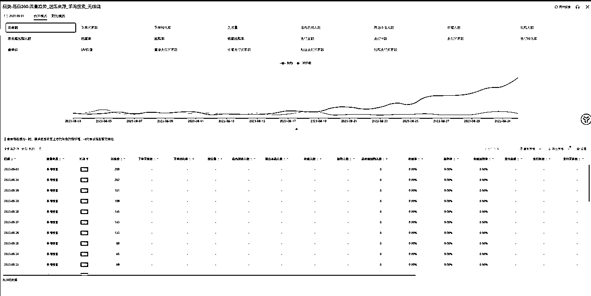

# 淘宝如何精细化让你白嫖搜索流量

> 来源：[https://ndrgazngqw.feishu.cn/docx/OC5Xd1dupoa4OIxld9PcVP9BnIZ](https://ndrgazngqw.feishu.cn/docx/OC5Xd1dupoa4OIxld9PcVP9BnIZ)

各位朋友大家好，我是祁元，一个在淘系领域中成长起来的罗里吧嗦的小朋友。

今天，我非常高兴能与大家分享一些关于淘系精细化运作的经验思路以及实操方法。

这篇内容可以算得上是最完整的一次以文档形式展示淘系的运营思维以及打法（若写的不好多多包涵）。

# 写在前面

先说一下这篇文章的想法，在加入这个圈子里面之后，我看到很多厉害的大佬分享的一些内容，如项目结果，工具推荐，实时方向性，思维心得，以及官方的一些文件，但我发现大家好像都在内卷一个方向那就是纯粹的搬运铺货，动销等一系列的矩阵性的操作，好像并无太多人分享或在意精细化的一些内容（也可能是我没看到哈，有分享过的勿怪），由此便有了写下这篇文章的想法。

# 一、什么是淘宝精细化运营？

## 1.1 定义

淘系精细化是一种精细化的运营策略，通过对新品和老品进行精细化选品、分析产品、优化维护等操作，提高产品稳定性和销售效果。

## 1.2 淘系精细化做与不做的区别在哪里

### 1.2.1 新品精细化选品上架-效果反馈

*   先给大家说一下类目，这个链接类目是童装里面的内裤，有做过电商的同学应该都很清楚这个类目有多么的卷。这个链接是八月二十一号开始上架，到二十八号开始拉爆，期间制作基础评价维护，无任何付费介入，有的同学可能会说是不是因为店铺层级比较高，有老客户扶持，这边同时奉上店铺截图，一个简简单单的二层级小店。而为什么能做出这种链接，在这个付费的流量时代能够白嫖到淘系的免费流量，请看版块二内容实操。

### 1.2.2 老品老链接精细化优化-维护效果反馈

*   看完上面的上新链接的结果，有在做的同学或者是想做的同学有问题想问，那我已经上架了，还能精细化优化拉升嘛？那答案当然也是可以的，具体请看下面趋势图。这个链接大概是八月十五号开始优化，八月十七号开始拉升，可以看到现在持续稳定免费搜索增量，看到这里，你心动了嘛！！

### 1.2.3 非精细化产品--弊端明显（不稳定）

# 二、淘系精细化实操详解

从定义看来，有点棘手，感觉不是个体可以做的事情，需要专门的团队去做这个事情，可能这个事情也是很多同学都会考虑的问题，做为一个单独的个体，为什么要考虑这些，一个人忙不过来等等的抱怨性的问题，但这些都不应该是借口，借用一句大佬说过的一句话，把优化放在上架之前，不要等上架之后再修改调整。任何的后置操作都要比前置预设准备要付出的更多更多。

实操内容将以选赛道到选产品 两个维度去简单讲解

## 2.1 如何通过生意参谋选择合适的赛道和产品？

电商行业不管怎么做，都要以数据为基准，不能以感觉来选赛道

使用工具：千牛--生意参谋

### 2.1.1 如何打开生意参谋

后台引导小章节（小白篇），已经了解的可以直接从2.1.2开始继续观看

#### 通过千牛后台访问

千牛后台--数据

#### 直接访问

生意参谋：https://sycm.taobao.com/

两种方式都可以 那个习惯用那种 个人偏向于把网址丢书签 直接访问

### 2.1.2 如何选赛道

上面实操的链接是童装类目，下面就以童装行业为例给大家做实战拆解

#### 赛道选择

*   打开生意参谋选择市场，选择市场大盘，以月为单位（图一），通过第三方插件转换实数，以销售额排序，选择同比增长的子品类（图二）。

PS：文档是之前的了，现在的生意参谋已经不能直接转换数据了，如果有需要转换的可以把数据下出来我给你们转换表格。2024年1月4日

### 2.2.1 如何选产品

以选品来讲解

如若有人对这个感兴趣 可以单讲选产品。选品、竞品选择这个版块 篇幅问题 就以选品来简单描述

根据赛道选择在市场大盘选择出的增长的子品类，打开生意参谋选择市场，选择市场排行，以月为单位（也可以三十天为单位，若有换季降温情况可以选择七天的维度），选择高流量或者高意向的产品，找到与自己能做的产品，查看趋势分析（图一），并对其竞品进行监控以备后续数据分析（图二）。

## 2.2 精细化分析产品

竞品链接：

https://detail.tmall.com/item.htm?id=678842046838&spm=a21ag.11815245.sycm-mc-mq-item-item-search.21.55e150a5fJcWAG

此链接只是为了举例实战，无其他含义

### 流量结构

目的：了解竞品同行产品主要流量来源，以便清楚推广的主要方向----顺势而为

*   打开生意参谋，选择竞争板块，选择竞品分析，添加要做数据分析的竞品，统计时间一般为七天（图一），同时往下滑找到入店来源（图二），统计主要进店来源做为推广时的主要方向

### 类目方面

做过淘宝的同学应该知道，淘宝的自然搜索流量推送跟产品所在类目有关，如果你的类目选择的不对，可能会影响到系统为你正常推流。

*   打开生意参谋，选择竞争板块，选择竞品分析，添加要做数据分析的竞品，统计时间一般为七天，选择流量最大的关键词（图一）。

*   复制搜索流量最大的词，打开生意参谋选择市场，选择市场大盘，选择搜索分析，搜索流量最大的词，时间维度选择七天，并选择类目构成查看关键词在什么类目下有流量（图二）

综上我们可以看到，这个关键词的主要流量在童装/婴儿装/亲子装的内衣套装里面，等上架时就要选择此类目以便获取最大的流量。 当然肯定有人感觉这一步很多余，那在此处放一个悬念，看到此处的各位想一下 打底裤 这个产品是在什么类目呢

### 主图方面

通过数据查询可发现平均点击率在 3.5%左右 由此接下来的作图标准就要以 3.5%的标准去测试并优化自己的主图

### 属性方面（SKU）

通过竞品属性组合及排序标准，我们发现竞品以一个单独的一件装来压低前端的显示价格，且放置最后不做主推（图一）通过生意参谋，品类里的商品 360 里面的销售属性分析发现 主要销售颜色为，白，粉，绿，蓝这几个颜色（图二）由此我们操作时，也可以复制一个同样的低价 SKU 在裂变里面，用于做钩子产品，并对主要销售的几个颜色进行排序置顶

### 问大家方面

通过产品详情页第三方插件，做高频词提炼

emmm，好像接口有点问题，一直加载不出来

暂时先使用之前做的问大家方面的拆解便于大家理解！！！

### 评价买家秀方面

同理问大家 可同步以问大家高频词方向 进行评语优化

# 总结：

# 方向定生死，优化放前置

# 

到此简单的分享已告一段落，第一次做纯文档分享，已尽最大可能以碎片化的方式进行输出。字数不多，细节很多，任何疑问或者感觉没表述清楚的地方都可随时联系

原创：祁元

未经允许严禁搬运