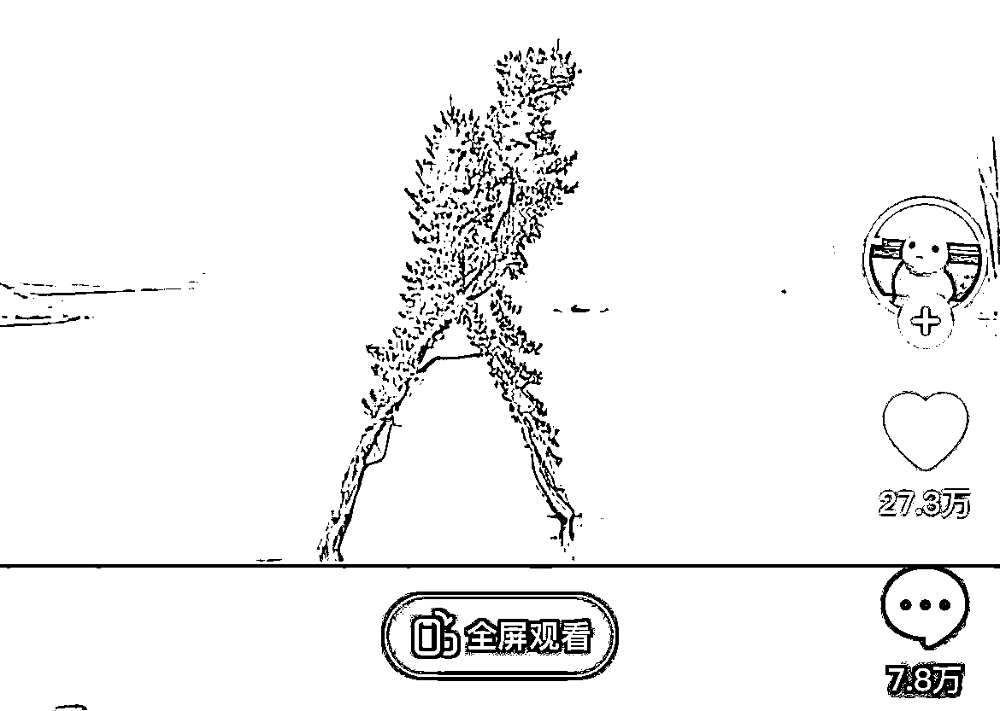
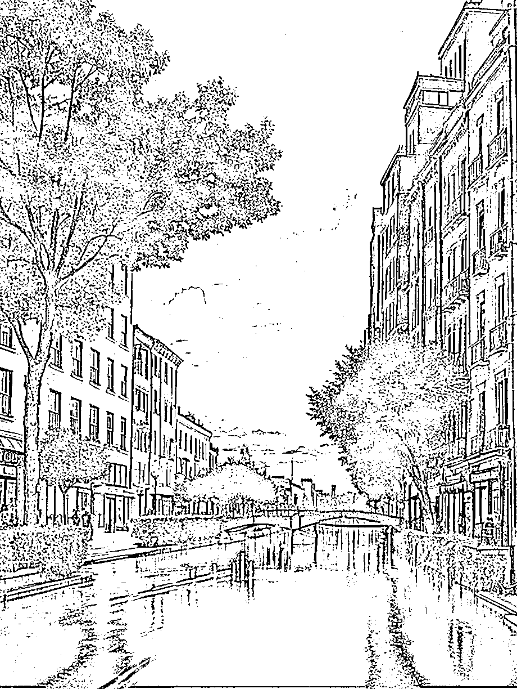

# 《流量密码！AI幻术终极教程，3步做出百万爆款视频！》

> 来源：[https://ry5hwpuf7b.feishu.cn/docx/OQdZdGoXaorykxxIWpTc35Jenfc](https://ry5hwpuf7b.feishu.cn/docx/OQdZdGoXaorykxxIWpTc35Jenfc)

《流量密码！AI幻术终极教程，3步做出百万爆款视频！》

各位好，我是吴东子

所谓AI幻术，就是用AI技术生成让人看起来像中了幻术一样的图片

这类内容因为「新奇有趣」的特性，在短视频平台快速爆火，出现了非常多百万、千万级播放的爆款作品

用AI技术把火过的梗或者表情包再做一遍，就是当下的流量密码

我花了几天的时间，把AI幻术的所有的玩法都研究了一遍，整理出了一套完整的制作流程

文章包含了抠图，SD基础设置，Controlnet设置三个步骤，只要大家一步一步跟着操作，也可以做出同款的AI幻术

1.风景幻术

2.二次元幻术

3.建筑幻术

4.表情包幻术

另外，文中需要用到的模型文件，也都给大家打包好放在末尾的网盘链接里，不需要大家再自己到处去找

花了很多时间才整理出来，希望对你有帮助

严禁抄袭搬运，势必追诉到底！

# 一、AI幻术是什么

AI幻术可以把你想要的元素，隐藏到一张看似普通的图片里

表面看似正常，实则 “暗藏玄机”

像这张，放大看图片的每一个区域都还算正常，但当图片缩小的时候，就可以看到一个熟悉的男人

除此之外，还有这样的街景图

风景图

甚至还有二次元的美女、小猫咪、一座房子，都可以看到那个男人的身影

更好玩的是，变成视频之后，那个男人直接跳起舞来了

这些有趣的图片跟视频，有些博主把他发到抖音上就获得了几十万的点赞，在b站甚至有上百万的播放

而以上这些千变万化的图片和视频，通过AI绘画只需要三步就能做出来

那今天这篇文章就带大家一步步操作，做出来这些有趣的AI幻术图片和视频

# 二、三个步骤，快速生成AI幻术图片

制作坤坤的AI幻术图可以分为以下三个步骤

1.抠图

2.SD基础设置

3.controlnet设置

接下来我们就以这张城市夜景图为例，看看具体的操作步骤

## 1.抠图

找一张自己想要制作的图片，抠出黑白蒙版图，这个蒙版图在后面的controlnet设置需要用到

我们抠图用会用到SD的一个抠图插件——segment anything

### SD抠图插件——segment anything使用方法

插件从安装到使用分为三步

01.安装插件

02.安装模型

03.抠图

01.安装插件

插件的安装十分简单，我们只需要：

①打开SD，点击拓展

②点击可下载

③点击加载拓展列表

④在搜索下面输入“segment”

⑤点击安装

02.安装模型

Segment anything还需要一个模型，大家只需要下载网盘里的“sam”文件夹

然后把文件夹里的模型放到对应的文件夹

存放位置：SD文件夹\extensions\sd-webui-segment-anything\models\sam

安装好了之后，我们再打开拓展，点击“应用更改并重启”，这样插件的页面才能显示出来

03.抠图

这时候回到SD，在点击“segment anything”打开插件的页面，

上传一张我们需要抠图的照片

鼠标左键点击会生成黑色的点，就是我们要抠出来的部分，可以围绕人物点一圈

鼠标右键点击会生成红色的点，就是我们不要的部分

给图片打好点之后，就点击 “预览分离结果”，就可以生成蒙版图片了

一次会抠出来三组图片，选一张扣的最完整的保存下来

如果三张都不完整，再去多打几个点，重新分离

到这里我们的图片就处理好了，接下来就可以用这个蒙版图去生成图片

## 2.SD基础设置

SD的基础设置包括：

01.选大模型

02.写关键词

03.设置参数

### 01.选大模型

可以选二次元的、也可以选写实的

像这张城市夜景图用的就是写实的大模型

如果没有这个大模型的小伙伴可以在网盘里面下载majicmix的文件夹

把文件夹里的大模型复制到SD文件夹，放到”models“里的”Stable-diffusion“文件夹

存放位置SD文件夹\models\Stable-diffusion

### 02.写关键词

关键词需要大家多尝试

通过不断出图的积累形成自己的词库

这也是我跑了很多次后发现出图比较稳定的城市夜景关键词

大家可以直接照抄

城市夜景关键词：

The highest quality, masterpiece, high-definition image quality, rich details,

City night view, Road,cars,architecture, streets, transportation, bustling city, lighting, plants,Water, Reflection,Sky, clouds,Colorful lights, headlights

最高的质量，杰作，高清画质，丰富的细节，

城市夜景、道路、汽车、建筑、街道、交通、繁华城市、灯光、植物、水、倒影、天空、云朵、五颜六色的灯光、车灯

通用负面关键词：

EasyNegative, ng_deepnegative_v1_75t, badhandv4,(worst quality:2), (low quality:2), (normal quality:2), lowres, ((monochrome)), ((grayscale)), bad anatomy,DeepNegative, skin spots, acnes, skin blemishes,(fat:1.2),facing away, looking away,tilted head, lowres,bad anatomy,bad hands, missing fingers,extra digit, fewer digits,bad feet,poorly drawn hands,poorly drawn face,mutation,deformed,extra fingers,extra limbs,extra arms,extra legs,malformed limbs,fused fingers,too many fingers,long neck,cross-eyed,mutated hands,polar lowres,bad body,bad proportions,gross proportions,missing arms,missing legs,extra digit, extra arms, extra leg, extra foot,teethcroppe,signature, watermark, username,blurry,cropped,jpeg artifacts,text,error

### 03 .基础参数

宽度和高度根据自己的图片比例去调整

## 3.controlnet设置

我们先把刚刚保存的蒙版图拖到图像的框里

然后选用qrcode monster模型，如果没有这个模型的小伙伴可以自行安装

模型放在网盘，存放位置：sd文件夹\models\ControlNet

控制权重0.75~1.5，权重越大，人物轮廓越清晰

最后点击生成

你的第一张AI幻术图片就做好了

以上就是关于AI幻术图片的制作方法

为了方便大家能够制作各种不同风格的AI幻术图片

我这几天花了很多时间把市面上比较热门的类型都跑了一遍，出了几百张图后

终于给大家整理出了几套即好用，而且出图比较稳定的关键词

都已经打包好放在网盘里了，大家可以直接抄作业

## 4.不同类型图片关键词

### 风景图

关键词：

The highest quality, masterpiece, high-definition image quality, rich details,

Mountains, blue sky,clouds, plants, trees,lake, beautiful scenery

最高的质量，杰作，高清的图像质量，丰富的细节，

山，蓝天，云，植物，树木，湖泊，美丽的风景

如果想让人物轮廓看起来更加明显

可以生成这种人物轮廓是黑色的图片

只要在controlnet设置里，预处理器选择invert，就可以把黑白区域反转过来

### 二次元女孩

关键词：

The highest quality, masterpiece, high-definition image quality, rich details,

1 girl, delicate facial features, big eyes, long hair,

Dress, exquisite clothing,

Upper body, with a garden in the background

最高的质量，杰作，高清的图像质量，丰富的细节，

1个女孩，精致的五官，大眼睛，长发，

连衣裙，精致的服装，

上半身，背景为花园

### 房子

关键词：

The highest quality, masterpiece, high-definition image quality, rich details,

1house, yard, residence,outdoors

最高的质量，杰作，高清的图像质量，丰富的细节，

1房子、庭院、住宅、户外，

### 表情包

除了坤坤以外，我们还可以各种有趣的图片

姚明的表情包

像姚明的表情包这种需要五官形状的图片就不需要扣蒙版图了

直接把原图上传到controlnet

控制权重拉高一点，这样出来的图片轮廓就会很清晰了

用AI幻术结合当下热点或者比较火的梗，这样视频的流量也会更大

# 三、AI幻术视频怎么做

做AI幻术视频其实跟做图片是一样的，因为视频就是由无数张的图片组成

只不过这一次从生成一张照片变成了批量化生成无数张照片

这时候我们的操作步骤就变成：

1.批量化抠图

2.批量化出图

3.剪成视频

做出来的效果是这样的

接下来我们看看具体的操作

## 1.批量化抠图

首先我们需要先把视频变成无数张照片，再生成这无数张照片的蒙版图

具体分为三步：

01.安装插件

02.将视频转换成照片

03.生成这些照片对应的蒙版图

### 01.安装插件

这个插件可以直接把视频分成无数张照片，并且生成对应的蒙版图

安装操作十分简单：

①.点开“拓展”

②.选择从“网址安装”

③.在第一行把网址复制进去，https://github.com/ClockZinc/sd-webui-IS-NET-pro.git

④.点击安装

把网盘里《IS-Net》文件夹里的模型装到下面的位置

储存地址：sd文件夹\extensions\sd-webui-IS-NET-pro\saved_models\IS-Net

这样我们的插件就安装好啦

### 02.将视频转换成照片

①.重新启动stable diffusion，在状态栏里就可以看到我们新装的插件——isnet_pro

②.打开isnet_pro的页面

③.把视频拖进方框里

④.打开启用输出帧率控制，输出帧率设置为10，输出帧率设置得越高，出来的图片就越多，为了节省时间，这里设置了10帧，也就是一秒视频出十张图片

⑤.新建一个文件夹，把文件地址复制到“图片输入地址”，用来存放生成的照片，注意文件夹的名字不要有中文

⑥.最后点击“gene_frame”生成

复制文件地址的方法：

鼠标右键点击文件夹，点击“复制文件地址”

接着把文件地址复制进去

注意，要把前后的双引号删掉，不然会报错

照片处理完了之后，就可以在文件夹里看到截出来的所有图片

接下来我们就要给这每一张图片生成对应的蒙版图

### 03.生成照片对应的蒙版

①.打开“ISNETpro2”的页面

②.把前面存放照片的文件夹地址复制到“图片输入地址”

③.再新建一个文件夹，用来存蒙版图，把地址复制到“图片输出地址”注意文件的名字不要有中文

④.最后点击“仅生成蒙版”

这时候处理完的图片就是这样的黑白蒙版

到这里全部图片就处理好啦，接下来就是生成图片

## 2.批量化出图

出图这一步跟前面只生成一张照片是一样的，大模型、关键词、参数都一样

只是在controlnet里面选择批量出图

01.打开ControlNet，设置不变，点击“批量处理”

02.把黑白蒙版图片的文件路径复制黏贴到”输入路径”

03.点击生成

这里大家可以先用单张蒙版图测试一下出来的效果，确保所有参数设置没有问题就可以开始批量出图了

根据自己照片的张数、设置的分辨率和迭代步数不同，出图的时间不同

耐心等照片生成就可以了

## 3.拼接成视频

等全部照片生成好了之后，我们就可以剪成视频了

点开文件夹“📂”图标，在里面找到我们刚生成好的照片，存到一个新的文件夹里面

注意新建的文件夹不要有中文字符

接下来打开 isnet-pro 插件，把图片拼接成视频

帧率设置为 10

把刚刚新建的文件夹地址复制到 “输入地址"

再复制一个存放视频的文件夹地址

最后点击生成

最后我们只需要在剪映加上自己喜欢的BGM就可以了

再看一次最终的成片

# 四、结尾

好了，以上就是我们这篇文章的全部内容，希望能够让你做出更多有趣好玩的AI幻术图片

如果你对AI感兴趣的话，可以关注我的公众号：吴东子AI，也欢迎分享给你身边想学AI技术的朋友

里面有我之前发过的所有文章，之后也会持续给大家更新实用的AI干货教程

我是吴东子，用奶奶都能听懂的方式，分享可以落地实操的干货，我们下篇文章再见！

网盘链接：https://pan.baidu.com/s/19Xnof-BSA-FubkMc_0XNhA?pwd=wdz6

提取码：wdz6

吴东子AI账号简介：https://ry5hwpuf7b.feishu.cn/wiki/space/7283841978071072772?ccm_open_type=lark_wiki_spaceLink