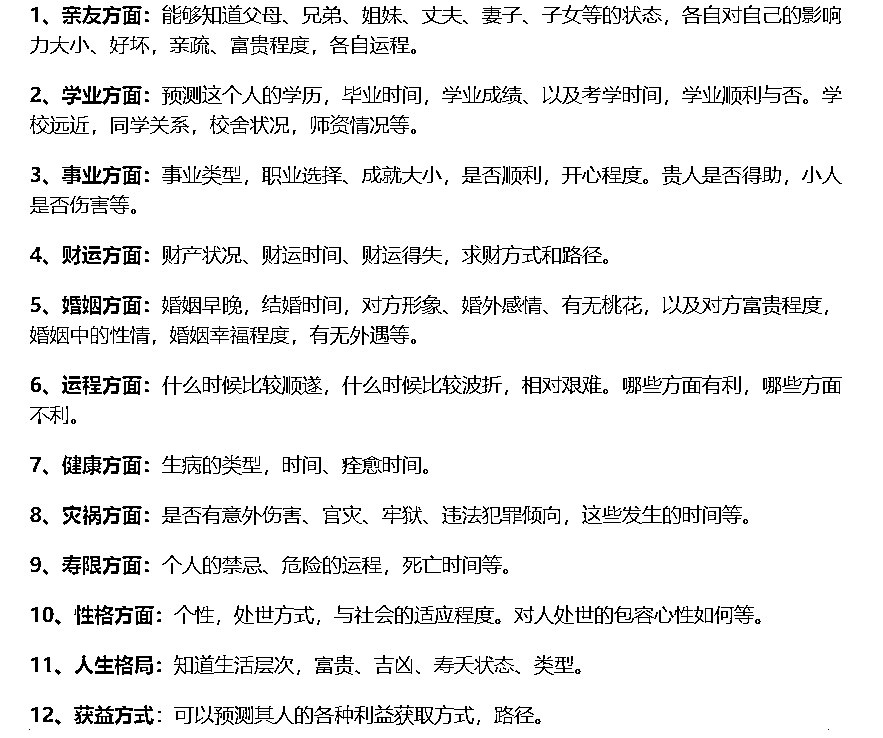
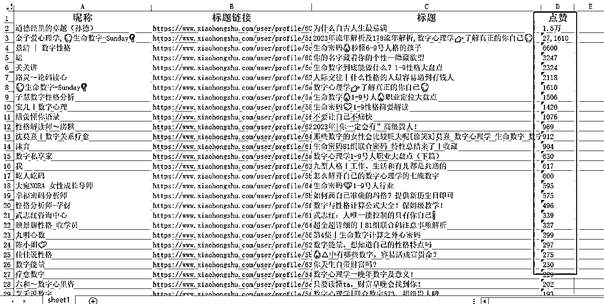
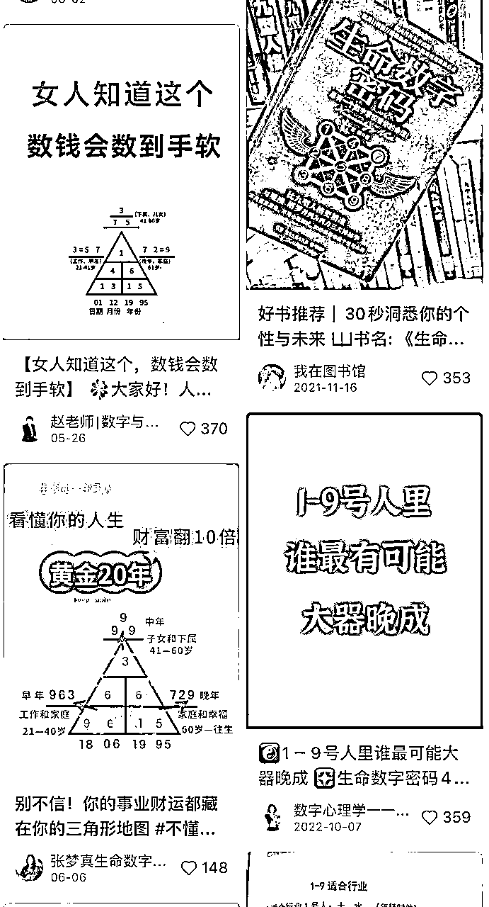
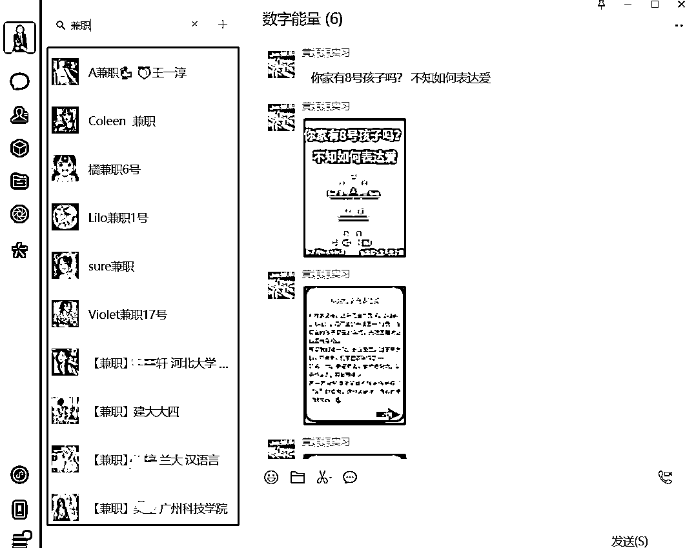
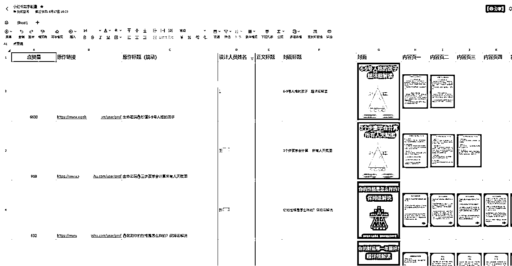
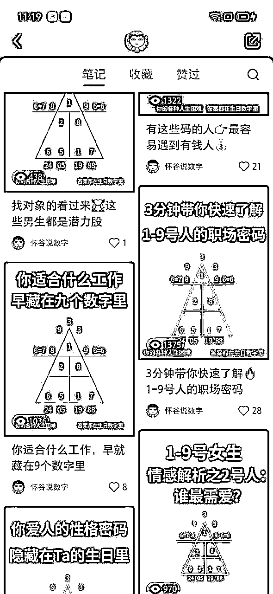
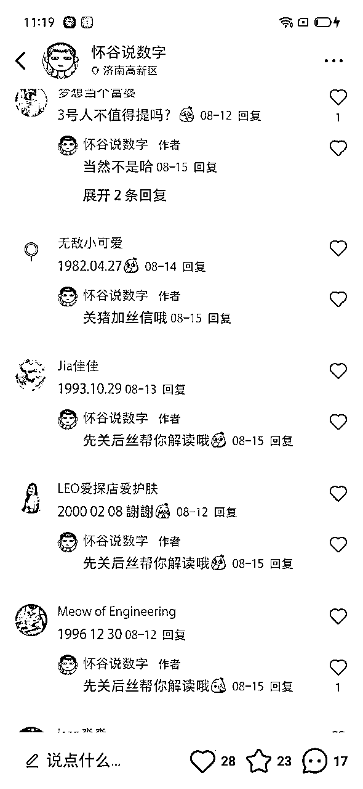
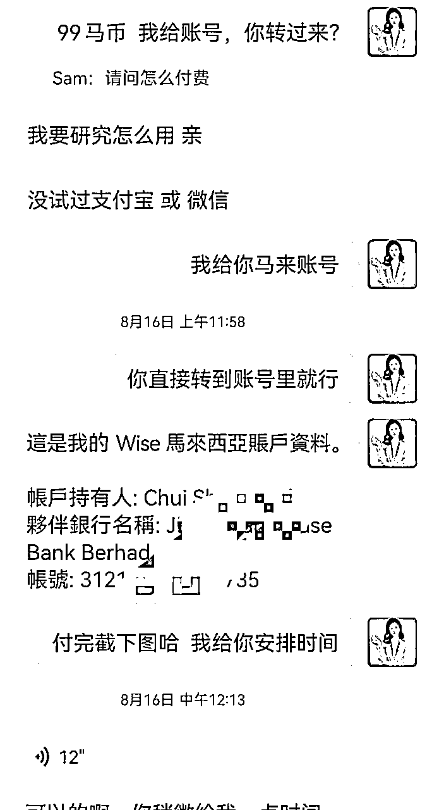
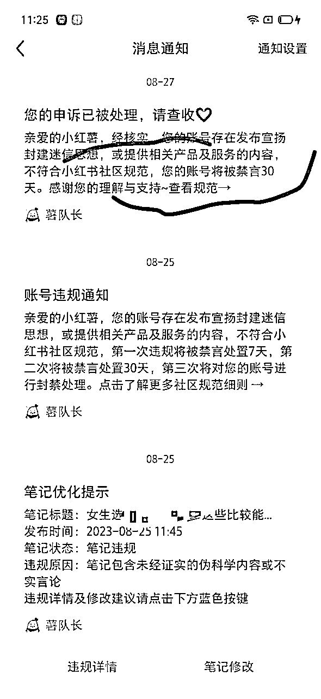

# 流程可复制，小红书矩阵引流变现，蓝海项目7天变现5000+完整攻略

> 来源：[https://vub1ul9ufi.feishu.cn/docx/OwIbdq12VoUfysxsp0yconc8nFg](https://vub1ul9ufi.feishu.cn/docx/OwIbdq12VoUfysxsp0yconc8nFg)

# 一、自我介绍

大家好，我是谢不言，一个95后创业者，小红书矩阵流量操盘手。

2021年毕业即创业，同时开启在小红书生态和微信搜一搜的战场，自有20+大学生教育领域公众号、3年小红书做废了800+帐号，小红书矩阵高峰日引流1000+，月变现10万+

现在正帮助企业和创业者们在小红书矩阵引流，接下来要带领一帮兄弟们做小红书高客单变现……

这次所分享的内容也是关于如何在小红书上面挖掘项目、通过矩阵引流到私域变现的干货。

精彩在后面，这是不藏私的分享，所有的小红薯矩阵流程均可以1:1复制，市场很大，红利期有限，所以不怕您抄，还请您往下放心食用干货。

本文目录如下：

一、自我介绍

二、需求挖掘、项目调研

2.1兴趣是最好的老师，也是你的无尽宝藏

2.2做任何项目，执行力拉满一定是成功的前提

三、产品搭建、商业模式

四、流量测试、矩阵赛马

4.1、深度了解用户痛点、需求，对症下药

4.2、通过大数据开天眼、站高一线看问题

4.3、劳动力外包、矩阵起号测试流量

五、人设打造、私域变现

5.1、同行是最好的老师

六、项目经验、复盘总结

6.1、后面项目为什么不做了?

6.2通过做这个项目，收获如下

七、我的需求、链接人才

# 二、需求发掘、项目调研

不卖关子，这次分享的项目是西方生命数字密码，很多人圈友应该是第一次听说吧，那我是怎么接触的呢？源于我今年3月份上的身心灵总裁班大课（花了3万多，感兴趣的朋友可以点赞告诉我，下一篇帖子写写里面的商业逻辑）。

### 兴趣是最好的老师，也是你的无尽宝藏

导师在课程中利用生命数字密码，给学员解读性格天赋，当时感觉还挺准的，于是产生了兴趣，接着自己跟着抖音教学视频，花了10分钟就学会了，因为教学视频是5分钟，我看了两遍，然后就要来身边朋友的阳历生日，自己直接去实操解读。

生命数字密码，源自于西方，类似于咱们老祖宗的生辰八字，但是易学易懂、可以通过你的阳历生日，测算出你的性格特点、天赋优势以及流年运势。

### 做任何项目，执行力拉满一定是成功的前提

出于对商机的敏感性，下了课，我就直接在小红书搜索关键词，发现果然有人在做流量。

顺藤摸瓜地到私域观察变现情况，做的好的同行，一个月凭借千粉的小红书号能变现3万+

而且我发现了对方的弱点，做这些小红书的人都是个体，没有矩阵思维，他们变现的天花板限制是流量。

只要我能通过矩阵引流的形式，把低成本获取流量给解决掉，那就能把这个项目给放大。

借用盗坤说的一句话，打得过的都是蓝海，发现项目后也是很兴奋的，半个晚上没睡着觉。

说干就干，第2天我就开始调研同行的产品，以及设计自己的商业模式。

# 三、产品搭建、商业模式

任何快速拿结果的项目，一定是围绕着产品做流量。所以我也是在做流量之前先设计的产品和商业模式。

在我调研之后发现同行的变现模式如下：

1.  80%的同行首单是随喜解读，20%直接收费599

1.  二开 全盘解读，根据能力不同，收费299/599/699

1.  高客单是自己录课教学 1999元

95%的人停留在自己引流、自己销售、自己解读上，

其余5%的人，会更高一级，录课、带学员、包装成赚钱项目卖出去

我在此基础上做了微创新，在随喜红包上设置了范围，69-198元

前期有产品模型、能收上来钱，后面再慢慢优化。。。。。。

# 四、流量测试、矩阵赛马

### 1、深度了解用户痛点、需求，对症下药

定好产品之后，就要开始围绕着产品做流量

做流量的第一步先深度了解用户需求，我做了一件事，是去百度搜索生辰八字、易经风水能解决什么问题

搜索的结果是主要是命运、事业、财运、婚姻，那这就清楚了用户大概关心什么，便可以对症下药

新项目在小红书测试流量时，一般有两种路径

第一是抄，抄同行爆款，同行怎么做，你就怎么做

第二是原创，自己围绕用户痛点和需求，去制作笔记

我建议新手一上来不要原创，先把同行抄明白就好，让同行替你踩坑、替你验证

### 2、通过大数据开天眼、站高一线看问题

第二步、确定好产品后，就要针对性的调研市场和流量情况，那就是开天眼，通过研发的爬虫软件抓数据，也可以通过免费的八爪鱼、后羿采集器，根据关键词“生命数字能量” “数字能量” 取大量笔记

为什么要爬取数据，一是为了分析爆款笔记做对了哪些点、二是 方便我们后续进行二创

分析什么呢？ 分析同领域中做流量好的人是谁? 容易出爆款的笔记类型是什么？

爆款笔记的封面共同点是什么？

然后我发现这个领域并没有什么大爆款，只要少量的千赞，其余都在几十点赞之间

1、且每个爆款封面并没有统一点，

2、唯一的相似之处就是封面的主标题比较醒目突出

3、大多数的笔记，内容都在正文里面，没有内容页

那我心里大概明白了，只要把封面标题和笔记标题优化好，正文内容可以拿来为我所用，改成内容页，只要足够能够刺激用户就可以

### 3、劳动力外包、矩阵起号测试流量

到了第三步，根究调研，确定好爆款内容模板之后，就要在稿定设计根据同行的爆款封面，设计了样板封面图、然后拿着样图去找兼职外包。

为什么要找兼职做内容呢？

因为我比较懒、时间有限，这些无关紧要的因素可以下放给他人，自己做最重要的环节

我之前有篇文章说过，一个小红书爆款笔记，封面占据60%的要素，标题占据30%的要素，其他的正文内容和内容页占据10%，爆款封面最重要的是封面标题，所以我们只需要抓住确定性高的事情即可，封面标题和笔记标题，我来改写，其他的全部外包给他人

相当于我是创意大脑，其他兼职是手和脚

（做出来的成品如上图）

具体的兼职寻找流程和运营管理细节，在之前的一篇帖子有说过

想要深入了解的朋友可以点链接考古

一篇笔记成本大概几块钱

做完笔记，测试项目流量时，我的习惯是同时起5个账号赛马，内容生产外包给线上大学生兼职、内容分发交给线下大学实习生

做的账号多了，就有了流量手感，所以在流量获取这块一直是我们的强项，因此我只需要承接微信流量，搭建私域人设、再把销售SOP做出来就可以

# 五、人设打造、私域变现

### 同行是最好的老师

私域人设、朋友圈塑造、销售破冰话术都可以直接模仿同行的，真的是不需要你原创什么

朋友圈基本上发个7天左右，基本上就很充实了，而且首单基本上是随喜的，所以用户的付费阻力就比较小……

做了七天，收了32个随喜红包，做了6个599的全盘个案，总共收了5K左右~

然后有趣的事，有十几个都是马来西亚的华人，第一次面临海外收款问题，然后在朋友圈找了他人代收，后来经过调查发现，西方生命数字密码在马来很有市场，而且经常举办线下沙龙会，当然收费也更高

# 六 、项目经验、复盘总结

### 后面项目为什么不做了？

原因是小红书把这类笔记判定为封建迷信、打击笔记严重，动不动就判定违规限流封号

在别人的平台里谋生路，对抗不了，只能放弃……

### 通过做这个项目，收获如下：

赛道大于一切

产品先行、流量为后

矩阵赛马、增加账号样本

流量获取效率=赚钱效率

把重要的事掌握在自己手里，其余的学会使用人力杠杆

做顺应平台规则的事，硬刚对抗不如早点投降，好项目多的是

最后希望这篇文章，能给有缘人提供一些流量变现的思路，如果你有任何关于小红书矩阵引流、账号IP打造、私域变现的问题，都可以随时问我，我是谢不言，知无不言、言无不尽！