# 我把4天3夜戈壁徒步108公里的收获，凝聚成5个故事分享给你

> 来源：[https://vub1ul9ufi.feishu.cn/docx/PyAqdva4lor70SxzxXpcMnTJnZd](https://vub1ul9ufi.feishu.cn/docx/PyAqdva4lor70SxzxXpcMnTJnZd)

圈友们好，我是谢不言，一个专注于小红书生态创业的操盘手，最近半年没怎么分享活跃，一直在线下忙于业务、忙于学习……

今天带来的分享不是关于如何赚钱、如何搞流量、如何销售，而是分享我在敦煌戈壁滩4天3夜徒步108公里，之后的感悟和收获……

或许不能为你带来显性的财富增值，但我会把这108公里浓缩成5个小故事分享给你，相信你会吸取的营养用于工作和生活中……

徒步缘由是今年3月份我花了3万多人民币，上了一个教练技术总裁班，平台把班级毕业环节安排到了甘肃敦煌，要求我们每个人4天3夜徒步108公里~

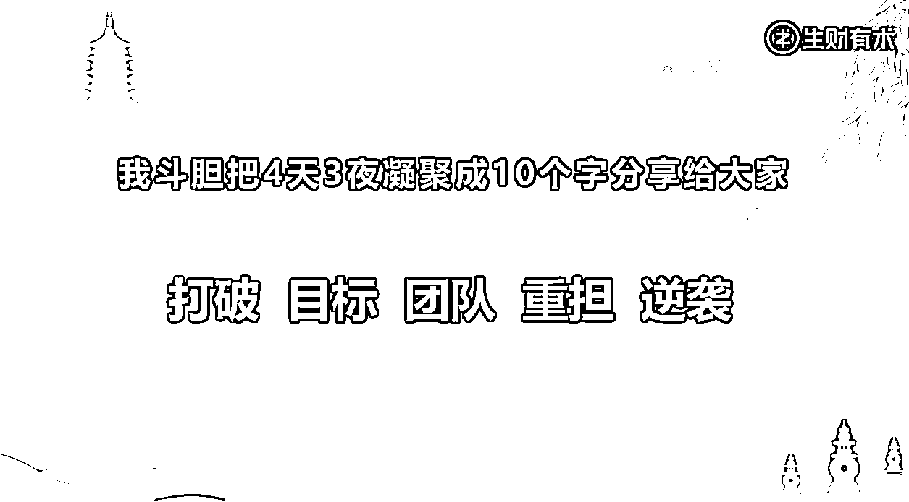

废话不多说，直接进入正文。

## 关于打破的故事

没有打破，便没有重生，想要凤凰涅槃，必先烈火淬炼

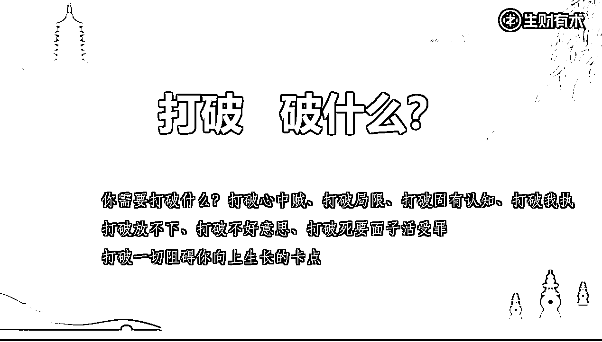

我们此行参赛人数总共210人，被分成了16个小组，第一天路程是24公里，走的路有灌木丛，有荆棘，也有碎石板路。记忆深刻的是我在后半程腿抽筋了。

抽筋的原因是看到一个越野车，我的教练站着冲我竖大拇指，旁边还有摄像师冲着我摄像，于是我兴奋的向她跑去，但跑了没有20米，就疼痛的停了下来，腿抽筋了……你知道这种尴尬吗？本来想装个逼，耍个帅呢，却没想到翻车了……

抽筋的原因是我的腿部肌肉长时间惯性保持在慢走的状态，没有给腿部肌肉一段路程的缓冲期，就突然改变慢走状态，进入强烈的快跑环节，肌肉瞬间痉挛起来，幸亏保障车上跟着专业医生，按摩了3分钟，才得以继续往前走……

事后想起，一个人或商业组织也是如此，当习惯性的保持某种状态之后，如果想改变它，一定是需要遵循客观规律、循序渐进的改变，没有一蹴而就的成功……

到了傍晚，是一群人的篝火晚会。

组委会临时告知每个小组要上台表演一个节目，还给大家准备了服装，此时距离篝火晚会开始只有不到30分钟的时间。

然后我们团队为了争夺好的名次，大家集思广益，有的人是去找服装道具、有的人是想剧本、编排导演。

最后定的节目主题是唐僧西天取经路过女儿国，需要有人扮演女儿国国王、有人扮演妖精，有人扮演唐僧等等，我扮演的是波斯公主，任务是去勾引唐僧，把他留在女儿国。

你有男扮女装过吗？我tam也是第一次啊，穿连衣裙、戴假发、涂口红，把假花塞到胸前，给你看一下我当时男扮女装的样子，是不是挺分外妖娆的哈哈，面对唐僧，具体会上演什么内容，你可以根据服装脑补一下，表演的原则就是像狗见了屎一样，主打的是——马叉虫化贝……

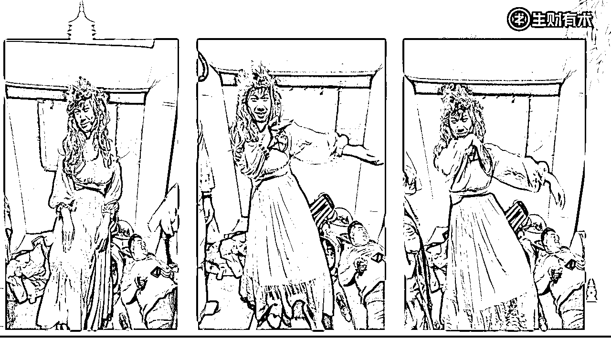

平时习惯衬衫西裤，这么大的转变，当时还是蛮不适应的，但是内心为了团队，为了冠军，也是接受的。

从这个装扮上，你就可以看到我打破了什么，打破了很多固有思维，打破了偶像包袱，打破了不好意思、

打破了扭扭捏捏……

人生就是在一个接一个的不断打破中得以升华进阶，打破固有的，才能迎来新生命……

## 关于目标的故事

你有为了一件事抛弃所有，奋不顾身的努力过吗？

如果你曾有过，希望你在前行的路上还能保持义无反顾的决心……

我将用第二个故事，给你讲述目标感、责任感和使命感的重要性……

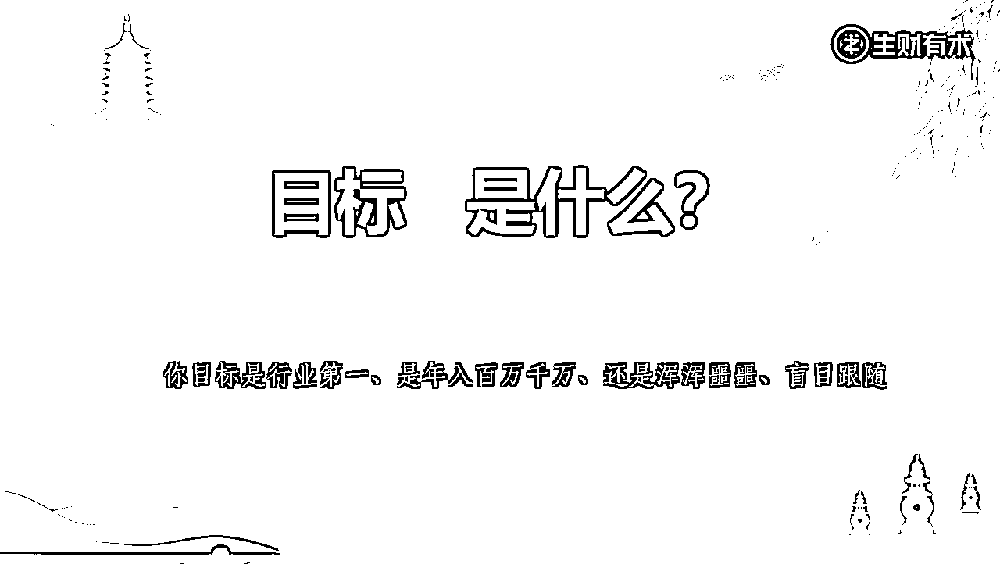

第2天是正式的比赛日，比赛规则是这样的，所有人统一起点和终点，比拼谁的团队速度快，谁先到达终点，个人成绩和团队成绩都会纳入到小组评分中。

而且在比赛过程中，小组的队旗不能够倒地，只要一接触地面皆视为团队阵亡，取消所有人比赛成绩。所以每支队伍扛旗的旗手一定是身高马大，体能雄健的旗手是和旗手相比拼，都会冲在队伍的最前列。

我们团队一共是9个人，5男4女，晚上我们共同商讨策略，排兵布阵，有人来扛队旗冲到队伍第一梯队，有人当中锋保持在队伍的中段，有人殿后带着体能弱的队员，由于我没能长出山东大汉的身高马大，所以就被特殊照顾安排殿后，实在不好意思，拉低山东男人的平均身高

但是变化总比计划快，在比赛刚开始，我跑出50米的时候，旗手突然叫住我，说他崴住脚了，让我扛着队旗冲在队伍的最前排。

我靠，当时心想你小子真是坑队友啊，我明明是被安排殿后的，你现在让我冲到最前线，而且刚开始跑就崴脚。那我也没办法，只能硬着头皮接过队旗奋力的向前跑，和那些大长腿们一较高下。

当接过队旗的时候，大概处于队伍的150名左右，一直往前冲，向前跑，路途中超过了数不清人。

大概跑出12公里，已经跑到了210名参赛者中的前20名，这个时候看到了，中途的补给站，补给站中有西瓜，水果、面条、水等一系列的补品，但是我不知道哪里来的勇气和决心，当其他人在大朵快颐的吃西瓜时，毅然决然的决定为了团队荣誉，必须追赶上前面的对手，于是片刻没有停留休息，绕过了补给站，，，因为我知道自己是团队的第1名，代表着团队的荣誉。

跑到15公里左右的样子，更神奇的事情发生了……

团队中有个年近40岁，身高一米八二的大姐，气喘吁吁的超上来，非常惊讶她是如何赶上来的，我可是一路没有停歇呀，她说一路都在快跑……

但明明两人之间只有几十米的距离，但就是追不上来，我先开口：“为什么要费这么大劲来找我？”，她答：“我们是一个团队的，你自己扛的太孤单了，来替你扛旗啊。” 她为了超越过来，自己也没吃补给，我感动得眼泪都快要掉下来了……

感到没超过3秒。我的灾难就来了……

我把队旗传给了她，随即发现自己身上好像少了一点什么。

往前跑出大概20米，我就开始出现了各种毛病、腰膝腿软、脚疼脑胀、肚子饿的咕咕叫，速度也开始急剧的下降，从刚开始的慢跑到后面的快走，再到后面的慢走，走到最后发现身体越来越累，然后实在走不动了，就坐在土堆上休息个两分钟，后面被我超越的人，在逐渐的超越我。

看着他们超越我的时候，心里面也挺着急的，但却像泄了气的皮球，没有了刚开始一样义无反顾的决心。

最后1/3的路程，是我走过最煎熬的一段路，因为没有了心力，体力也不复存在，全是在和身体负面反应做抗争。

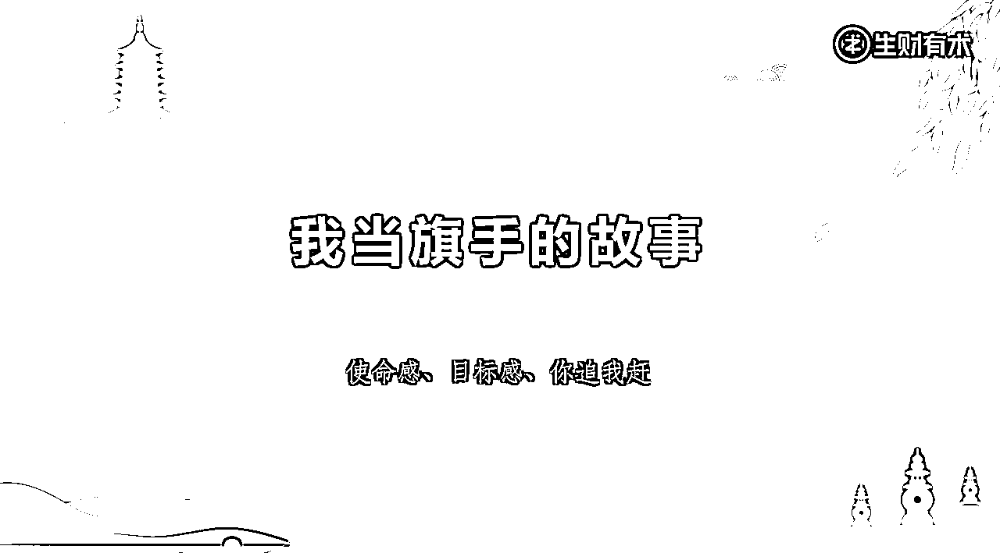

为什么扛着队旗和没有队旗时，会差别如此之大？

事后复盘，我明白了，是因为自己身上的目标感、责任感和荣誉感没有了，当我把队旗传给队友的那一刻，相应的也把责任和使命传给了她。

当我眼里紧盯着目标，身上背着责任感和荣誉感的时候，就不会关注脚下的疼痛和身体的酸楚，而是拼命的向前冲！

## 关于团队的故事

一个人可以走很快，但一群才能走更远……

我们从小受到的教育好像都是在与他人竞争、与他人作比较，父母在拿我们与邻居家孩子比较，老师在拿我们与同学比较，好像到哪里都得分出个一二三，但鲜少有人教我们去和别人合作，1+1不仅仅等于2，还有可能会大于2……

我想分享的第三个是团队赛冠军的故事，它关于合作、关于团队……

你可以看下面的这张图，这是冠军小组到达终点时拍的合照，你可以看出他们组有14个人，6个女人，8个男人，其中两个男人已经年过50，还有一个200多斤的大胖子，比赛之前他们说自己是老弱病残组合。

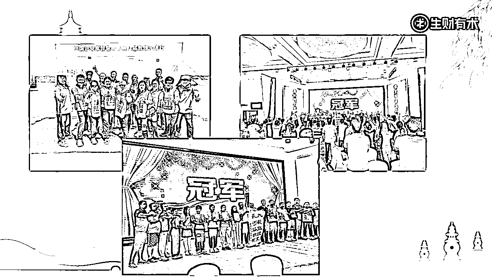

但就是这么一个组合，在15个小组中脱颖而出，取得了团队赛的第1名，究竟是为什么呢？

因为我们团队赛规则，是取团队中倒数第2名到达终点的成绩，以及团队中的每个队员的平均成绩作为参考值。

这就类似于木桶效应，考验的是这个团队中的短板有多短。

女生由于天生力量有限，便成了队伍中的短板。

这支冠军团队，他们把女生放到队伍的前排，身强力壮的男生在其身后，每当女生有懈怠，跑不动时，男生有的拿出登山杖拽着女生往前跑。，有的男生在后面赶着女生往前跑，就这样拽一程赶一程，这支团队中的女生逐渐的超越了其他队的男人。

当听到对讲机不断传来舜泰二队已全员到达40号旗，已全员到达50号旗的报备时，我就知道这次冠军团队非他们莫属。

因为他们真正做到了不抛弃、不放弃，不抛弃团队中的每一个人，不放弃团队中的每一个人，团队中所有的人都奔着同一个目标，那就是奔着冠军，向前，向前，再向前。

这一次是真正让我感受到了团队的伟大，人心的伟大、人心齐，泰山移。

在团队中个人既是整体，整体既是个人，

有任何问题，只要每个人都想着自己是团队的一份子，只要自己做好了，团队就做好了

一个团队中有三种人，引领者、跟随者和破坏者，如果你想考察一个团队成员时，可以观察他遇到问题和麻烦时的态度行动，他勇于担责、积极处理、还是推卸责任、找各种理由……

我们也是一样的，遇到问题向内指就通了，向外指就疯了……

## 关于重担的故事

你所认为的轻松，都是有人在背后为你负重前行……

如果你在前行的路上感觉无比的累，有时被压的喘不过气来

那么我想恭喜你，你是在承担，承担家庭责任、承担家族命运，

你是一个勇者，你是一个了不起的人，老天是公平的，你的付出都会以另一种形式馈赠于你

以财富、以健康、以虚惊一场、以举手可得、以柳暗花明又一村……

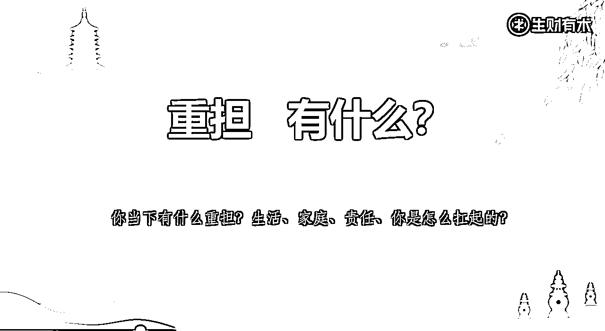

第四个是团队抬担架的故事，如图所示每个小组中都得选出一个人躺在担架上，然后再选出一个人，扛着队旗当向导，其他人负责扛担架，这个抬担架的路程大概有3公里，所有队员全程不许发言，担架全程不能落地，一旦落地，全员成绩作废。

躺在担架上的是一个脚受伤的女人，谦称自己132斤，当担架上肩，我的体感是180斤

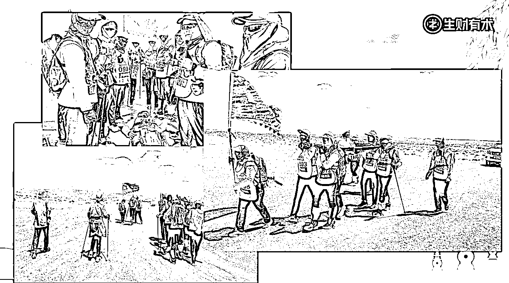

但是也没有办法，选择了就要负责到底，男人分布在四角负责抬担架，当扛着担架走到路程2/3时，我忍不住的流泪了，这是我在4天3夜徒步过程中，第1次流泪😭

因为肩膀上的重担，实在是压的喘不过气来，但是又不能轻易放下，其次想起了我的父母，一边流泪、一边迈着沉重的步伐，如果担架上躺着是爸爸妈妈，怎么办？

一想到这里，眼泪就忍不住的往下流，是内疚的眼泪，是悔恨的眼泪，是恨铁不成钢的眼泪……

内疚的是什么呢？内疚自己在小时候，为什么没有听父母话，让自己多吃两碗饭时，那么抗拒。为什么平时不好好锻炼身体，储存一下体力。

可能也是基于当下情绪的一种宣泄吧，眼泪确实是忍不住的流。

抬担架就像是把未来危机，前置到现在，让你提前体会力竭的感觉……考验你会如何应对……

写到这里，好像有点明白，为什么戈壁那么艰苦，却还是吸引着一批又一批的企业家趋之若鹜……

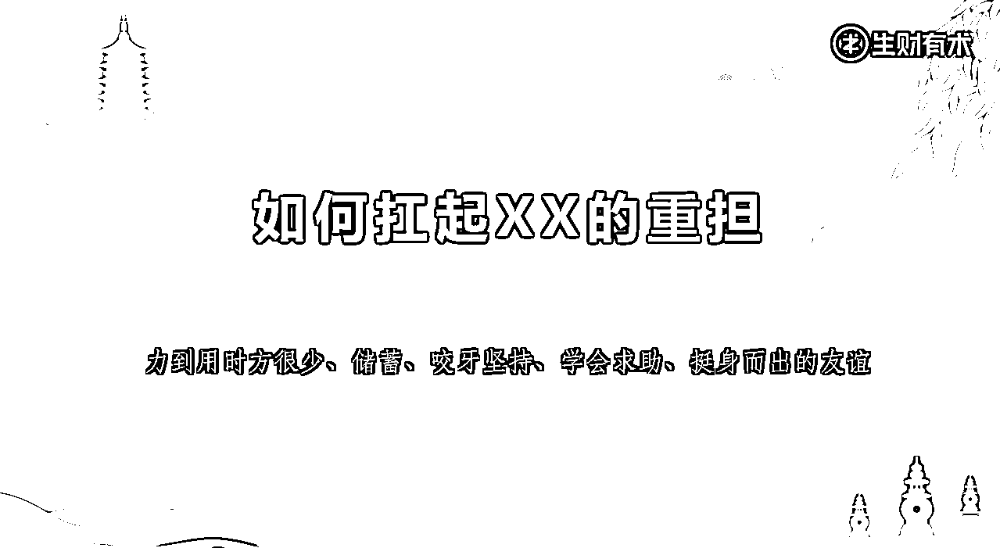

事后复盘，我们究竟如何应对突如其来的危机呢？

第一 养成储蓄的习惯，力（钱）到用时方恨少，平时要养成储蓄的习惯，因为你不知道明天和意外哪个先来临，平时就要储蓄好资金、储蓄好人脉，储蓄好关系。

第二 是咬牙坚持，有时候即使重担压身，当你真正想要达到某目标时，咬牙坚持、全世界都会为你让路，以命为棋、胜天半子

第三 是学会示弱求助，以前最怕自己给别人添麻烦，遇到困难或事情总是独自应对，但是这是最笨的方法，最快速解决问题的方法向他人求助，向高人和有经验的人寻求帮助

当你示弱去求助时，别人可能会因为你力量小而帮你别人，也可能因为你态度好，懂礼貌而帮助你，也有可能是因为你长得帅、长得漂亮而帮助你，总之只要你开口，别人就会有千万种理由来帮你。

第四 是要有挺身而出的友谊，锦上添花比不上雪中送炭，真正到危机关头时，才能看到谁是真正的朋友和兄弟。

## 关于逆袭的故事

比赛的最后一天，眼看马上就要结束，大家心气儿就都没那么高了，都想着慢悠悠的走到最后就结束。

在这种氛围下的团队中，我也没有燃起战斗的意志，想着也是慢悠悠的走完就完事了。

当比赛枪声响起，看到前面的人一如既往的向前冲，后排的人在慢悠悠的走，自己则是被不断的人超越，一直甩到了队伍的最后。

看着自己被落在最后时，胜负欲起来了，决定不能就这么浑浑噩噩的走下去，来这一趟必须全力以赴，不留遗憾。

于是我开始从队伍的200名位置上，一路小跑往前冲，大概用了一个小时，我冲到了队伍的前30名

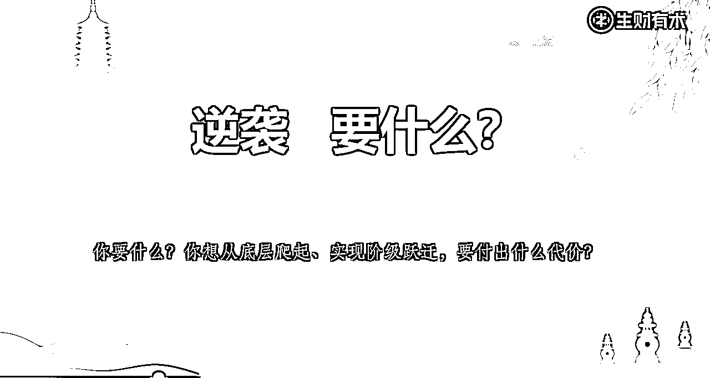

分享给你一路逆袭过程的感悟

第一 欲想成功、意识先行，提前准备，先发优势，一开始就跑在前列的人，是最容易拿冠军的人。

第二 以劳待逸、在别人休息的时候你不能休息。在别人走路的时候你要小跑，在别人小跑的时候你要大跑。只有这样你才能够从后面赶上来。

第三 直线超车，选择难走但正确的道路，

戈壁滩的路并不是笔直的，而是崎岖蜿蜒，坎坷不平的碎石路，接下来的内容很重要，可以多看几遍

在你们两人的前方设定一个目标点，但是路不止一条，对手有可能是走的舒服平坦的路，但是会弯弯绕绕

两点之间、直线最短，你如果奔着目标点，克服困难走直线，路上一定会遇荆棘、忍住脚下的疼痛，一如既往的往前跑，只有这样你才有一线生机，超越具有领先你的的人。

就像是战争中很多部队，为了搞偷袭去翻山越岭跑夜路，最后拦在前面敌人的必经之路，出其不意时给敌人致命一击。

这也是华为能在落后美国这么多的情况下，历经几年的忍辱负重，最终能在5G上胜出的原因……

第四 避免踩坑，尽可能的少犯错。

只有比别人少犯错，少浪费时间和机会，后来者才能在别人犯错时趁虚而入，加速超车。

第五 是永不停歇，保存体力和心力

本来就是后来者，你还有资格风花雪月？你怎么能睡的着觉！

我从倒数几名冲到了前20名的位置，但是在后1/3的路程，由于体力不支，开始慢慢掉队，眼睁睁看着被我超越的人在反超我，所以保存体力、心力很重要，不要一股脑的完全提前透支~

写到这里已经接近尾声，非常感谢能看到最后的你，有眼光之人必有好运加持！

最后请允许我衷心的感谢一下，帮助我众筹徒步费用的生财亲友团的朋友们，感谢大家对我的认可和支持……

感谢阿晨、Erik、张亮、张岳、刘杰、王大漂亮、鹏翼、wake up

蓝衣、方寸、康五六、许芝之、高恒、金泽、卢道然、冯妮儿

大林、宁伯、陶恒涛、陶金金、吕律师、Vince、芳园

杨星城、春秋、程序员小解、宋老师、隆哥、家蒙

（排名不分先后）

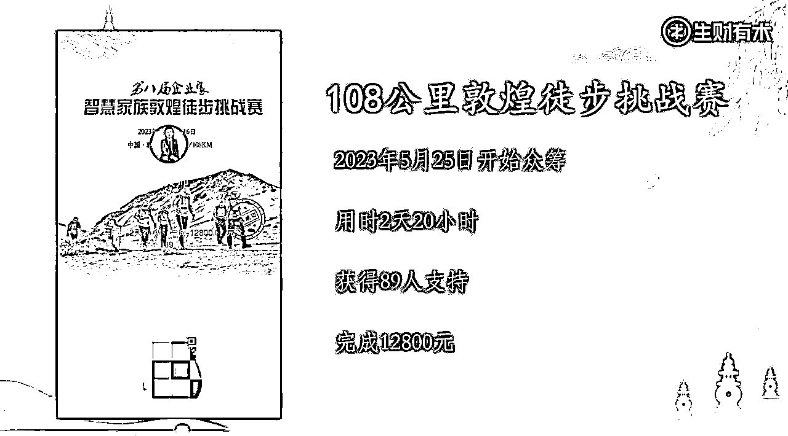

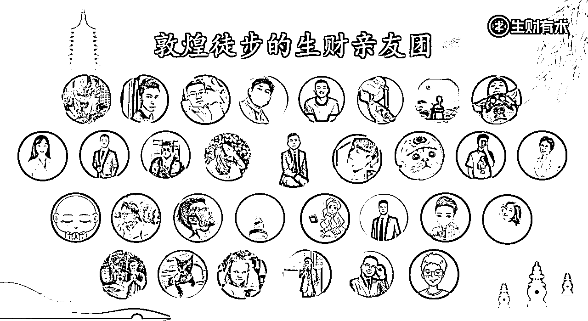

如果看到文章最后，如果你也燃起了对戈壁徒步挑战的向往之情，可以联系我okk296，我会在10月中旬再重走一遍戈壁，用双脚丈量大地、用生命书写人生，期待与你在大漠相见！

无兄弟，不远征，若同行、必不负！