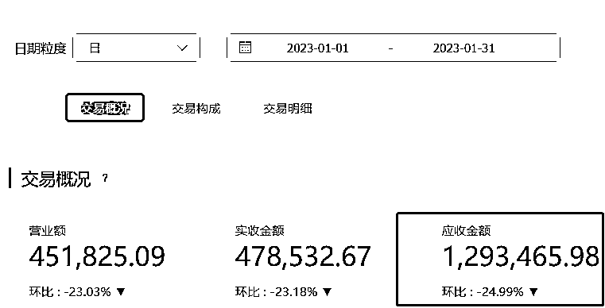
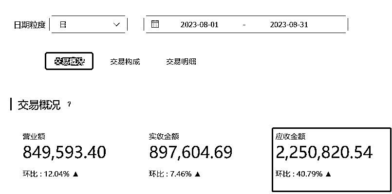
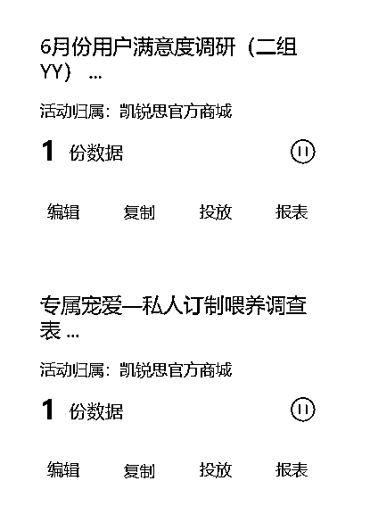

# 一个策略，半年时间，让私域销售额从一百万到两百万

> 来源：[https://lvimnfrah8l.feishu.cn/docx/T6rYdJS5AozfMnxor0QcSUVNnKc](https://lvimnfrah8l.feishu.cn/docx/T6rYdJS5AozfMnxor0QcSUVNnKc)

哈喽，伙伴们，又是我zeno，一个五年的私域中鸟，一个朝着段子型私域努力的男人（这个梗有机会解释）。继上次半个月搞定二百六十家加盟商后，没读过的伙伴一定得读一下，链接在此：

今天我又给大家带来了我的方法分享。整体还是比较简单粗暴的，先来看两张图吧，图一是我刚加入公司后没多久的销售额(今年一月份)，图二是刚刚过去的八月份的月度销售额。

半年时间，销售增长了一百万。先给大家说明一个点哈，这半年时间的我们的用户数量只是从30万出头到了40万出头，所以不存在用户数量翻倍导致的销售翻倍情况。

我也不跟大家卖关子，这一切的变化，我把它划分为三个维度：

分别是“舔好了大客户”“掐准了用户旅程”“摸清了用户心理”。

今天就先跟大家分享第一个点，怎么把你的大客户舔好，至于后面两个点，有机会再聊。

说舔可能不太恰当，但恰恰非常形象。因为我们都知道，在私域运营中，一个不能忽视的群体便是“大客户”。这些用户由于他们的购买力、频繁的互动和对品牌的忠诚，经常为企业带来稳定而丰厚的收益。

事实上，我能在半年时间得到将近50%的增长：70%的收益增长来自我们挖掘的那10%的黑金客户。

在我的职业生涯中，我有幸为两家颇具规模的公司做私域运营工作，因为数据保密哈，我就分别代号为A公司和B公司。A公司是护肤品市场的一个非常有竞争力的国货品牌，而B公司在宠物食品市场中是非常有冲劲，正在昂头爬坡的一家国货品牌。

从数据上看，A公司的大客户（即那些累计消费超过50,00元的用户）占总用户的5%，但其贡献的营收占比高达30%。与此同时，B公司的数据也很惊人：尽管那些贡献很高销售的用户只占总用户的3%，他们却为公司带来了近35%的营收。

先导环节结束，在接下来的几千字内容中，我将详细的与大家分享我对大客户运营的见解以及一些较为成熟的方法论。

### 一. A公司与B公司的概述

为了让大家更能快速理解后面的一些策略，我们还是花一些时间来介绍下这两个公司的情况以及业务背景。

##### 1.A公司：我将它称之为护肤品市场的中上游领导者

A公司凭借其强大的供应链以及优秀的产品质量量、创新的营销策略和持续的研发投入，成功地站在了这个行业的中上游，更是国货新兴品牌的领导者。A公司不仅仅是一个产品制造商，它更是一个为顾客提供全方位护肤解决方案的品牌。无论是针对油性、干性还是混合性肌肤，A公司都有对应的产品线来满足用户的需求。他们的次抛，面膜，面霜精华等产品，通过一批又一批的koc和kol的宣发，被越来越多的消费者熟知。

##### 2.B公司：我更愿意称它为宠物食品市场的爬坡者

我们都知道，宠物赛道是一个非常卷的赛道。尽管该市场已有许多成熟的品牌，B公司仍然在努力的爬坡，希望为每一个宠物提供更健康、更营养的食品。虽然他们没有自有工厂，但丝毫不影响他们在市场的占有率。他们主要以宠物粮为主，宠物用品和宠物零食为辅。另外，B公司的老板还非常注重与客户的互动，他多次和我说，我们不仅仅是销售宠物食品，更是提供一种生活方式，鼓励宠物主人与宠物建立更深厚的情感联系。就是这句话，让我下定决心加入到他们的团队中去。

在这两家公司，不同赛道不同用户人群，但我都使用了相同的策略，就是大客户运营策略，这也是我为什么想优先讲这个策略的原因。

##### 3.两个公司大客户的数据变化解析

为了直观地呈现两家公司实施大客户策略后的成果，我们先看实施前后一些数据变化：

###### ①整体客单价增长：

- A公司：在实施大客户策略后，整体私域50万用户的客单价从原来的￥270增长到了￥340，增长率达到20%。要知道，公域的可单价平均在240左右，超了一百多

- B公司：B公司就更加明显了，我们经过专门的高客单组合品和产品推荐，整体客单价从125提升到了将近175，近乎提升了30%。

###### ②客户重复购买率：

- A公司：原先只有45%的大客户会再次购买，策略实施后，这一数字上涨至60%。

- B公司：原来的大客户回购率为40%，现在已经达到了58%。另外40%的大客户大部分也会在超过复购周期一段时间后回来继续购买。

###### ③大客户的增长率：

- A公司：与之前相比，每个月新增的大客户数量从之前的100人/月，到现在的160/人每月。

- B公司：与之前相比，每个月新增的大客户数量从之前的40人/月，到现在的55/人每月。

###### ④客户满意度：

- A公司：经过精细化的大客户运营，满意度从85%提升到了93%。

- B公司：与客户深度互动后，满意度也从原来的80%增长到了90%。

###### ⑤大客户流失率减少：

- A公司：之前的大客户流失率为15%，实施大客户策略三个月后就降低到了10%，后续还在持续下降。

- B公司：在加强与大客户的沟通和维护后，三个月后流失率也从20%下降到了10%。

###### ⑥销售额的显著提升：

- A公司：之前的大客户流失率为15%，现在降低到了7%。

- B公司：在加强与大客户的沟通和维护后，流失率也从17%下降到了6%。

综上所述，无论是从客单价、复购率、新增大客户数量，还是从客户满意度和流失率来看，大客户策略都为两家公司带来了显著的改善和增长。这些数据充分证明了专注于维护大客户的策略在当前的私域的粗暴收割的环境下是非常有必要和有效的。

### 二. 对于大客户的定义与筛选

说到大客户，那真的是我在公司里头疼的问题。不是说我们不喜欢大客户，而是真的很难定义谁是“大”的。刚开始，这个问题在团队里真是一千个观众有一千个哈姆雷特。谁也不服谁，最后我大手一挥：来，都听我的！

##### 1.A公司：购买频次与累计消费金额

在A公司，我第一次提出，别光看订单多少钱，要看这用户多久来买一次。是不是每个月都跟我们有业务上往来？那种偶尔来买个大单的客户，真的能算稳定大客户吗？再加上他们在我们这累计花了多少钱，这两个指标一结合，筛出来的客户，才是我们真正的宝藏。

尤其是美妆，母婴，护肤这样的赛道，用户天然对于某一家产品，某一个品牌有依赖性。用得好，就会一直用。按A公司的产品结构及客单价来说，正常用户的复购周期在20天左右，这也就意味着，三个月买五次及以上的用户，就一定对品牌有相当信任的用户，基本形成了稳定的复购周期。这样的用户，就一定是我们的大客户。

当然，如果一个用户能够累计消费三千以上，我们也是非常乐意去维护的。

##### 2.B公司：基于累计消费金额

到了B公司，我简化了筛选流程。宠物市场上，我觉得哪个主人真心对待自己的宠物，从他们的花钱习惯就能看出来。那些为宠物买好食品、不惜投资的客户，绝对是我们的大客户。另一方面又受限于宠物行业的特殊性。一只狗子，它就算再能吃，一个月两袋粮也很极限了，更别说主人还会给他一些别的食物。他不像护肤，今天她的皮肤不好了，加大护肤用品的使用量，进而缩短复购周期。

所以，我就用了一个最直接的标准——看你在我们这累计花了多少钱。我们的客单价在一百五左右，如果累计消费金额在1500以上，那他就是我们的大客户，享受大客户优惠。当然，如果你能一口气充值一千元在我们的小程序里，也是我最爱的衣食父母。

所以朋友们，如何辨别你行业的大客户，如何精准筛选出你的大客户呢？

1.如果是快消品，明确客单价，把平均客单价*10，这条线就是大客户与普通用户的分界线

2.明确复购周期，一个用户，如果能完成三到五轮你家产品的复购周期，那她对你家产品基本上属于真爱了。不信你想想自己，买同一家产品五次，你下次再买同类型的产品，会不会第一时间想到你买了五次的那家。

3.设立储值门槛，因为在私域里我们都有自己独立的小程序，如果一个用户愿意在你这花大价钱储值，那即是他一分钱也没花，但他仍有无限可能。

4.一个忠告，别过分研究数据，反而会越研究越乱，这个后面也会讲到

### 三. 大客户的差异化价值与满意度收集策略

“要知道一个客户到底喜不喜欢你，最直接的办法就是直接去问。” 这是我一直坚持的客户运营逻辑。

毕竟我们要确保这些为我们带来巨大价值的客户，真的从我们这里得到了他们想要的东西。

运营切记别自嗨。

##### 1.满意度调查方法：问卷与电话回访

所有调研的方式，必定绕不开问卷和电话。为什么呢？因为它既快又方便。我们可以在短时间内收集到大量的反馈信息，然后快速进行筛选和分析。这里，针对大客户的问卷也非常有讲究，你就记住一个点，精细化的针对性。我们甚至会针对不同用户情况，一对一的设置问卷内容，如下图。具体问卷维度就不在这里说了，感兴趣的伙伴可以联系我。基本上我们回收问卷率在80%以上。同时我也知道，纸上得来终觉浅，真知要靠踏破铁鞋。

于是，电话回访成了我的第二把利刃。对于那些已经超过复购周期半个多月，但仍没有下单意向的大客户，直接与客户约定时间，然后一个电话打过去，接了就接了，没接就在微信后面补一句，张哥（姓名一定要带，这个不解释），刚才给您打了个电话，想跟问问您宠物/皮肤的情况，如果您有时间了可以给我回拨回来或者微信跟我说说。如果接了，一方面可以深入了解他们的需求和不满，然后针对性地进行改进。不接，也刷了一波存在感，一举两得的事情。这样，我们既确保了大客户的满意度，又深化了与他们的关系。

##### 2.大客户与普通用户的差异

大客户和普通用户，他们之间确实存在巨大的差异。

首先，大客户对客服的依赖度要高得多。他们不仅仅是购买产品，他们购买的是信任、是一种深度的合作关系。

同时，他们的反馈通常更加针对性，因为他们已经非常了解我们的产品和服务。跟他们沟通，其实是在变相的帮助企业和品牌优化相关活动和策略。

第三点，相对于普通用户，大客户是企业的核心资产，是游离于金钱价值外的核心竞争力。有数据表明，一个用户可以在有意或者无意间影响五到十个他的身边人，大客户就是你的企业做声量的最好资产。

而普通用户，他们可能更多地是基于需求或者活动促销来购买，与品牌的关系还不够深厚。可能今天你这便宜，他在你这买了，明天他那打折，他就转投他人怀抱。

但这并不意味着我们可以忽视他们，毕竟，今天的普通用户有可能就是明天的大客户。那如何让普通客户，变为大客户呢，这个地方我们有时间再说。

所以，确保每位客户的满意度，以及在我私域里面的体验良好。无论他是大客户还是普通用户，都是我追求的事情。

### 四. 私域的不同用户运营模式

每当我聊起私域运营，总有那么一点点小激动。为什么？因为我觉得这就像是一场有策略的游戏，我们要确保每一步都走得稳稳当当，稳而不错，还要有冲劲！

下面就先跟大家分享下我在私域运营中最常用两个用户体系：大客户体系和普通用户的培养体系。

##### 1.大客户体系

先说说大客户体系。简单说，就是那些已经在我们这里消费了一大笔的客户，或者是频繁地与我们互动购买的客户。这部分客户，他们已经对我们非常信赖，我们的任务就是要不断加强这种信任，不断地提供更优质、更贴心的服务和产品，确保他们的满意度一直保持在一个高水平。

概括来说，要的就是服务，就是专业度，就是用户的差异化优越感。弱化的是促销，是定价，是利益。

##### 2.普通用户的培养体系

然后是普通用户培养体系。没错，我讲他称之为“大客户养成游戏”。要怎么把普通用户培养成大客户呢？

首先，我们得有一套刺激他们购买的策略。可能是一些特别的促销活动，或者是一些独家的礼品。这都是为了激发他们的购买欲望，让他们愿意尝试更多的产品。只有源源不断的购买，才能制造源源不断的认可。

其次，充值机制也是一个非常好的方法。我们可以设置一些充值阶梯，比如充值1000元送100元，充值2000元送300元。这样，不仅可以鼓励用户多次购买，还能让他们觉得非常划算。更重要的是，你在你的私域里留住了这个用户，他将不会再去到公域下单，所以很长一段时间，我们都会把储值率和储值金额，当做我们部门的第一梯队数据指标。

再者，就是培养他们的忠诚度。我们会持续性的定期推送一些有价值的内容，比如护肤教程、宠物喂养知识等，来与他们保持互动，让他们感受到我们的真诚与用心。

当然，这个地方推送也是非常有讲究的，就拿宠物喂养知识举例。如果你是一个养宠人，我教你如何给猫喂粮，你可能嗤之以鼻，因为这个是所有人都知道的尝试。但如果我教你，如何正确抱猫呢？很多人抱猫都是错的，要不就被猫抓伤，要不就猫咪不在你怀里呆着。当时这篇文章，一下子点爆了我们的分享，阅读量五万+，数千转发。

所以，推荐内容很简单，如何解决用户的问题，其实很难。要有足够的用户洞察，要有足够的痛点发掘。这里推荐一下，如果你想做行业的痛点科普，那你就去小红书或者抖音看一些与你行业相关的视频或者内容。比如我想知道养宠的痛点，我会去抖音关注十个救助宠物的博主，他们讲的宠物问题，往往是最真实的，也是最能引起用户共鸣的。

说到底，不论是大客户还是普通用户，我的目标都是一样的：让他们真心喜欢我们，真心信赖我们。只有这样，我们才能在这场“大客户养成游戏”中赢得最后的胜利。

### 五. 团队结构与职责分工

我们都知道，搭建一个强大的私域运营团队并不是随便找几个人就能完成的任务。更别说是对用户行为，用户心理要求更高的大客户运营团队了。这里我谈一谈，在我眼中，什么样的客服能力模型，能够胜任维护大客户的重担

##### 1.由客服团队选出的销售与服务精英组成

现在回头来看，我们最初的大客户团队其实是从基础客服团队里挑出来的。那时候，我注意到有几位客服不仅服务态度超好，还具有很强的销售意识。他们经常能够成功地向客户推荐更多的产品，而且客户反馈都非常满意。我觉得，这正是我们团队需要的人才！所以第一点，作为客服来讲，销售的主动性以及销售意识，这个东西真的很重要。

同时，他们日常中从来不会回避与用户的电话沟通，接通电话后聊的也是落落大方，处理问题没有任何问题。反观另外一些客服（惭愧，我也是这种人），看到用户打电话就犯怵，接个电话声音都打颤，更别说处理问题了。所以，第二个点，一定要自信大方，不畏惧沟通，勇敢的表现自己，这样别人才能看到你更深层次的能力。

还有我认为最重要的一点，也是我选择大客户团队最重要的一个，虽然可能有些不人道，但是就得是这样的。无论什么时间，无论什么地点，看到消息，能够第一时间回复用户，尝试解决问题。这个也很简单，服务意识，是一个销冠，一个大客户经理的立身之本。

##### 2.运营团队对大客户进行精细化运营设计

其实我是一个比较务实的人，在我看来，运营团队的用人画像其实很简单，从大的方面来看：我要求你执行的时候，你能闭上嘴，百分百保证你的执行，把执行力拉满。我让你创造的时候，你能发挥你天马行空的想象，让这个事情按照你的思路想法更好的呈现在我们面前。这就很够了。

我对于大客户的运营团队，本质上和普通客户的运营团队，要求其实是一样的。

用户洞察力：私域运营，本质就是洞察用户行为，清晰用户画像，然后高效的应用到相对应的活动策略中

产品构建力：不懂产品的运营不是好运营，一个真正能带来增长的运营，一定是对于产品了解，但还要能较好的构建产品的组合，知道如何配合用户行为进行专属产品推荐的人。

问题解决力：运营一定要能解决问题，要会解决问题。无论是运营过程中出现的问题，还是用户反馈的问题，解决问题就是运营的基本功。

专业知识力：专业知识决定了内容厚度，内容厚度决定了用户粘度。用户粘度又决定了信任度，信任度就是大客户运营的基础。

### 六. 从护肤伴侣到爱宠专家：我在A公司与B公司如何打造大客户维护策略

咱们都知道，护肤和养宠压根就是两回事，那我是如何设置这两种不同的活动并成功拿到结果的呢？

先聊聊A公司。护肤，这真是每个人都关心的事情，尤其是我们的大客户们。她们不只想买产品，她们还想知道怎么用，何时用，与什么搭配，线下门店能不能面对面的帮助到她。所以，这个地方划重点，你所在的行业，你所面临的用户，你是否知道他们这些针对性个性化的需求，这直接决定了你是否能维护到大客户的心坎里去。

至于怎么收集这些需求，很简单，问卷+电话，大道至简，但是要记住一个点，就是要精细化的针对不同用户的购买习惯，跟你们聊天反映出来的各项问题设计问卷以及电话沟通的内容，这点非常重要。

接下来就是我针对护肤大客户的相关策略：

精致女生计划：因为我们的受众群体是20-40岁的女性，重回年轻抗初老是每个女性想要的。所以我们就推出了一个精致女生计划。

在这个计划下面，我们不仅给大客户提供护肤品，还一周三到五次为她们提供专业的护肤指导（具体次数由大客户的肤质及时间决定），半月内还有两次线下免费面诊服务，门店免费进行肤质情况检测，专业美肤师出具报告，配合线上产品使用，达到效果的翻倍提升。同时还有给每个女生的月总结，肤质变化报告，真正意义上的做到了全方位无死角的照顾你的皮肤。

优惠，必须的：推荐产品的时候，我们按购买时间来进行折扣，如果推荐当天买就有八折优惠，一周内买也有九折。这样有两点好处，一方面是可以营造出过了今天就亏的感觉（因为我们后面是真的只有九折）。另一方面能变相检测我们的推荐专业度以及成功率。你可以想一下，如果一个用户和你聊的很好，但你推荐产品后，他就不回复了，甚至也不买了，这时候你是不是就要反思自己和用户的沟通哪里出了问题，或者是不是推荐的策略出现了问题？

一对一的关怀：久没复购的客户（这里我们选择的是超过一个复购周期，二十天），我们团队成员就回一对一询问情况，主要的策略就是以一个活动为开场，相约一个电话沟通，电话里尝试唤醒用户，或者提醒用户继续购买。同时电话结束后也会给用户发一个短信，附带一个门店地址，告诉用户凭此短信可以免费进行门店测肤一次，制造惊喜感。

线下门店贵妇沙龙：每月三城，进行线下门店活动，活动主题会根据当季特点而定，参与活动的就是我们各个城市的大客户们。我们会先跟他们沟通时间是否合适，然后采用邀请函邮寄邀约的形式，仪式感拉满。门店活动主要以专业美肤师讲解护肤问题，线下面诊，按摩手法交流，免费护肤体验，领取礼品纪念品等环节。最大限度的让用户享受到我们的专业与服务。

新品体验：每月都有新品让大客户先免费尝鲜，我们从来没要求大客户给我们进行站外分享，但60%的大客户都会在抖音和小红书分享我们的产品。

朋友圈一对一种草：在朋友圈，我们会精细化的做一系列的特性动作，比如让一些南方地区的敏感肌皮肤，我们会在夏天发一些如何补水或者防晒的文章，精细化的推荐给我们的大客户，点对点或者点对线的进行种草，但绝不会店对面的进行朋友圈式的群发。

然后是B公司，跟A完全不一样。毕竟，猫猫狗狗吃的东西，怎么可能和我们涂脸的一样呢？在B公司的策略为：以产品的搭配和我们的专业度为第一驱动，高效的服务为压舱石，保证大客户体系的全面推进。

促销提前知：因为相较于普通用户，在B公司的大客户也是从普通用户的阶段过来的，所以身为我们的大客户，会有一个最直观的特权，每次有促销，我们会先告诉大客户，让她们抢先一步下单，尤其是一些限量的产品，一些大客户经常抢不到。这个策略也是大客户最喜欢的策略之一，因为他们能从这里面清晰的感受到差异化带来的不一样。

定价小技巧：在定价方面，我们针对大客户和普通客户也是存在差异化的。虽然可能不太厚道，但确实很有效果。因为在B公司对于大客户的定位，可能和A公司不太一样。B公司是想要考大客户拉升客单价和毛利率的。B公司的产品毛利较高的是那些零食之类的。

所以我们在给大客户展示产品定价的时候，会特意的把一些主粮产品的定价稍微调高一些，把零食的定价稍微低一些。然后我们在给用户推荐的时候，会重点推荐我们的零食组合，对比公域的价格多么多么的优惠。这样一套动作下来，60%的大客户都会在卖粮之余买一些零食给家里的毛孩子。

新品体验群：这个就和A公司的比较类似了，每月新品优先给大客户的毛孩子进行尝鲜和试用。

小程序差异化：这个地方是我在B公司投入大精力重点打造的一个版块，具体图片就不给大家展示了。有句俗语说得好，见人说人话，见鬼说鬼话。我们现在的小程序就是，见大客户，展示大客户的页面，见普通用户，就展示普通用户的页面。核心原则就一个，怎么奢华高贵怎么来，怎么提现差异化怎么来。让用户最直观的感受到，原来我确实在这个品牌是不一样的。比如：普通用户的开屏弹窗可能是什么优惠，什么活动。而大客户的弹窗则是：xx公司的老朋友，欢迎回家。这样用户想不感动都很难好吧。

总之，不同的公司，不同的产品，但我们对大客户的态度是一样的：用心、专业、利他、真诚。

同时，再给大家分享一个前段时间发生的很有趣的一个案例。

我把这个案例起名为：一个忠实顾客的自我修养

张姐是B公司的一个老客户，买了三年的宠物用品，主要是狗粮。但这三年来，她与公司之间的互动都非常有限。就像很多其他客户那样，张姐只是在收到我们的群发通知时，觉得家里的狗粮快吃完了，价格也算合适，就会再次下单。

直到我们的大客户团队前段时间回访的时候发现，张姐在这三年里已经累计消费了五千多元。但却和我们基本上0互动。她绝对是我们的忠实大客户。为了更好地了解她的需求并加强与她的关系，我们决定采取点对点的沟通方式。

我们的客服主动发起了微信沟通：“张姐，您在我们这儿买了这么久的狗粮，我们真的很感激您的支持。我们想了解一下您使用我们产品的情况，以及是否有其他方面可以为您提供帮助的地方。您方便的时候，我们可以聊一聊吗？”不久，张姐回复了我们，愿意与我们进行深入的交流。

这次交流中，我们不仅了解到张姐对我们产品的满意之处，还听到了她的一些建议和需求。这些宝贵的反馈不仅帮助我们改进了一部分服务内容，还加深了与张姐的关系。

从那之后，每当张姐的宠物有任何需要，她都会第一时间找到我们。而我们也会根据她的需求，为她提供专业的产品和服务建议。慢慢的，张姐从只买粮食，到愿意尝试我们推荐的零食，用品。现在基本上我们有什么新品，她都会第一时间主动支持我们，即使她的宠物现在可能不是很需要。成为了一名名副其实的大客户。

其实，真正的营销不仅仅是销售产品，真正的大客户服务也不只是发消息那么简单，更重要的是建立和维护与客户之间的深度关系。通过与客户的深度互动，我们不仅可以更好地了解他们的需求，还可以赢得他们的信任和忠诚。

### 七. 团队如何处理大客户反馈

有一句话我一直很认同，那就是：“客户的反馈是私域部门前进的指南针。” 对于大客户的反馈，这句话更是显得至关重要。毕竟，这群人已经为我们贡献了很多，我们当然要确保他们的声音得到了重视。所以我们给每个大客户都会发一个电话号，这是我的工作手机号，全天24小时开机，我们向大客户承诺，只要有问题，就可以打这个电话，或者加这个微信解决，当然，表扬的话也可以通过这个手机传达。而这个手机，由我和我的两个主管始终拿着。

##### 1.快速响应与解决问题

如果有大客户通过客服对我们的产品或服务表示不满，这就是我们部门一级重点事情，由我直接负责。

首先，我作为部门一级负责人，会第一时间核查他们提出的问题，找出问题的根本原因，明确到底是因为客服问题还是产品问题导致的。而后，我们会优先通过电话的形式，及时告知他们问题发生的原因以及我们的处理结果。如果没有接通电话，我们会采用微信留言+短信的形式告知用户处理结果，争取第一时间解决用户问题。

如果是因为流程或者内容上上的问题，导致的用户不满，我们会明确流程问题，然后再对应流程地方加上是谁给我们提出的优化方案。比如一张图片，用户觉得她很丑，那我们再优化后，会先征求用户的想法，如果大客户说没问题了，那我们会在征得同意后，在图片右下角署上大客户给我们提供的名字：感谢xx为我们提供的宝贵意见。这样不仅大客户不仅会觉得受到了重视，更是会对我们的处理结果表示满意。

而且，我始终认为，快速响应是显示我们尊重客户的最好方式。它不仅可以让客户觉得被重视，还可以增强他们对我们的信任感。

##### 2.完整的奖惩制度

那如果是客服的问题呢，这里会分为两种情况。

情况1：客服疏忽，没注意或者没有及时回复，或者回复错误导致的用户不满。那这种情况，每个大客户客服每月只有一次犯类似错误的机会，如果吵过一次，就会从绩效及激励方面入手做惩罚。

情况2：故意不回复，回复内容敷衍了事，不给用户解决问题。这种情况出现，出现一次，回到普通客服岗位，出现两次，直接开除处理，没有商量。

当然，我们也有很好的正向激励给到大客户的客服们。

比如，如果某个团队成员成功地解决了大客户的问题，并且得到了他们的好评，那么他会得到一定的奖励，可能是提成，也可能是其他形式的奖励，比如公司产品，带薪休假，团建经费等等。原谅我比较老套的激励方式，让大家见笑了。

总之就一个点：允许犯错，但不允许触碰底线，如果被表扬，那就大力奖赏，打造学习对象。

### 八. 从银行与保险业学习：提高我们的大客户运营策略

当你走进银行，总会有那么几个特殊的办公室，上面写着“VIP客户服务”或“贵宾室”。而保险公司也有专门的团队为那些高端客户提供一对一的服务。这两个行业，他们真的很懂大客户。当初为了更好的完成大客户的模式搭建，我特意办理一个保险和去银行存了点钱。为了就是真实的体验下他们的服务，当然，最后虽然也就是一个小客户的服务，但也给我了不少启发。

##### 1\. 专属服务

银行和保险公司非常擅长提供尊贵的、一对一的服务。你知道的，那种一进门就有人专门招待，还带到私密的办公室聊天。我当时就觉得：我们也可以为我们的大客户提供这样的尊荣体验啊。大客户的专属接待人员，大客户的专属退货退款渠道，大客户的专属展示页面等等。

##### 2\. 定制化产品

银行为大客户提供专属的金融方案，而保险公司也为高端客户提供了定制的保险计划。思路很简单，要的就是“专属”。那为啥我们不能根据大客户的购买记录，提供更加贴合他们需求的产品组合或者套餐呢？我自己对这个事的定义就是“去群发模式”，完全以一对一的人工去替代。事实证明，带来的销售额不但打平了成本，甚至还远超我们之前的群发模式。

##### 3\. 忠诚计划

信用卡的积分兑换系统吧都了解吧，或者那些保险公司的奖励计划，长期合作可以享受更多优惠。我们当时也设计了一套核心大客户服务体系，你买的越多，权限越高，对应的获得的产品及服务也就越丰厚。

##### 4\. 教育与培训

许多银行和保险公司会定期为他们的大客户举办一些小型的讲座或研讨会。例如，如何更好地管理财富、如何为子女选择合适的教育保险等。我们也这样尝试过，时不时地组织些线上、线下的分享会，让大客户更了解我们的产品和行业动态。

总之，尽管我们是在完全不同的领域，但从银行和保险公司那里，我们学到了很多关于如何更好地服务大客户的方法和策略。我们可以借鉴、学习，也可以结合我们的实际情况进行创新。当然，也推荐大家去认真调研一下他们的大客户服务逻辑，基本上放在电商板块属于降维打击了。

### 九. 公司面临的挑战与我的解决方法

面对挑战总是不容易的，尤其是在大客户运营这块。但就像我经常和客服们说的，没有什么问题是我们解决不了的，只有我们不想去解决的问题。

##### 1.A公司：初期投入与收益平衡的问题

当我们在A公司开始实施大客户运营模式时，我知道前期的努力和投入是关键。但面对初始三个月仅回收了成本的1/3，我也感受到了那与众不同的压力。线下门店、人员调配、活动成本，产品成本...我们投入了大量的资源，但回报似乎并不如人意。

就在这关键时刻，正是那些大客户我们前三个月积极维护大客户的反馈激励了我。他们不仅仅是我们的消费者，更是我们品牌的忠实拥趸。从第四个月开始，我开始深入了解大客户的需求和购买习惯，通过提供更加个性化的服务和优惠，确保他们能够得到真正的价值。结果也很明显，大客户开始主动联系我们，甚至很多原本只在线上购买的用户，也开始走进门店进行消费。到第六个月，大客户项目最终成功实现了盈利。

##### 2.B公司：大客户的配合度与流失问题

B公司的问题稍微复杂一些。很多大客户在购买了一段时间后，开始出现配合度下降的问题，比如不太愿意参与我们的活动，或者给出反馈。更严重的是，部分大客户开始流失。

这让我意识到，仅仅提供好的产品是不够的，我们还需要在服务上做文章。所以，我提出了“超预期服务”策略。简单来说，就是让客户觉得我们为他们做的，总是超出他们的预期。比如：大客户想要一款猫粮，我们会尝试要一张大客户猫咪的照片，根据照片形态，看看有没有什么问题出现，如果有问题。比如泪痕，发腮，体态等问题，我们会先给用户解决问题，然后根据问题给大客户推荐适合的零食，用品和粮食。

我们制定了一套完整的客户关怀流程，包括定期的回访、特殊节日的祝福、定制的优惠方案等。每次与客户的互动，我们都希望能够给他们带来惊喜，包括但不限于如何与宠物玩耍，新宠到家如何解决等等一系列的问题解决方案。我们甚至搭建了一个十万字的知识库，只为了大客户有问题，能够第一时间解决他们的问题，而不是去百度找一些很中庸的方案。

### 十. 大客户体系未来展望

##### 1.A公司：更精细化的大客户运营

在A公司，私域运营一直是公司的核心策略之一，而在未来，这种策略还将更加精细化。由于我已经从该公司离职，但我相信他们还会继续深挖这个领域。大客户不再只是一个简单的标签，而是一个真实的、有着独特护肤需求的个体。

为此，当时我也提出过，A公司会为每一个大客户建立专属的护肤档案。这意味着，无论你是油性皮肤、干性皮肤，还是混合性皮肤，你都将得到专门为你定制的服务，一对一只为你的服务。这种点对点的回访策略不仅可以满足客户的实际需求，还可以提高客户的粘性，确保他们得到最满意的不仅是购物的体验。

##### 2.B公司：提升客单价与多样化产品推荐

对于B公司，未来的挑战和机会同样巨大。首先，公司需要逐步提高大客户的客单价。这意味着，客户不再满足于购买基础的宠物食品，而是逐渐转向高价位、功能性更强的产品。为此，公司会推出一系列高质量的、针对不同宠物需求的食品，确保每一位客户都能为其宠物找到最合适的产品。

此外，收集到这些大客户的需求后，公司还将重点根据大客户的需求，进一步丰富产品线，包括宠物用品、药品、保健品等。发展方向是为大客户提供一站式购物体验，确保他们无需到其他地方寻找宠物相关的产品。更进一步，我们还会专门为大客户推出一些高毛利、高客单价的组合产品，虽然有点功利，但大客户真的愿意为了信任买单。这也是我们做这一切的原动力。

总结

无论是A公司还是B公司，未来都将面临更多的机会和挑战。但只要我们坚持以客户为中心，持续创新，相信我们都能为客户提供更好的服务，赢得他们的心。

### 十一. 结论及复盘

##### 1.大客户运营在私域运营中的关键作用

在私域运营中，大客户的运营无疑是最具价值的环节。想象一下，那些忠诚的、高频的、高客单的客户，他们为企业带来的不仅仅是稳定的收入，更重要的是，他们的口碑推荐、正面反馈和与品牌之间深度的互动，这些都是金钱买不到的价值。

每一个成功的大客户运营案例，都证明了一个道理：当你真正关心你的客户，去了解他们的需求，去提供真正有价值的产品和服务，这种关系就不再是单纯的交易关系，而是一种真正的伙伴关系。在这种关系中，客户不再是被动的接受者，而是与品牌一起成长、共创的合作伙伴。

##### 2.大客户体系成功的关键

都写到这了，其实也可以和大家聊聊，为什么我这两次大客户体系的搭建可以这么成功，可以取得一些很好的数据。其实，有很多不好的点，刚开始迷茫，没做出来的数据，并没有直观的展示给大家。一方面那些都是踩过的坑，我给大家踩了，你今天读了这篇文章，以后避免就好了。另一方面，人性就是这样一个东西，美好的永远是令人向往的。那今天，我就用这两个例子，告诉了大家，大客户运营就是私域里很美好的东西。一个能真正收获用户信任，是一个能让客服，让运营，让操盘手感受到自身运营价值的策略。

回顾我这两次案例，其实成功的因素，我觉得是蛮简单的，概括的话就一点：绝对利他。

###### ①运营动作和专业内容，永远是两条线

但大部分私域都做成了一条线，也就是现在的发券收割类型的私域。

这个其实也无可厚非，毕竟企业人力有限，但我们更应该把有限的人力放到无限可能的事情上。我也可以很明确的告诉大家，就是运维大客户。通过你专业的运营动作，和绝对利他的专业条线，双管齐下，最后由专业的客服团队1对1的完成最后的收尾。

运营动作体现你策略上的专业度，真正打开天花板的，是你的专业内容。就拿B公司举例，我们有两条专业内容线，一个是依据宠物生命周期的专业输出，一个是生活中养宠场景的问题解决。这两条线，解决了不下90%的大客户问题。

###### ②一定要把大客户运营，当成你私域里面的头等大事

大客户运营体系，只有不做和一直做两种。没有做一半停下来的情况。如果你开始了几个月，发现投产比不行，打算停掉。那相信我，造成的损失一定要比你硬着头皮做要大得多。这也是为什么A公司，虽然刚开始三个月亏损的厉害，但我仍然硬着头皮做下去，幸好六个月回本了，不然我也不确定能不能坚持。但我很明确一个点，只要停下来了，大客户意识到你之前给过这么好的服务，但后面有不给了，造成的用户伤害，会非常大。有句话可以引用到这里，如果我不曾见过阳光，我将可以忍受黑暗。

所以，什么能保证大客户运营体系能一直做下去呢？只有把大客户体系当做你们部门的第一要事，所有人统一思想，才会坚持着走下去。这也是我能坚持推动大客户体系的原因。每当我累了，不想推的时候，总有我的主管，经理，告诉我，你要推下去啊，不能半途而废啊！现在回想起来，真是一帮可爱的团队啊，哈哈哈。

###### ③一切动作的初心，都是利他

大客户体系，会有一种可能性，就是做着做着，做偏了。又变成了另一种形而上学的收割形式。通俗点说就是，以前两头是用户与转化，中间连的线叫收割发券。现在呢，两点还是用户和转化，只不过中间连的线变蜿蜒曲折了，叫大客户运营体系。

所以，我们为了避免这种情况，就要从一开始，就明确一个初心，我做的一切动作都是为了用户好，为了他们感受到舒服，感受到爱，而不是感受到负担，感受到尴尬。这个事情是要时常自检的。不然你会因为各种压力导致你的动作偏离，比如业绩压力，领导压力，下属质疑等等。但请坚信一点，任何投入，都会有汇报。任何付出，都是为了将来的收获。

好了，又一万字输出了，看到这的朋友们，谢谢你们的支持，可以揉揉眼睛，看看远方。最后再次做一下自我介绍，我是zeno，一个五年的私域中鸟，一个朝着段子型私域努力的男人。