# 如何成就理财类IP（一）|怎么创作快速获得他人信任的图文内容？

> 来源：[https://aa16nizk1e.feishu.cn/docx/TGwPdlfTloiFsfxhHdZc2s1dnSb](https://aa16nizk1e.feishu.cn/docx/TGwPdlfTloiFsfxhHdZc2s1dnSb)

大家好，我是lemon，我是互联网金融行业从业者。

操盘过百万客户参与的大型理财营销活动，单月营收超千万，

自己也曾在抖音、雪球上做过投资IP，单月涨粉1w+。

今年7月份，抖音上即将卖基金的新闻，传的沸沸扬扬、业内震动。

抖音超6亿的DAU，这可是金融行业新的蓝海市场。

同时，《证券公司租用第三方网络平台开展证券业务活动管理规定(试行)》或即将启动，这代表了以后在支付宝、微信、头条等巨头平台可以开通股票账户、交易股票了。

在不远的将来，基金、保险、证券等普通人的投资理财方式通过一个平台就能完成。

这也就意味着，以后金融机构在三方公域平台的流量争夺会更加激烈，

机构内部培养&外部合作大V引流的模式也会迎来新一轮爆发。

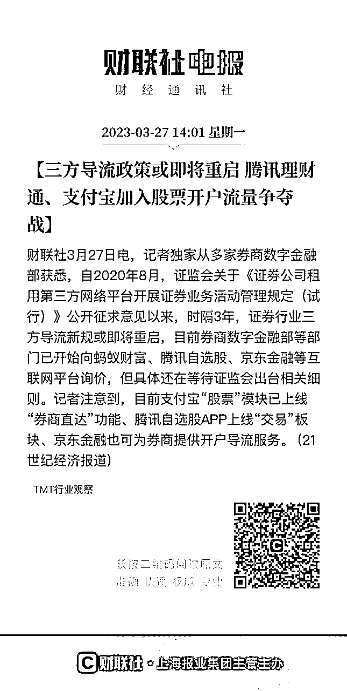

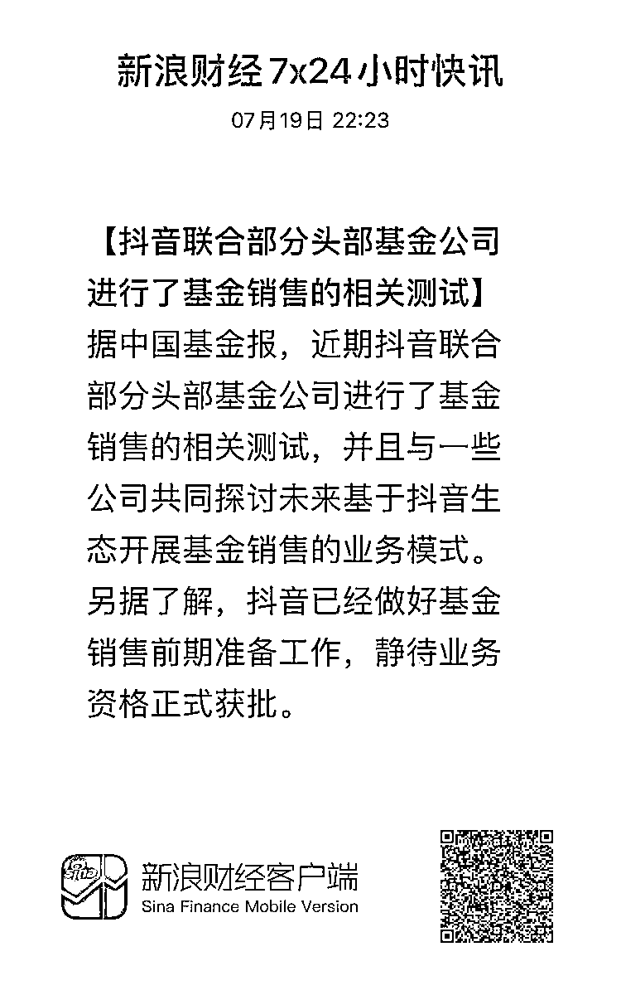

投资理财类IP的重要性不言而喻，生财上也不乏年入百万的投资IP大神们。

对于这类专业程度较高的赛道，如何做好这IP？

去年参加了花爷IP训练营，很有收获。

其中一个关键点，就是模板的应用。

它可以创造规模效应，是可以滚起来的雪球。

因为找到通用的内容密码后，就能快速复制和应用变现。

在专业门槛高的理财领域更是如此。

而小红书、知乎、抖音、公众号等平台屡出不穷的相近内容证明了这一点。

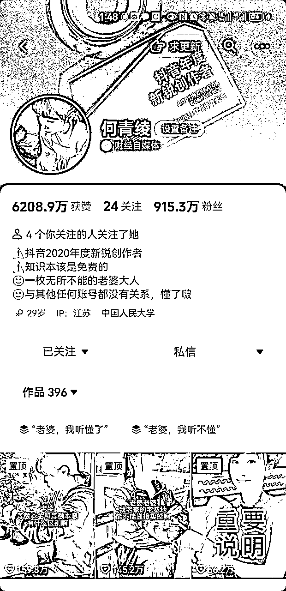

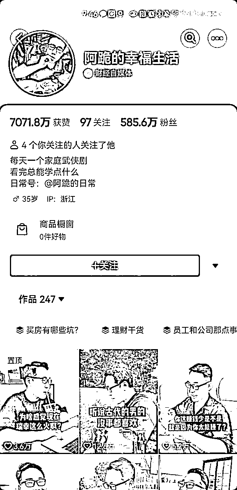

知识问答短视频：左图：老公问、老婆答短；右图：老婆问、老公答）

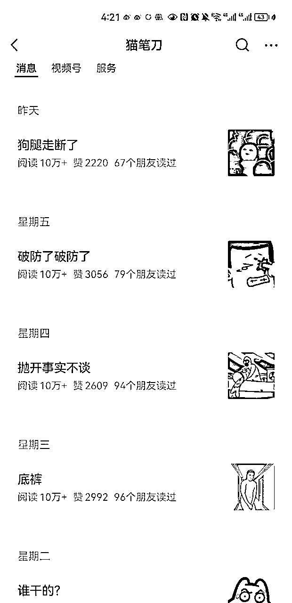

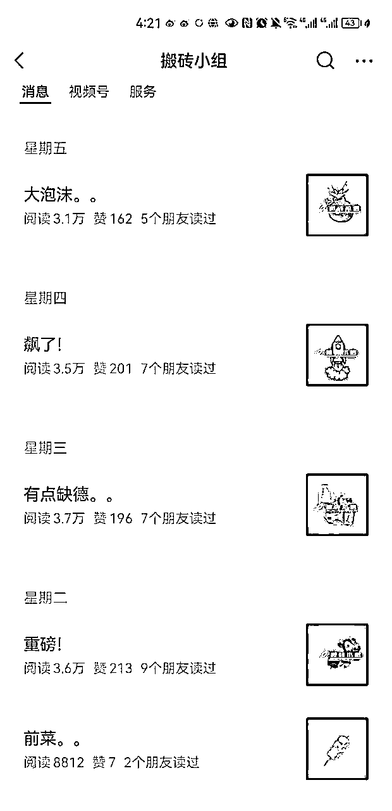

我结合投资理财领域的特点，整理了长图文、视频、短图文的通用模版内容。本文是首篇，是最传统、但适用面最广的长图文部分，试图对以下问题进行回答。

*   在视频时代，长图文还有人看吗，它有哪些优势？

*   有哪些能快速让人产生信任的模版内容？

*   有没有具体公式，要怎么应用？

# 一、长图文的劣势和优势

1、图文的劣势：用户群体少

图文的用户群远远小于看短视频的用户。

首先，图文的信息量和理解难度远高于短视频。能顺利把专业图文内容看完、并理解的人是很少的，我们身边有很多中年人、或者老年人，他们不具备看完图文就能马上理解的能力。

其次，有图文阅读习惯的人，远低于刷短视频的人。短视频是快乐的，看图文是需要自律的。

2、图文的优势：用户相对优质

图文的上述劣势，其实也构成了相对于短视频的优势。

它本身是一种筛选，它帮我们筛选出来了相对优质的用户（能看懂图文、有一定的理解能力、相对来说客单价相对较高）。

现在能被实际带出货的投资财经自媒体博主，大多也是以图文形式沉淀的（例如银行螺丝钉、ETF拯救世界、二鸟说）等。

所以虽然抖音、视频号、小红书有巨大的用户，但图文形式的内容，长见于公众号、知乎、论坛、社群、支付宝，一直也都是一个巨大的流量池。

# 二、图文写作的两大基本原则

### 1、原则一：学会讲人话

现在网上任何一个头部IP，都不是这个领域最专业的人。

行业最专业的人，往往是大学教授、科学家、研究员，但有多少普通人爱听他们的课呢？

李佳琦在真正的美妆行业的专业人士面前可以排不上号，但不影响他是这个行业的顶级IP。

因为专业IP的核心价值，是把专业内容，

用普通人能听懂的语言表达出来，并让人产生信任和转化。

这里跟大家分享2个练习的诀窍。

（1）不要联系写，先练习说，再把说出来的内容，用口语话的方式写出来。

如果你自己讲的话，别人听不懂，不要联系写出来，要先说出来，然后用工具记录下你的语言，转成文字。

为什么呢，往往是因为从小为了应试”八股文“，文字语言已经定型了，很难一时半会纠正过来。而强迫自己先说后写，就能自然地放在跟人对话的场景中，说出让人听得懂的语言。

（2）各种AI工具：CHATGPT、Bing都是不错的工具。

最近层出不穷的AI工具，例如chatgpt、bing、国内的文心一言、讯飞星火等，都是在对话的场景进行使用的，这种场景下的回答本身就具备清楚易懂的特点。

同时他们也具有文本改写的能力，输入专业的内容，通过优质指令往往能把他们进行”人话“改写。

### 2、原则二：学会场景化

场景化能让人身处特定的情景中，这样能更好的产生共鸣。具体来说有两个方法。

（1）多用短句，多用逗号、句号，多分段

一句话尽量不要超过10个字。如果超过了，就想方设法在其中加上逗号、分号。

一段话尽量不要超过3行，如果超过了，就按照主题多分段。

可以看看，无论是公众号、知乎还是支付宝上阅读量高的图文内容，一段话往往就是1、2句话。

（2）多用动词，少用形容词

因为形容词很难让人产生画面感，很难让人身处特定的场景中。

例如：今天我很不开心。

改后：今天我就像泄了气的皮球，垂头丧气地弯着腰回到家，整个人都矮了半截。

例如：UBS并购了对手百年银行瑞信，全球金融市场总算安稳了下来。

改后：UBS极不情愿的将这位昔日对头收入囊中，167岁高龄的瑞信轰然倒地，全球金融市场也暂时松了口气。

# 三、提高用户转化的两大方法

### 1、方法一：有自己的经典内容库

准备至少多篇（一般建议5篇）体现自己专业度的经典内容库，并让每个新加关注、加微信的人能看到它。

这样能让用户最快的速度对你的专业度有感知。

此外，有了这5篇内容，给首次认识用户给你打上了”专家“后，以后你的内容就更容易能打上”专业“的烙印。

### 2、方法二：不追求爆款，追求转化

作为专业内容，阅读门槛高，本身受众人群就有限，不如媒体、八卦搞笑、美妆等方向，追求10w+很容易搞死自己。

此外，因为决定链条长，很难因为一篇内容就转化，而是需要多次服务触达。

因此在公域图文内容核心价值，是为私域导流（包括加企业微信、私聊、关注微信公众号、进交流群、关注直播等）为用户提供长期服务。

它的核心逻辑是：内容够干货、够有效，让读者在阅读过程中，心动值持续飙升，看完后忍不住想加你微信或跟你私聊。

在此基础上铺问答、付费问题，能起到更好的效果。

# 四、五个长图文模版

## 1、模版一：攻略

攻略的意思是”我要解决一个问题“，它的目的性极强，用户非常精准。

在攻略里，本身会展示相关图片、资料来源等，所以很容易留下引流钩子，让用户加微信或私聊索要。

例如在一个炒股付费功能使用攻略里，附上具体的使用截图和详细数据后，很容易有人问这个功能在哪个平台能使用，有没有优惠券。

一个成功的攻略内容，通常有六个要素：攻略主题 、常见解决方案 、常见方案的问题、你的方案、你的依据、案例五个部分。

接下来给大家一个个详细拆解。

### （1）要素一：攻略主题

通常是”我要解决什么问题“。

一般人罗列问题，很容易太大太空，这不是一个好的攻略。

因为短期不容易落地和执行，也不具备针对性。

什么是好的攻略主题？可以按照以下公式进行填充。

如何在xxx的情况下，实现yyy的目标。

xxx是限制条件（比如预算有限、时间有限等），能用数字就尽量用数字。

yyy是具体目标（比如降低风险），能用场景。例如：

1、资产配置：年轻人如何理财？vs 100w的买房款如何稳健理财？

2、投资策略：股民如何做套利？vs 十个套利常见做法，适合小资金低风险选手

### （2）要素二：常见的解决方案及其问题

树立专业度的高效方法，就是打破常规。

可以先抛出一个常见的解决方案，然后提出它的各种缺陷。

例如容易踩坑、有潜在风险、不能让人完全满意、不能满足特定人群的需求等。

这样能让用户快速感知到你的与众不同。

·可以专家视角，比如说：刚投资理财时，一般人肯定会这样做。

·也可以感同身受视角，比如说：我以前也想当让这么做。

比如说，【常见解决方案】买指数基金通常会看它的估值，

【常见解决方案的问题】但平台估值往往做的过于简单，统一用PE/PB来衡量。但因为各个行业特性不同，用一个指数往往会导致出现偏差。

### （3）要素三：你的方案

到前一步用户兴趣已经被充分调动了，下一步就需要根据常见方案中提出的问题，进行差异化的解决方案。

如果需要用户实操，最好要要有具体的执行步骤，具体到第一步、第二步、第三步...分别怎么做，有截图就最好了。

如果你已有产品，不需要用户跟着实操，需要展示这个产品的各维度表现或用户评价。

### （3）要素四：案例说明

有了方案还不够，需要向用户证明，它是经得起检验的，常见的证明依据包括：

·客观依据：

包括理论、研究成果、数据支撑等

·实际案例：客观的依据只能说明道理，但不能打动用户。如果有实际的案例，会更加生动形象。

案例需要具体、有细节，比如是谁、什么背景、做了什么、什么效果、服务截图等，不要伪造 。

### （4）优秀栗子

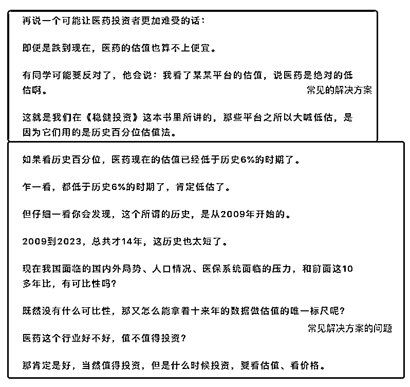

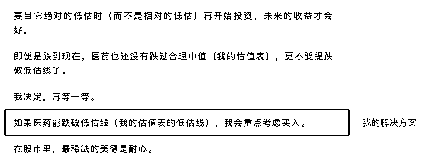

## 2、模版二：清单

如果你刚入门，攻略模版难度比较大，那么你可以考虑清单模版

清单是做一件事情的详细步骤，让人看了之后就能轻松照做。

例如新人如何开户、如何判断基金是否值得买等等。

它是最简单的专业内容，即便是入行不久的新人也能轻松上手，因此强烈推荐。

具体包括三个要素。

### （1）要素一：清单主题

清单的作用是让用户可以简单照做执行，因此主题内容越具体、越容易落地越好。

公式：A实现B的C个步骤

（1）A：是具体的人，客群越细分越好

例如：月定投2k的5个步骤VS职场新人月定投2k的5个步骤

（2）B：具体目标 目标要清晰具体

例如：月定投2k的5个步骤VS职场新人月定投2k攒100w的5个步骤

（3）C：具体数字

### （2）要素二：具体步骤

在具体步骤阶段，每一个操作都要拆分为一步，每一步都要有清晰的指令。

比如筛选基金时，可以去什么平台、搜哪个关键词、搜出来的结果怎么比较，哪里要重点看，哪里不要重点看。

格外需要注意的是，最好少堆砌文字，多展示实操截图、步骤。细节展示越丰富越好。

### （3）要素三：行动理由

除了傻瓜式的无脑操作，每一个步骤最好有行动理由，用来体现专业度，更具备说服力。

例如：筛选基金时，为什么要看3-5年以来，每个自然年、每个牛熊周期的排名。

因为：只看一年排名会导致xxxx，更长周期的排名能清晰xxxxx

### （4）优秀栗子

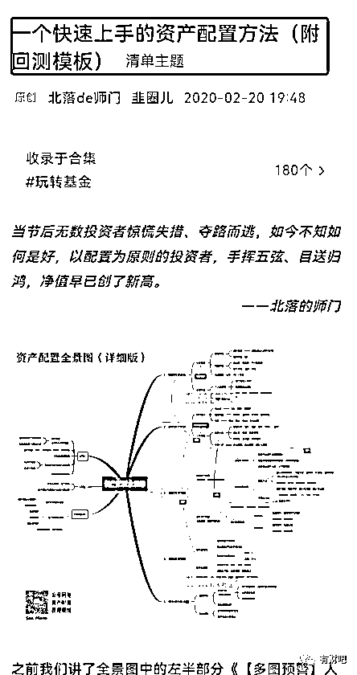

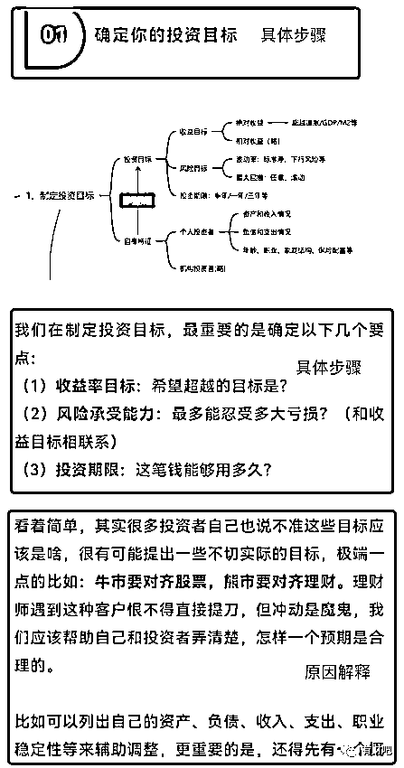

## 3、模板三：市场点评

市场点评是投资理财领域最常见的图文内容方式，上至千万级粉丝账号”招财大牛猫“（现”猫笔刀“）、支付宝粉丝”小高理财“、盈米孵化的IP账号”搬砖小组“，下至各类基金、股票小IP，无一例外每日都会坚持不懈地发布市场点评图文内容。

一篇好的市场点评类图文，由以下三个要素组成。

### （1）要素一：素材来源

点评类素材主要包括两类，一个是时事热点，另一个是投资资讯。

对于市场热点类素材，入选原则是被讨论得越多越好，这样才有话题度和对应流量。它的选题主要来源于市场热榜，例如知乎热榜、微博热榜和股吧热榜。但选择具体话题时需要做好甄别，例如某博的粉饰程度较强。

具体用哪些，可以用这个财经热榜工具箱进行参考：今日热榜 https://gubatopic.eastmoney.com/

对于投资信息类素材，入选原则是信息有价值、懂得人越少越好，这样才能体现不对称价值。主要来源是内部路演、会议纪要、研报、你的投资经验。

### （2）要素二：通俗解释

重点是把事情讲清楚明白，如果热点太过复杂，需要着墨于把一个侧面讲清楚，不要面面俱到。

不要照抄网上的资讯解释，可以把内容自己给别人讲一遍。

### （3）要素三：转化钩子

对于树立投顾IP而言，市场点评图文的作用在于利用各种热点素材吸引流量，体现专业性，增加关注和转化。因此在文章中一定要记得留下转化钩子，钩子分为两类：

1、怎么看：专业角度和情绪角度来进行表达，体现你的专业性和价值观。

2、怎么做：需要注意的是，如何提到基金产品或操作分析时，必须要附带提及的基金产品的个人持仓图/交易图，否则有荐基荐股风险。

### （4）优秀栗子

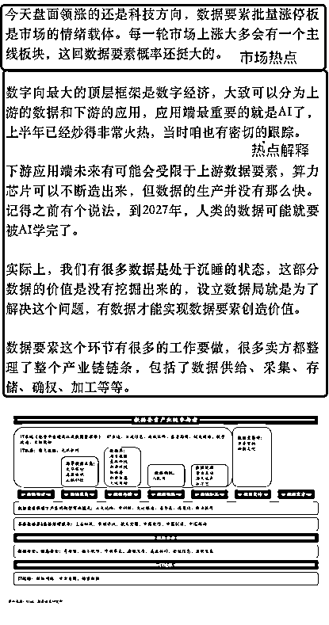

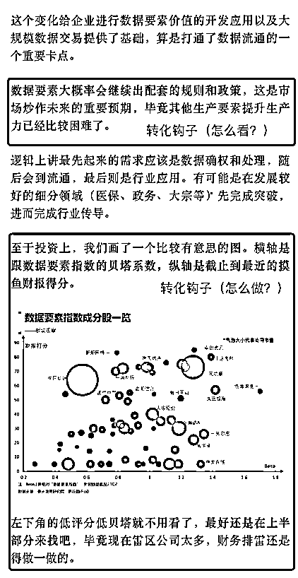

## 4、模版四：避坑图文

避坑图文是引流类图文模版里，点击率较高的一种类型。

如果读者曾经被坑过，被坑的狼狈经历最容易引发共鸣。

如果没有被坑过，避坑方法能让用户提前避免损失。它由以下要素组成。

### （1）要素一：避坑主题

写好一个避坑主题可以遵循这一公式：

【避坑指南】详解a避免b的c个坑

a是具体的人

b是具体要避的坑。

c是具体可衡量的数字

如：买基金的5大坑 vs 避坑指南：小白第一只基金的常见5大坑，多损失xx元

### （2）要素二：具体的坑

一般至少列举5-10个维度，用来描述不同类型”坑“

哪里发现坑呢？资深经验、身边访谈、客户经历、网络资料，如果有案例，坑会显得更真实。

### （3）要素三：为什么坑

1、弄清楚坑的原因 2、如果遇到不懂得，靠搜索

### （4）要素四：如何避坑

1、具体做法 2、避坑的方案，要和“为什么坑”结合

### （5）优秀栗子

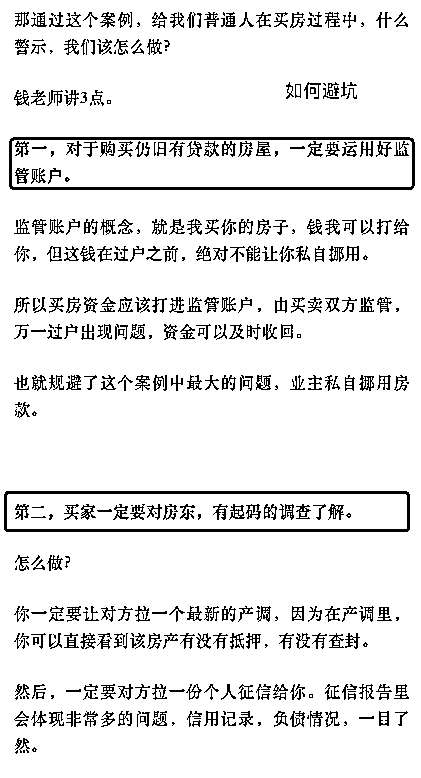

## 

以上是我的思考和整理，后续我将围绕投资理财IP创作更多内容，欢迎大家关注喔~

·【公域】如何创作快速建立信任的视频、短图文

·【工具】如何利用AI工具快速创作投资理财类内容（短视频、短图文、长图文）

·【私域】如何打招呼、打造投资顾问朋友圈，让它既专业、真实、像朋友

· 【转化】理财类社群、训练营有什么特点，如何带货

有兴趣的小伙伴也欢迎加我微信一起交流哈~