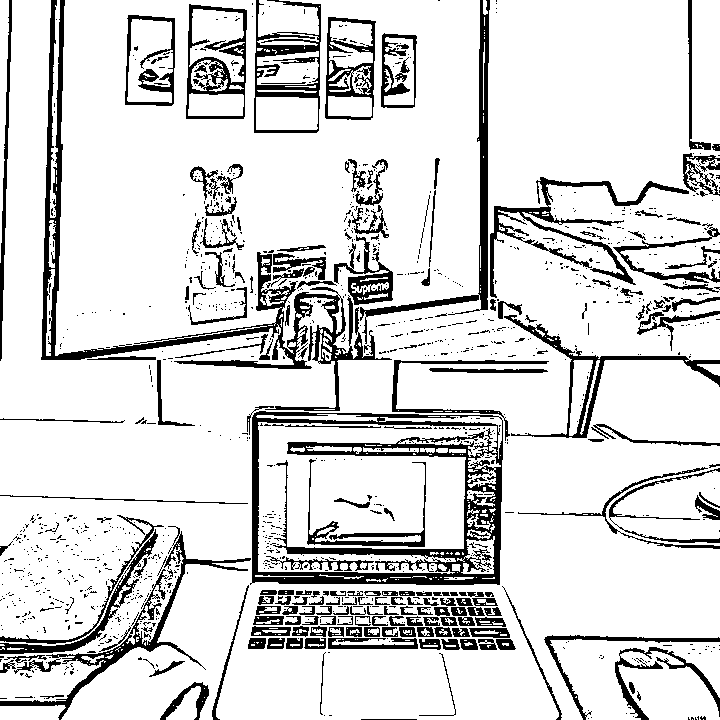

# 我做短视频，不拍视频，不直播，光靠剪辑素材半年赚到了70w+，推荐一个无脑赚钱兼职副业项目！（新手入门全操作攻略）

> 来源：[https://own4m8h9o3k.feishu.cn/docx/TXSrdRQSPoJcHfxSjBHc1rxxnVG](https://own4m8h9o3k.feishu.cn/docx/TXSrdRQSPoJcHfxSjBHc1rxxnVG)

### 各位兄弟姐妹们，听我说句实话，互联网上能赚到钱的项目真不多，大多数的人只是想要用赚钱的噱头去赚你的钱。

网上的各种项目，我做过不少，总的算下来，没有四五十种，也有二三十种，最后能赚到钱的也有不少，但是适合普通人的，不需要太高的门槛的，剪辑明星的直播间素材算是一个。

以下是一个切片资深从业者的分享，全文无广。

很多兄弟姐妹可能不知道，以前在抖音、快手、视频号上发作品很难赚钱。

哪怕是你一天花18个小时在拍视频，没有播放量，也是一分钱都没有。但是如今在抖音、快手、视频号剪辑明星网红的素材，有机会赚钱了。

因为抖音、快手、视频号在大量给明星网红的视频导电商流量，需要大量的剪辑师，只要你按照我的要求走，拿到明星网红的授权，你就可以剪辑明星网红的素材，卖产品拿佣金，我拿你们卖出产品的后返佣金，咱们是一条绳上的“蚂蚱”。

## 一、参加剪辑明星网红素材项目

我一开始做剪辑的时候，不需要拍摄，不需要直播，只需要拿着明星给的素材，按照模板剪辑视频，每天轻松赚几百。

半个月后，播放量越来越多，效果也越来越好；

1个账号也满足不了我的野心，于是拿着积蓄开始扩了起来。

马无夜草不肥，人无外财不富，通过剪辑明星的素材，我从无业游民的小愤青，变成了一家公司的小老板。

后来随着疯狂小杨哥授权的账号越来越多，剪辑明星素材就变成了一个项目，直播切片。

其他明星达人看到小杨哥赚的这么多，也开始开放授权，提供素材给大家剪辑。

一开始，我们也不断的储备账号去拿授权，剪辑，让公司尽可能多的拿到授权。

但是一个公司的力量是有限的，在多方面的思考之后，我准备调整公司的战略方向。

我们不如作为一个中端，向上承接授权，帮明星去培养剪辑手，向下开放授权，给各位有剪辑能力或者有赚钱欲望的朋友，一起去做这件事。

剪辑明星网红素材这件事，大家可以这样理解，明星网红拿到了价格低、质量好的产品，在直播间进行售卖，看到的人越多，就越赚钱，但是，不是所有人都能在晚上看明星的直播。

平台只能借助短视频，把卖货的视频，送到每一个用户的手机上，因为短视频是可以随时随地的刷到，所以，这个生意就应这个需求产生了。

明星一开始也是自己的公司找剪辑手做视频，但是市场太大了，人手不够用，只能把授权开放，让更多人的人参与剪辑。

简单来说：

明星提供产品供应链，提供流量，提供直播素材和短视频素材；

剪辑手提供账号并且剪辑素材，把产品卖出去后，双方赚钱。

而且直播切片对新人真的友好，差不多一周左右就能速度上手，两周就可以看到收益！

不管你是上班族、待业在家、还是宝妈，只要你有空闲的时间，都可以做这个项目！

## 二、剪辑明星网红素材的4大优势

### 优势1，不用为短视频素材而烦恼，直接照着模板剪辑

很多人一看到短视频，就想打退堂鼓，总觉得视频很难拍摄，容易没有播放量。

但这个项目不需要拍摄，不需要直播，直接拿着明星给的素材，按照模板剪辑就可以。

给大家看看常见的带货视频的流程：

选品：容易选不好，产品千千万，选择爆品才能出单；

买样品：有成本，而且产品不一定能爆；

拍摄：拍不好，补光灯、收音设备、三脚架都是成本；

剪辑：容易没思路，视频开头容易剪辑不好；

发布：没流量，300多的播放量不出单；

如果今年让你去做这5步，你一定起不来，因为这个行业已经产生了壁垒，普通人没有技术，没有资源，做不了。

那我们再看看给明星剪辑带货视频的流程：

领取素材：有专门的工作人员把直播录好，大家去领取就可以；

剪辑：把直播的精彩片段，剪辑出来，比如5分钟20秒到6分钟30秒的，介绍零食的片段，剪辑出来，发出去；

发布：用明星的流程去卖价格低，质量好的产品；

讲真的，做明星素材剪辑要简单起码80%，明星把素材整理好了，照着模板剪辑就行了，照猫画虎，换汤不换药。

这些视频最终会剪辑成什么样呢？最终销量多少呢？

视频会被剪辑成产品介绍，几千的粉丝就能卖出几万的销量，这里面的利润大家去算，一个产品即使只有5块钱的利润，也有不少收益哈。

### 优势2，自动赚钱，一个视频“吃一个月”

剪辑明星的视频做成带货视频能实现从一时赚到一直赚。

大家我看5月16日发的雪糕，到6月13日，一天还能有两百多的佣金收入。

就是剪辑明星的视频素材，它每天能自动帮我赚钱，你剪辑好的视频，它会每天自动去找喜欢浏览雪糕的用户，然后你就能赚到佣金。

### 优势3，不用为流量而担心，明星网红不缺流量

这是剪辑明星视频的优势3，不缺流量；

这是最牛逼的！

开放授权的小杨哥、金星、大狼狗夫妇、郝劭文、嘴哥、许华升、张柏芝等等明星

在短视频平台上，谁没有几千万的粉丝呢？

剪辑小杨哥大杨哥互黑的视频，会没有流量吗？

剪辑金星吐槽娱乐圈黑料的视频，会没有流量吗？

剪辑大狼狗夫妇直播间槽点的视频，会没有流量吗？

利用明星的流量，去卖产品，每天被动收入几十，几百稳稳的，赶上周末说不定能突破更高。

有时候一个视频爆了，连续不断的流量还能把整个账号的流量带起来；

一个月的时间里，每天打开手机的后台收益界面，就好像开盲盒一样刺激，你要是有多个账号剪视频会更爽。

之所以能这样，因为短视频平台在源源不断的给明星网红的带货视频导流量

举个例子。

一瓶可乐，普通商家能拿到1块钱的成本价，短视频平台上卖3块钱，有1万人购买，平台赚1万人购买产生的流水；

那换明星来拿产品，1瓶可乐，能5毛钱拿到，短视频平台上卖2.5元，再加上明星粉丝，购买的人群可能达到10万人，平台赚10万人购买产生的流水；

你觉得平台会把流量给明星呢还是给普通商家呢？

### 优势4，不用担心成本高，明星网红杜绝付费流量

明星网红是杜绝付费推广的，不允许任何形式的付费；

有时候即使你想花钱推广，明星网红也是不允许的；

这在一定程度上给了普通人机会，毕竟一旦能介入付费，就没普通人的事了！

明星有很大的流量，做好自然流量就能赚钱了，投流就没有意义了；

### 愿意花时间去剪辑视频的，我建议你去试一试；

## 三、剪辑明星的视频真的能赚钱吗？

肯定能赚钱，但是不一定是你，很多人都是语言上的巨人，思想上的巨人，行动上的矮子。

所以这里要再一次强调执行力；

如果你对赚钱没有欲望，而且也不能持之以恒的去做一个事，那你还是别做了。

我压根不想培养这样的人，太浪费时间，浪费精力了；

如果你做过公司，做过项目，那么你一定认同我说的这句话，觉得这句话在理的，给本篇文章点个赞哦！

### 1、什么样的视频能卖出钱？

相信你经常在抖音、快手、视频号上刷到这样的视频，这种视频就是能卖出钱的视频。

只要有人点击这个链接，他进入产品购买界面，购买你推荐的商品，你就有提成拿。

如果他没有买你推荐的产品，但是买了购买界面的其他商品，你也有提成拿。

如果他把购买界面的产品，添加到购物车了，不管他添加了几件，180天内只要她购买了，你都有提成拿；

说实话，这样的提成真的很好拿，不要囤货，不要售前售后。

2、明星的产品链接是找商家要吗？

不是的，只要你拿到明星的授权，明星的大部分产品你都可以用（直播间价格与短视频价格不一致的不能用），因为明星已经跟商家谈好了，这事不用咱们操心，咱们就负责剪视频就好。

只需要发布视频的时候，添加商品链接就可以的。

还可以申请定向佣金，当你产品销量高了，可以找我们向商家申请专属于你的佣金比例，比如普遍是40%，单独给你45~50%。

3、这么多人剪辑明星的素材，还有市场吗？

大家看看明星卖的产品，这些产品有什么特点？

用户把这些产品买回去后，总会吃完吧，总会用完吧，当产品用完的时候，系统再一次把视频推荐到该用户手机上，会不会再次购买呢？

这个就是复购，复购越多，明星就会越赚钱，平台就会越赚钱，剪辑师也会越赚钱，这个就是项目的好处；

再给大家讲一个直播切片催生的顶级商业模式，从侧面也能反映出切片的市场大！

去年贾乃亮的直播间，1分钱赠送一个价值20元的预制菜，这一场直播消耗的流量费+坑位费，累积一个亿。

在微波炉加热就能吃的预制菜，成本价十几块，零售价二十几块，直接1分钱赠送；

为什么会有这样的老板呢？

难道是做慈善吗？

因为在抢占市场，要长尾流量，这场直播之后的复购和潜在买家，就不是1分钱了，而是它原本的价格了。

你说这赚钱吗？直播切片的市场大吗？

### 回到这个问题上来，这么多产品，哪一个不需要复购呢？需要复购难道就不需要发视频吗？

### 大家要记住，每一次的复购，都需要剪辑手再去发视频。

### 所以说，市场很大，缺口也很大，希望各位抓紧机会；

4、真的有人在抖音上买东西吗？

这也是我见过最多的问题，我用两个案例就能给你解释清楚，看好了哈！

第一个案例：

大家看抖音带货前10的达人，这销售额可不是一般的高，还有哪些平台能有这么高的销售额呢？

现在在抖音上购买产品，已经成为了习惯。

而且前10 的商家中，小杨哥和交个朋友直播间开放了授权，可以让广大剪辑师去剪辑，从这里就能看到平台官方的态度，如果平台不支持，不可能有这个段位的人去放开授权的；

前10个达人中有2个开放授权，余下的市场还有很多，也能看出来剪辑明星素材的前景很好；

第二个案例：

新手发了3~4个视频就能出单

大量的客户在抖音上购买产品，这个机遇将会造就一批新的富豪。

不然怎么才能发几个视频就能出单呢？

这个出单情况像不像红利期的淘宝呢？

这里给大家讲一下我对红利期的概念：

红利期项目，不需要技术、资源，普通人也能赚钱；

非红利期项目，需要技术、资源，有能力的人才能赚钱；

各位要对自己有清晰的认知，普通人做红利期的项目才能赚钱，不然就是浪费时间，浪费精力。你说你去做带货、抖店、直播，这些不是红利期的项目，能成功吗？

5、不会剪辑，没有做过短视频，能做剪辑明星素材的剪辑手吗？

大多数人都认为：不会剪辑，没有做过短视频，就不能做剪辑明星素材的剪辑手，这么想不能说完全错误，但是没有必要。

而且很多人容易落入思维惯性的误区里面，总以自己现在的能力去评判能不能做！

第一，不会做可以去学，只要你有执行力，对赚钱有欲望，就能去学习，谁一生下来就会做所有事情呢？

第二，不要给自己设限，没有做过的事情，也不一定是非常难的事情，没有亲手做过，你就不知道剪辑手到底好不好做！

各位都是在想在互联网上找项目的，一定要记住：实践是检验真理的唯一标准，看到项目，啥也不要想，自己先试试，干了再说。

明星素材的剪辑方式和运营方式有很多，像抽帧、关键帧、解说、截流、矩阵等。

我的观点是学会一种剪辑方法，一种运营方法就行，我也确实是这么做的。

李小龙曾说过：“我不怕会一万种腿法的人，我怕把一种腿法练一万次的人”。

比如我在剪辑明星素材的时候，只用解说的形式，因为这个最简单，而且还可以“借鉴”做的好的同行。

光说没有用，下面给大家讲一下如何去拿授权和剪辑视频，让你也体验一下剪辑视频就能赚钱的感觉。

## 四、如何获得授权？如何剪辑作品？如何加产品链接？（纯干货，看完一定要点赞收藏，防止用时找不到）

### 1、如何获得授权？

### 三只羊机构IP授权下载APP《众小二》

可授权网红：交个朋友直播间，郝劭文，红绿灯的黄，嘴哥、三只羊网络，疯狂小杨哥，辛吉飞，朱梓骁，陈赫，七老板、金星、圆脸妹得得、于天奇、逆袭丁姐；

目前开放授权网红：金星、圆脸妹得得、于天奇、七老板、逆袭丁姐（达人开放授权具有随机性，仅供参考）

达人开放授权都是随机的，比如非常有潜力的三只羊的嘴哥、小杨哥的徒弟红绿灯的黄，基本上是每月开放一次，大家可以先练习剪辑能力，待开放授权时，再去申请授权，只要有能力，就能拿上授权。

申请授权步骤：

注册登录众小二APP

点击内容分发

学习课程（用心学习）

完成考试（认真作答，基本都会通过）

点击账号管理（新增账号，选择达人）

剪辑直播素材

完成任务，获得授权

### 2、如何剪辑作品？

下载素材，导入剪映：在百度网盘中下载明星网红提供的素材，导入剪映，开始剪辑

粗剪素材：将直播片段中介绍产品的片段剪辑出来，不留一句废话，此步骤只需要熟练使用“分割”

加解说（槽点）：给整个视频加一个吸引人的槽点，提高整个作品的完播率

①找点赞高的槽点文案，利用小程序提取文案

②在剪映添加文本，生成解说

③根据解说，配相应的素材，可以从抖音或者明星提供的素材中截取片段

视频添加音效：在合适的位置，添加音效能提高点赞率和互动

视频添加特效：在合适的位置，添加特效可以增加视频的原创度

视频添加字幕：点击文本，智能识别字幕

视频添加背景音乐：添加轻柔或者有节奏感的音乐即可

这样下来，一个完整的视频就差不多制作好了，整个视频是两部分，第一部分是“梗”，用来吸引观众在作品上停留；

第二部分是介绍产品，把产品的优势、价格剪辑出来；

给大家看一个新手做的视频，非常的简单；

### 3、如何加产品链接？

剪辑好视频之后，把商家提供好的产品链接，在发布界面添加即可。

首先先找到产品链接，复制链接

发布的时候，添加标签，点击商品，将链接复制上就可以的；

这样整个视频+产品就全部制作好了，等着出单就可以了；

咱平心而论，是不是不需要什么技巧资源啊？

挺简单的了！

我感觉这个项目，作为副业真的不错。

上班族的话，多了不敢说，一个月赚个房租钱不难，大学生时间更充足，经济独立问题不大。

宝妈的话，如果有执行力，对赚钱有欲望，挣点补贴家用的钱，应该是不难的；

负债创业人群，就别做了，这个项目不一定能满足你的需求，小钱很容易挣，大钱的话，是需要多个账号的。

如果你是负债创业人士，能做多个账号，多付出一些努力，也是没问题的；

* * *

### 我真的强烈建议大家都来试试直播切片，剪辑视频就能出单，发货不用你操心，不需要你囤货。

### 只需要你获得授权，发视频就可以赚取佣金。

### 趁着风口还没有消失，赶紧去做吧！