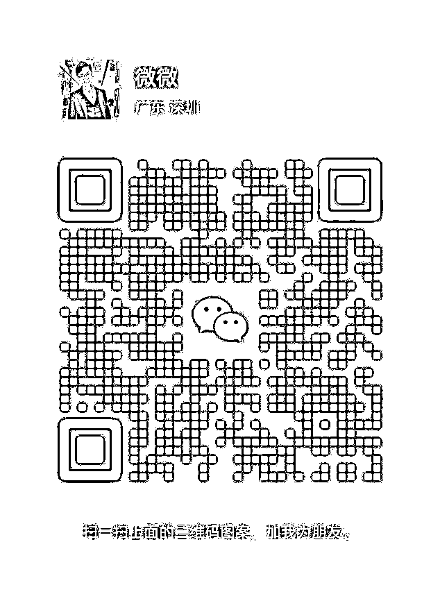

# 自媒体必修入门课，社交礼仪！

> 来源：[https://eqc9f6vzuhv.feishu.cn/docx/TXSyd1YGYoipxzxBTM0cP4HJn6I](https://eqc9f6vzuhv.feishu.cn/docx/TXSyd1YGYoipxzxBTM0cP4HJn6I)

# 一、序言

你好呀，欢迎打开微微所整理的《自媒体必修入门课，社交礼仪！》呀。

见字如面，可以先了解一下咱的个人介绍哈：

【微信昵称】微微

【所在地区】深圳

【自我介绍】

①乐活创富星辰会成员。

②7年阅读420+本书，拆书笔记50本。

③写作12年。接触自媒体半年改稿562篇、一年输出100+篇10W+爆文，所写的内容全网累计阅读量超1000W。

④万粉号主，所写文章被生财有术公众号等圈内大号转载，年输出800多篇原创文，累计字数达160W+。

⑤一年输出1400+篇帖子，作品在乐活创富、生财有术、玩赚新媒、觉醒创业营等多个优质付费知识星球获得加精华，累计创作100➕篇精华帖。

【乐活部分精华】

https://t.zsxq.com/HD2sL

https://t.zsxq.com/wAipD

https://t.zsxq.com/BmcMf

微微一直都会在这里，陪伴想要通过写作成为斜杠青年的朋友一起成长，持续分享写作成长和写作变现赚钱的相关技巧。

欢迎小伙伴链接交流呀，记得要备注才会添加喔！

V：weiweihaoyaa

# 二、前言

「你没有必要讨好所有人，但是你也不应该得罪太多人。」

无论是线上交流，还是线下生活中，我们都需要构建与他人的链接，都需要通过逐渐被他人看见、了解、熟知，才能建立起自身的影响力。

而这个链接的过程尤为重要，不仅影响着我们人设、口碑、能力等方面的传播质量，而且也影响着个人在圈内的声誉，甚至对你未来的发展造成可持续的影响。

所以「社交礼仪」的作用便显得尤为重要。

但是不少人都存在一个误区，误以为待人友善、虚心请教、说话谦卑即为有礼得体，可以让对方感受到你的诚心诚意，也能展现出自己是一个值得信赖的人。

而事实上，这是最低阶的「社交礼仪」，只能说是不令人讨厌，但确实也让人无法喜欢上你。按照这样的模式发展，很大概率会成为“白嫖”、“单纯”（一根筋）、“被疏远”的群体。

所以，为了让新手小白们能够认清正确的「社交礼仪」，同时也为其他人提供一些新的启发，微微结合付费所学来的知识，在思维过滤后，特意分享关于自媒体入门的必修课：

如何运用优质的自媒体社交礼仪，高效地向上链接、向下联系，成为社交达人、讨喜的对象。

该礼仪经过思考转化，同样适用于现实生活中，所以学起来是很有必要的，你可以在职场、在交友、在对话等各方面获得更好的评价之余，提升自身的情商，积累起更广的人脉、资源。

# 三、正文

### （一）心动。

也许不少小伙伴都有过这样的经历：

①这个人怎么这么难相处？这个人说话好难听，这个人也太讨人厌了吧...

②我觉得自己这样做没错呀，回答多一句又会怎样；我是在咨询看看自己适不适合，这些问题不至于付费吧...

这两点，其实他人都没有错，错的是你自己：①你不会有效筛选，②你完全没有社交礼仪。目前的你缺乏情商、缺乏人际交往技巧、缺乏对高质量群体的认知。

当我们想要加入优质的圈子，想要通过优秀的人群影响自己、感染自己、提升自己时，首先就要把一个成语牢牢记在心上：互利共赢。

通俗一点来说也就是：

没有任何人需要无条件地对你好，你想要得到，就要学会付出、理解，相互尊重，别人不欠你的，没有必要用个人的时间、精力去与你解释、分享一大堆有价值的内容。想要成长、想要变强、想要变现，和上学读书、买菜吃饭、买衣服保暖是一个道理，要懂得付费、要懂得价值互换。

如果你还停留在自以为是，唯我中心的观念中，像是别人不帮助、稍微说错一句话你都要记恨的话，那你的认知、人际交往、情商可以说是处于低阶水平，急需完全逆转改变。

微微希望你参考以下3点建议，从零开始，从“心”改变：

#### 1.先粉碎已经根深蒂固的认知

你现在的所思所想，所作所为，都是因为你过去的成长环境、氛围圈子、以及自身的懒惰所造成的，是的，你要承认，你要接受如此“愚蠢”的自己，你现在真的很让人讨厌。

勇敢的接受现状，是重新打造全新现状的唯一选项，现在开始，每当自己脑海里出现不应该的低阶想法时，时刻遵循以下“三原则”去重复警醒自己。

##### ✅不要怨天尤人

虽然事实的确是因为成长环境、氛围圈子等占据了重要的影响因素，但是这些都不是「决定性的因素」，关键在于你个人对自身的要求和想法。

你如果想要改变自己，提升自己，摆脱现在的生活，那就不应该存在一直抱怨是因为小时候的成长环境、成长过程中的圈子影响了自己前进的步伐。

咱往大方面说，多少成功人士都是从贫民窟走出来的，运动员艾佛森、贝利、詹姆斯，商人洛克菲勒、舒尔茨、贝兰克梵，哪一个不是成长环境恶劣的，影响他们后来的成功吗？

咱往小到你身边的方面说，微微直到大学都没有住过房顶不漏水、有砖有瓦的房子，吃不饱穿不暖，经常去摘果子果腹，这影响我现在坚持读书，并在自媒体路上开始取得不错的成绩吗？

你不愿意承认、不愿意肯定自己目前的无能是因为你的懒惰、习惯性推卸责任而造成，那你就始终只能在抱怨、吐槽的控制下继续往更底层、更让人讨厌的方向走下去。

要想改善认知，提升自己的情商、能力，进入高质同频人的圈子，现在就要马上停止抱怨、停止懒惰，告诉你自己：我如果不想成为他人眼中“奇葩、难搞、无理取闹、白嫖”的人，就要虚心接受自己是因为懒惰而原地踏步，与任何人事物无关。

认清自己，方能拨开眼前的迷雾，看清前方该走的路。

##### ✅不要自视过高

除了白嫖、贪小便宜、说话不经大脑以外，这一点也是让你无法有效链接的重点。

明明能力顶多处于60、70分，但是心比天高，自认为自己比谁都厉害，很多知识点看一眼就自以为是的懂了，别人给你的见面礼也不屑一顾。

面对他人的好意，经常性回复“好”、“知道了”、“哦”、“是这样啊”、“我也会”...之类的，这样的做法，其实与不回复、没有礼貌、不懂得尊重的人毫无区别。

养成自以为是的性格一般就两点：你现在的生活不错，你在某个阶段获得了比他人更高的成就。

这是一种“人格的缺陷”，会持续性地让你陷入思维牢笼，产生“达克效应”，继而成为井底之蛙。或许你可以通过熟人、朋友等对你的看法，反思一下自己有没有这样的行为举动。

能力越强，情商越高的人，是不会放弃可以学习、可以链接优秀小伙伴、进入优质圈子的机会的。

也就是不会存在「认知下沉」，即使面对新手小白，他们也能够认真对待，说不准还会从无意间的话语中找到一丝灵感，衍生出新项目的苗头。

##### ✅不要放弃希望

认清自己是多无知、多无能以后，也许大概率会出现躺平、摆烂的想法，这是认知最基础的一道关卡，在这里退缩，你的认知便会持续停留，永远也不可能提高情商、与优秀的群体走在一起。

受尽苦难而不厌，这才是强者之道，也是每个成功者具备的特点之一，无论被击垮多少次，也要记得重新站起来。做，未必能成，不做，肯定不成。

当你能够把前两点都做好以后，你只需要鼓起勇气，愿意去相信靠谱的新知识、新鲜事物，其实建立全新的认知是非常容易且迅速的，像是婴儿学习走路一样。

相信自己，永远是成功的第一步。

#### 2.再把“价值”实体化

当你脱离了低阶的认知水平后，你虽然不会有以上让人无语的思维，但是也不至于能够理解怎么去摆脱白嫖、互换、尊重、回礼等操作。

核心关键词在于：价值。

其实你只需要搞清楚一点，别人拥有的知识、资源、人脉、方法等都是属于个人的价值，同理你也是，要想得到他人的价值，就要理解这个价值是怎么来的。

##### ✅时间

将心比心，你如果现在已经取得了一丝成绩，就要回过头想想自己花费了多少时间才得来这些成绩、经历了多少困难才得到认知的提升。

像是微微，这6年来阅读了300多本书，写下48本阅读笔记，这些宝贵的知识财富，信息资源，还有里边蕴含的学习方法等，那是经历了多少个日夜付出才能够形成。

##### ✅用心

这里可以回想当年学习的时候，每天用心做笔记、记重点的学生，先别说他考的好不好，最重要的是他的笔记内容涵盖了我们想要的学习知识。

你在下课玩耍的时候，他在拆解难题；你在饭堂聊天的时候，他在分析解题思路；你在宿舍睡觉的时候，他在把每个知识点进行联系。

把自己的身份代入进去，你会更深刻的体会到，为什么自己的知识内容，不能够轻易分享，甚至不一定有钱就能买到，那是他人经过了多少头脑风暴才能打造的价值。

而这个价值，也是需要筛选人群成交的，“有钱就是上帝”这个说法已经Out了。

##### ✅反思

通过以上最基础的2点，你应该能够清晰地理解到，为什么会出现这样的问题：

（1）向他人要资料，却被婉拒；

（2）自来熟的热情，会让人讨厌；

（3）目的性过于强烈，身上带有太多引起怀疑的地方；

（4）为什么他第二次就没有帮助我了呢。

如果想要让人喜欢你，又能够不断链接到优质的人，进入优质的圈子，首先就一定要清楚地换角度思考，“价值”是有多贵重，目前的自己有没有这个能力去“接受它”、“购买它”。

如果你只想着单纯一次性购买，而不想着未来的长期合作或发展，那你可以看到这里就停下，但是你可能很快又会回到第一大点的陈旧认知中。

#### 3.最后是保持“谦卑”

人一旦有了飘飘然的意识，你会对任何东西都存在“偏差值”，也就是见高捧、见低踩，但是我们在自媒体社交上，除了要努力向上融入优质的圈子以外，向下链接也是一个非常重要的关键因素。

这和现实生活中的人际交往是同一个道理：你既要能认识大客户，也要能和下属打成一片。

这就需要我们理解一个词：谦卑。既要谦虚，也要“卑微”。

##### ✅谦虚

谦虚相信大家都不会感到陌生，即对人对事的态度都要保持一个学无止境的思维起点，在与他人的交流中，以虚心求教的态度去求学，寻找到细节进而突破自己。

即使是新手小白，也有值得你学习的地方，比如他虽然暂时啥也不懂，但却是一个卷王，那这就是一个情绪价值，值得你从中挖掘他“内卷”带来的价值影响。

##### ✅卑微

这个点就不一定所有人都能够做到了，此卑微非彼卑微，向上生长和向下链接是两个完全不同的概念，所以行动起来也会有质的区别。

##### 01.向上生长

###### A.个人执行：

卑微指的是你要在向上链接时，保持该有的谦虚以外，也要懂得保留自己的底线，做出反差的效果，即：语气上的卑微，行动上的果断，执行力的显著。

前辈们都有经历过得事情，不要侃侃而谈，把自己放在同等高度，这样的话，你还需要人家帮助你什么呢。所以情感（语气）上一定要把自己放下一个身段，细心学习才能了解精髓。

而行动上的反差，正是让人能看到你拥有未来的最好证明，前辈们通过你的实践效果，可以判断你的潜在价值，加上你人足够谦虚有礼，这样的链接才能够更加长久稳定。

也就是：你的底子是好的。

其次是怎么用正确的心态、正确的目光去看待对方的回应：

###### B.看待对方

如果打招呼、收到见面礼也没有得到回应：

事实上，前辈每天处理的信息量、工作量远比我们想象的要多，你的介绍与赠予，很大概率是茫茫人海中的一员，并非有意忽视，只是无法同时兼顾。

此外，互利永远会是双方合作的最基本要求，要想得到大佬、前辈的赏识，首先得自己摆正态度，不要因为这点小事就情绪化，得承认或许是自己目前的信息、资源无法给予太大的帮助。

要立足于实践，才能更好地往上实践，想让人注意到自己的存在，那就得做出更让人惊讶的成绩。

久未回复，无需打扰，可以私下再默默做出实际成果，进而当个人提升较为明显时，再以价值更高的内容进行问候。

##### 02.向下链接

双向奔赴是同频共进的最佳方式之一，小可爱说过，不要看不起任何一个新手小白，每个人都值得被认可。

如果想要讨人喜欢，你就少做一些现实生活中低情商的事，不要陷阱了高捧低踩的坑里。

时刻意识到新手小白的潜力，力所能及地给予适当的帮助，远比你费尽心思去引流精准粉丝要强。当一个小白是被你直接或间接培养起来的话，大概率也会成为你的铁粉。

你可以筛选，但不可以树敌，以礼相待、保持委婉始终是向下链接的必杀技。

当然，也会出现新手小白收到你的有效信息、资源（比如见面礼）后不回应、不答谢的，像是这种情况也不必过于在意，我们可以换角度去思考：

###### A.为他人考虑

大部分人在做自媒体前期都会开设一个小号，而不少小白属于不清楚个人定位、方向，且没有专注耐力的，也就是会不常看小号的信息，也不会去专注留意自己链接的一大堆人（爆粉）。

这种情况可以放着观察，一段时间后仍然没有答谢或是回应解释的，可以归类为“避雷人群”。

###### B.礼貌互删

如果属于自顾自地，收了礼物和得到招呼而选择忽视，继续发朋友圈、在社群活跃的，此类人群可以选择礼貌回应，并保持平静的情绪对其表达互删的意愿。

不用去满足任何人，但是也没必要去做费时费力的争论，礼貌一句话带过，既显得自己的格局，也不会对他人太过唐突。

#### 4.总结

叔本华说过，“世界上最大的牢房，是人的思维观念”。

以上的心法是打通你以下实操中的必备思路，没有学好公式、理论就下场实操的话，很容易溃不成军，即你根本不理解自己为什么要这么做，感觉这么做甚至是在损害自己的利益，而又见不着回报。

你会很容易放弃，很容易回到第一点的低阶认知，甚至倒退。

综合以上，可以直白一些理解，也就是说：

信任、情感、交好，都是源自于双方的付出，他人没有义务对你好，即使是付费也要互相尊重。这也是为什么，付费学习，也是有门槛的。

通俗点的解释：

1.理解他人的时间很宝贵，不要想着利用他人的善良而得寸进尺。

2.太多漂亮的夸奖不如一次真诚地付出（付费、价值互换、替人无偿完成事情）。这不是过家家，想要学习就要学会尊重理解。

3.没有白嫖的意思，就先把礼仪理解学透，以免造成对方的误会。

这些认知，你不打通自己的思维线路，几乎到哪里都会被人厌恶。

那为啥有些新手小白，尽管暂时还不算做出成绩，但是也会得到成功者的青睐？因为他们都在双向奔赴，比如说：

你（小白）能给我提供价值，我也愿意给你帮助；

你能给我付费（诚心学习），我也乐意给你解答；

你能给我认可（看到潜力），我也有意给你方法。

### （二）行动。

从以上的“心法”中，如果能够用心、时间去学习、悟透，那接下来的实操，也不用过多的解释，听话照做就对了。

#### 1.见面三部曲

个人介绍相当于你的一张名片，告诉大家关于你简单的个人信息，你在这个行业的成绩，你能为大家提供什么，你想要和什么样的人链接。

比如微微的个人介绍：

【微信昵称】微微

【所在地区】深圳

【自我介绍】

①乐活创富星辰会成员。

②7年阅读420+本书，拆书笔记50本。

③写作12年。接触自媒体半年改稿562篇、一年输出100+篇10W+爆文，所写的内容全网累计阅读量超1000W。

④万粉号主，所写文章被生财有术公众号等圈内大号转载，年输出800多篇原创文，累计字数达160W+。

⑤一年输出1400+篇帖子，作品在乐活创富、生财有术、玩赚新媒、觉醒创业营等多个优质付费知识星球获得加精华，累计创作100➕篇精华帖。

【乐活部分精华】

https://t.zsxq.com/HD2sL

https://t.zsxq.com/wAipD

https://t.zsxq.com/BmcMf

这里有一点要注意的是，你的个人介绍是伴随你的红包之后再出来的，红包相当于是现实生活中的握手、打招呼，让他人能够接过（看）你的名片（个人介绍）。

注：个人介绍不宜太长，把你最强、最突出、近期最显眼的成绩填上即可。

当然，你也可以像微微一样，先是红包打招呼，再是递上名片（个人介绍），进而再给出见面礼。这样有助于他人加强对你个人的印象，不至于过目就忘。

红包因人而异，如果暂时没能稳定月入过万，一般在群里介绍的话，最好是20-100的金额，然后红包数量也不适宜太多，会很散，100人以上的群8-15个为宜。

#### 2.有话必回，懂得感谢

这里可以分成三种情况：

##### ✅个人咨询

对于来咨询的小伙伴，无论最后是否成交，也要记得回答他人的提问（可按付费情况与否回答不一样的答复），同时感谢她/他对你的支持和信任。

付费情况：专业角度解答，给出实质性建议和方案。

简单咨询：给出自己的表面理解，无须做深入思考，但也需要给出自己这边的报价，免得互相盲猜。

##### ✅信息交流

这个与技能互换是一个道理，即使对方的技能你已经掌握，但是当我们接受了交流后，就不能想着半途中止，口碑始终是你往后最大的影响力之一。

感谢对方找你交流，可以适当提出自己已掌握相关的信息、技能，在分享给他人自己的技能、信息以外，也要补充对刚才掌握方法的一些心得。

如果能够提出让他人进步的建议，对于你而言并没有损失，但是他人可能因此获得的信息差、价值内容而对你表示感谢，口碑+1。

##### ✅回礼不要超过当天

这是一个相互筛选的过程。

如果对方给了你见面礼，或者在别的社群推荐了你、为你背书的话，你一定要懂得回红包或者回礼有价值的内容，这里分为3个阶级：

（1）接受了对方的好意，而只懂得谢谢的，是一般朋友，相当于泛粉，转化率一般，不用过多把心思集中在他身上。

（2）接受了对方的好意，懂得谢谢之余，还会针对这份好意做出自己的感悟、理解、分享心得的，是值得长期交往的朋友，相当于忠实读者，可以适当偶尔交流、分享。

（3）接受了对方的好意，懂得谢谢之余，还回礼红包或者回礼有价值内容的文章或是信息差，是要深交的朋友，相当于互利成长的铁杆粉丝，必须长期合作交流。

像是心法有提到，这不是过家家，感谢对方，又想要与对方建立深度的链接，那就不应该把对方当做是你的泛粉，要以深交朋友的想法去对待。

除此以外，我们还可以用一个方式去回礼，比如通过整理他的精华内容，做成一个小手册之类的给他，让他感受到你的诚意。

#### ③尊重他人

杜绝“顾客就是上帝”的理念，即使你付了款，你也要给自己的这番认知醒醒神：你是去求学的，不是去当大爷的，他不是你的服务对象，他是你的导师，记住尊师重道。

##### ✅时间

提前约时间，准备好提问材料，控制时间时长。

你的时间很宝贵，他人的时间也很宝贵，以此为基础出发，以最高效的方式进行，让双方都能够省时省力的尽快做出最优解方案。

##### ✅好意

当他人让你免费进群、给你提出建议、为你提供了一个信息差等，即使非你本意需要这些资源，但对于他人有参考性、借鉴性的好意，要懂得感谢与回礼，具体的方式可参考以上。

红包可大可小，按照你认为这个价值的具体而定，一般如果不是深入性的探讨，在6.66/8.88/12.88之间都可以，当然如果你已经取得了较大的成就，可以适当提升金额。

##### ✅隐私

未经他人许可的聊天记录、原创图文等，不要随意发圈、发平台，有时候多问一句，或许可以避免后续的矛盾、不必要的麻烦。

##### ✅把握分寸

不要以自来熟的感觉去挖掘他人的底线，这里就要求咱要有“眼力见”。

眼力见这东西不是每个人都能拥有，但是这个其实也不难学，可以多观察公司里工作能力平庸，却非常讨上司、老板喜欢的同事，或者是校园里，讨辅导员喜欢的同学。

即：咨询、交流要有度，别太兴奋了啥话都说。

##### ✅匿名的重要性

即使发生争吵、矛盾，也不要光明正大地在平台、朋友圈直接公布他人与你的不和，人都会晒对自己有利的一面出来，如果当对方发现你的做法，同样实施一遍的话：

他是作为回应方，而你是主要搞事的麻烦精，自媒体的圈子真的不大，传出去的话，你可以想象翻起的波浪有多大，也许未来你要合作的伙伴，会是对方的好友、导师呢？

所以要作为案例发布的话，最好还是匿名。

##### ✅总结

自媒体社交礼仪的最后一部分，给你们分享这么一段话吧，可以说是整个礼仪的核心内容：

不要想着白嫖，任何形式的咨询、请求、分享、合作、邀约、交流等，都是有价值的。而既然是有价值的，那你就必须懂得「价值交换」或者「回礼答谢」。

简单的一句谢谢，并不适用于长期的社交。

#### 4.注意事项

##### ✅心怀理解

很多小伙伴应该都有过这样的想法：

当自己还没有产品的情况下，也没有时间去收集做“见面礼”，所以去咨询他人的时候，只要对方没有先提出付费咨询的说法，自己的内容就无需付费。

也就是：你去咨询，他没有提前说明，但回答过后再说，这样自己不付费也情有可原，就不用礼仪了，因为是对方的问题。

首先，我们付费咨询的前提是什么？

答案是『对方比我们优秀』。因此，即使出现了后续才提起付费咨询的事情，我们也应该尊重对方付出的时间、知识指导。

你可以不理解对方的做法，但是得理解对方的确给自己带来了价值。

##### ✅不要太过于啰嗦

像是有一些小伙伴总是抱着不一定“买”的态度去链接他人，这就会造成“有时候我会简单咨询一下，然后确实有需求，才会继续付费咨询”的结果。

而大部分情况下，80%都是简单咨询过后就没有下文了。

这不仅给人落下一个“你情商很低”的印象，而且更是在无形中把自己的口碑给贬低影响了。回顾一下心法，简单的问题都可以自己搜索：

而遇到卡点的问题就要果断整理出来进行付费咨询，即使是简单的咨询，在没有得到对方的拒绝下，也应该在结束交流后发红包、赠送价值内容等。

你的一秒与他人的一秒价值并不同等。

可以先观摩一下对方是否适合自己的问题，从他的朋友圈、自媒体平台中多了解一些分享的内容，“货比三家”比起“直接上门聊两句”更有助于你快速找到问题的答案。

### 四、文末彩蛋

以上就是微微接触自媒体一年来的礼仪心得啦。

除此以外，购买咱们『乐活』旗下的产品，包括但不限于『星辰会』、『乐活终身读写社群』、『乐活创富』、『乐活百日IP修行计划』...将会按比例赠送『小白基础写作课』、『小白写作季度学习群资料包』、『阅读共读季度学习群资料包』等，感兴趣的小伙伴可以礼貌咨询哈。

你也可以直接购买『小白基础写作课』、『小白写作季度学习群资料包』等内容，过段时间『微式拆书写作课』出来以后：

可以补差价进行购买噢！具体的情况，可以咨询微微哈。除了能够得到见面礼以外，或许还能够解锁其他礼包噢！

欢迎链接交流，微微在这里等你哈，V：weiweihaoyaa

