# 《小红书蓝海项目-p掉路人；观察12天，执行5天，收益1159，引流私域260人》

> 来源：[https://qnfoes1o78.feishu.cn/docx/TXwrdLSEIoSsUhxAD9icDXRqnoI](https://qnfoes1o78.feishu.cn/docx/TXwrdLSEIoSsUhxAD9icDXRqnoI)

圈友们好，我是林歌，主业在杭州混电商，副业在平潭开民宿；

最近从0-1跑通了：小红书-p掉路人的业务模式。

发了风向标后，很多朋友来问，感谢链接，

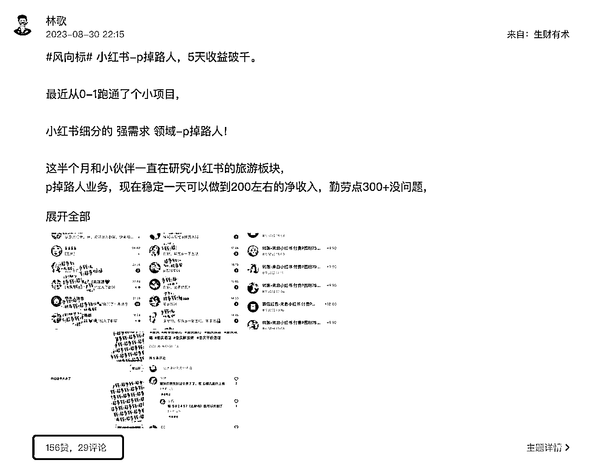

分享出来，给生财添砖加瓦。

先上数据

5天收益1159，小红书吸粉430+，微信存粉260人，付费用户105人；

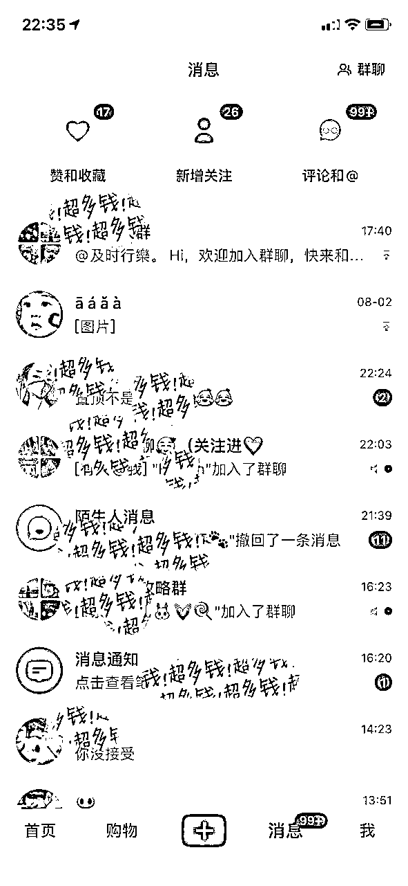

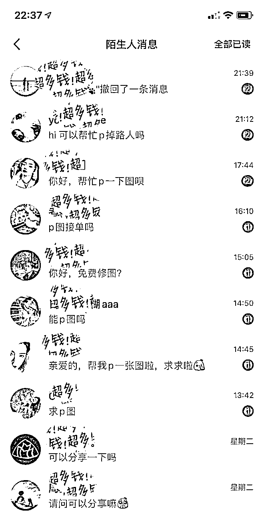

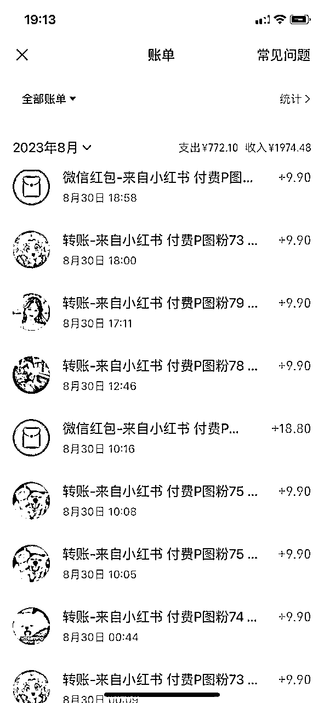

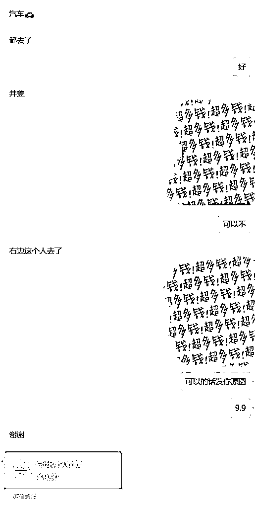

# 一、项目背景

背景是：在小红书引流 意向来平潭旅游客户，入住民宿变现。

研究的过程中，发现p掉路人的需求，

极其旺盛，并且每天更新的帖子数量都很多，

出来游玩的多是年轻、情侣、旅游粉；

对于照片有着非常高标准的要求，想要美美的发朋友圈，一张图p个十几分钟都是常态，如果是多人合照，一部手机轮着p很正常。

用后裔浏览器采集话题数据，会发现 #p掉路人 这个话题，是个千万标签贴；

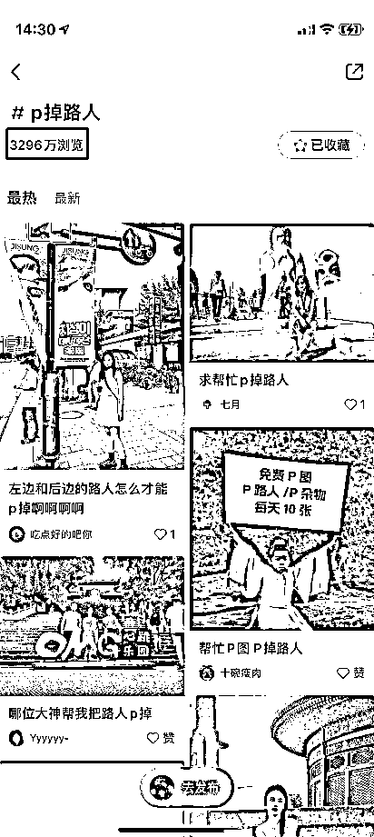

正好浏览到生财的中标贴↓

小小的p图需求，

居然有200w的月GMV，这200w还是按照最少5元/单的金额计算，

我预估实际起码得翻2倍！

感觉p掉路人这个业务大有可为！！

# 二、寻找工具

于是乎，从各个渠道寻找能够免费、高效的p掉路人的软件，

因为这个业务，如果想要放大去做，自己用美图秀秀，或者是醒图的画笔，得扣到眼珠子凸出，也不是特别完美；

之前做电商，经常跟品牌方谈的是ROI；

开始探索这块业务之前，给自己的定位就是，评估好自己投入时间和获得收益的ROI，

所以对于这款工具的要求：免费、高效，缺一不可，

刚开始，观察市场，

见到过专业的修图师，是如何消除路人

按照这种常规办法，一张图起码10分钟！

我一看这么麻烦，直接放弃，

转头去淘宝问了p掉路人的价位，回复是：80元，但是不管什么图，5分钟就能交付；

懒得废话，打算关闭页面，但一想不对，

为什么p图师之间效率能差这么多，

这里头肯定有信息差，

花了2天时间，从抖音、知乎、小红书，到ins、推特、youtube，

各种换关键词搜索p图的修复手段，

终于找到了一款p掉路人的神器，但这个工具刚开始并不是针对p掉路人使用的，

有时候换个思路，换个关键词搜搜，也能找到非标准的答案。

结合自己的需求，开辟出创新式的解决方案，

就比如这款AI工具，别人是用来做创意式生成，我目标很明确，p掉路人！

有多好用，我来演示一下。

大家可以很直观看出这两者的效率！

PS的AI功能；

可以根据提示词生成不同的场景，这有点意思，

花了一下午研究，算是入门，

下一步，用之前做其他业务的小红书账号，寻找需要p图的帖子，免费p；

一来，练手；

二来，积累素材；

为了提效，

去小红书发帖引流，带上#p掉路人 #p掉多余的人 之类的标签，

刚开始发帖其实是没有什么流量的，

因为使用的账号之前主要是在品牌圈打交道，发布小眼睛数都是在两位数，完全激不起波澜，

所以后面思考，如何借助别人的高流量贴，快速起号；

之前做知乎的时候，学会了后裔采集器的使用，这个很关键，为后面数据分析做铺垫！

知乎能采集数据，小红书自然也可以。

具体操作：

小红书中，如【p掉路人】相关标签贴全部找出来，

让后羿采集器把标签贴中的笔记，全部爬取下来，有利于我们数据化分析！

一般来说，我会爬取一篇笔记的：

博主、笔记链接、标题、点赞数、正文、tag、发布时间、评论前6条；

这样就非常清晰，一目了然！

比如：

该标签下，点赞最高的帖子是哪篇？点赞数是多少？什么时候发布的？带了哪些tag？评论区主要在讨论什么？

根据发布时间排序，最新发布的帖子是哪篇？

历史项目积攒的经验，同步复制到另一个平台。走过的路，都有意义。

## 采集器具体操作

1）把这个话题页面所有数据爬取下来；

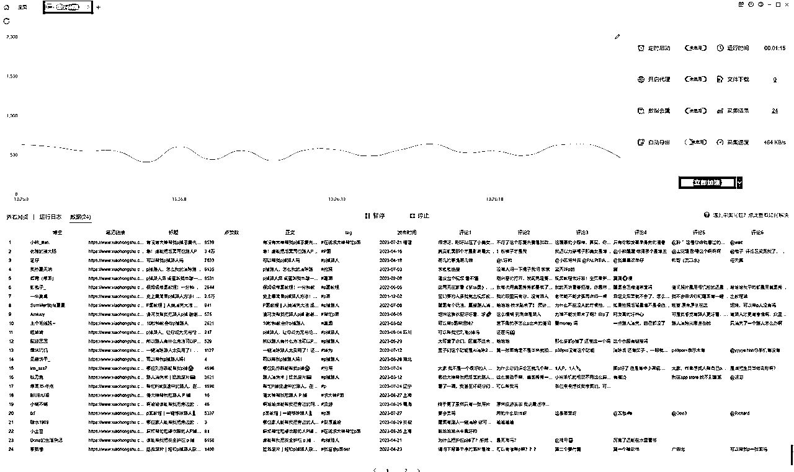

2）可以按照点赞数的高低，或者发布时间的远近进行排序，如下图

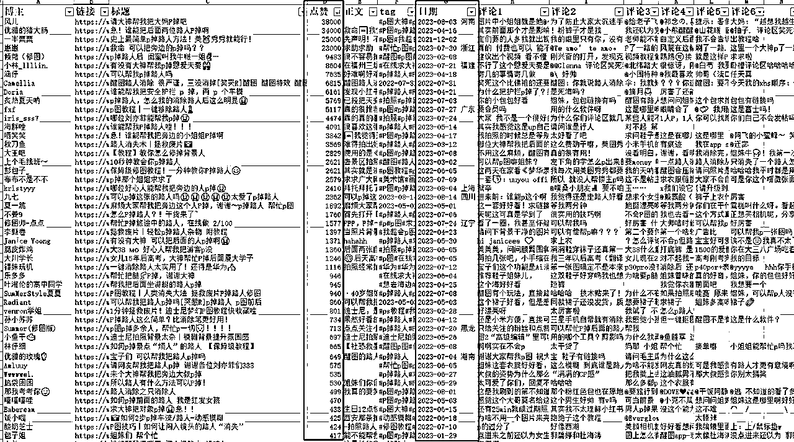

当然里面有一些弯弯绕绕，比如爬取的数据，其中过万赞的数据，是以1万、2万的形式呈现，

那该如何变成纯数字、可排序的形式？

数据不多的情况下，可以手动更新，但是我们爬取一次，就是近一千条数据，手动肯定没办法，怎么办呢？

3）善用生财的搜索，一些面包屑的信息点，已经有人摸着石头过河，咱们借用经验，快速过河。

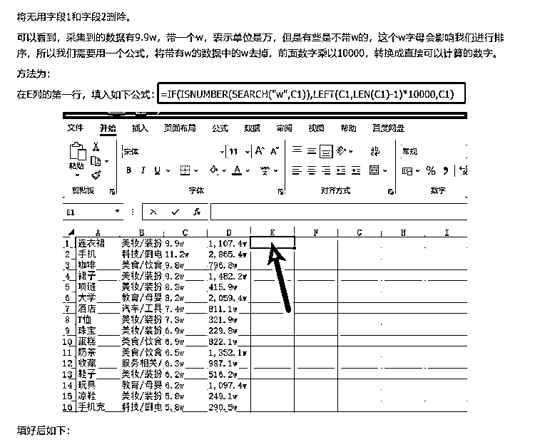

在此感谢@沙丘笔记 老哥。

找到小红书中最爆款的需求贴，评论区往下翻，

能够看到近三天的求p图留言，展现出你的p图实力，先免费p！

这些流量都比较新鲜，回复后很快有反馈，并且也是一个挖热帖流量的动作！

又或者是通过时间排序，寻找到近期寻求帮助的帖子，

同时，再根据发布账号的粉丝量级、活跃度去评估，值不值得花时间帮他p图。

那段时间，每天晚上忙完之后，找到流量贴，p完图去回复，结合自己的帖留钩子；

我的筛选标准，近三天，互动数据＞50，都可费点时间，留下自己的作品，展现出实力！

果然很快，借用他人的流量贴，效果一下就上来了。

第二天、第三天，数据是一直在上涨；

点赞、关注、评论、私信，都有：

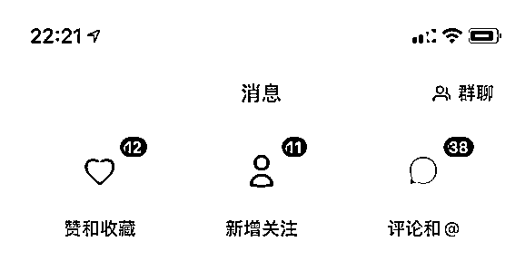

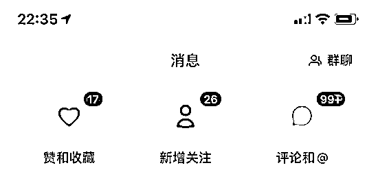

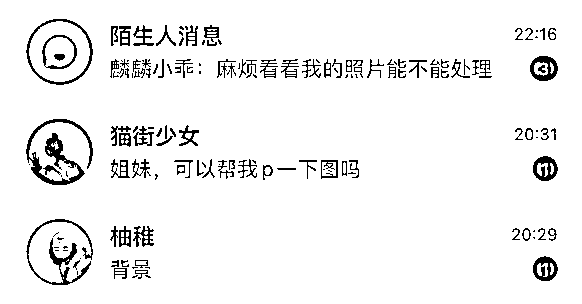

小红书平台现在私信导流管理非常严格，我从不在私信回复任何带v、谐音字；

让他们自己进群看群公告，基本能够成功加上我微信的，都是比较年轻的女性用户，对于p图的需求强烈，且着急。

这一步算是我筛选过的用户，

加不上的要么看不懂 不怎么玩小红书，要么年纪比较大（大概率不会为9.9一张图付费）

又或者同行私信给你下套，这种不好评估的话，不回也罢，号更重要！

引流到微信之后，开门见山，

从刚开始的：【你好，要p图吗？】到后面的：【你好，要p什么图？】

遇到嫌贵的、讨价还价的、非常多，

对应的话术，我也细细琢磨了一遍，现在成交率基本能有80%

p了有近千张图，非常熟练了，已经能做到一分钟p好一张图；

粉丝很可爱，甚至有夸你配享太庙、你就是我的神，等等等等，

实际呢，我只是一个接触几天的小白，只不过善于使用软件而已，

论美图秀秀的技术，我指定是比不上她们。

但是也分人，有些特别揪细节的客户，可能来来回回需要p个4、5次。

每天起来，消息都是99+，即使这中间2、3天没有去发布新帖，

并且可以看我后台流量来源，72%都是来源于搜索；由此可见小红书的长尾流量确实不错；

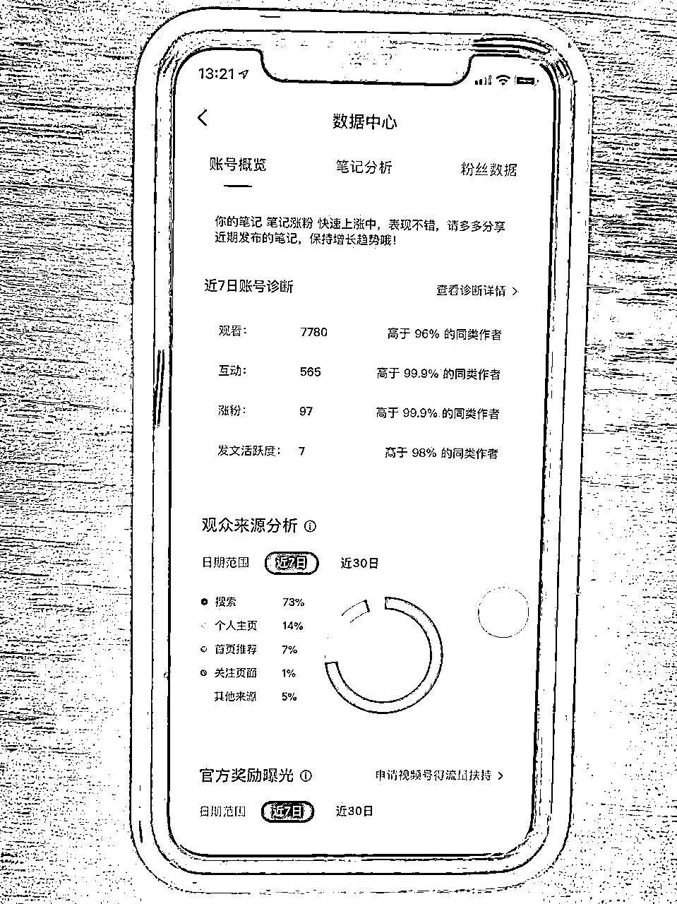

之前测试，5天时间收入破千没啥问题。

（最近主要参加小红书店铺的大航海，这块也希望多链接圈友深度交流！

# 三、延展玩法

## 去哪儿大搜码

小红书这部分人群的价值，个人认为非常大；

p图可以是只作为一个钩子产品，

整合流量，用其他产品进行二次或者长期的变现。

像是去哪儿的大搜码，

小红书站内很早前已经有了这块的玩法，

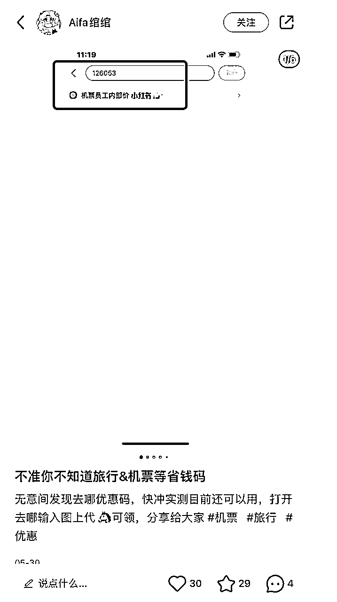

我已经谈下来了，这是给我的国庆旅游产品集合页；

大家可以试一下，在去哪儿站内，搜索：334739

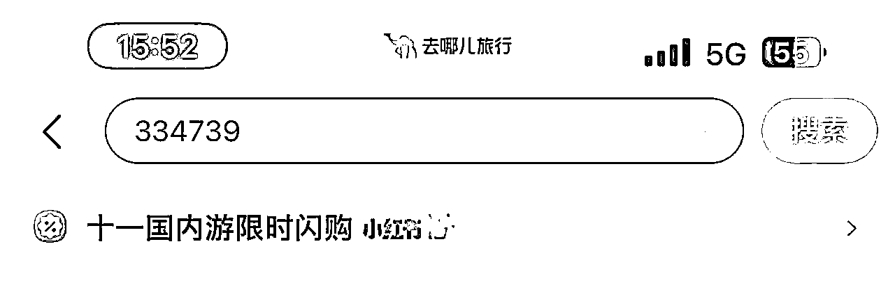

只要通过我这个大搜码打开页面购买的订单，都有佣金可以拿。

有想要做这块资源变现的，可以一起建联，共创！

另外，p图引流过来的旅游粉，有哪位大佬能接走的，欢迎链接~

我前端持续引流，你后端持续变现，都可聊~

# 四、项目优势：

### 1、帖子评论数蹭蹭涨，不管你会不会给她免费p，她第一步是要把图发出来。

所以，不断有人一直留言，帖子一直有热度，

三亚、云南、迪士尼，

人多的景区拍的照片，都需要p图。

评论区学习到一句话：你不知道女生遇到对发型和妆容，同时满意的图片，有多难！

### 2、各种各样的人群需求，市场空间巨大。

例如：

分手，p掉前男友；

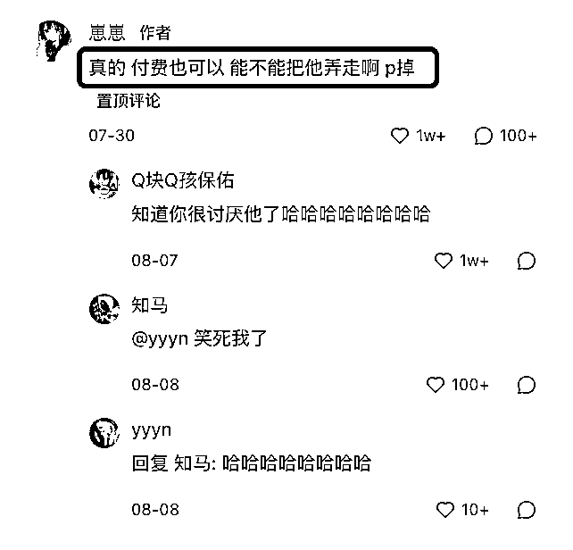

闹掰，p掉闺蜜；

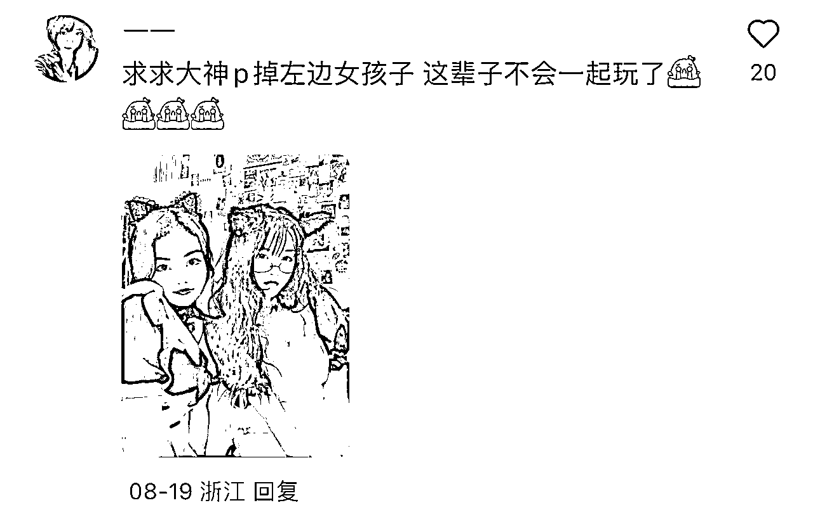

宝妈，p小朋友的单人照；

婚礼照，p掉司仪；

生日照，p掉服务员；

万物皆可p！

给大家截图几个热帖中的留言有主动付费的需求。

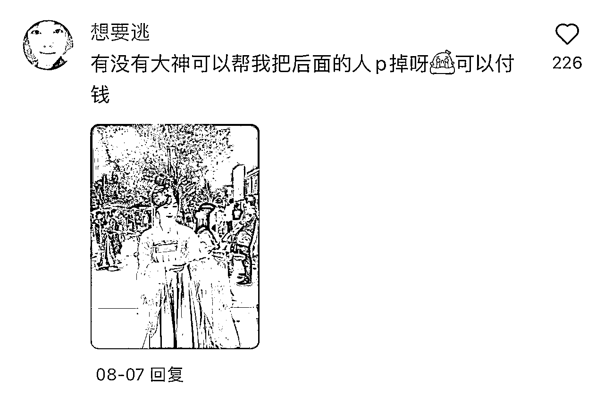

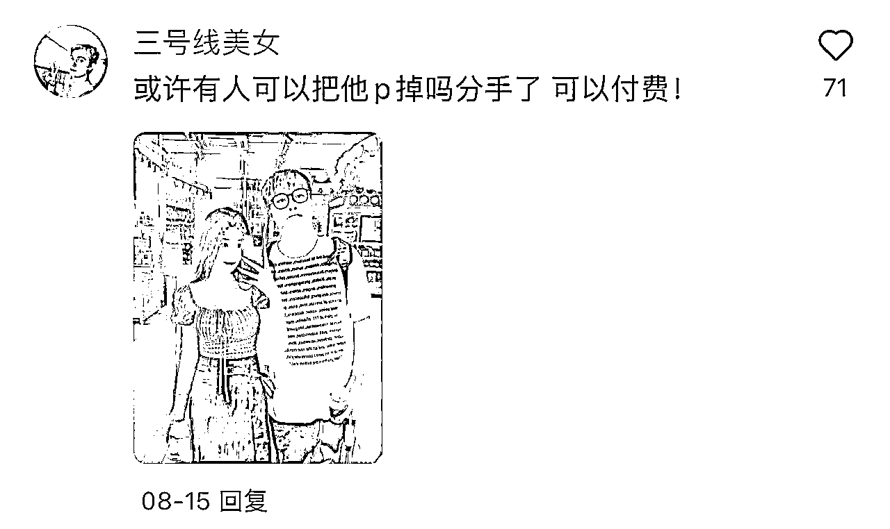

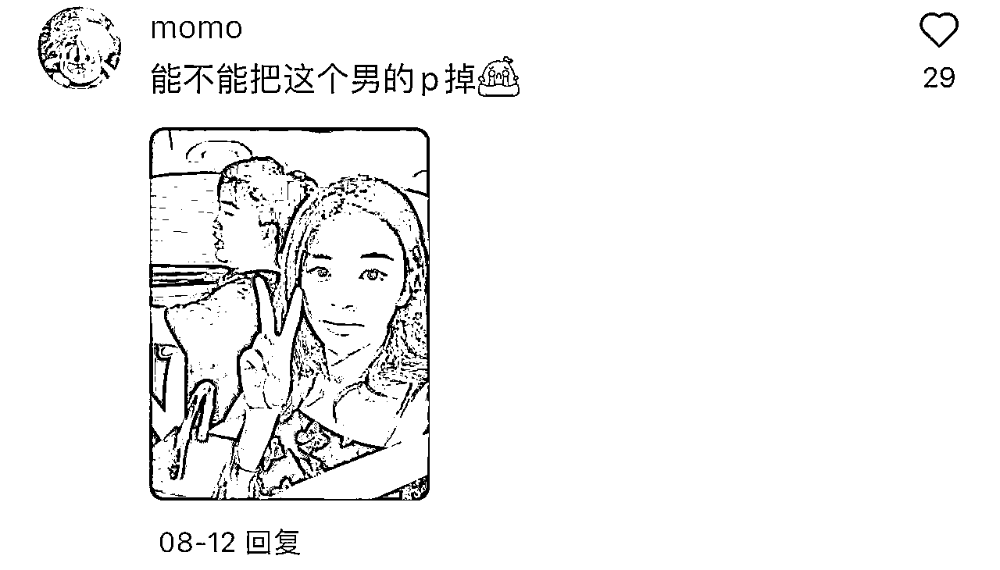

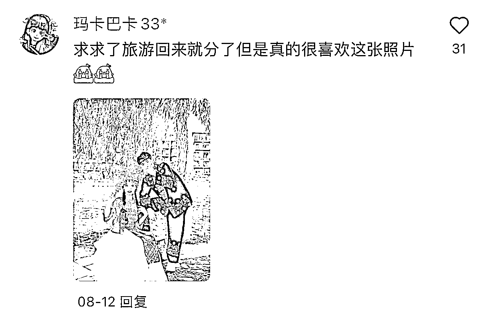

还有更离谱的，把狗p成人。。。

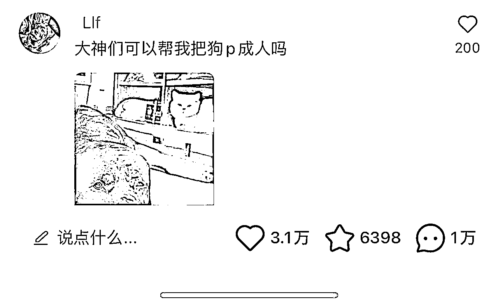

### 整体来说，

旅游市场，一个热门景点，愿意排队半小时拍照，但是每个人拍照时间都是有限的，

不可能强霸占一个地方，所以导致拍摄出来的照片，并不完美，

回来一看，不甘心。

所以后续的需求，是一直存在，并不是一次性生意。

再者，这批是愿意为一张照片付费9.9的女性、旅游、年轻用户人群；

消费力是非常强的。

（各位问问自己，是否愿意为一张图花10块钱？说实话我是不太会为这个付费，但是小红书的客户群体就愿意！）

目前我的承接微信，已经有了百来个付费用户，这群人后端的一些变现方式，我感觉是有非常多种的玩法。

所以，个人感觉是个好生意，

也算是在做一个小红书电商板块的内容！

只不过是沉淀到私域，用我的服务完成需求，

结合亦仁老大之前说的：

非标品、强复购。（高客单应该还算不上

对于认可技术你的，回头率非常稳定。

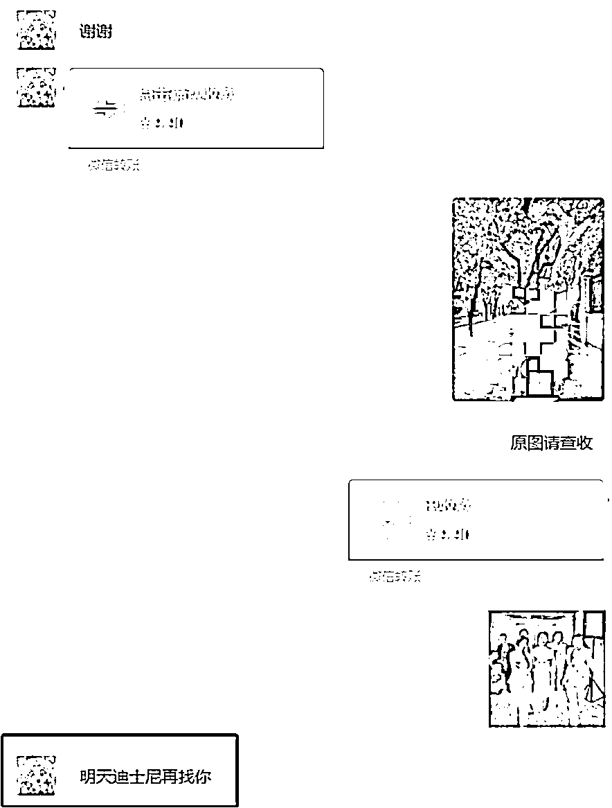

还有很多转介绍过来的。

# 五、项目总结

做了一段时间之后，发现这个业务比较稳定，但扩大的话，一个人是肯定不够的。

## 原因：

## 5-1、我不在电脑前，不p图，就会流量损耗。

及时性也重要，有些女生着急发朋友圈，找到你，

但是你在外面，无法交付，他会去找别人p。

别忘啦，平台上还有很多传统的修图师呢。

## 5-2、更倾向：跑通一个模型，有团队配合交付，

我更愿意做去深入摸索新的、可放大的模式，而不是一直处于重复劳动的状态，

这样会把自己困在已有的业务模型里头，类似于有了榔头，满世界找钉子。

这块业务的市场巨大！之前爆火的妙鸭相机，程序化接单，空间就很大。

（有没有程序大佬琢磨看看，p图是否也可以做成系统化玩法？）

欢迎圈友多多交流，一起生财有术！

另外，有需要p图的软件，不用浪费钱去淘宝买，我这有破解版的安装包，

v：916255491