# 塔罗牌美女抽卡，SD文生图学习步骤（新手经验分享）

> 来源：[https://hiuinilx1w.feishu.cn/docx/TcQHdSlv4oacbUxNi9WcBHr5nmb](https://hiuinilx1w.feishu.cn/docx/TcQHdSlv4oacbUxNi9WcBHr5nmb)

大家好，我是林书，一个目前从事AR应用的产品经理。

曾经我也是一枚程序员，吃饭的手艺还没丢，所以学习SD和MJ这类AI绘画工具上手还是很快的。

优秀的程序员都是很懒的，能用工具替代的尽量不愿意动手去做。

我学习AI绘画的时间不长，真正动手实践操作，大概不到30个小时，一周左右的时间。

现在敢来分享，确实有一些自己真实绘画后的感受，可以分享下我的学习经验，帮助大家少走弯路。

## 1 为什么要学习AI绘画？

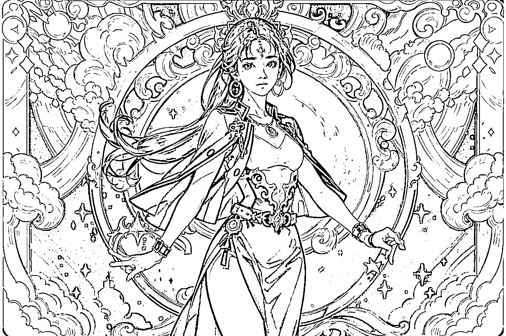

我了解到很多人玩AI绘画基本都是一段时间的热情，大概1、2个月不到的时间，这点学习的激情就被磨灭了。

因为大部分人是没有清晰的目标，而目标的实现往往需要两个必备因素：

一个是兴趣，一个是功利心。

兴趣不必多说，只要是你非常喜欢做的，没有钱赚也可以坚持做下去；

而功利心，就是赚钱。财富是最好的春药，就是这个道理。

通过这个项目或者技术可以让你赚到足够多的钱，那么有什么不能忍的呢？

至于AI绘画怎么赚钱，我会另开一篇去讲讲我的思考逻辑。

做自媒体核心产品就是内容，谁可以用又好又快的速度生产高质量的内容，就可以用内容赚钱。

AI绘画和chatGPT就是生产内容的引擎，所以这两个工具是一定需要掌握的，而且是投入成本极低。

所以，最开始需要做的一定是一个明确的目标，我的目标是：出高质量的可供穿搭号的美女图

## 2 如何选择 Midjourney 和 Stable Diffusion ？

### 2.1 MJ 和 SD的对比

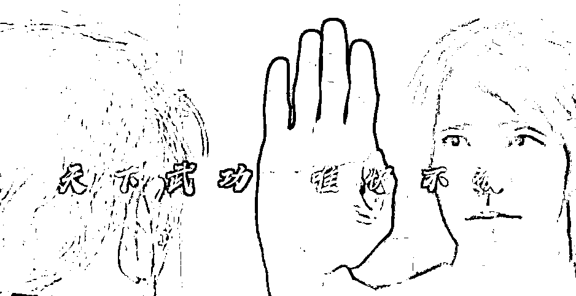

Midjourney的优点是模型开放，用户不需要选择各种参数，只要知道怎么写提示语就行。

缺点是出图比较发散，每月至少10U，出图不容易控制画面，不需要购买高配显卡的主机。

听说最近支持局部重绘功能了，看起来不错，比较适合新手。

SD的优点是图像效果更容易受模型和lora的控制，各类第三方插件很多，SD的发展速度更快。

缺点是操作界面相对复杂（入门后其实也没那么吓人），更像是一个生产工具。

我的选择是全都要，因为目标是获得高质量的图片，

通过图片去做内容，而不是为了学习工具，不是为了炫技。

## 3 如何快速入门 Stable Diffusion ？

Stable diffusion 理论部分是必须要迈过的一道门槛，中文不好的同学，完全可以从B站开始。

英文好的，YouTube、Twitter、Facebook都有不少同类型博主。

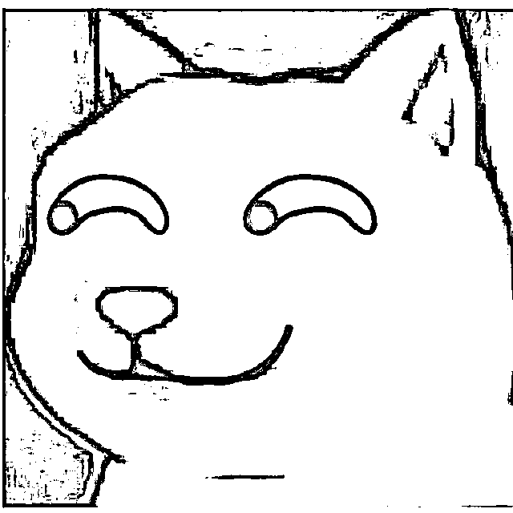

我基本上找到一个优质博主，会把这个博主的视频或文章全部挖空，直到内化为自己的能力。

建议先去看B站Nenly同学的入门教程，这套视频在真正上手前，我看了至少5遍，有些细节操作还会反复重开。

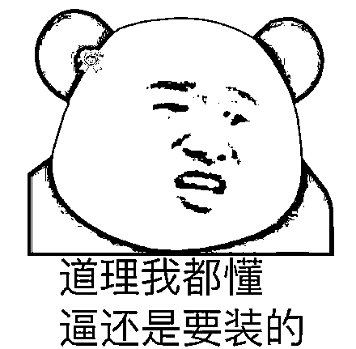

目的是为了知道各种参数概念，可以不懂得原理，但是一定要知道各参数调节对于图片的影响。比如：

*   CLIP跳过层数是会选择性丢弃提示词

*   Steps迭代步数在30-50的效果最佳，低于或高于这个范围都不行

*   Denoising strength重绘幅度和Hires steps高分迭代步数可能导致高清修复后出现烂手烂脚

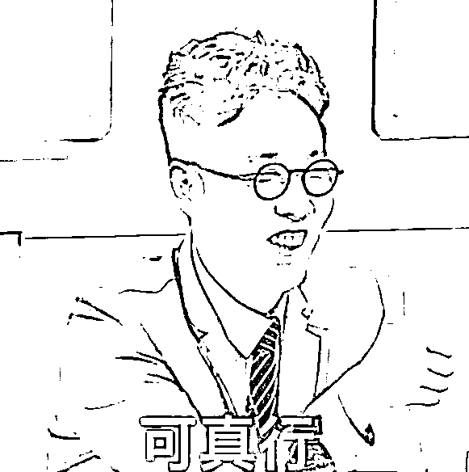

总之，出图的每个参数你要明白调节它们可能产生什么影响，后面才好控制图片质量和效果。

这个过程很关键，一定要打好基础。

虽然鼓励大家先去复制粘贴模型网站的提示词，但是你要懂得那些词到底意义何在？

不然，后面你想修改调整都不知道从哪里入手，自己骗自己，时间白白浪费了，何苦呢？

这边推荐强烈B站UP主：Nenly同学（最好的AI绘画入门教程），

## 4 如何渡过SD的学习爬坡期？

以我目前对Stable Diffusion的了解，学习主要分为3个阶段。文生图、图生图、模型训练

1>文生图，就是了解工具的各种参数，并不断使用各类模型和lora，排列组合去出图。

2>图生图，借助controlnet等各类插件可以更好的控制图片的效果，如真人图片转动漫，局部重绘。

3>模型训练，训练属于你自己的绘画风格的大模型，lora，基本可以靠模型生产来赚钱了。

我现在就处于第一个阶段，文生图，这个过程还是很有趣的。

我是怎么顺利渡过学习爬坡期呢？

一个是兴趣，剩下的就是靠怼量。

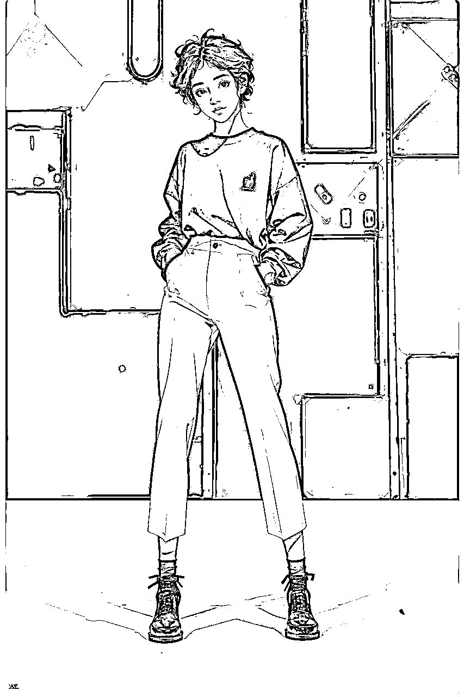

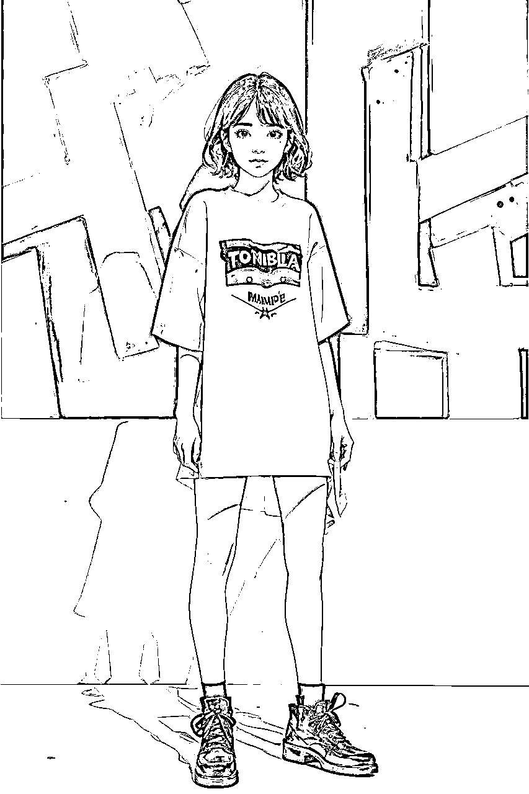

我的兴趣来源最初是看到一个推特博主的作品，我看到他发的作品。

对这种图片没有任何抵抗力，惊为天人，非常想要可以生成这种图。

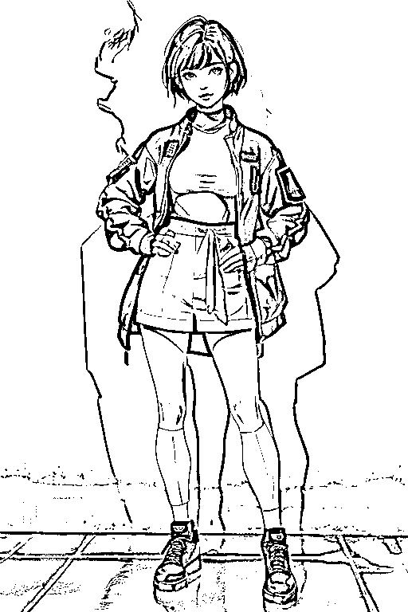

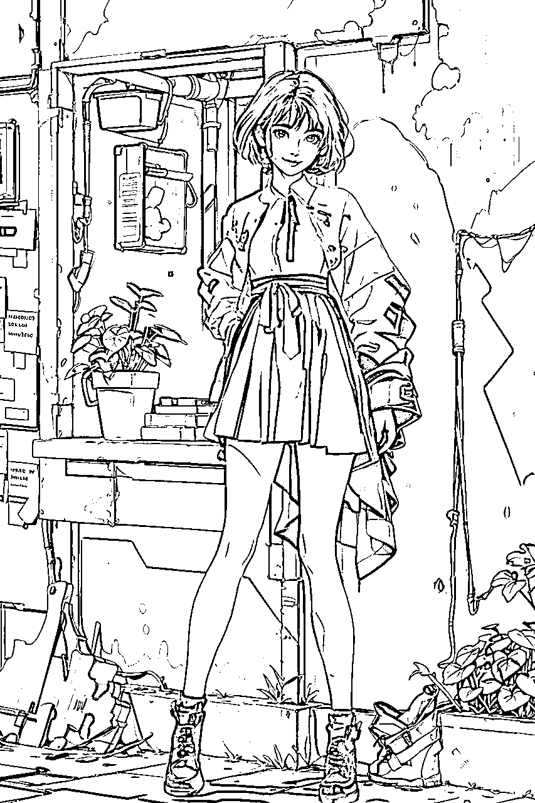

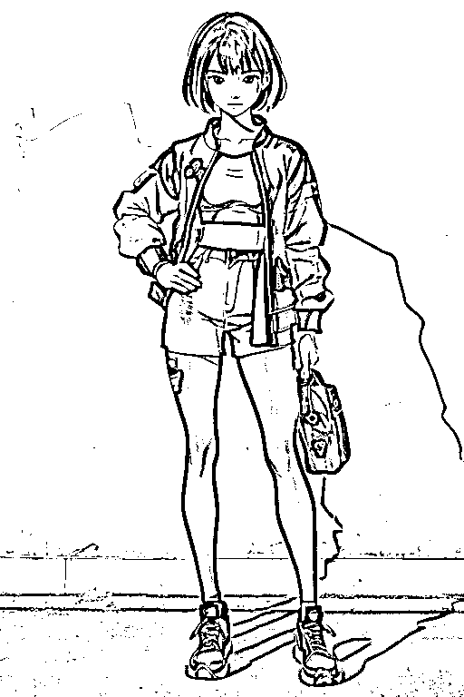

兴趣驱使下，那几天是进步最快的，尝试了大量的模型，发现和对标图片仍然存在不小的差距。

我当时选的基础模型是2D，基本很难出对标图片那种真人材质的效果

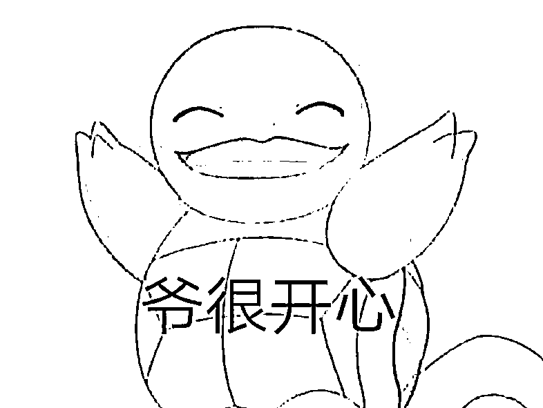

但是这个阶段，我已经可以熟练的自己写正向prompt和负向prompt了。

Stable diffusion对于自然语言的识别能力还是可以的，直接让chatGPT去出对于效果的提示词，速度很快。

如果大家觉得有用，后续我会再更一篇如何用chatGPT去写提示词。

知道自己有差距，后面直接私信这个博主，才要到了他的模型和lora，可以生成类似的效果。

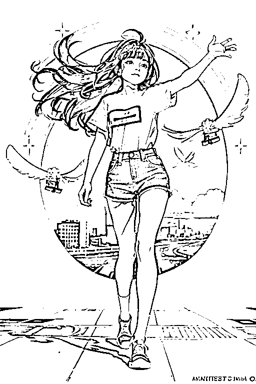

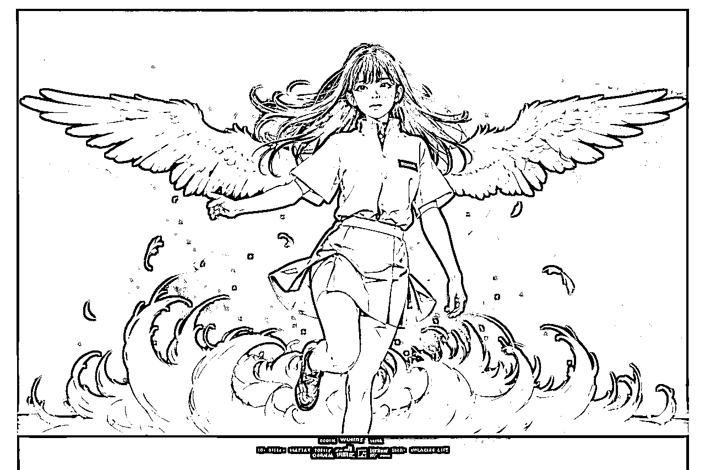

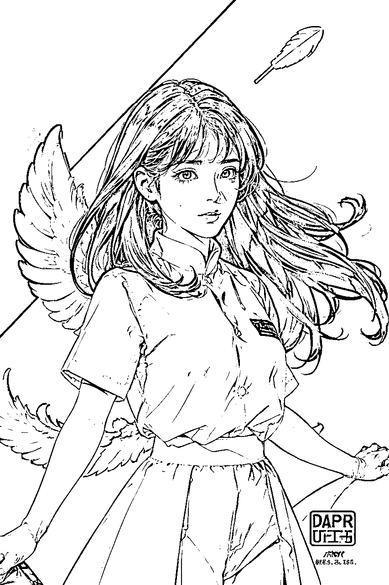

上面这些是我近期新出的一些图，因为已经知道怎么出图和文生图

后面总结复盘的过程发现：

1、很多我以为的非常困难的质量问题，本质是数量问题，因为数量不够，差好几个数量级。

2、数量就是最重要的质量。大部分质量问题，在微观上看，就是某个地方数量不够。

3、想掌握AI绘画，先怼上200个小时看看，找到优质对标图，别人出什么效果，你能做到无限接近，就算掌握了

## 5 文生图阶段，达到什么效果算是及格呢？

你想要写实风格，那你就知道选择什么底模，选择那些人物、环境、氛围的lora

你想要画动漫风格，想要出常见风格，如2.5D，2D，3D画风，水墨，工笔画，素描，彩绘，绘本等等，

就知道用什么模型，怎么调参数，那些lora的权重应该怎么调，高清放大知道什么画风选什么算法。

如果可以达到这个效果，基本就差不多了。

## 6 我的Stable Diffusion美女图的出图逻辑？

玩Stable Diffusion我推荐从写真妹子图片入门，很容易出效果，更容易建立信心。

我目前出图的主题是卡牌，塔罗牌的背景，虽然有些不太像是卡牌，但是本质上就是~

抽卡是容易上瘾的，因为人脸很容易出现审美疲劳，但根据不同风格和服饰，发型，可以产生极大的创意

很多手游抽到SSR角色是非常爽的，这也是AI抽卡的乐趣所在。

塔罗牌的的模型：https://civitai.com/models/11177/anime-tarot-card-art-style-lora

塔罗牌lora的核心在于各种风格的组合和lora权重的调整。

### 6.1 基础模型

基础模型可以选择写实、2.5D、2D都可以，

纯2D的人物脸部会比较扁平，缺少立体感，所以可以加入一些水墨、水彩的lora让人物更立体。

这里比较推荐的模型：

*   CamelliaMIx_2.5D (动漫拟真)

*   fantasticmix2.5D （动漫拟真）

*   majicMIX realistic 麦橘写实（真人）

*   AWPortrait（真人）

### 6.2 卡牌lora

这个lora本身是2D动漫的质感，会融合到模型中，同时会影响背景和边框设计。

选择卡牌的好处是你基本不需要描述太多背景提示词，就可以有不错的整体效果了。

如果想要比较重的卡牌背景，就把lora调整在0.7以上，背景就会有卡牌边框背景；

如果只是要人物居中的抽卡姿态效果，就把lora调到0.3以下，就没有卡牌痕迹了，但是会混入卡牌lora的动漫画质，还挺不错的，推荐试试

（正向提示词prompt）

颜色+background 可以影响背景颜色，比如： green background

颜色+frame 可以调节卡牌的边框，比如：white frame

### 6.3 我的出图步骤是

1、先选角色主题，写简单的提示词，把人物脸、身材、发型给固定下来。

2、再混合模型、背景、服饰、脸型，这个过程需要去混多个lora

3、调整提示词，修改不同提示词的权重，增加一些装饰物和特征，提升画面设计感。设置2-4个批次为一组抽卡，不加放大算法，速度比较快，第一次不一定能抽到满意的。

4、画面风格固定后，设置seed为-1，增加随机性，开始大批量抽卡，我通常会设置20批次或50批次，挑好看的成品。

5、挑出好看的图片后，以那张图片为基础，固定seed值，修改人物姿态，再去抽卡，这样一个风格就会有多种视角、多种人物画幅出现。

6、具体的提示词逻辑就是三段式：

<画质提示词>：Masterpiece,best quality, ultra-detailed..

<主题描述词>：人物、场景、特色元素

<使用lora和权重>：卡牌lora、脸部lora、绘画风格lora、服饰lora

## 7 提示词应该如何写呢？

正向提示词和反向提示词我建议看下下面这篇文章，我从中收获很大。

提示词基础学习： https://docs.qq.com/doc/p/4e09cf49213034e86b67c361953676f80917aafe

B站UP主分享的，看完基本逻辑就知道了，自己对照中英文翻译就可以上手了。

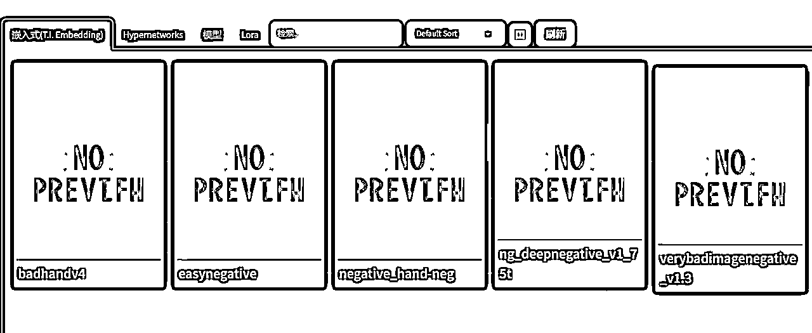

反向提示词部分，建议加上几个常用的embedding基本就够用了，可以修复下烂手、烂脸和畸形的问题。

最后再补充两句，我写的提示词每次都不太一样，基本逻辑就是分成画质提示词、主体描述词和lora部分。

非常鼓励大家去自己探索提示词的书写过程，有些不知道怎么描述的，完全可以把你的问题丢给chatGPT，再去尝试。

如果你还是不懂得如何写，欢迎和我交流探索~~