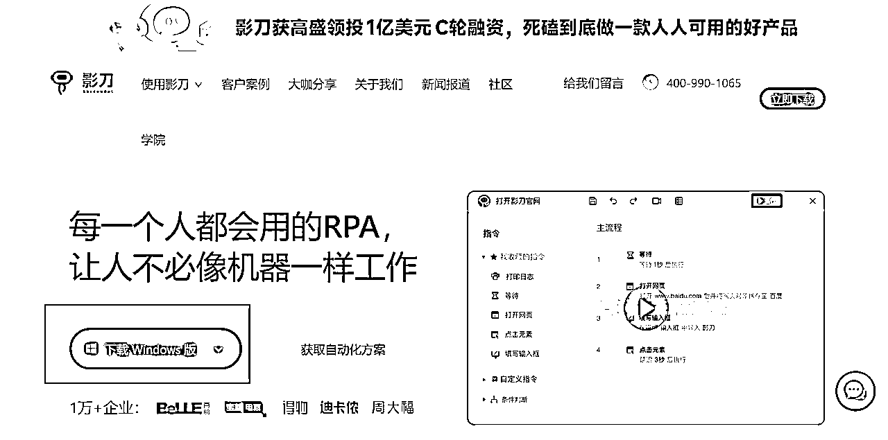
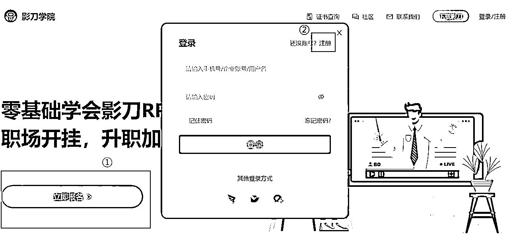
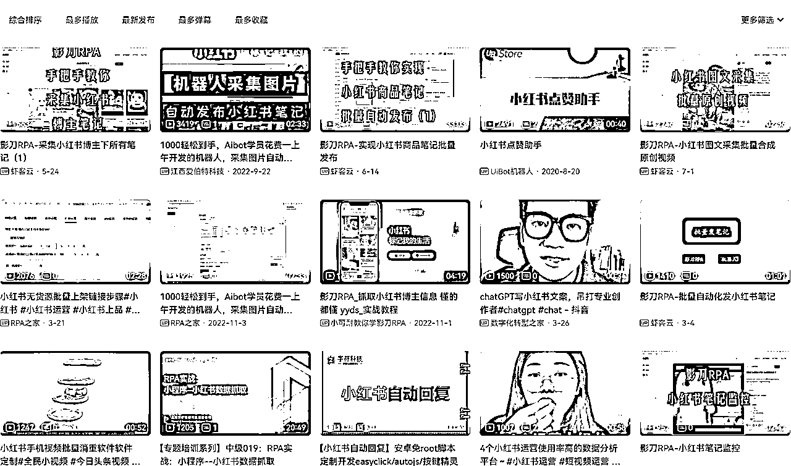
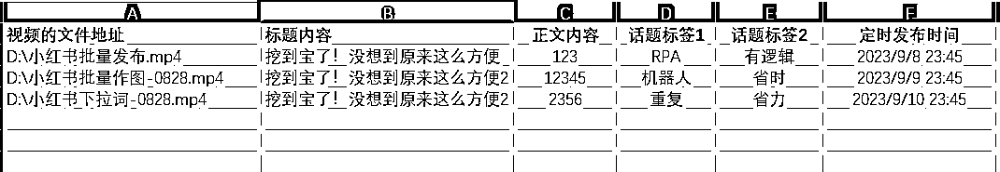
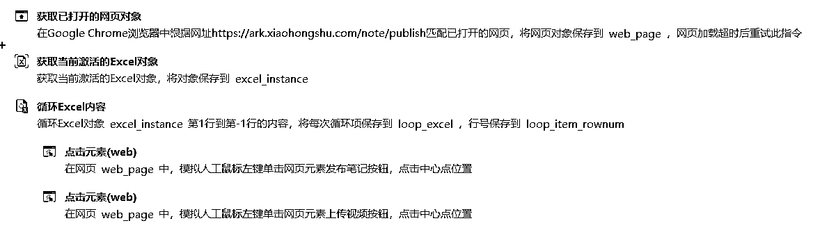
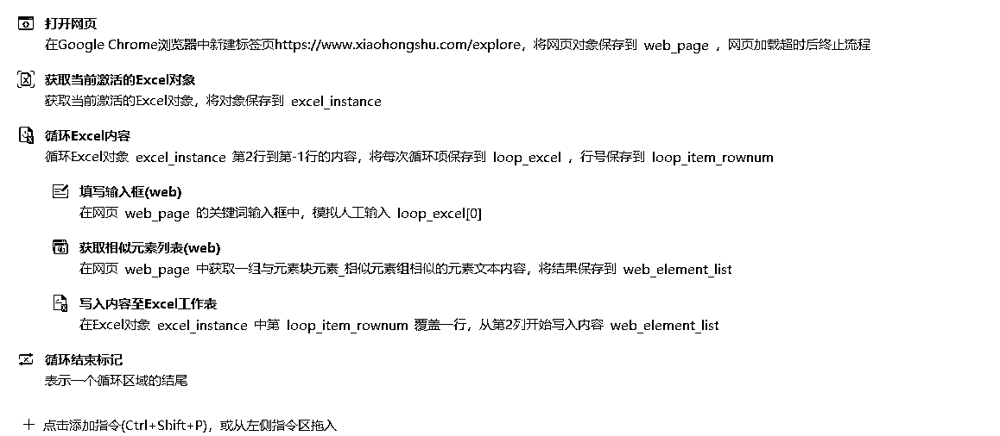
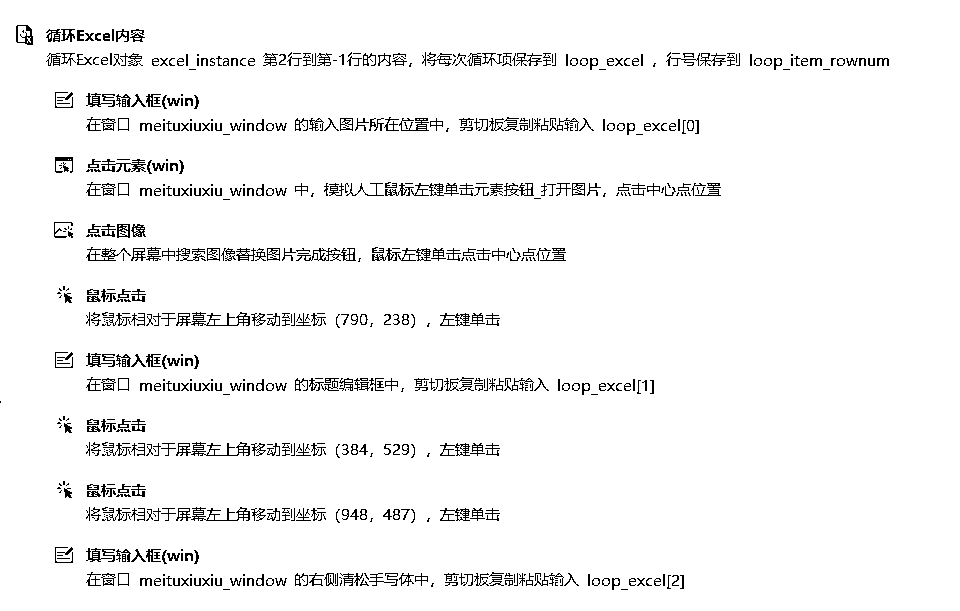

# 《如何利用RPA提升小红书店铺10倍以上的效率？》@Leeka

> 来源：[https://ktuszl372b.feishu.cn/docx/UcTFdIFxqoRadEx4ephcFKVqnVf](https://ktuszl372b.feishu.cn/docx/UcTFdIFxqoRadEx4ephcFKVqnVf)

大家好呀，我是Leeka，影刀认证的优秀工程师。

感谢生财，让我知道有RPA这么一个好东西，感谢自己在6月续航的时候终于决定学好影刀RPA。

目前的我已经开始让RPA渗透自己的项目中，同时也通过贩售RPA机器人变现4位数了。感谢阿蓝的邀请，来跟大家分享一下我是如何通过RPA给小红书店铺这个项目全面降本增效的，希望你阅读完会有所启发。

### 1、什么是RPA

我简单地称之为：把你不想做的重复性的工作交给机器人的过程，就叫 RPA。

就相当于你聘用了一位不需要休息的助理，只要你给的指令没问题，它就能 100% 按质按量快速完成。只要能联网，随时可以开干，我们睡觉的时候，就可以让 RPA 接力我们白天没做完的工作，听起来是不是超级棒？

只要我们手头上的工作符合以下条件：重复的、有逻辑性的，都可以让RPA帮忙。

RPA 的优点就很明显了，只要你设置是对的，它就不会出错，全年无休，简直就是提升效率的神器。

### 2、需要准备的工具

#### 2.1 RPA 软件 + 插件

推荐使用影刀，因为影刀几乎把所有代码都整理成可视化的模块，对新手更加友好，入门更轻松。

官网地址：https://www.yingdao.com/

下载适合你电脑的版本。

按照自己的使用习惯，给浏览器安装影刀插件，影刀目前支持 Chrome（谷歌浏览器）、Edge、360、火狐等浏览器，我自己常用的浏览器是 Chrome 和 Edge。

#### 2.2 零基础可以在影刀学院系统学习

虽然影刀在 B 站也有账号，但相对而言，还是影刀学院的教程比较系统，新手更好入门

影刀学院地址：https://college.yingdao.com/。

打开网站后，点击【立即报名】进入登录界面，新用户点右上角【注册】，用手机账号注册一个账户，再登录就可以啦~

登录后就进入了学习界面。

在官网上拿到证之后，基本的操作就没什么大问题了。

#### 2.3 进阶玩法

当你把影刀学院官网的课程都学完，该拿的证件都拿到之后，你就可以开启自己的进阶之旅了。

推荐去B站那边学习更多其他的知识，在看完其他人的操作之后，你会发现自己的境界又不一样了。

不具体推荐哪个UP主，因为都听得很困（机会点啊朋友们，稍微讲得有趣点，账号不就起来了？咳咳，回归正题），哈哈哈，按照自己的实际需求，搜关键词就OK。譬如：我搜的关键词是【小红书RPA】

### 3、在小红书项目中，如何利用 RPA 提升效率

其实我认为，只要是重复的、有逻辑性的工作，都可以让 RPA 帮忙。

譬如，如果我是制作图文笔记的，为了让整个账号看起来更加整齐美观，我的图都是一个模板出来的。也就是说，我这个作图的过程是重复的、有逻辑性的，那就正好可以让 RPA 帮忙了。

再譬如，我们混剪好素材之后，需要批量定时发布小红书笔记。也是有逻辑的、重复的过程，同样可以让 RPA 帮忙。

同理，找对标账号的所有笔记、又或者是按照关键词找低粉爆文等，都可以通过 RPA 来实现，今天分享的时间有限，就先分享一部分，其他更多的玩法，等大家一起去解锁。

马上进入今晚最精彩的环节了，来，拍一拍我，让氛围烘托到位！

#### 3.1 批量定时发布

我想这个功能，相信在座的各位老板都很想实现的，毕竟其他的软件单月需要 98 元，掌握了之后分分钟能节约不少。

我讲一下机器人的运作原理：

就是我们预先告诉它需要做什么，譬如打开小红书商家后台网页，然后点击笔记发布，选择视频发布（或是图文发布），然后上传对应的视频，再写标题、正文、加对应的标签、定时发布的具体日期和时间。

具体如何实现呢？

就是用前面提到的影刀RPA软件，在软件里录入以下内容。

它的原理简单解释就是：

依靠 Excel 跟机器人交代需要选择哪些视频、标题写什么、正文写什么、标签加哪几个、具体的发布时间，如下图所示：

Excel 表可以根据自己实际需要批量发布的数量，预先填好，机器人就会一个一个完成，有多少完成多少。

当然，为了确认哪个视频成功发布，哪个没有成功发布，我们还可以让机器人将完成与否的结果写入 Excel 表里，这样我们就能清楚知道哪些已经完成，哪些还没有。实现人机交互。

实现出来的效果是这样的：

#### 3.2 通过 RPA 抓取下拉词

有时候我们需要找到长尾词、做好 SEO，但是我们如果做多个类目或是多个品，就需要不断重复搜索，就感觉很累。

为什么要做好SEO呢？譬如我们在卖【微胖身材的连衣裙】，如果我们只铺了关键词【连衣裙】，来的客户可能不够精准，也就意味着我们转化率很低。但是如果我们找到了精准的下拉词，如【连衣裙微胖】，这样来的客户就会更精准，而这个都可以通过下拉词实现。

而抓下拉词这个动作，其实也是重复、有逻辑性的（在输入框里，输入自己的主关键词【连衣裙】，然后记录跳出的下拉框的10个词】，刚好符合 RPA 的要求，那么我们就可以整个 RPA 程序，帮我们来抓下拉词。

整体流程：

实现出来的效果是这样的：

#### 3.3 通过 RPA 批量做图

当我在实现这个需求的时候，本来的想法是让机器人先整一个模板，然后在模板上再不断变换图片和文字。

后续发现这个实现起来有点困难，因为图和文字的位置不好确定，真要死磕其实也可以，但是属实没有太大必要，于是我就简化成了让机器人直接在模板上修改。

其实在使用 RPA 的时候，我们不必让它 100% 帮忙，能帮忙 80% 以上就已经很不错了。

适当人工干预，其实也没啥，只要总体能帮我们省时省力，这就是一个好的机器人。

按照这个思路，我就写了批量作图的机器人。整体流程是：

实现出来的效果是这样的：

### 4、结语

我明白，在陆陆续续看到其他船员已经跑通 0-1 或是已经单量暴增的时候，自己会有失落的感觉。

而此时我们能做的就是不断地优化自己的步骤，别人一天发 3 条笔记，那我是不是可以做到单账号每天发布 10 条呢？

在别人单日发布 10 条笔记的时候，我是不是可以通过下拉词让自己笔记的搜索量更大呢？

为了助力各位老板，时间关系，我已经将今天分享的下拉词机器人交给各位志愿者了，想要拥有的老板们，去跟志愿者聊聊吧~交个朋友，希望对你们有帮助！

我始终认为赚钱不是非得累死累活，找到对的提升效率办法，一个人也能做好矩阵。身边很多程序员其实看不上RPA，觉得RPA没有代码来得快速，但我恰恰认为这就是不会代码的我们的机会。

时间有限，没办法跟大家分享更多，我是 Leeka，我持续在研究 RPA，如果你也对 RPA 感兴趣，欢迎和我一起交流~

最后祝大家一起生财有术！