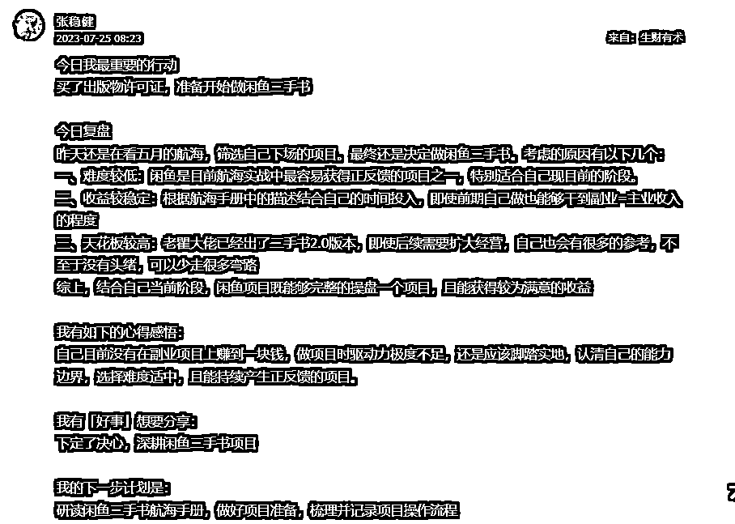

# 新手小白闲鱼二手书如何45天卖出1.4W+

> 来源：[https://ma0g2u36irl.feishu.cn/docx/UpJndUAEdoMvMBxezRtcWcW2nch](https://ma0g2u36irl.feishu.cn/docx/UpJndUAEdoMvMBxezRtcWcW2nch)

## 自我介绍

1.  大家好，我是张稳健。主业是在成都的一家外企担任软件测试岗位，平时的工作主要就是保障网站的上线质量，通过工具提高测试效率等。曾先后入场小红书电商和闲鱼二手书项目。前者历经半个月没有跑通闭环，后者在一个半月的时间三个店铺完成了1.4W的GMV，其中的1.1W是在下场一个月后蹭着开学季的东风开始爆发。所以暂时没有成绩的小伙伴千万不要气馁，可能明天就轮到你爆单啦~

## 航海初体验-小红书电商

1.  一转眼，加入生财已经俩月有余，刚进入生财也和大部分小伙伴一样，看到各行各业年入百万甚至千万的大佬在星球里真诚的分享自己的项目，简直看花了眼，不过作为一个Gallup测试得分极度偏执行力领域的选手（得分前5中有4项属于执行力领域），也是按捺不住下场的冲动。

1.  于是也没有过多的犹豫，粗略在航海中筛了一遍，就被红利期的小红书电商项目给吸引了，撸起袖子就开干！可惜由于之前没有接触过自媒体和电商项目，选品、图文二创、视频剪辑也没有经验，发布的笔记数据都很差，以至于迟迟挣不到第一块钱，看不到任何正反馈，在反复的纠结和内耗中，最终下场半个月后选择了放弃小红书电商项目。

1.  既然没有得到，那就有学到。通过小红书项目，自己也有反思项目失败的原因：

1.  没有任何自媒体和电商的经验，纯小白入场，导致笔记热度不高，更无法转化为成交

1.  公司工位经常会有同事和领导经过，不适合进行剪辑视频和处理图片等工作

1.  项目和自己当初的定位不符，作为一个小白初入生财，最重要的不是一口吃成一个胖子，而是先挣到第一块钱，拿到正反馈，以激励自己能持续地干下去

## 总结经验-重新筛选项目下场

1.  在放弃小红书项目后，也是吸取了之前的教训，没有盲目的开始，而是花了几天时间把航海中有意向的项目一个个列出来，然后逐个了解、尝试、排除，最终剩下三个：个人优势挖掘、ChatGPT+自媒体、闲鱼二手书。

1.  由于小红书项目的失败，也让我对自己筛选项目是否匹配自身产生了怀疑，再加上之前也有做过Gallup测试，所以首先就选择了个人优势挖掘，想要更深入的了解自己的优势才干，以便找到更匹配自己的项目。先是把航海手册通读了一遍，然后针对自己的前五项特质：排难、成就、公平、回顾、纪律-都找到了对应的事迹证明，加深了自己优势才干的了解。最终根据自己的成就特质也是坚定了自己的想法，先跑通项目闭环，赚到第一块钱，不断的取得正反馈，以刺激自己持续的深耕项目。

1.  后续也尝试过ChatGPT+自媒体，完成了GPT3.5的账号注册和GPT的基本使用，也看了大佬们分享的关于指令生成、AI绘画工具等帖子，但感觉上手门槛较高，且自身兴趣不大，就给pass掉了。

1.  最终就自然而然的选择了适合新手小白闲鱼二手书项目，原因如下：①上手难度较低，能及时看到正反馈 ②电商的客服工作上班同时也可以胜任 ③较为繁琐的上书、拍单等工作也可以在上班期间操作

## 航海二进宫-闲鱼二手书

1.  应该是在7月25日联系圈友办了出版物许可证，迫不及待的想要立刻上书，但证没下来也只能望洋兴叹。只能逼着自己静下心来去为项目启动多做一些准备。包括账号资料准备、选品方法熟悉、商品上架流程熟悉等工作。

1.  且这个时间点恰好处于两次航海的间隙，既没有同频的小伙伴可以讨论，一起督促项目打卡，也没有定期的高手分享，就想到了自己每天以生财帖子的形式完成每日打卡，记录每天的思考和复盘，帮助自己坚持下去。这个动作也在无意中链接了很多同频的小伙伴，有小伙伴一起加油打气，也有小伙伴主动提供帮助，也让我更加坚定了持续输出，极致利他，链接更多圈友的想法。

1.  7月31号，心心念念的许可证终于办下来了，迫不及待的花了俩小时手动上书57本，深感手动上书效率太低，于是开始去星球内搜索如何提高上书效率的帖子，刚开始是刷到了大佬分享的影刀脚本教程，准备自己参照圈友的影刀教程写一个简单的上书脚本，不过后续逐渐了解到圈内大佬已经研发出不止一个更成熟的闲鱼二手书网站，于是就打消了自己开发脚本的想法，吃上了嗟来之食。先后使用了ROC和明哥的网站，个人感觉在上书便利性上前者更优，数据统计上后者更优（个人看法，仅供参考）

1.  正式开始做闲鱼二手书项目，真的遇到了很多问题、也踩了很多坑。但是我都尽量让自己做到：非必要不提问。一是养成主动去思考的习惯，而不是拿来主义；二是可以锻炼自己处理（简化）问题的能力；三也是可以减少很多无脑提问，节约时间。

1.  莫名其妙账号被限制闲鱼币推广（考虑原因：①红米手机 ②发布1分钱小黄鱼）

1.  尝试使用不同圈友开发的网站，各有优劣的情况下应该如何选择

1.  项目运营的操作这么多，到底哪些动作是最关键的核心动作

1.  尝试各种各样的选品和运营操作，店铺流量却没有明显增长

1.  尝试添加客户微信，拉群发红包引导好评和复购，测试后却发现效果却并不好

1.  教材全解仅初中就有三个年级上下册，八个科目，十多个版本（需求最大的就人教版），还有广东专用、天津专用等地区专版，在这样的情况下如何才能提高客服咨询的效率，减少各种各样的售后订单

1.  工作、生活和副业冲突时应该如何平衡自己的时间和精力

1.  就这样不停地遇到问题、解决问题、记录收获、复盘总结、梳理流程。最后也形成了一套自己的SOP。

1.  一键擦亮、闲鱼任务：10min

1.  批量上架-下架-粗暴选品：5min

1.  出单品推广-超级擦亮：3min

1.  批量抵扣/优化、降价：2min

1.  爆品复制：5min

1.  数据分析：10min

1.  优化标题和主图

1.  有曝光、浏览没出单的补单

1.  每日精细化上新3个：60min

1.  坚持干了一个月，借着开学季的流量，账号销量也一下起来了，单日销量从500、800最高冲到1300。刚爆单还是很兴奋的，每天早上6点起床，晚上11点休息，忙得那叫一个不亦乐乎。不过好景不长，伴随着爆单的同时，售后订单量也是水涨船高，每天除了处理售前咨询和拍单工作以外，还需要和各种各样的客户斗智斗勇，真切的体会到了什么叫做痛并快乐着。

1.  就这样又肝了一周，先是主业项目上有新版本发布，工作和副业多线程作业确实忙得够呛，就把每日的闲鱼币推广和超级擦亮都停了；又挺了一周，每天在手机、电脑前的时间超过12个小时，每天肩颈腰部都在发出无声地抗争，叠加本身需要筹备10月份的婚礼。最终在经过深思熟虑后也是决定暂时停掉闲鱼项目，让自己休息一下，不过这也是后话了。

1.  这次闲鱼项目的经历，也让我开始反思接下来的副业之路应该如何走得更远。

1.  做项目需要长期的积累，不能用百米冲刺的速度去跑这场马拉松，否则很可能累瘫在跑道上；

1.  准备把之前停掉的定期健身的习惯捡起来，做好任何项目都需要有一个健康的身体支撑；

1.  有句话说得好，家和万事兴，只有处理好家庭关系，才能有更多的精力专注在项目上；

1.  最后，深入践行长期主义，做好在一个项目上深耕三个月甚至更长的打算；坚持每日复盘，输出倒逼输入

### 闲鱼项目的一些心得

1.  大部分的操作技巧在航海手册里都写得很详细了，我这边就结合自己的实操简单提几个我认为有用的点给大家作为参考

#### 前期筹备

1.  办证：我这边办了两本证，价格都差不多，但是一本证花了一周，一本证花了一个月。所以建议圈友办证前在圈内、群里多咨询、多对比一下，避免迟迟下不来证浪费时间。

1.  个人资料完善：最粗暴的就是找5-10个数据好的同行账号，把他们的昵称、头像、简介全都扒下来，然后重新组合形成自己的。（注意：昵称30天只能改一次，我就是前车之鉴：小米书屋、红米书屋、黑米书屋）

#### 选品

*   选品的方法太多了，任选一种深入实践也有不错的效果，我这边只分享我用了效果较好的两种。

1.  在闲鱼上搜索近七天数据好的书籍（出自圈内大佬：驴保国绅士）

1.  通过闲鱼首页-分类-图书音像-考试教辅/大学教材-发布时间7天内，寻找数据较好的品

1.  自然出单的品优化为多SKU

1.  账号上出单的品直接去闲鱼上搜索关键词，找到同行的3-5个品，把商品标题、介绍和套装图片扒下来，组合进行发布。比如下面这种

1.  我个人的爆品-教材全解系列，也是前期在孔网批量上书上了一本：中学教材全解-七年级语文上，自然出单，就引起了我的注意，于是在闲鱼上搜了中学教材全解，从同行数据较好的品中筛选了几张套图和详情介绍就开始上书，结果又出了几单，之后就是不断的完善多SKU。先是语数外物化生政史地等不同科目、然后是人教版、北师大版、外语教研版等不同版本、之后再把小学和高中教材全解也都上了单独的链接、最后再不断的更换主图、定位重复上爆品链接，直至把教材全解的流量吃完。

#### 运营优化

1.  大部分都是些日常操作SOP，重点讲下爆品复制，这也是从圈内大佬驴保国那儿学来的。

1.  找到一个爆品是真的很重要，教材全解这一个品占我所有销量的60%以上，利润更是占到了70%以上！

1.  一个品爆了一定要继续上这个品的B链接、C链接，多店链接，直到吃光它的流量为止。

1.  多个账号发同一个品，需要更换标题、主图和定位发布，否则可能会被判定重复发布违规。

1.  千万不要爆了一个品，还傻乎乎地去找下一个爆品，对新手来说连续找到两个爆品的几率太低。

1.  然后是数据分析：

1.  没有曝光：上架2周后只有几十曝光甚至更少的品毫不犹豫地删除

1.  有曝光没有浏览：参考同行同品类的链接更换主图、更换标题

1.  有浏览没有我想要：优化商品详情介绍，合理调整价格

1.  有我想要没有成交：客户咨询及时回复，多SKU之间的价差不要设置过大，避免用户有被骗进来的感觉

1.  数据最好的10-20个品，每天都去改改标题、换下图片顺序，据说会有额外流量曝光（我是有时间就做，也不敢保证100%有用）

1.  话术总结

1.  只有当你遇到了客户收到书后因为品相差、笔记多、版本对不上等各种原因退换货，才会意识到增加这些话术（详情描述）的重要性。话术航海手册中也有，根据每个人出单的品和习惯略有区别，但都大差不差，以下是我的话术总结，大家可以参考一下

1.  重点提一下引导关注和引导好评，你不主动提客户基本不会好评，但如果在你服务不错的前提下，再适当的进行引导，还是有不少客户会关注和好评的。

1.  好评飙升榜我三个号都上过，闲鱼规则是30天只能升一级，否则大号1.5个月已经鱼小铺L3了！我在不推广和超级擦亮的情况下每天仍然有大量的曝光，很大一部分原因就是关注和好评数据还可以，用LOL的术语就是隐藏分很高，上分速度贼快！

1.  另外给大家介绍一款手机快捷回复的APP：客服宝。手机应用商店直接搜索就能搜到。

1.  点击悬浮的APP图标就可以直接复制事先编辑好的话术，在手机上进行快捷回复。

1.  我也是在坚持下场30天后，再趁着开学季的东风销量才慢慢起来的。所以也希望暂时还没有取得成绩圈友们不要气馁，只要跟上航海的节奏，每天进步一点点，也许明天爆单的就是你！

1.  选品手册中的一句名言送给大家：如果成功后你不知道为什么成功，这种成功是无法复制的；如果失败后你不知道为什么失败，这种失败也是没有意义的！

1.  最后，感谢肉松老师的辛苦审稿，并给出了很多中肯的改进和建议。