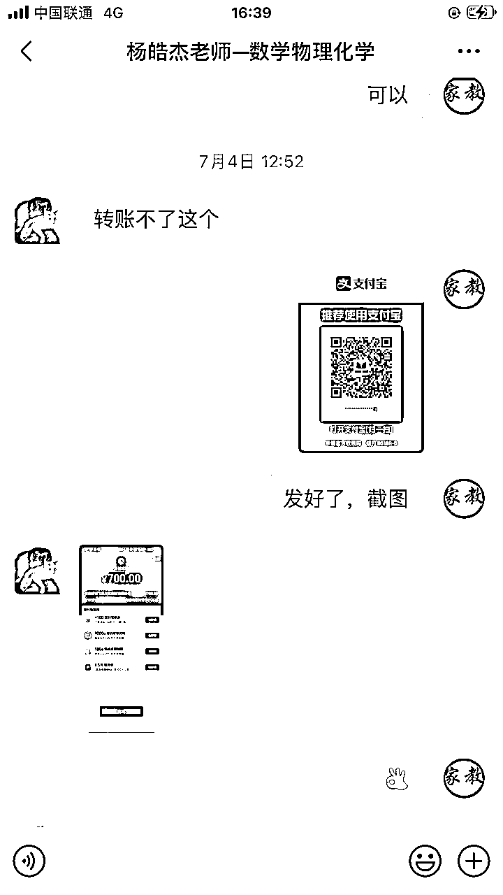
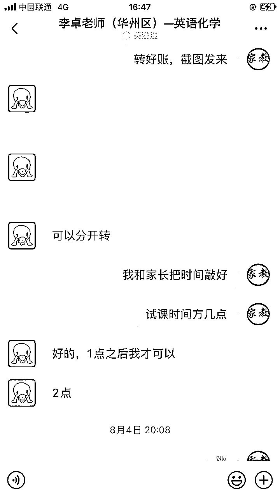
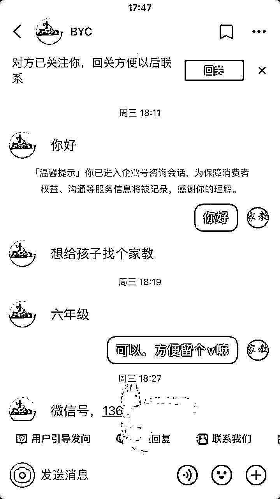
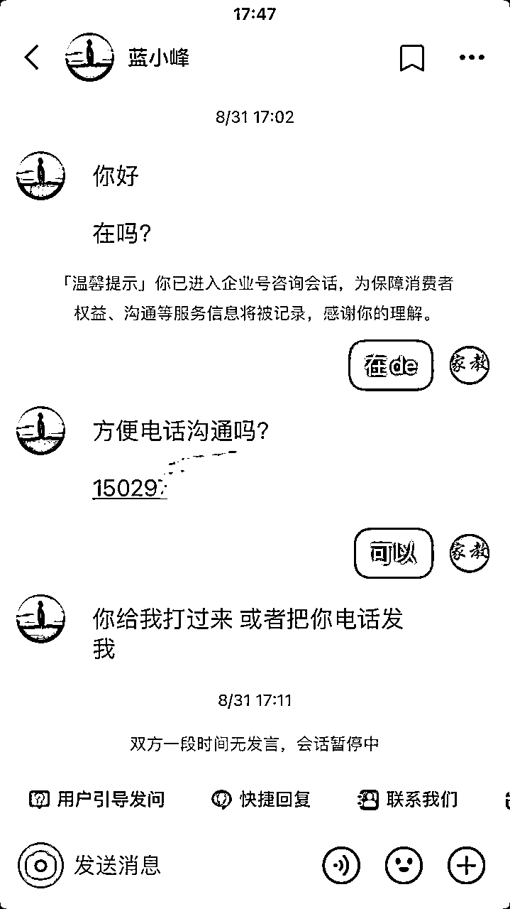
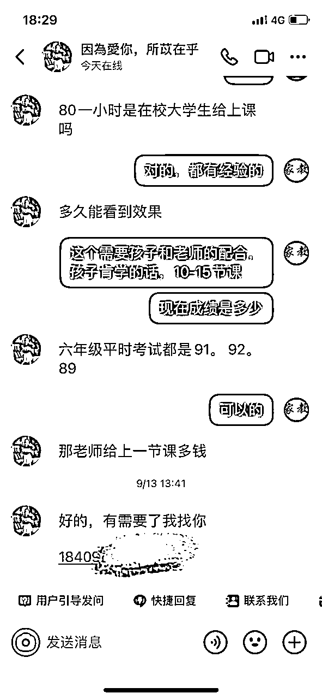
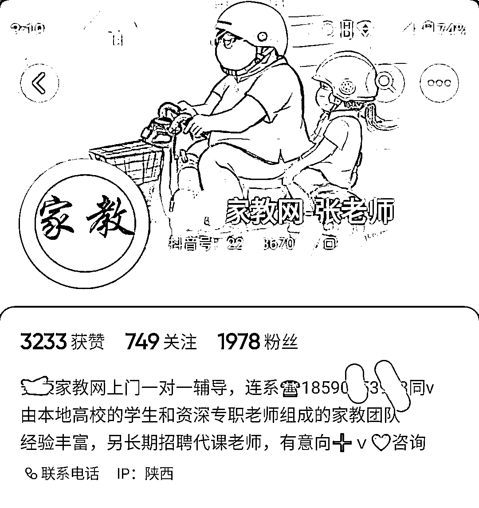
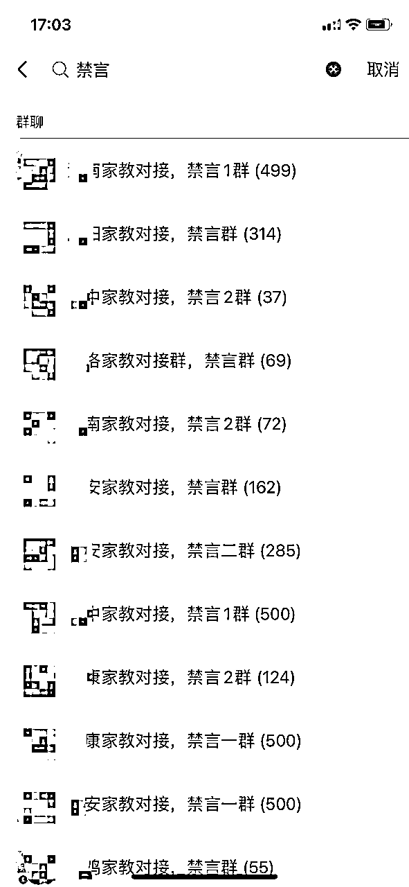
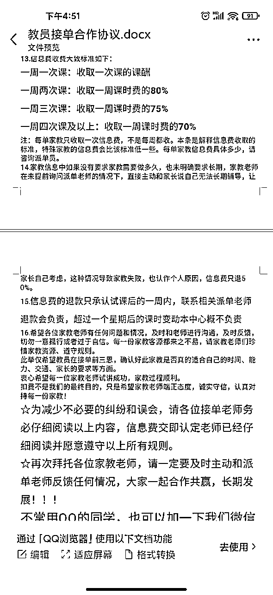

# 同城信息流：一对一上门家教单月利润20万，我们做对了什么

> 来源：[https://jnbsgdsqir.feishu.cn/docx/VBEPdwP4aonkKXx5MQ2cA7TnnRg](https://jnbsgdsqir.feishu.cn/docx/VBEPdwP4aonkKXx5MQ2cA7TnnRg)

大家好，我是天道。一位90后连续创业者，8年互联网经验，互联网项目一线实战派，目前专注商业私域引流和同城信息流项目。潜伏生财一年半了，一直在默默的学习，没发过文，一方面是各路大佬太多，另外一点是之前的项目不方便传播，哈哈。

之前一直做的网创类项目，今年4月份开始转型做同城信息流项目，同城一对一上门家教就是我们转型开始做的第一个项目，也算小有成绩，六月份做的利润差几百块到20万（团队三人）。今天就像素级分享下我们是怎么操盘的。

# 1、关于项目介绍

这个项目生财圈友分享的文章比较少，属于小众赛道，在7月份有兄弟分享过，我们是在4月份开始入场的，目前团队3人，6月份到一个单量的高峰期，8月初的时候迎来了一波行业动荡期。

家教行业，在我们国内属于刚需市场，经历了19年开始的双减政策打压校外学科类教培机构，反而校外一对一的上门家教需求猛增。

我们主要是大学生老师为主，为需要提升成绩的小孩家长提供上门辅导服务。试课成交收取老师一次性抽佣。

中介思维：这种类型的同城信息流项目的优势就是，不需要门店，一个人一个手机一个微信一个抖音号就是一个门店，向上对接老师资源，向下对接家长。全程电话微信即可完成沟通成交。并且我们做到了可跨城市运营，文章后续讲解。

# 2、转型之路

这两年的网创项目，生命周期越来越短，从以前一个项目能做一两年，到现在一个能做的生命周期只有半年甚至三个月。这就意味着每年都要不停的找项目，换项目。甚至有些项目觉得可行，准备大干一场，对接过来后组建团队，培训团队，还没等团队成员完全上手，项目已经走下坡路了。

所以我们团队今年的项目方向思考是：刚需，长期为主，不再投入重资产去操盘项目，而是用中介思维去做。

而符合这种方向很好的一个切入点便是同城信息流，利用我们做互联网项目的引流优势，结合本地一些优质的项目模型。年后一个多月期间，我们走访学习了很多教同城的，学费交了不少，当然学到的项目思维也不少。

再结合生财的一些同行分享思路，于是我们就开始了做同城信息流的业务转型，第一个切入的就是家教项目。

# 3、怎么找意向家长

这个是整个项目的核心环节，所以优先给大家讲。因为任何项目都是一样，客户是最难解决的环节，任何行业解决获客基本就已经成功一大半了。而家教项目的客户便是家长。

家长的获客我们主要做了两种方式：抖音短视频和抖音付费代发。

我一直认为做引流，不在于姿势有多少，而在于有效的姿势深耕。有些人喜欢全平台引流，各种平台各种引流方法去尝试，结果时间花了，金钱花了，获得的精准客资却少的可怜。

我们只在有效的平台，单一的引流方式去深耕优化放大。而抖音就是客户质量与数量最大的平台。

## 3.1、抖音短视频引流

我们最开始用的是视频，到后面视频内容流量限制，我们就转的用图文方式。

内容方式不管是视频还是图文，抖音号名称和简介是一样的。

名称：我们都是用的：地域+家教网+x老师，比如：西安家教网-刘老师

或者：地域+一对一家教+x老师，比如：长沙一对一家教-张老师

地域是为了让同城的家长更清楚我们是做当地家教的。

而后缀加上x老师，是为了更突显人设，这样有利于家长打电话过来可以直接称呼。没带后缀之前，他们打电话过来说的是“你好，你们这是做家教的吗”，我们带上后缀后，家长们打电话就是直接称呼“你好，是刘老师吗，我这小孩需要家教”，细节决定成交率。

头像：我们用美图秀秀软件制作的：地域+家教，或者直接就家教两字，这种头像让用户非常直观的知道我们是做什么的。

如何引流到私域：

1.半蓝认证，这样我们就可以在主页留我们联系电话，商家直接可以通过抖音主页拨打我们的电话联系。

2.主页前三个作品置顶，用这种三联屏图留电话。

3.客户私信不要主动留我们自己的微信，容易封号。我们一般让客户留自己的联系方式，晚点联系他。或者让客户看主页联系。并且对于关注我们的用户，我们会回关后，以语音的形式发送。

视频内容：最开始我们是以第三视角的方式，前面老师在辅导学生，我们在后面拍摄。发布的时候配上文案和音乐即可。这种方式的视频，家长刷到后第一眼就知道我们是做家教的，并且文案中以诱人的价格（低于市场行情价）触达想请家教的家长。

这种视频虽然简单，但是重点在于文案，比如：“一对一上门家教，xx大学（当地名牌），经验丰富，认真负责，免费试讲，满意再用，低至60元每小时”。把文案放在视频中，我们做这种视频的时候虽然点赞评论不高，但是后台很多私信的，或者直接打电话过来咨询。

到六月底这种视频方式引流就被限流了，于是我们便转战了图文方式。

在小红书去扒一些大学生的图片，用去水印去重软件处理后，带上文案发布便可获得不错的流量。文案和上面视频内容的文案类似。这种图文方式制作起来比视频内容更为简单。

关于制作细节，生财之前有小伙伴分享过了，这里就不重复分享了。

发布的时候一定带上同城的定位，最好是当地学校的定位。

## 3.2、抖音付费代发

这种方式也是我们之前引流创业粉的思路，直接套用过来做家教项目了。

我们在当地的同城公众号，兼职群找了一批宝妈。

我们剪辑好相关的视频后，直接让宝妈给我们发布在她自己的抖音号上。

内容就是我们之前的视频方式：老师给学生补课，我们在后面或者侧面拍一个十秒左右的视频。文案方面有所改动，“给我们家小孩找了个大学生家教，不知道这60一小时花的值不值。这家伙第一次这么认真的学习”

我们制作好视频后分发给本地宝妈发布，发布后保留7天以上，给她们十块一次。

让她们评论区@我们的家教主号，并且把其置顶。

关于效果：这种素人号发布的视频流量不会很大，但是投产比而言绝对是有利润的。偶尔有爆的作品我们就会和她商量，再给50块让其给我们把作品保留延长至3个月。

# 4、怎么找老师

刚开始我们启动这个项目的时候手上没有一个老师，我们引流家长的同时才开始找老师。

前期我们从以下三个渠道找老师：

1.本地同城公众号，我们在本地公众号发布老师招聘的信息。很多本地号他们是有很多同城微信群的，发布在本地公众号的同时是可以帮我们把信息发布在他们的微信群里的。

这里注意，一些本地公众号发布招聘信息必须要有本地公司的营业执照，不然不给发布。如果个人操作没有的话可以借朋友的用一下，或者某宝找代办营业执照的办一个个体户的就行，几十块即可搞定。

2.boss直聘，只要稍微大一点的城市，boss的招聘效率是很高的，我们发布一个招聘职位信息，一天就有上百个投简历和主动咨询过来的。

boss 发布一样需要营业执照，另外在发布的时候记住我们是招聘的兼职合作老师，在关键词或者介绍中写清楚，避免都是全职的老师找过来。大学生为主，全职为辅，因为有些家长指定要全职老师，说钱不是问题，只要能提升自己的小孩。

3.抖音号招合作，抖音不仅能引流家长客户，还可以招老师。我们会有一部分抖音号在名称后或者简介里带上“招老师”后缀，这样有些老师看到了会直接联系我们，让其加上我们的微信号即可。

以上三个就是我们的找老师的渠道，前期通过这几种方式找到一部分老师后，我们会让老师帮我们转介绍老师。介绍合作成功后给她们发个红包。大部分的老师是愿意介绍自己的同学的。

一般从事过家教的老师手上或多或少都有一些本地家教群，我们让她们帮我们拉进群，拉一个给她们10块20块红包。

这样的我们短时间很快有了足够支撑订单的老师资源了。

并且我们建了属于我们自己的微信派单群，把所有的老师都拉到群里，并且鼓励老师拉老师进群，我们给予一定的优先派单权和红包奖励。

我们和老师的合作是以试课模式，当有订单我们便会把订单信息发布在群里，订单信息包含地址，需要补课的科目，家长的出价，补课时间等。有时间的老师就会抢单联系我们，然后再和其沟通细节。

先会把教员接单合作协议发给要接单的老师。我们合作的信息费会先收取，一般视家长需要补课的具体情况收取。一周一次课的收取一次课的课酬。

一周两次课的收取一周两次课时费的80%。

一周三次课的收取一周课时费的75%。

一周四次课及以上的收取一周课时费的70%。

一次课一般都是2小时以上，我们最高的一个合作抽佣了3000多块，那个家长补了两个科目的课，一个月总共60个课时，

有些人可能疑惑，为什么这些老师愿意把第一次合作的大部分佣金给我们。因为所有的家长都不仅仅是只需要补一次两次，而老师只是给我们第一次合作的费用有抽佣，后续家长再找同一个老师补课，我们就不再抽佣了。

收到老师的佣金后我们便会拉群对接家长和老师，安排试课。试课一小时，满意即可进入正式授课，如果不满意我们便会安排二次试课。

大部分都是试课成功的，因为大学生会很珍惜这份工作。

# 5、如何利用矩阵思维，三人团队快速做到月利润20万

这个部分是我们能做到20万的核心拆解。

我们在四月跑通了这个行业变现的单账号模型后，立马矩阵去放大了。从单账号矩阵为多账号，单城市矩阵为多城市。

我们项目团队最开始跑的是陕西安康市，最开始一个账号跑，前三天养号，第四天开始改资料发作品引流，第七天便出了第一单。于是我们立马加了两个安康的账号。

到四月底安康市我们三个账号已经跑了1万6千多的利润，我们便抽调了2个新员工加入，同步开通了我们省周边五个城市每个城市铺2个账号，3个员工操作13个账号。

并按同样的方式去找老师。陕西除西安市，其他城市都被我们铺了账号，当初如果多一个员工铺几个账号打西安，那收益估计还得加几万。

最忙的五月份，我们员工从早上六点多就被电话吵醒，起床开始对接，一直要忙到晚上一两点。早上起来，打开抖音的私信都是几十个待回复的

怎么把抖音定位到其他城市？

大家都知道，这种账号主做的是同城流量，那我们公司在安康市，是怎么把账号铺到周边市的。

这里就得用到改定位的功能了。安卓手机是没有这个功能的，只有苹果手机并且是苹果x及以上的型号才有。

先把剪辑好的视频或图片保存在手机相册，在手机相册右上角可以修改图片的地址。把图片地址修改成我们需要发布抖音作品的所属地址。

改好后就可以在抖音发布视频了，发布视频即可选择作品所带的定位了（如果没有在相册先修改地址，是选不了本城市外的地址的）。比如我们在上海市，按这种方法我就可以把我的抖音作品发布到深圳市，这样深圳市的抖音用户刷同城就可以刷到我在上海市发布的作品了。

这个技术可以应用到所有做同城的项目上，我们其他同城信息流项目也完美的结合了这个技术在矩阵，其他项目玩法后续有机会给大家分享。

# 6、私域承接与转化

所有到我们私域微信上的人，不管是老师还是学生家长，我们都会打上对应的标签。

比如老师能教初中及高中英语的姓刘，我们就把名称改为初高中英语刘老师。并且会根据家长反馈的情况标记ABC三个等级，分别代表优秀，中等，差。对于优秀的我们下次派单会优先选择。

对于家长我们也同样会备注好。我们隔一段时间对家长进行回访，问一下家教是否满意，对孩子的情况（成绩）是够有所改善。这样即让家长觉得我们敬业，下次如果孩子需要补其他科目也会第一时间想到我们，当他们朋友邻居需要补课时也会把其介绍给我们。

这个是我们回访，家长给我们的反馈。我们的家教老师比她花了七八万的掌门一对一效果还要好。

目前通过转介绍过来的家长每个月都有几十单。

有些同行喜欢用企业微信承接流量，我们一直用的都是个人微信。我总感觉企业微信和客户沟通差点人情味，客户会觉得我们就是个客服。反正我是这样想的，也和很多身边的朋友聊过这个问题，大部分都是和我一样的想法。

# 7、关于机遇和风险

8月初开始，因为一个打假网红“铁头”对教培行业的挑战，致使抖音的家教行业迎来了一次全网大封号，我们十多个账号，折损一半，剩下的也是不再敢有大动作。这也使我们的利润直接断崖式下滑。所发作品全部都会盯着，差不多到八千播放量我们就会手动下架隐藏。因为作品上一万播放就会进抖音人工审核。

这几天教育局也颁发了，10月15号执行的关于校外培训新规，涉及校外培训监管。对校外这块的学科类的补习更加严格了。

意味着这个项目的风险又有所提高。我们做的一直是大学生家教，大学生勤工俭学给自己赚点生活费，坚持不用在职教师（最大化的规避风险）。

但这个需求不会因为政策的修订而消灭，就像不会因为校外教培机构的整改关停而消灭一样。

不过我们团队也在考虑要不要继续做一对一上门家教，或者转型做陪学师。

陪学师相对于家教的区别就是，陪学师是一对多，只辅导写作业不教学。这个是政策允许的类目。目前利用我们现有的家长及老师资源转型做其他的同城教育类目是否有好的切入点。欢迎做这块的同行一起交流。

我是天道，一起生财有术！