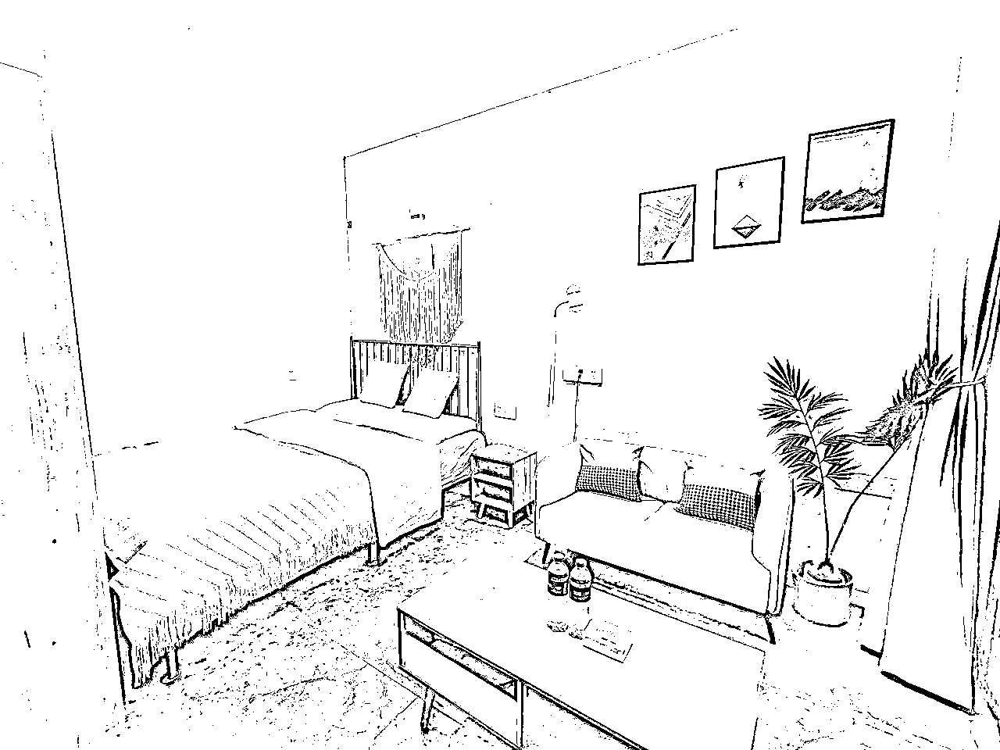
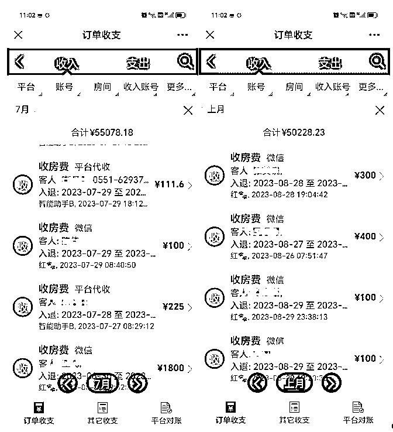
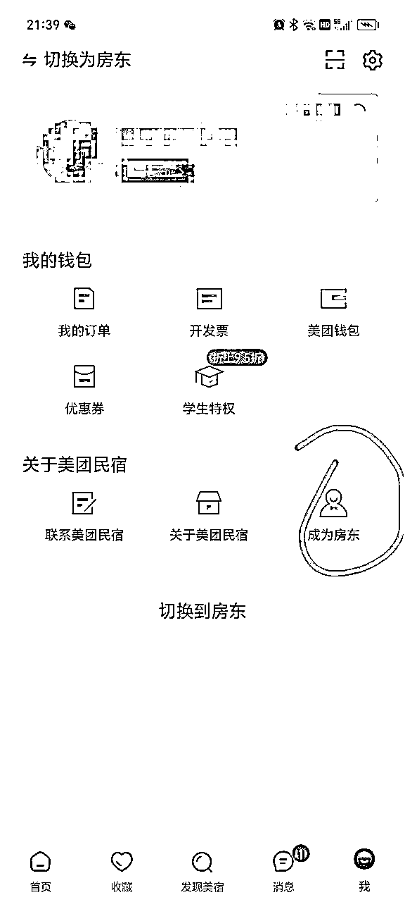
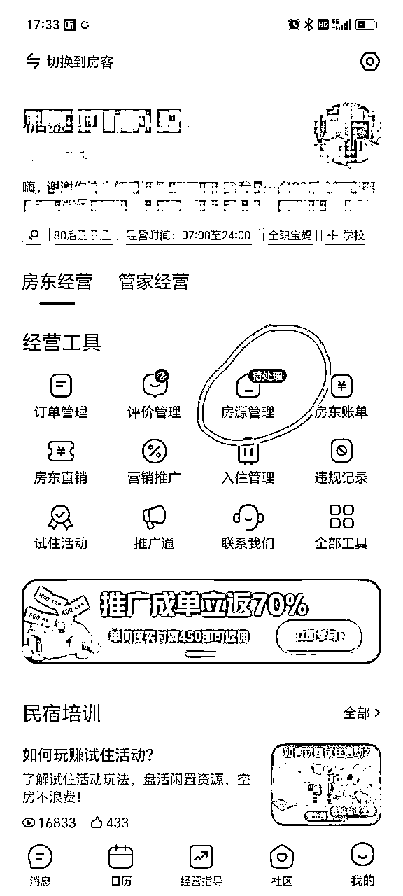
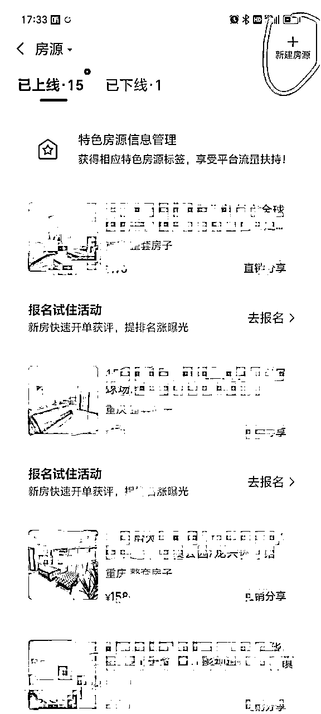
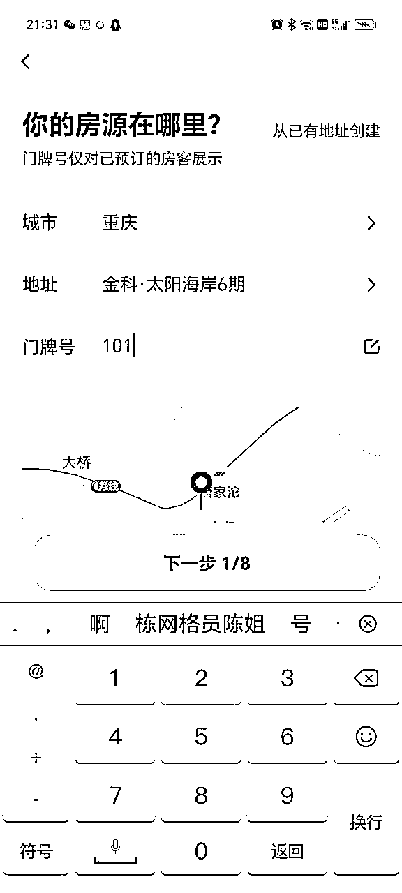
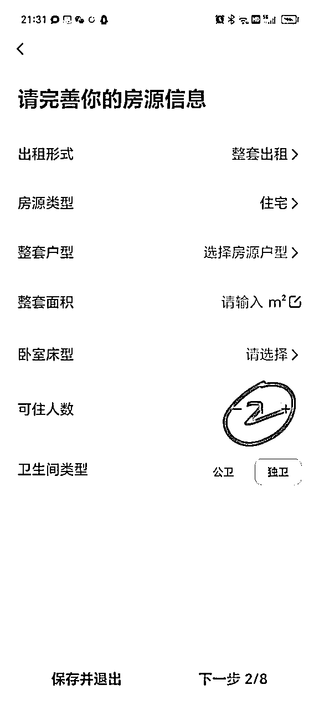
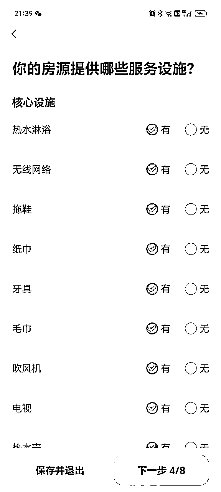

# 全职宝妈在重庆做民宿从0收入到月入3w+的经历分享

> 来源：[https://fwsgkdbb3og.feishu.cn/docx/VF75dim8AoRcaKxq9fGceh90nyg](https://fwsgkdbb3og.feishu.cn/docx/VF75dim8AoRcaKxq9fGceh90nyg)

大家好，我是糖糖家，一名全职宝妈，坐标重庆。2022年4月加入生财，潜水了一年，今年初才开始活跃，参加了线下生财聚会。我的学历比较低，星球里面很多项目我都整不明白，看到星球里各位大佬的精华帖，动辄月入几万，几十万，我是万分焦虑又兴奋的。

跟着航海跑过几期，也尝试了一些项目，但是都没有大的结果，心里说不气馁那肯定是假的。后来链接上生财最懂二手书的男人老瞿Qu， 本想跟着他去做闲鱼二手书，因为平时除了打理民宿，我还有挺多空闲时间，想再利用下。

但老瞿Qu却问为什么要去硬切不熟悉的赛道呢？既然你做民宿两三年了，也有稳定的收入，为什么不持续在这条赛道上面深耕下去，然后进行放大呢？比如做小红书给民宿引流等等。

我的回答是：第一，民宿日常大多是满房状态（入住率能达到90%以上）不用引流，我老客户维护这块做得还是不错的。第二，主要是我觉得生财里都是各种高大上的高科技项目，我这种低门槛的民宿真的太low了。

这回答把老瞿Qu给整无语了，似乎有点凡尔赛了，但冤枉啊，我真没有好嘛。

分享让经历更有价值，在老瞿Qu 的鼓励下，今天我鼓起勇气来浅浅分享一下我的经验，大家不要笑话我哈，多给我提提建议呀，在此万分感谢。

### 一、我为什么选择做民宿？

2021年之前我都是手心朝上的宝妈，老公工资只有7-8K，每个月我只有3000左右的生活费家用，生活很是拮据。有时我也会出去打打零工补贴家用，其实做民宿前，也做过其他副业。

比如因为我儿子特别喜欢面食，我就在网上报班学了果蔬卡通包，一是做给儿子吃，二是可以建小区社群进行售卖。做了三个月吧，实在太累了，挣的也不多，反而因为长时间低头颈椎病特别严重，最后不得不放弃了。

后来机缘巧合下开始做民宿，因为我朋友聊天时说，她的一个朋友有一间日租房，一个月能赚2500左右，这是她朋友自己的房子。我一算觉得比卖果蔬卡通包轻松多了，我租房的话一间房除掉成本大概能盈利1K+，那如果有3-5间，每月收入就能有4-6K。当时我做卡通包，累死累活一个月才2000多。

我决定做民宿的初衷也就是两点，一是时间自由，可以边赚钱边带娃。二是投入小，风险可控。

我做的是小区民宿，之前是没有办证的。2年半时间，从刚开始的3间房，扩到现在15间房，月利润从几百到现在3W+，其中付出的汗水不可谓不多。

（上个月拿的一套单配，房租+押金+软装一共9000左右）

刚开始也没有人带我，什么都是靠自己摸索，走了很多弯路，踩过很多坑。刚开始生意也不好，经常是哄睡孩子后，我还要上网学习经营技巧常常，到一两点才能休息。那时候我老公在外地工作，一个月就回家一两次，所以民宿也好，家里面也好，都没有办法为我分担。

我有严重的颈椎病和腰椎病，忙的时候累得腰都直不起来，晚上贴张膏药，第二天我又会活力满满的继续投入工作。有时候凌晨两三点预订了房间的客人找不到路，即使大冬天我也要从温暖的被窝爬起来去带路；由于租的房子比较老旧，电器经常会故障，或者客人不会使用，我也需要上门去解决各种bug。

虽然每天都很忙，但我内心却是开心的，因为我自己有收入了，而且既能带娃又能赚钱。下面是暑假两个月的营业额，7月有5万5左右，8月有5万左右，扣除1万多的房租等各项成本，利润稳定在3W+。因为我这个位置属于重庆郊区，没有旅游资源，旁边大学也放假了，所以寒暑假是淡季，价格反而要低一些。

### 二、如何从0到1开始做民宿？

下面我就从选址租房到装修装饰，从推广引流到经营管理开始聊一聊如何从0到1开始做民宿，希望能够帮到跟我一样在家带娃又想有一份收入的宝妈们。

1、和你传统理解的民宿有啥区别？

一般大家理解的传统民宿，都是在大理洱海旁边，租一栋房子，装修的古色古香，然后专业的去打理运营。这种民宿前期投资很大，动辄几十万上百万，其实卖的就是情怀。

而我现在做的这种民宿属于轻资产创业，更相当于是一个二房东，做日租和短租的，风险低、投入小、具备可持续发展性，能打造长期被动收入管道，并且可当主业，也可当副业。

根据住建部公布的官方数据，中国目前有将近6亿栋城乡房屋建筑，注意，是栋不是套。其中商品房、民用住宅保守估计4亿，可供28.2亿人口居住。在如此巨大的房源体量面前，对于包租行业做二房东来说，是一片空前绝后的蓝海市场。任何一个普通人都能够有“借房赚钱”的机会，适合所有普通人创业。

2、前期投入多少？

一开始我只租了3套房，都是建面35平左右的单身公寓，3套房前期一共投了3万左右，包含租金、押金和软装。刚开始上手的小白，建议从一套房子开始练手，从0-1跑通后，再进行复制就行。

这里提一点啊，小白不建议一上来就拿毛坯房练手，投入大，回本周期较长，相对来说风险就增大了。小白从简装或精装房入手比较合适。

3、要办证吗？

能不能办证应该是很多人第一个想到的问题。我做的是小区民宿，一开始是没有办证的。目前不办证也可以在美团、途家、携程等平台售卖。如果要上抖音或者小红书，就需要办证了。上携程比较麻烦一点，需要同一地点有5套房源以上，所以建议刚开始的小白先上美团、途家这样的民宿平台，一套房源也行。

上个月我链接到一个同行，告诉了一个擦边的方法， 就是在原有的营业执照上加了住宿的项目，现在可以上小红书了。所以，要不要办证就看自己选择什么平台了。目前国家没有强制要求哈。也有不办证小红书引流的方法，后面我们再讲。

4、如何选址？

4.1、任何线下生意，选址都是很重要的一环

每个城市都有网红打卡地，比如重庆的解放碑洪崖洞、成都的春熙路等，虽然流量很大，但是租金也高，租金高投入成本就高了，一旦遇到像疫情这样的天灾人祸，压力就会很大了。三年疫情，重庆解放碑、观音桥等就有一大批民宿倒闭。而且这种地点竞争也是非常激烈的，所以刚开始的小白不建议碰哈，自有房除外。

对于刚开始尝试民宿的朋友来说，首选家附近5公里内的房源。因为刚开始还没有稳定收入的时候，最好是近一点方便自己打理自己清洁，尽量减少投入。而且民宿经营中会遇到这样那样的小问题，需要我们去为客人解决，住得远自然不方便，当然，如果有请管家管理的除外。

4.2、选址有几个参考点

比如附近有大学、工厂、商圈、医院、写字楼、旅游景点等。我的客源主要就是靠旁边一个大学和周边工厂，因为没有商圈和景点，所以寒暑假我们反而就是淡季了，会进行适当降价或者月租等引流方式，以保证入住率。

5、如何选择房源？

5.1、选房的主要参考因素

拿房尽量选择装修较新一些、家具家电齐全的房源，相对环境好，交通便利，客人入住体验会更好。老旧房源虽然房租会便宜一些，但脏乱差，就容易收到客人差评。当然，这也不是绝对的，老旧小区也要参考其他方面有没有优势，比如，离地铁更近，购物吃饭更方便等，能拿到公寓就更好了。

房态也是需要特别注意的，比如有的房东的房子是改装过，把建面35平的单身公寓硬生生改成了一室一厅，甚至还有改成两室一厅的，卧室只能勉强放下一张小床，有的卧室还没有窗户，通风采光都很差。这样的房源，客人住进去会觉得非常压抑。

再一点就是，选房时要选装修清爽的，那种花里胡哨的电视背景墙，特别是老一辈喜欢的那种“花好月圆”“青松迎客”类型的，改起来特费劲。也尽量不要选墙布墙纸装修的房源。因为脏了旧了不方便翻新，就选乳胶漆的墙面，哪里脏了破了，买一点材料自己就修补了。

做民宿之前这方面我是啥也不会的宝妈，做民宿2年多，墙漆也会刷了，桌子椅子也会组装了，东西坏了我也会简单修理了，房间里很多装饰品都是我自己手工做的，反正就是能自己干的绝不花钱请人，能省则省。我经常笑说我已经进化成了超级全能王宝妈啦，哈哈哈。

5.2、租房合同怎样签？签多久？

首先，租房时要和房东讲清楚，租房用途是民宿，所以合同里有一条“不得转租”要删除掉。另外，做民宿需要长租，问他月租价格有多少优惠。

有的房东不愿意租给做民宿的，担心人员复杂，有安全问题，可以告诉他，我们民宿是有在派出所登记的，派出所也要求每个入住的客人都要提供身份证正面照登记的。

而且房子租给我您可以放心，因为我们是定期清洁的，房子有什么问题我们是第一时间解决。也不会养猫养狗，把您的房子搞得乱七八糟。

如果租约到期，我们也会恢复原貌，当然，适当磨损折旧属于正常范围的。由于我们是长租还能保证房东没有空置期，又省心又放心。这样谈大多房东都会同意的。我的一个房东大姐就给我介绍了好几套优质房源。

其次，合同签的年限至少3年，能签5-10年更好，因为民宿是需要布置翻新的，如果只签一年，投入进去的钱刚回本，房东说要收回或者涨租金，那不是白忙活了嘛。如果精装修的房源，价格有优势，房态较好，不需要投入太多，签一年也是可以的。

5.3、选几室的房源

我的房间基本上都是单身公寓，只有一套是两室的。因为我这是小情侣比较多，单配会更有市场。如果是旅游打卡地就需要套房为主了，这个还得根据用户群体决定的。

6、民宿必备清单

*   密码锁

建议买通通锁系列，我对比使用后觉得这个小程序比较好用哈，生成的限时密码较短。拼夕夕，淘宝上搜通通锁，100多-1000多的都有。之前我买的密码锁就不好用，生成的限时密码12位，经常有客人抱怨太长，还没输入完就提示开锁失败。有一次客人急着上厕所，反复多次打不开锁，憋得不行，我只能把常用密码发给她了。非常影响入住体验。

*   四件套

我用的宾馆专用纯白色的，可以用84漂白并消毒，如果是其他颜色四件套就要买单独的消毒用品了。

*   装饰品、摆件等，选择物美价廉的小装饰

*   浴巾、毛巾

*   一次性牙刷、一次性拖鞋、凉拖鞋

*   消毒品

*   吹风机、烧水壶、共享充电线、计生用品

*   洗发水、沐浴露、纸巾等消耗品

*   瓶装水，美团优选、多多买菜上面冰露，冰点水都很便宜，每套房间按人数放上瓶装水，一定要放瓶装水。

7、民宿如何销售和运营？

民宿售卖平台流量比较大的有携程、美团、途家，其次还有小猪、木鸟等。我常用前三个，后两个已经下架了，因为这两个平台属于平时生意淡时一个单都没有，节假日难得又冒一个订单出来。

美团和途家对房间数量没有什么要求，一个房源都能上，有房产证或者租房合同就成，房源位置也可根据实际位置上传，很灵活。

携程要求就要高一些了，需要租房合同或者营业执照，并且要求是同地点5间房源以上，因为携程主打酒店，所有房源只能有一个地址。但是携程毕竟算头部了，流量还是很大的。

携程有一点不太友好，就是很多客人习惯了酒店宾馆的标准化，下完单发现是小区民宿，害怕清洁不到位，很容易取消订单。而美团和途家的客人心理预期没这么高，就很少有这种情况发生。

一开始我的订单70%来自美团，现在30-40%来自携程，40%来自回头客，剩下的来自美团和途家。

下面以美团民宿为例，上传房源信息的步骤：

1.下载“美团民宿”APP

2.选择“成为房东”

3.我的-房源管理

4.新建房源

5.按步骤添加房源地址等信息

6.上传多角度房源图片，卧室、厨房、卫生间等

7.发布房源

8.等待审核通过后就可以设置新房特惠等优惠活动啦

7.1、新房源如何获取平台流量

新房源尽量多参加平台活动，比如新房特惠、今夜特价、早鸟优惠等，因为每一个活动就是一个流量入口，新房源在没有订单数据时，最好的方式就是参加活动获取流量推荐。先把数据做起来了，排名靠前了，客人更容易搜索到，曝光量上来，平台自然会给流量。

7.2、价格如何设置

参考同一区域的同行价格，像五一、十一黄金周可以多关注同行订房情况，如果节假日同行的房源预定光了，那恭喜你赚钱机会来了，立刻调高价格了，节假日房间是不愁卖的。

8、房客接待流程？

来订单后一定主动联系客人，加微信，让他提供身份证正面照和联系方式，就说是派出所要求的实名登记，都会配合的。实在不配合发照片的，可以用平台的入住管理登记，或者亲自上门登记。这是为了保护我们自身权益，一旦出现问题，派出所查起来，能拿得出入住记录。加客人微信还有个好处就是给私域导流，以后还可以考虑多元化变现。

加了微信发房间定位和入住密码给客人，并附上入住注意事项。比如退房时间，退房时关门关空调等。

9、多平台如何一键管理？

我目前用的是宝寓，微信小程序上面搜索“宝寓”，注册登录，可以把所有平台绑定上去，后面一个平台有订单，宝寓会自动关闭其他平台上的房源，不用手动一个平台一个平台地关房，避免造成超售房源，容易受到平台罚款。市面上还有很多，比如百居易，哪个用得顺手用哪个，大同小异吧

平台定价可以参考同行，上美团、途家搜周边的民宿就行。总之一点就是，不要打价格战，可以拼服务，我就是靠真诚服务留住了一大批老顾客。刚开始我只拿了3间单间，先练练手，全部是大床房，因为大多是小情侣。后来慢慢有出差的顾客，去年问标间的客人多了，我新租的房源就做了双床，满足住客多种需求。两室的平时生意较差，寒暑假还可以，如果是旅游景点附近，就建议多拿两室三室的套房，因为假期旅游一般都是多人出行。从最开始月入1000左右，到现在月入2W+，我用了年半。一路摸爬滚打，从不会到熟练，这需要时间去实践，我相信只要踏实用心，就会越来越好的。

### 三、民宿经营过程中踩过的坑

刚开始，我一味地为了省钱，买的沙发、茶几等质量很差，没用几个月就缺胳膊少腿儿了，只能重新买，真是省小钱花大钱。可以去二手市场淘品质较好的家居物品，也能省钱。

其次床品不要买深色的，第一拍照不好看，第二经常洗很容易掉色。我刚开始想着深色床单耐脏，结果用了几个月就掉色了，看起来很陈旧，客人说没有清洗床品，要求退房，这就很郁闷了。

最重要的是：一定要经常关注各平台房态房量，以免重单。我有一次就重单了，客人来了没房间，被投诉至平台，导致这一单 全额退款，还被罚了当晚房费，相当于我损失当晚双倍房费，我心在滴血。

### 四、未来民宿创业准备如何规划？

之前主要是做日租短租，未来我准备扩大经营范围，将长租也做起来。虽然长租的收益相对较低，但是收益更稳定，并且是真正的睡后收入，基本不需要操心。

未来的民宿发展趋势，一是品牌连锁化，会出现一些民宿头部品牌，住客更认可品牌的服务细节和品质；

二是多元化发展，民宿和酒店相比，有家的温馨感觉，更多了一份情怀。我们可以鼓励房客在旅途中亲手做一份早餐，包一顿饺子等，房客融入了自身情感，那是不是容易产生分享朋友圈行为，这就有了社交流量。

三是集群化发展，也就是区域抱团式发展。比如解放杯“日月光小区”，里面70%都是做民宿的，真正业主只有不到30%。还有像有的旅游村庄，做成集体民宿经营。

近期的目标是先成为拥有100套房源的包租婆，同步我正计划在小红书、抖音等平台上做个人IP，真正拥抱短视频，用好新媒体这一助力，效果应该能放大N倍，我已经在期待月入10W,20W啦，星星眼，哈哈哈哈哈哈

期待各位圈友，2023年我们一起生财有术，也欢迎做民宿的朋友一起多多交流，圈友们一起做大做强。