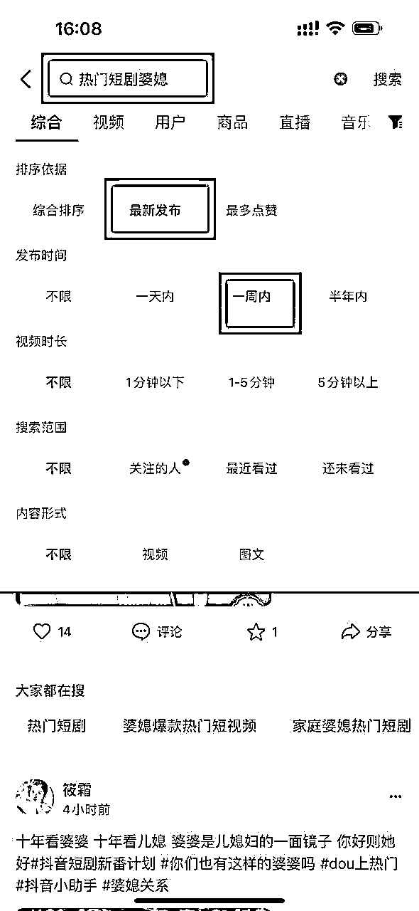
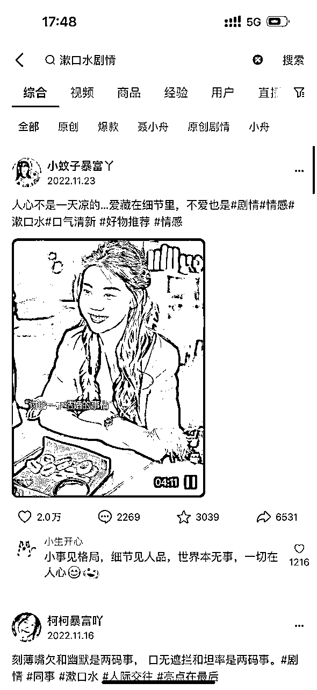
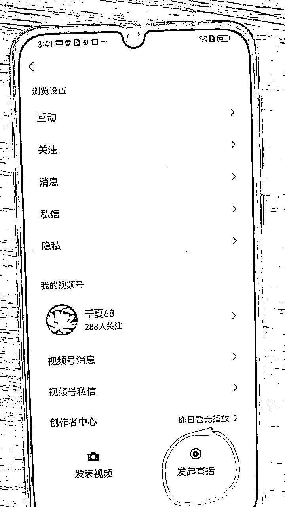
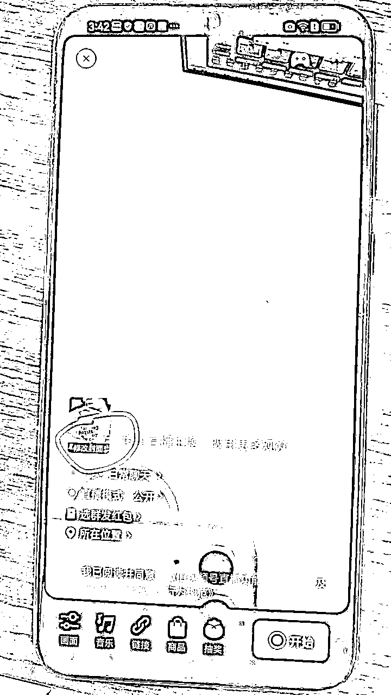
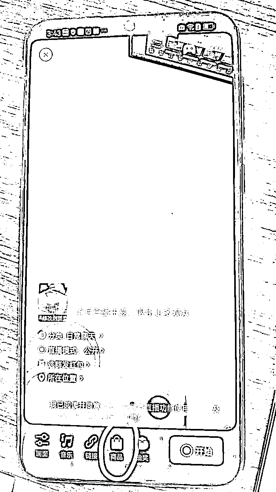
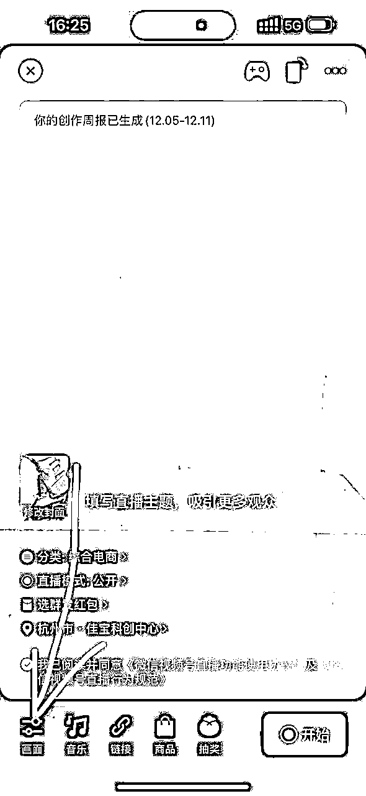
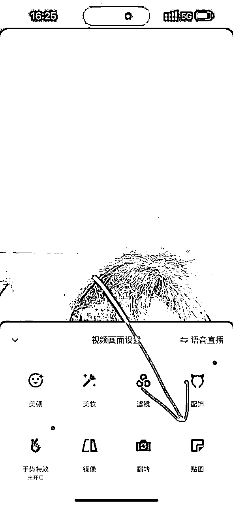

# 《视频号航海：如何内容变现》

> 来源：[https://k4h4dcpi91.feishu.cn/docx/VlR0dRPw1onLDCxevL5cbaWTnph](https://k4h4dcpi91.feishu.cn/docx/VlR0dRPw1onLDCxevL5cbaWTnph)

大家好，我是李百万，在生财经历 0～1，1～10。感谢生财。

视频号 6 月单月 51w➕，12w 收益。在视频号持续深耕 8 个月取得了理想成绩。

很高兴认识大家，曾经我也是新手，深知新手的痛，没有系统玩法，没有人带迷茫。。。

我来根据自己的实操经验给大家分享我的方法和历程。希望对大家有所帮助。

本文开始前，必须要感谢生财官方的小霸王和肉松小姐姐的指导帮助，还有生财圈友也是好友达达，小刀的支持以及靠谱姐，芷蓝姐，理白哥和比比背后这一路成长的鼓励与帮助。在生财遇到更多的朋友帮助，也在生财经历 0～1，1～10。真心感谢生财。

* * *

话不多说，正文开始。

首先想说明，视频号带货这个项目，最最重要的还是选品，

另外，生财的这篇选品攻略也帮助了我扩展选品思维，大家可以等分享结束后来看看：https://search01.shengcaiyoushu.com/docx/doxcnWV9yAMFfoCGuaT2wvmWGBf

我之前也总结了一些自己的选品方式，大家也可以参考《视频号 6 月单月 12w＋》：https://t.zsxq.com/11YdPqF3l

选品方法大家分享过很多，我就不再重复说明了，我来主要讲后续的视频内容准备和直播变现，我是怎么做的。

## 实战篇

### 第一步：玩法及对应素材

当我们有了产品，该如何去通过内容获取流量打开转化？我自己是会准备三种内容，这三种内容的玩法不太一样，但是整体流程是一致的，即发布视频内容后，根据流量情况决定是否开直播承接流量，在直播中引导下单。

三种内容的玩法分别是：

#### 1.百货带货视频获取流量

即短视频展示产品获取流量，直播卖货承接流量。

这也是最适合大家的玩法，家居百货服装美食新奇特等等都可以。核心是内容，七分靠封面，三分靠视频脚本框架。所谓的框架是前三秒和内容的种草性，虽然不需要多强的人货场，平播即可，但很考验耐心。具体步骤航海手册中有详细的讲解。

#### 2\. 狗血短剧获取流量

这个玩法就是用抖音短剧获取流量，再通过直播卖货承接流量。但是有两个注意点：

但选品上具有局限性，仅适合类似 9.9 的低价爆款产品，视频号的用户进了直播间后会因为低价而产生购买需求

而且也考验我们挑选视频能力，因为视频号上中老年用户居多，建议大家选婆媳关系一类视频，而且优先挑选近期短剧，因为被别人搬过的很容易没流量。

如何选择短剧？

抖音&快手搜索栏搜索：热门短剧，热门剧情，自己剪辑发视频号。

也可以用和产品相关的关键词去搜索，比如我搜漱口水剧情：

还有更多的剧情品类可以参考：

漱口水剧情、牙膏剧情、七子粉面膜剧情、冻干粉面膜剧情、内裤洗衣液剧情、留香珠剧情、大运河肥皂剧情、毛巾剧情、一次性保鲜膜套剧情、洗碗抹布剧情、洗碗毛巾剧情、厨房湿巾剧情、男士手工皂剧情、香薰片，香蜡片剧情、一次性手套剧情、鞋子除臭喷雾剂剧情、沐浴露剧情、喷雾身体乳剧情、垃圾袋剧情、眼影棒剧情、鞋油五件套剧情、油污净剧情

水果奶盖沙琪玛剧情、酸汤面叶剧情、五黑沙琪玛剧情、牛奶燕麦酥剧情、红糖姜枣茶剧情、阿尔卑斯巧禾棒剧情、干吃面剧情、酸辣粉剧情、鱿鱼爱上虾剧情、玉米酥剧情、小麻花剧情、山药脆片剧情、榴莲酥剧情、冰糖金桔千剧情

这里也给大家推荐一些零食剧情原创对标账号：

佳佳油甄选、小花妞、明欣电商、阳哥电子商务、古古达电商、熊一君、贫穷玩家、碧姐百货、林有志、燕儿电子商务、泊洋心选、鑫源电子商务、放牛姐电子商务、脆美人、老谭先生、慕柄商贸店、穆梵心选、小发哥、宇泽百货、兵哥哥吖、欧阳电子商务、春美婆媳电商、兴兴优选、海达电商、E 哥严选、冷小七、盯当侠、俞顺六、鑫阳文化传媒、王二帅优选、人生如戏、星哥哥（即将选、朵朵优选鸡、梦达萍姐、明嘴电子亲妈、贾嘻嘻爱吃零食 等等。

#### 3\. 精准带货视频

这个和百货带货类视频不同的是，他账号带货的品类非常的垂直，品类少，但是可以找客单价为中腰部的产品，单品利润较高，标题直指痛点，流量很高。比如养生类炖养生茶视频：

可参考对标账号：忆膳堂，木膳食语，汤汤煲汤，粤先森广东靓汤等（对标以上账号简单粗暴的种草内容形式）

养生类的内容如何收集：抖音搜索滋补煲汤的近七天视频，下载被转发少的，做好去重后发布。（临近秋季，推荐大家找适合秋季的滋补汤包，例如竹蔗茅根雪梨茶，五指毛桃茯苓茶等）

还有书籍类视频的赛道，其中的家庭关系类，中国人情世故类，厚黑学类，流量都很好。

可参考对标账号：醒悟书摘，清晨每日阅读，柒月读书 3，柒月读书 等

书籍类内容如何收集：抖音搜索家庭教育，自我提升，个人成长，历史人物等话题标签会有大量视频，同上去重发布到视频号即可。

清晨每日阅读这个账号的形式大家可以学习，他是前三秒图片加痛点文字模板留人，后面书籍实拍，不同于完全混剪，更为持久。

具体的品大家可以参考蝉妈妈或者考古加进行选品。

### 第二步：素材去重

这步的目的是需要将下载下来的素材进行去重操作，避免和别人的一样造成重复。

去重剪辑工具我们一般用剪映就可以，直接电脑剪也可以手机剪，推荐电脑，效率高一些；导入素材后，我们具体需要做：

以下为我用手机版剪映去重的步骤：

#### 1.导入去完水印的视频素材

#### 2.对视频进行掐头去尾（删除原素材视频的开头和结尾）

#### 3.更改素材的原画面比例

直接用双指放大一点屏幕即可

#### 4.为视频素材添加贴纸

贴纸最好四个角都用上

#### 5.为视频添加合适的滤镜

#### 6.调整视频声音的音频，更改视频的音色

#### 7.调节视频画面的颜色

#### 8.为视频添加合适的特效

以下为电脑版剪映的步骤教学：

### 第三步：直播带货

开播标准

第一个视频发布后达到 200 播放补充第二条，两条累计达到 1000 播放补充第三条后开播，来开播后视频任意一条达到 1 万播放再补充一条，任意一条达到 2 万播放再补充，而后 5 万播放，10 万播放相继补充。

苹果手机可以一边播一边发，在直播过程中，右上角最小化直播间，然后回到视频号主页发表视频（这个过程尽量快点），发完视频后，立即回到直播间状态。

如果是用安卓手机直播，由于中途没法一边播一边直接发，需要提前把视频保存到草稿箱（建议至少保存 10 条），然后在直播过程中，右上角最小化后，进入草稿箱发视频，或者先可以用电脑，登陆视频号创作助手，在手机直播的过程中，用电脑进行素材的补发。

直播形式：最好是视频直播，可以买一个转台，把产品放在上面直播，如果是用贴纸展示产品，贴纸不要挡住脸，且贴纸不要太大。

开播 1 小时内流量不会起的那么快，所以不用着急，一方面看看自己视频爆没爆，没爆的话，根据数据标准持续补视频，如果实在跑不到数据标准了，也可以直接补素材。

直播步骤：

#### 1.进入视频号，点击开始直播

#### 2.修改封面

封面最好是你要卖的产品，这样大家从直播广场进来的时候，就知道你是干嘛的

#### 3.直播间上商品

点击【商品】，将直播要卖的商品添加即可（推荐大家走单品打爆逻辑，新手不适合多品）

直播贴纸

如果没有产品的话，也不要担心，我们可以用贴纸当作产品进行展示

注意贴纸不要太大！不要挡住脸，不然封号概率会大大提升。

#### 4.直播分类

选择日常聊天和购物都可以

#### 5.直播话术

百货的话术一般比较简单，主要用低客单价引流购买，然后简单讲下产品的作用即可

直播话术参考：

欢迎各位新进入直播间的朋友们，大家晚上好，给大家讲解下我们的 xx

咱们这款 xx 是真的非常好用哈，不仅能够 xxx，还能 xxx（这段主要根据产品，简单讲下产品的作用，以及适用的场景）

今天是咱们新直播间开播哈，原价 xxx，现价 xxx，数量不多，先到先得，喜欢的哥哥姐姐们赶紧去拍哈，赶紧去拍，如果买回去之后发现用的不顺手怎么办？没关系，到时候直接联系咱们的客服进行退款就可以哈，大家可以放心购买

拍了的各位哥哥姐姐们，一定要回来给我打一个已拍加急，我这边帮您备注，帮您加急发货哈

精准带货的视频，需要更多的了解产品，不过更多的也是引导下单动作，因为进直播间的用户都是看了视频内容来的，对产品有一定的了解和感兴趣。

#### 6.正式开播后需要注意

##### 讲解商品

点击直播间下方的购物车，看到商品后，点击【讲解】

##### 状态检查

开播后，需要自己拿小号到自己直播间检查，看看声音是否卡顿、清晰，检查商品是否挂上了链接

开播后放宽心态，放心播就好啦，不用太担心，做好购买引导就可以

开播后视频可以半个小时候才会把流量拉起来，所以耐心等待一下，不用太着急