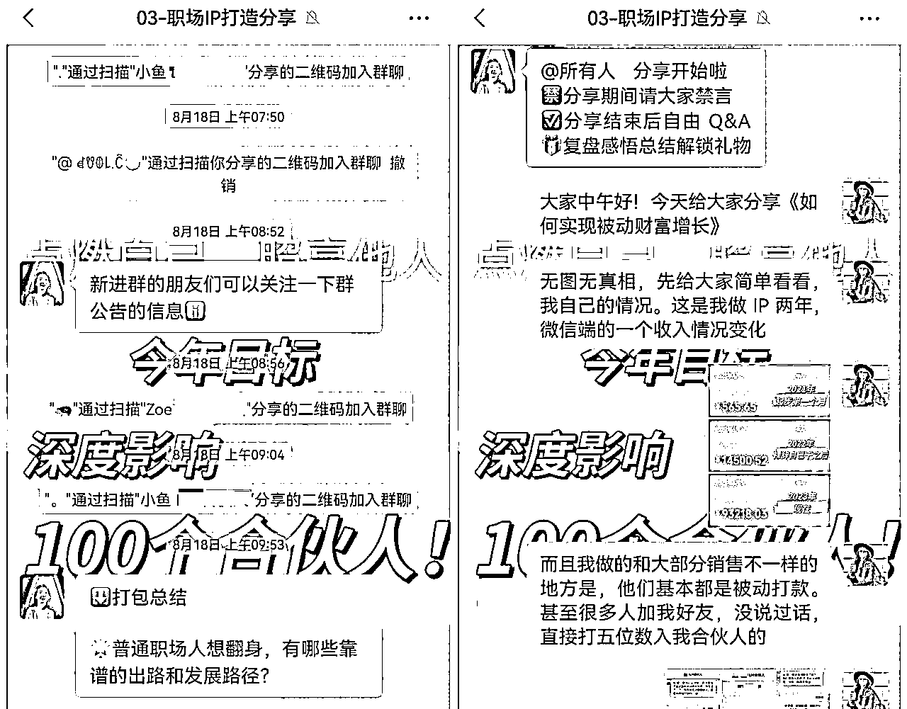
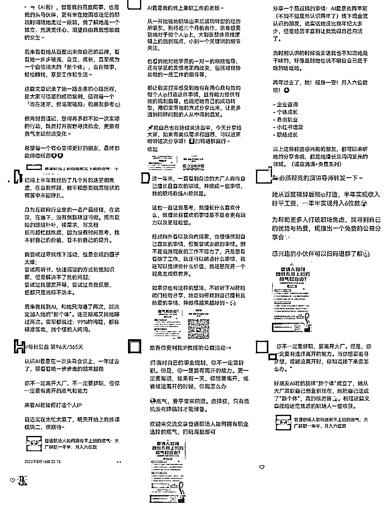

# 职场IP品牌活动，四天收入近8w，普通职场人如何通过IP+内容+活动突破职场天花板

> 来源：[https://j7329dxmbu.feishu.cn/docx/W7nudn38IoxRuyxz1tpcrJOZnnd](https://j7329dxmbu.feishu.cn/docx/W7nudn38IoxRuyxz1tpcrJOZnnd)

大家好，我是赵立心（原名AI君），95后，前大厂产品经理，做个人IP两年，辞职一年半，月入六位数，目前是一名职场个人IP孵化教练。

这几个月，我通过两场品牌活动，靠着3000私域好友+1000粉公众号，以及一些甚至自己都没有粉丝量的普通职场人帮我转介绍，做到了四天收入差不多8w。

我们的基底其实很少，去掉重复的和自己人，实际有效人数，线下活动30多人，线上几个群400多人而已，但靠着精准人群和强转化能力，我们转化了6个1w+的合伙人产品，和一批几百块钱的会员产品。

这群人中，有差不多一半的人，都是我的学员、合伙人们拉来的，报名的人数也有三分之一是他们介绍来的。

里面出现了神奇的四级转化（我拉了A，A拉了B，B拉了C，C拉了报名者）。以及，一个陌生人看了我朋友的推荐来听分享，当场直接打了五位数入我合伙人，而我朋友压根都不熟这个人。

而这几次的活动我都在复用同样的逻辑，也往往能够获得差不多的结果。这些都让我感知到，这个事儿是可以有效复制给大家去做的。

普通人其实就是没那么大的号召力和流量池的，但是只要能把自己这块的设计做好，做一个垂直IP，自己来打造势能，一样可以有还不错的成绩。

这篇文章就想和大家详细分享一下《普通职场人，如何通过打造IP+举办品牌活动的玩法，实现日入3w》，具体包括——

1、职场人如何突破收入瓶颈和道路狭窄的问题？职场IP必须要打通的三个重要环节

2、如何通过做事+做势放大自己的影响力和收入？IP日常储蓄势能与IP品牌活动释放势能

3、如何低成本做一场低流量高转化的IP品牌活动？一套从整体规划、人员调度、内容准备到现场应对的SOP

4、大型运营活动操盘，容易出现哪些问题？如何调整心态，从容过关？

# 一、对于普通职场人，收入瓶颈、道路狭窄，如何破局？

## 1、普通职场人的两大瓶颈

普通职场人，想转型跳槽的不在少数。但他们往往面临两个非常突出又实际的问题。

第一，职场晋升和跳槽的涨薪通道收紧，收入增长困难。

前几年的时候，跳槽涨薪30%很常见，但现在各家名额都在收紧，想换工作都并不容易，就别提高额涨薪了。

职场内部通道也是一样，每年的窗口能够成功晋升的人越来越少，积压的人却越来越多，晋升的激烈程度逐年增加。

指望普调和年终奖金，基本上更是不可能有什么突破。

很多人想通过副业解决困境，但已经被上班榨干，时间精力不足无法有效探索和执行，也没有明确的方向和道路可以去做，两边受困。

第二，对于收入、工作情况、职业方向不满意，但转型困难。

职场分工日益细化，螺丝钉化。别说想转行业，转去同一行业的其他业务都非常难。

发展路径慢慢被缩小再缩小，每个人只懂自己的那一点东西，也只能做那一点东西，好像感觉自己一辈子都只能做这一件事。

对于现状不满意，想跳槽，但别人宁可要应届白纸也不愿意要有多年其他行业经验的人，更别提，和小自己那么多岁的人同一起跑线从头开始的心理压力。

想做新的项目，但是时间精力不足，商业思维和执行力也不到位，总是不知道从哪里开始入手，找不到方向。

这些都是我在做职场IP孵化过程中，看到的大家的共性问题。如果你也有，很正常，不用着急。它是有办法可以破解的。下面就个大家详细讲讲。

## 2、破局需要打通的三个重要环节

先说结论：

① 普通职场人被困住的核心原因，不是能力问题，而是方向不对，发展链路有严重缺失，导致完全失去主动选择的权利

② 想真正获得职业选择的底气和自由，一定要能够同时做到三件事：能独立闭环，拥有人脉自由，有非线性增长渠道

什么样的人，能挣很多钱，还各家抢着要、不缺工作？一定是有稀缺价值的人。

这个价值可能是过硬的技能，可能是稀缺的人脉和资源。

有些技能容易和某些行业强绑定，一旦行业完蛋，或者技术更迭，你也就失去了选择权。典型的比如互联网大厂的程序员。曾经非常高薪请来的人，现在也会面临失业危机。

但有些技能是什么时代都需要的常青树，比如销售技能，比如商业决策能力，比如沟通表达技能。人脉和资源，也同样是这类不会过时的东西。

在职场上，我们大部分时候发展的是这种被强绑定的专业技能，这样的发展路径，就会导致你非常依赖行业、公司，丧失主动权。

所以， 如果想真正获得职业选择的底气和自由，一定要能够同时做到以下三件事情——

#### 第一，有做闭环的能力

如果面对职场，你始终有planB，那么你就不会再怕上面的任何事情。

一旦觉得现在的职场环境不满意，你可以随时脱离和转换。

比如你现在是一名互联网产品经理，做的是支付业务。那么下一份工作，你大概率还是只能找个其他产品的支付产品经理做。

但如果你现在同时是一名运动健康方向的IP。那意味着你多了很多选项。

你可以做一个运动健康课程来赚钱，你可以通过带货来赚钱，你可以转型到一些做运动健康、但想卖货的品牌去上班。

甚至，如果你做的好，你可以去当内容编导，当私域操盘手，当销售。今天没有任何一个行业离得开这些东西。

相对于固化在支付产品经理一个小领域，你就有了更多的空间和选择权。

因为前者，你只提供了技能的价值，你能做这条链路上很小的一环。而后者，你有自己实现闭环的能力，你能给公司带来流量，带来资源，带来实际的收入提升。这是选择权的底气来源。

#### 第二，有人脉和资源的自由

高价值信息和机会，最后一定是藏在社交关系里的。

你如果直接去一家公司面试，人力和面试官会按照条条框框来卡你。

但如果你认识公司高层，对方对你的能力认可，他想要你，那么这些东西全都不再重要。

如果你认识很多这种高层，你的路，就彻底自由了。

那怎么能够突破职场的一亩三分地，让那些牛人看到你、认可你？

需要在价值的基础上，构建自己的知名度。越多的人知道和认可你在某一领域的价值，你能获得的资源和机会就越多。

这件事儿其实就是IP打造的逻辑。一个专长+影响力拓展。

#### 第三，有非线性增长的可能性

在职场上班，你干一天活，就有一天的工资。薪资的增长靠缓慢的晋升和熬资历，非常线性。

如果你能通过自己给自己“提咖”“造势”，突破这个模式，你的天花板也就被打开了。

比如，你写了一本书，做了一门课，这个东西可以不断被人购买，你就能够源源不断获得收入。

再比如，你做了一件很牛的事，它可以不断被人传播提起，你就能够源源不断获得新的资源和人脉。

对于普通人来说，办活动，写内容，都是非常低成本又普适的方式。你完全可以在职的同时来做，它们又可以放在那儿持续不断的被看到，只需要你付出一次的时间成本。

基于这三点，IP+内容+活动是一套非常好的普通职场人破局方式，我也在帮我的很多合伙人们，通过这种方式来打破天花板。

比如小T，本来做的人力资源方向，后来做了英语方向的IP，现在转型到了英语机构做教师。

比如小H，本来做的是互联网产品经理，后来通过视频号接业务，现在已经是很多家机构的讲师，副业收入也足以养活自己。

不管你是想换行业，还是不上班拿收入，用这种方式，通常都会是风险更小、性价比更高的。

# 二、如何通过做事+做势放大自己的影响力和收入？

做IP，是典型的以慢打快。每一次做事情做动作，都是在慢慢建立自己的IP，中间急不得。

但是做IP，又不纯粹只是个靠时间积累的活儿。它的发展可以指数型增长。

当你的IP达到一定阶段之后，可以通过做势能做大事件，促进量变到质变的转变，提升它的增长速率。

做事+做势，双管齐下，就可以又稳又快的，提升自己的影响力和收入，打破职场天花板。

## 1、IP的日常储蓄势能

如果把做IP类比为登山，日常的每一次做事，都是你在缓坡上一步一步向前。而定期的做势，就是集中力量，攻克一个陡坡，一次让自己的身位提升一大截。

对于你来说，日常的动作，或许不能让你一步登天，但是，每一次发内容，每一次私聊，每一次办活动，都在让你离山顶更进一步，你也知道，你是在向前走的。

IP的日常动作有五类典型，他们有不同的作用，可以分别从不同维度上，拉升我们成交变现的进度条。

|  | 认识促进 | 记忆促进 | 专业度促进 | 信任度促进 | 购买意愿促进 |
| 朋友圈/社群 | 🌟 | 🌟🌟🌟 | 🌟🌟 | 🌟🌟 | 🌟🌟 |
| 公域自媒体 | 🌟🌟🌟 | 🌟 | 🌟🌟🌟 | 🌟 | 🌟 |
| 公众号/视频号 | 🌟🌟🌟 | 🌟 | 🌟🌟🌟 | 🌟🌟 | 🌟 |
| 1v1私聊 | 🌟 | 🌟🌟 | 🌟🌟 | 🌟🌟🌟 | 🌟🌟🌟 |
| 日常活动 | 🌟🌟 | 🌟🌟 | 🌟🌟 | 🌟🌟 | 🌟🌟 |

这几类动作的重点关注点也是不一样的，下面我们依次来看看。

### 1.1 朋友圈/社群

你发个自媒体视频，别人不一定点开看。你做个活动，别人不一定参加。你去找人私聊，需要名目，需要话题，双方压力都很大。

朋友圈和社群，是所有日常动作中，最轻、触达效果最好的动作。只要在这里的人都能看到，但对方是不是看，是不是回应，都没有压力。

所以它特别适合做两件事情——

第一，也是最关键的，持续出现，让别人记得你。

对于朋友圈和社群这种场景，发内容的频率很重要，甚至某些程度来讲频率>质量。

其他动作，别人的参与成本很高，预期也会相应很高。但朋友圈和社群本来就是很轻的，聊天的，对内容密度的要求并不高。

所以在这个地方刷存在感，是对于大部分人来说，性价比最高的。

把自己的领域关键词和记忆锚点，在朋友圈定期出现，就是最好的方式。比如我的锚点“个人IP”“合伙人服务”，每天基本都会至少出现一次。

第二，展示自己的人设形象，传播理念，加固标签。

相比于干货，这些软性的东西，别人更好接受，也更容易深入人心。

但自媒体有数据指标压力，别人也对你不熟悉，往往需要更有价值感、更迎合别人的内容，没有太多空间给别人去了解你。

而朋友圈和社群，都是相对熟悉的人，沟通的距离也更近，相对来说，就更需要软性的内容。

比如我发旅游的照片，是强化我自由职业的形象。比如我发讲课分享的日常，是加深自己专业咨询师的形象。

我会说，我们要成为拥有职业选择底气和自由的“新个体”，这是我们的理念。

这些东西，会强化我做个人IP孵化，做帮职场人转型，这样的身份。

此外，这两点对于促进专业度、信任度、购买意愿，也都效果非常直接。

像我就是因为朋友圈发的多且设计感较强，所以很多人会想起我，甚至专门来看我。

### 1.2 自媒体

朋友圈和社群的场景更适合短内容和强交互，如果是过干过长的内容别人看的会没耐心。

但自媒体有较为完整的空间，给别人系统讲一个东西。它是一种你可以自己说很久，不被人打断的场景。

所以对于一个IP来说，自媒体特别适合作为干货内容的输出地，来提升别人对自己的专业度认知。

对于公域自媒体（小红书/抖音等），由于能被更多人看到的属性，它也是整个闭环中，扩大流量池，完成让别人看到我们这一动作的最主要发生地。

它适合发一些大众喜欢的话题类型。越能够戳中用户需求，越能够让别人快速建立对你的认知。

私域自媒体（公众号/视频号）大部分情况类似，但同时，因为和私域打通，主要面向群体为熟人，可以在此基础上，增加信任度提升的部分。

比如，一些自我展示和暴露，一些个人故事的讲述，会更为合适。

### 1.3 日常的1v1私聊

1v1场景的极强私密性和特殊性，都意味着私聊是最适合促进购买意愿和转化可能的场景。

但这不意味着，你就要到处给别人群发产品信息，直接上去就一通销售。

如果把从认识到成交，看作是你和一个人从相识到结婚。中间你每一次私聊都问要不要买，就和每次聊天都冲上去问你要不要和我结婚一样的效果。你想想，你会不会被吓跑。

但是如果，每一次都给对方提供价值，不管是关心对方，还是给对方帮忙解决问题。那么你们的关系就会不断推进，自然而然走到下一个阶段。

私聊的场景，更像是朋友间的对话。我们的重点应该放在，让对方放心把自己最真实的情况和问题告诉自己，不断去增进关系。

有效的购买意愿促进是，你能够让对方感受到，你能给对方解决他的问题，他找你是有效的。

### 1.4 日常参加和组织活动

因为活动的小圈子属性，活动是相对来说比较综合的场景，也是最适合做深度的场景。

尤其如果你们是线下见一面，那对方对你这个人会有全方位的感知，信任度会大幅增强。

同时，线下活动也可以有空间做比较完整的理论输出，也可以有对外招生和熟人带人，还可以私下做1v1私聊，从促进认识，专业度提升，促进购买几个方面，都会有作用。

上面的所有动作，都是我在向前拉成交的进度条。

只要在这几个维度上，不停提供价值，不停做功，成交、挣钱是早晚的事情。

抱着这种心态，就不会那么刻意和着急的要去销售成交，而成交和资源，都会自己过来。

## 2、IP的定期释放势能

到一定阶段之后，如果你还是在低位一点一点攀登，效率会很低。

这个时候如果你能在一些大的活动上做露出，通过一些大的宣传提升自己的影响力，你后面再做就会顺畅很多。

坐等这种机会找到你很难，但我们可以自己造。去主动自荐，去付费购买，去在正确的方法论下自己做一个活动。

这里有几种典型方式，他们的特色如下——

|  | 成本 | 转化效果 | 覆盖人数 |
| 线下大会 | 高 | 强 | 少 |
| 线上直播 | 中 | 中 | 多 |
| 社群发售 | 低 | 弱 | 中 |

根据他们的特点按需取用。比如线下大会转化强，可以做低单价的内部福利会议。适合在你的低单价积攒了很多但高单价很少的时候适用。

比如线上直播覆盖面广，可以做引流获客。适合在你的流量不足时适用。

也可以几种有机结合。比如我们八月这次品牌大活动就是，既有社群分享，又有线上直播。

这里面能帮你提升势能的要素主要有三个——

（1）人数

你能一次性召集一个几百人甚至几千人的大会，本身已经说明了你的影响力。

当别人看到这件事情的时候，对你的认可度一定会调高一档。

为了保障人数，在选题的时候，一定不能做的太窄了，否则感兴趣的人天然比较少，不利于造声势。

比如我们八月这次分享，职场IP打造只做了小标题，大标题是在圈人群，针对想改变现状的普通职场人。

（2）借势

如果你能请到一些厉害的嘉宾和赞助商助阵，那么，你的声势就会上去。

但是别单纯想着自己那点心思，也要好好想想对方为什么愿意来帮你助阵。

我找的嘉宾主要是两类。

一类是之前有接触过的，有一些交情，这种对方答应的面儿会比较大。

这种就得平常多攒交情。没事儿给人帮个忙，付个费。不然等有事儿再想找人就晚了。

另一类是到处比较活跃的，这种一般不是比较享受分享，就是自己有产品在推的，你可以给他提供价值交换，虽然不太熟对方也比较容易答应。

找嘉宾的宗旨，就是一要不要脸，二要平常心。

如果太纠结是不是不太合适，对方会不会答应，这事情就没法做了，只要你的言辞不过分，大胆去邀请。

同时，你也要给别人拒绝的余地。别人的想法可能会和你不一样，比如有些人不愿意抛头露面，有些人最近有事要忙。

只要第一次聊完，对方没给出正面回应，我就不会去再追问。

这样一定会损失一些人，但是我更不希望因为自己的意愿过分逼迫对方，给对方太大压力和不好的体感。

（3）证言

自己说自己好总有自卖自夸的嫌疑，别人说你好，往往会更可信。

这种东西不要编，不要刻意安排，会很假。但你要给主动别人创造夸你好的机会和环境。

比如邀请优秀学员来连麦，比如和别人积极互动。如果你做的好，对方也比较知道事儿，就会很自然有效果。

像我们这次，还有很多人在帮我打宣传做推荐，这就是更好的证言了。

自己做这类大事件，一个非常重要的点，就是把你能用的力量都调动起来，集中攻克难关、上一个台阶。

它不是一种势能的消耗，而是让你站到更高位置，更容易被看到。

天之道，损有余而补不足。人之道，损不足以奉有余。

越是你不缺人不缺钱不缺能量，它们越会流向你。

所以初始的起步，特别难，也特别重要。

如果你能在一定阶段，有效规划，把这些事情做好，你的发展道路就会更加顺利。

# 三、如何低成本做一场低流量高转化的IP品牌活动？

## 1、IP品牌活动组合策划

对于每个IP来说，都可以通过设计适当的品牌活动组合，来提升自己的影响力和收入。

包括基于定位和特质的日常动作、日常活动，以及定期的大型运营活动。

以我自己为例，特质和相应的动作设计

再比如说，我给合伙人设计的动作组合

对于IP来说，把自己的特质和形象植入用户心中，是非常重要的。

做活动不是单纯的和大家产生交流链接，这种会有用，但非常低效。

普通职场人时间非常有限，以这种方式，等到见效时间会很长，很难坚持。

所以建议大家，一开始的时候要把这件事情设计好，去做什么，展示什么，效果会更好。

同时，单独一场IP品牌活动，也需要事前做好设计。

它绝不仅仅只是活动当场的一些布置和体感。活动前的宣传，活动中的内容讨论，活动后的渗透，都非常重要。

相比于普通活动，IP品牌类活动，要更注重内容和IP人设的渗透，它是直接关联效果的。

这也是我觉得，为什么我们的活动，能做到转化率这么高的重要原因。

做大活动，重点就是借力引爆势能。做到集中我们可以用的力量，拿到比平常好的效果就可以了。不用非得追求是一个多大规模的活动，和自己比，量力而行。

下面就和大家具体分享一下我们5月的一场品牌线下大会，8月的一场线上发售，以及办日常活动的SOP。

## 2、线下大会操办指南

### 2.1 活动策划

首先按照我们上面说的原则，明确一下整体的活动策划

### 2.2 活动筹备

做具体的筹备工作，我一般会按照时间的顺序来划分，这样比较节省脑力资源，每个阶段只关注当前的重点即可。

这样一场线下大会，或者说大部分大活动，可以分为四个部分——

比较前期的筹备（提前半个月以上）：活动关键信息确认，宣发材料筹备，现场物料筹备

活动前（提前一周到半个月）：宣发&报名承接，关键材料&人员确认，踩点&彩排，应急预案

活动中（活动当天）：布场，到场人员沟通

活动后（结束后一周内）：致谢&沟通，活动材料发布，活动复盘

对于普通职场人来说，一般做这种半天的活动就够了，时间太长的成本太高，没有那么多人和流量的情况下也不是很有必要。像我们做这种半天的活动，你本人+邀请几个小伙伴/学员其实就能做下来了，也不需要有专职团队来操办。

一场大活动，涉及的东西很多，最怕手忙脚乱，想起这个忘记那个。如果用公司那种项目管理，太过复杂也没有必要。所以通常我会用一个简单的飞书表格关联提醒的方式，来做管理，释放自己的脑力和心力。这个是我们的线下活动模版，也给大家一个参考

截止时间里面，选择插入-日期提醒，选择好提醒谁，什么时候提醒就可以了。

到时间，相应人员的飞书对话框就会收到消息提醒。

这东西你看着可能觉得很复杂，还要先花力气去列个表。但是，后面会非常节省时间，保证你不会乱套，不用每次都重新理一遍。而且列完一次之后，后面直接复用就可以了，也没有多费事儿。

另外，作为组织者，一定是自己是最后责任人，所有事情要定期去check关键进度，不能发个提醒、把事情交给别人就完了，否则很容易掉链子。

### 2.3 三个变现的重要环节

线下大会本身链接强度和转化效果都非常强，所以我们的线下大会，没有做任何销售动作，连产品介绍和海报都没有，只是靠大家的自发宣传。

一个有效的成交，把专业度+信任度+需求度三个进度条拉满，就可以了，不需要追着客户做销售。IP+内容+活动，能够完全做到。如果成交不了，一定是中间有环节做的不到位。

我们会对照这个成交三原点，来做活动各方面的具体设计。

#### 2.3.1 用主题和形式，锁定需求

做活动，主题和形式确定了，效果怎么样也就几乎有数了。

一个好的主题一定同时满足三件事情：你的目标受众关心，你有充分话题可讲，和你的产品高度相关。

比如你是一个做健康养生咨询的，你一定要去讲副业话题，确实这个话题火，但是这个主题不满足后两项，效果就不会好。

结果大概率是，你认识了一群新的人。但是转化很弱，对方对你的信任也并没有建立起来。这样做的效率就非常低。

如果选了一个好的主题，是能够无痕成交的。因为所有的东西，内容里面，活动里面，已经该给的都给了。

内容再好，没人听也是白瞎。在好主题的基础上，还要通过形式的设计，让大家活跃起来，和你的交互热烈起来，真正沉浸进去。

比如我们就是用了一个模型人的形式，以大家的真实需求为底板，设计了一个虚拟的场景，让大家去解决问题。这样可以很容易代入，讨论的积极度很高，也很容易触发需求。

同时，我们也会设计一些互动机制，比如点评反馈，比如组长引领，比如分享有奖，来鼓励大家积极发言和参与。

此外，我们准备了大量的手册和互动材料，活动毕竟是最直接的真人接触，温度感，专业感，都可以通过这些细节来感知。

#### 2.3.2 用系统性内容，展示专业

线下分享，会有一个非常完整的场域，让你讲一段东西给大家。基本不会被打断，也不会有人离场。这是专业性最佳的展示平台。

可以用一些系统专业的方式，来加强效果。这里每年有很多小技巧。

比如，完整的讲述一个主题，what-why-how，第一步第二步第三步，而不是几个小tip和建议。

比如，合理使用图表和PPT，展示整个脉络，凸显专业性，而不是大量的文字。

#### 2.3.3 用个人经历和故事，提升信任

线下分享，同样是最容易和听众产生共鸣、调动情绪的。

这个时候，除了方法论，一定还要有个人故事。

比较好的展示方式：照片，小视频，时间线，可视化感知到你的状态和情绪。

比较好的讲述方式：心情描述，场景描述等，通过细节代入情景。

比较好的表达方式：停顿，提问，来控制节奏，让听众沉浸进去。

## 3、线上发售操办指南

### 3.1 整体的筹备

同样，可以先做一个和上面类似的策划方案、整体规划表，明确整体的节奏和ddl，自己心里有数。

相比于线下大会，线上的发售一般来说要更加复杂一点，因为至少是个3-5天的周期，涉及的环节会更多。所以在方案和人员配置上，也需要更加细致到位。

这里面是特别容易有人中间出错的，所以一定要给关键人员一个很清晰的预期，告诉他们，在哪个环节要参与，要做什么事情。

比如可以给每类的关键角色一个时间-行动表，这里也给大家一套参考模版

关键人员的话至少要有两个：

（1）分享的专家——一般是IP本人，这种情况仍然建议你单独给自己一个表，对内的动作只需要大致控制节奏，对外的动作，一定需要符合宣传，否则会影响信任

（2）一个运营同学——对于普通职场人，可以找个临时兼职帮忙，比如学员之类的，给一点分成

运营同学的工作是最碎、最容易出问题的，给出的东西要特别细致，同时选人也一定要选细致的

另外直播这块，相对要更复杂一点，我一般会提前带着运营同学做彩排，熟悉相关动作

### 3.2 线上活动的三个重点

线下大会和线上发售，两者的侧重点和特色有所不同。

线下受地理位置和时间的限制，人数会比较有限，但是到场之后，大家的注意力比较能保障，所以分享内容和活动形式是重点。

而线上，容易招到更多人，但进来后，大家也更容易分心去干自己的事情，所以除了内容以外，扩大基数和运营调度是更加的重点。

下面我们来逐一看看，各个环节的一些重点和注意事项。

#### 3.2.1 运营策略

##### 3.2.1.1 活动节奏

这次的线上分享，是五天的时间，要有一个从进入到高潮的节奏感。我们的大运营策略就是1天纯分享+2天推合伙人+2天推社群。

第一天的时候，就非常纯粹的讲干货和个人故事，让大家进入进来，获得一个好的观感，建立信任。

中间两天，讲思路和整体的方法论，给大家推做定制化IP陪跑的合伙人产品。合伙人是五位数终身的一个产品，作为高价值锚定和小范围的成交。

最后两天，讲干货和技巧，给大家推平民级的社群产品。前面可能大家心动了，但是觉得这个产品价格太贵了，这时候有一个三位数产品可以低成本尝试一下，而且看到非常实际的东西，就会比较容易成交。

另外我们还有专门的开群仪式和闭群总结、答疑，关键地方还有红包雨，整个的仪式感拉的比较满，让大家感觉到是个很充实、用心的活动。

##### 3.2.1.2 注意力调度

线上做活动，大家的注意力是很分散的，日常运营非常关键，要不断拉住大家的注意力，不要跳出。这里面我们也做了几个关键动作。

第一，进群之后给明确指引

新人刚进群的时候一定是热度最高的时候，这时候要把最关键的动作给到他们，不能让他们处于干等的状态。

首先是引导加我微信领资料，把人沉淀下来，这样子我后面不断发朋友圈去预告我们接下来的分享内容，也会多一个触点。

以及引导大家去邀请朋友进群，做二次裂变。

他在这个群投入了一些成本，看了一些东西，那么后面更有可能去持续关注。

第二，不断用内容激励讨论

IP类的活动，一定是内容主导，运营为辅的。我们会不断去反复引导大家消费内容、讨论内容。

首先，不断发分享内容的预告，提醒大家关注内容。上一次分享后、中间的时间、分享前，都会反复提醒。

其次，不断提醒大家消费内容。会专门做打包合集，标示重点，在下午没有分享的时候，再次提示没看的和后进群的人去看。直播的时候也会同步在群里去说，现在分享的内容是什么。

最后，我们会通过奖品激励，让大家发复盘总结。每一个复盘我都会认真去回复和交流，碰到好的话题还会额外加餐分享。同时，也会把几个群的精彩内容互相转发。

这块整体效果还是挺不错的，很多人都发了复盘，而且写的很认真，讨论的氛围蛮热烈的。

##### 3.2.1.3 特殊说明

我们的运营策略整体做的是比较克制的。都是一群人进来才会发一遍欢迎词，而且后面几天再进人，都会直接一句话提醒看公告领福利，不再发一遍大长公告。

包括广告和日常的交流都是，基本上主要让大家聚焦在内容上。

我觉得对于普通职场人来说，其实时间精力没有那么多，也普遍比较厌恶过度骚扰。该发的内容要发，该做的宣传要做，但尽可能比较精简聚焦的给到大家。

此外，我们的运营，还有一个部分是会带着给我付了五位数的合伙人们做操盘。

给大家深入去讲，每一块要怎么做，背后的逻辑是什么。

我所有整理下来的sop和操盘方案，也都会后面给大家直接复用。

这样一方面也作为权益和合伙人宣发的物料展示，一方面也能给学员做交付。一鱼多吃，不浪费资源。

#### 3.2.2 内容设计

普通人没有那么多的名气和流量来支撑你大肆调用运营手段，内容就是我们最好的武器。

对于IP类活动来说，内容设计始终是重点。通过内容，展示专业度，建立信任度，促进购买。群里的活跃度和效果都是和内容直接挂钩的。

对于一个五天的分享来说，怎么做拆分，讲到什么份上，用什么形式来做，都会有讲究。

整体来说，在这种组合下，群里适合讲干货，直播适合讲故事。内容围绕需求和要推的产品做展开。比如我们这次的活动内容设计。产品本来就是围绕给某类人解决某种问题设计的，你的分析和内容做到位了，成交就是水到渠成的事儿。

#### 3.2.3 活动宣发

上面提到了，线上活动，扩大基数很重要。

这时候就一定不能纯粹的靠自己的力量了，要多种渠道并行发展。

自己的渠道主要靠内容文案的吸引，多角度做宣发。

而别人的渠道，就主要靠机制的设计了，让别人愿意帮你转发、拉人。对于普通人来说的话，前期没有那么大的号召力让别人愿意帮你做事情，主要就是靠真诚和舍得。

##### 3.2.3.1 朋友圈主战场

朋友圈是整个活动前期到后期最重要的流量来源，要一直保持活跃，每个阶段有不同的侧重点。

注意每一条就表达一个角度就可以了，要把一个点写到位。

有写情怀的，有给价值的，有紧迫感促单的，也有简单内容直给的。

基本上每发一条就有几十个人进群。

##### 3.2.3.2 公众号&社群扩范围

朋友圈主要吸引私域，公众号和社群主要吸引二级熟人，把宣传拓出去。

如果说朋友圈是每次写一个点，公众号的这种推文就适合一篇大而全。

让别人直接帮忙转海报拉人，这个是很难的。但是如果你把自己的经历写一篇推文，内容本身比较丰满，别人看了有价值，大家会更愿意帮你做转发。

自己有自媒体的，活动前几天就可以开始同步在自媒体做预热。正常发内容，下面就贴一些预告，告诉大家有这个活动，可以预约报名。

正经让大家帮忙转发的这篇推文重点就是三件事：你的个人经历和经验、你的品牌和产品介绍，联系你的触点。

触点留的就是这次活动的信息，所以很多人是过来直接就要加群的。如果对方没提这件事，单纯被你的故事吸引，基本上问一句，也直接能进群，毕竟是个免费分享。

这个推文就可以拿去邀请别人一对一转发，也可以在主题和人群适合的群里直接发，形成网状的宣传效应。

##### 3.2.3.3 用真诚打动嘉宾

我的群是邀请了一些关系好且相对比较有代表性的嘉宾进群，并且请他们帮忙转发推文。

相对来说，他们是比较有影响力的，这个部分也给我带来了不少有效用户。

作为普通人来说，你可能是没有那么多很有名气、很牛的嘉宾可以给你面子的，你也没有那么多东西拿的出去给别人。

这里面我觉得主要就是真诚一点，就是请人家帮忙，真诚表达为什么要做这件事情，以及真诚表达感谢。

另外就是要站在别人的角度降低别人帮你的难度，给他写一份文案的参考，这个文案能帮他表达一些什么东西，让他有面子。

至少他觉得转发之后，别人不是看到了一篇纯粹的广告，而是给别人带来了一些价值。

#### 3.2.4 活动裂变

这个部分其实也是宣发的一部分，但它对于最后结果贡献蛮大的，我就单独拿出来说说这块。

基本的机制其实就是邀请有礼，但是大部分时候你会发现这条都是摆在那儿没用的，几乎没有人会去拉人。

但我们的群有差不多一半的人都是朋友拉人进来的，之前很多次活动也是类似的情况。这里面主要有三个重点。

##### 3.2.4.1 舍得付出

大部分社群的邀请礼包，其实都是给一些资料。这种说实在的，现在大家都拿去做引流钩子，吸引力不大。

对于普通人来说，别人可能没有那么强的动力帮你拉人，就需要你诚意给的足一点。

我们的礼品给的就非常重，第一阶是个资料包，第二阶就给了我们小灶的运营辅导，第三阶直接给了市面上售价大几千的精华课程。

而且很多人加我之后看我朋友圈，看我的表达，他们是感兴趣想学的，所以很多人都是冲着最后这个课来的，直接就拉了十多个人。到结束还有人想来要这个课。

我觉得对于IP来说，只要这个人留在我这里，对我的信任度提升了，它就是有增量的。我不介意一时半会儿这一笔是多赚少赚，给一个课程是不是多。

尤其是自己还没有那么强大的时候，别计较那么多，只要别人愿意做一些事情，我也愿意去多给一些价值。

##### 3.2.4.2 价值感足够

别人拉人进群，是在用自己的声誉为你背书。尤其对于职场人来说，不会因为自己想要一个奖励就坑朋友，让他们进一个没有价值、体验特别差的群。

我们的内容提供的价值感比较充足，运营做的比较克制，群内的氛围也比较活跃，大家本身觉得有价值，朋友进来是能够有收获的。从他们的实际反馈来看，也确实如此。

你的群要做到能够帮别人做人情，而不是需要别人帮你贴人情，这样别人自然就愿意帮你拉人。

##### 3.2.4.3 一个IP的长期主义

这是我截图的，大家转发的一些文案。

如果你仔细去看这些文案，会发现每一条写的都非常真挚。不是一个简单的文案，一个简单的二维码，一个敷衍的帮忙，而是非常用心的在写我们之间的故事。这种文案无疑是更打动人的，但这种文案是教不出来的，只能用做事用真心堆出来。

很多人是之前就有在关注我，看我的内容，或者买过我的服务，对我这个IP是有信任的，他们相信我给到的东西不会差，他们也愿意给我去做一些转发。这些都是平常积攒下的功夫。

其实还是上面说的，对一个IP来说，人设和内容是主线，运营手段都是辅助。我们的效果，靠的不是运营手段有多精彩，其实反倒是一些更基础的东西。

## 4、日常活动操办指南

日常活动，主要就是一个系列感和IP感，去刷信任感和存在感。

同时，这类活动因为比较频繁，设计的时候就尽量用最低成本的方式，有三个比较重要的点——

（1）固定记忆

这类活动最好有相对固定的场地和固定的频次，给大家形成一个记忆锚点。

比如我们的财富人生模拟体验活动，现在是每三周的周日线下开一次，在某个高端场地。

同时每一次都会有固定的流程，给大家加深记忆。

（2）聚集效应

以前我们报名都是朋友圈发信息，一个人一个人去聊，效率非常低。

单次看成本可能也还好，但是时间久了也足以让你觉得很麻烦不想持续做。

尤其对于普通职场人来说，保不齐哪周有个加班有个头疼脑热的，你又没有那么多人可以帮你做这些基础工作，所以就一定要控制住成本。

比较好的方式就是建一个群，每次群里发通知。群里能看到别人的反馈和报名情况，往往都是不用什么沟通很快就满人了，大幅节省成本。

（3）刺激讨论

这种日常活动是可以通过提前的准备来保障平稳且充足的价值感的。同样还是关注内容维度的刺激。

比如提前准备活动的讨论点，哪些地方可以聊，有哪些案例支持，时间长了可以直接sop化。

另外每次我都会额外发红包让大家来做复盘讨论，激发群内的活动和大家的关注。同时，现场要注意收集照片和反馈。对于这类活动，这些都是最直观能吸引人的素材。

对于长期系列活动来说，这些还挺重要的。有这一点小运营，大家就会愿意交流。氛围养好了，你的运营、报名成本都会低很多。这样其实我每次就现场半天的时间，前后都不怎么花功夫。

# 四、普通人做大型运营操盘活动的卡点破解和心态调整

## 1、一个大招难攒，但N个小招好做

对于普通人来说，长期主义是最好的方式。

没有人不想一夜暴富，只是我们做不到。更靠谱的方式，是慢慢来。

很多人会觉得，办活动就要办大会这种才有意义，其实完全不是。

对于自己来说规模稍大型的活动+日常活动的组合，就完全可以对你有不小的作用。

就像我自己，坚持了四年，平常办一些日常活动，每年办一次大一点的线下圆桌活动。对我来说的稍大，其实就几十人而已。从19到23年，包括口罩三年也依然在坚持。

第一年做的时候，我刚毕业不到半年，什么都没有，几百人的微信好友，基本都是同学朋友，我也不知道自己要做什么，只是觉得自己圈子太窄，想积累积累。

那时候就是靠一帮好朋友的支持，撑起了这个事情，日常活动经常五个人都凑不齐，大的圆桌也不过能来二十人而已。

甚至嘉宾，我们联系了整整两周也没找到人，亏得最后一个朋友出面帮我搞定了一桌子嘉宾。

但是就是这样，看起来完全不起眼，也一点都不靠谱的事儿，让很多人其实有在看到我，有愿意给我一些机会。

大家现在想办一场活动，你身边的人脉资源，肯定要比我当时强呀，又有什么做不了、没效果的呢？

很多普通人其实是有自己策划一些品牌活动的能力，做这么一次，也会对他们的发展很有帮助。

但是，大家的脑子里，通常没有这个选项。

原因很多。比如，不擅长搞气氛搞社交，觉得自己办不好活动。比如，觉得自己没有那么大的影响力，做不起来。再比如，觉得做这种大活动很麻烦，真的值得吗？

从日常的做事，到间歇性的做势，某种程度，就是自己主动跳出舒适圈，推自己一把，迎接挑战，然后快速迈上下一个台阶。

它确实是挑战，但是它足够值得。值得你花心血，去找人学，去付出。它早已经有很多固定路数。正确的方法论+有人指导和托底，不能保证你做好，但可以保证你成长很快。

今天给大家分享这一篇，很大程度上，不是在说一场典型的成熟的大型商业操盘。而是你作为一个普通职场人，一个没那么多名气资源，没那么多团队人力，甚至没那么多时间精力的情况下，怎么通过这件事儿来获得突破。

你也不需要指望，通过这一件事情，能够让你月入翻十倍，名气翻十倍。不是只有这样的事情才值得去做。

经验是慢慢积攒的，人气是慢慢积攒的。IP不需要等你要做商业那天才开始做，它是以慢打快，容得下慢慢来。一直在进步，就是有效的。

对于IP来讲，做大活动也不是单纯的集中成交，挣一波钱，它是对你势能的提升，是让你一次性把N多人对你的了解、信任、进度条都拉高了，让你被更多人看到，更大可能获得更多机会和资源。

四天挣到8w，不是单纯就靠那几天多么努力，一定是靠不断的做事+做势+设计来获得的。它也不需要很久，好好设计一下正经做一年，足够。

如果你不以单次成交的结果看这些事情，而以进度条的过程思维看待这些事情，你可能会心态更好，也更认识到这件事的价值。

## 2、如果不出意外，肯定会出意外

一场大的运营活动，细节太多，不可控因素太多。尤其对于新人来说，各个环节不熟悉，基本上肯定会出现意外情况。

比如我们这次，有四个环节都出了比较大的bug。

第一，节奏被打乱

我们一开始的计划是8.13内部预热，8.16开始对外做宣传，8.18正式分享，事实证明这完全是个不靠谱的计划。

结果从8.14，我的一些老学员和合伙人们进了群之后，就开始到处帮我拉人。

我一看，节奏不能压了，不然会打击大家积极性，群里进来了人等那么多天不开始也不行，所以临时把原定18-20的三天分享扩充到了16-20五天。

这就导致了另一个问题，分享太久，后面几天，大家有点疲了，关注度和活跃度都下降的很厉害。

前两天的时候第一个群是非常活跃的，但到了最后报名阶段，就变成了最后一个拉的群活跃度比较高，报名也比较多，前面拉的人已经带不动了。

这样整个周期变长了，成本变高了，大家节奏都乱了，最后效果也会受影响。

第二，群被停用

大家正在如火如荼拉人，突然显示群被举报，停用了。

说实在我当时完全懵了，我们小伙伴也炸了。

我九点预计要分享，群炸了的时候是八点五十几，时间节点非常尴尬。

这时候我已经没有多余的精力去处理了，更没有心思去想是咋回事。

短暂的思考之后，我决定还是先保障其他群小伙伴能按时看到分享，这个群的事情稍后再处理。

赶紧和运营同学和几个拉人比较多的伙伴交待了一下情况，和处理方案，就去其他群分享了，完事儿了再逐一把旧群的小伙伴挪到新群。

后来我们想了一下，觉得还是官方判定异常的可能性大于被用户举报，所以再拉群群名字改一改，拉人的时候先说说话多活跃活跃，也都有注意。

当时心里也很忐忑，不知道还会不会有第二次，所幸后面没再出幺蛾子。

现在微信群越来越容易被封，一些活动群，课程群，即使是量级不大的正经群也有风险，所以这点大家也特别要注意。

第三，运营人员缺位

有一天晚上直播的时候，运营同学没有及时到位，直播间当时就没有人去上福袋和引导用户，于是我临时找了另外一位同学来顶替。

这种事情你没有办法去抱怨别人，临时有状况，或者忘了，都挺正常的，还是得自己做好充足准备。

一方面是关键环节得提前反复确认到位，一方面是留个backup，先让他也大概熟悉一下操作，万一临时需要能顶上。

所有的事情，发起人一定是最后的把控者，以及第一责任人，所有事情都要做好预案、对最终的结果负责。

第四，报名人数较少

开启新社群报名的第一天其实大家没什么太大的反应，群里接龙的人廖廖，当时看到这种状况其实是有点灰心的。

后来发现，这种事情就是有自己的规律的。开始的时候大家都在观望，后面越临近涨价的时候报名的人数越是井喷。

我也知道临近涨价会报名更热烈，但是对于他的分布状态差距如此之大，心里并没有预期。

就算现在知道了，下一次开始效果不好，心里仍然是会忐忑的。

所以就一定要稳住心态，顶住压力，不管结果怎么样，做足做好动作。

我们无法预测风险，只能增强自己应对风险的能力。

所以，对于这些事情，也有三个建议分享给大家

第一，意外很正常，平常心对待

中间出了种种意外，就是当时搞了个兵荒马乱，对最后的结果并没有什么太大的影响。但如果你是真的心态崩了，最后的结果肯定不会好。

而且就比如说群被封了这件事儿，其实也并不完全是一个坏事，拉新群的过程中肯定损失了人，但也给了我一个很合理且不太会被拒绝的理由去加上这些人的微信好友，以及发起沟通，也是有好处的。

兵来将挡，水来土掩，别怕意外，及时处理就好。

第二，提前储备应急预案

比如我们一般做线上，会防备微信收款出现问题和视频号被封之类，提前准备微信小号，开通视频号权限、收款权限，拉到各个群里，以防有意外出现。

很多事情如果你自己预先设想过，并且有了处理方案，那到时候也就不会慌了。

第三，组建后援团

大家看我上面讲的，可能已经很细致了，但是到你自己做的时候，还是会上课啥都会，考试全都废。

我的方式就是提前找到各种协助力量，包括资料，包括导师，包括顾问，包括团队。

有太多细节，需要临场去应对，很多技术细节需要支持和问人。有人在那儿，你心里就不慌了。

## 3、除了做事，做势，还有做人

做这种大型运营活动，涉及到的人很多，你和用户打交道，邀请嘉宾，和团队一起努力。人的事情要处理好。

我不是一个很会表达感情的人，也总无法在人情世故中做到面面俱到，如果让我去跟他们说太多的感谢很难。

但是我一直希望，用自己的方式去回馈那些帮助过我的人。

比如对于帮忙转发分享活动的朋友，不管最后有没有成交，甚至有没有拉到人，只要帮忙转发的，我都会给包红包。

比如我们的品牌推文，只要帮忙转发了的朋友，我都会在朋友圈做推荐，并且给每个人写了针对性的业务介绍和什么可以找他们。

项目的冷启动期，总是很难的，对于这些愿意施以援手的人，我真的特别特别感谢。也希望能做些什么，去表达我的感谢，去对他们带来些微的价值。

其实对于我来说这次做线上发售的过程压力特别大，那几天4点前就没有睡过。

它不在于我自己通过这件事儿能赚多少钱拉多少人。体会过月入六位数，也做过一天几十人付费，我对于这件事的成绩并没有那么多在意和执念。

但我很怕，这么多人在帮我转，在帮我推荐，群里交付做的不好，会辜负他们的信任，会影响大家对他们的看法。

所以说实在，这个5天的免费分享群，我们做的很充实。6场群文字分享，3场直播，2场答疑，还有每一个复盘我都会去仔细看和点评，远超一个引流群的操作。

但我觉得心里踏实，也值得。

毕竟，做IP活动，要做销转，要有策略和话术，但它不是快速转化割韭菜，我也愿意真实提供价值给来到的人。

我觉得做IP，一定要相信长期主义。你的内容提供给别人，产出的信任和价值，终究会留在你的身上，未来不断开花结果。所以，只管去提供价值，不要太在意一次的结果。做内容，做活动，做沟通，都是如此。

这样的心态，也会让你不那么着急，更愿意付出，也更能看到结果。

就像我们新品牌的slogan一样，希望大家，都能用这种方式，让自己拥有更具职业选择底气和自由的“新个体”。

感谢大家的收看，希望能对你们有所帮助。

整个运营操盘，细节真的非常非常非常之多。帖子篇幅有限，有一些对方也可能有遗漏，不足之处望理解。如果大家想了解更多，也欢迎和我交流。

另外，我们这边办活动比较多，北京、上海、广州、深圳都有一些可以用的高端场地资源，艺术园区、酒店、咖啡厅等都有，大家如果有需要，也可以联系我。