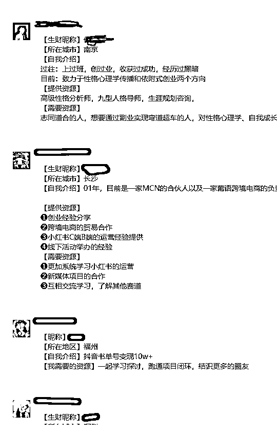
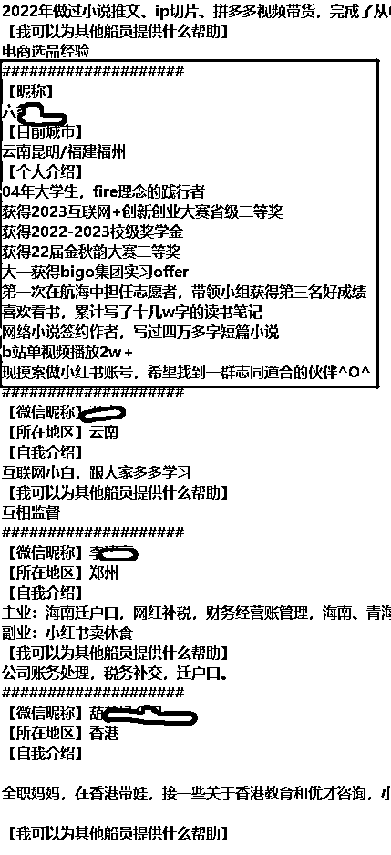
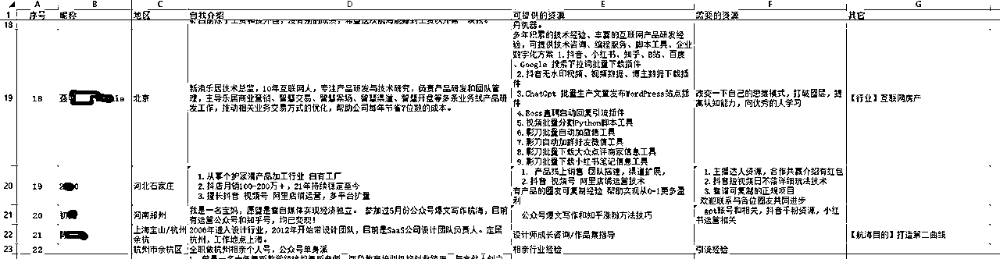
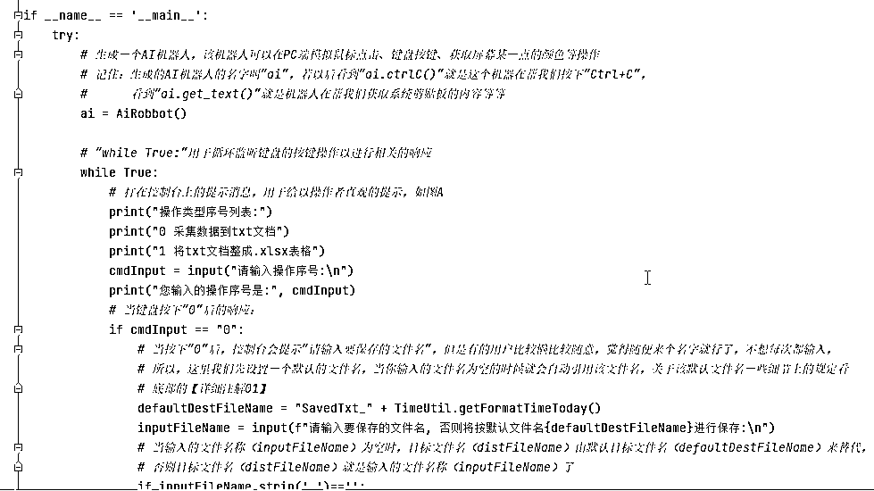
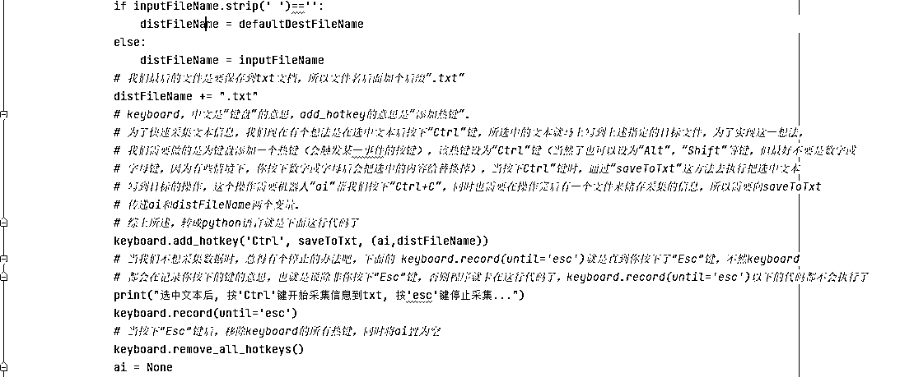
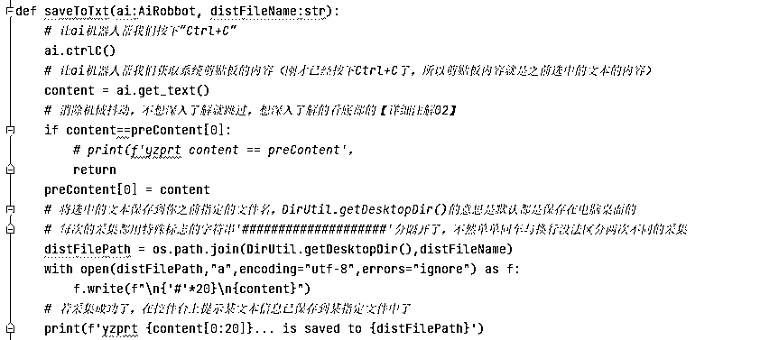
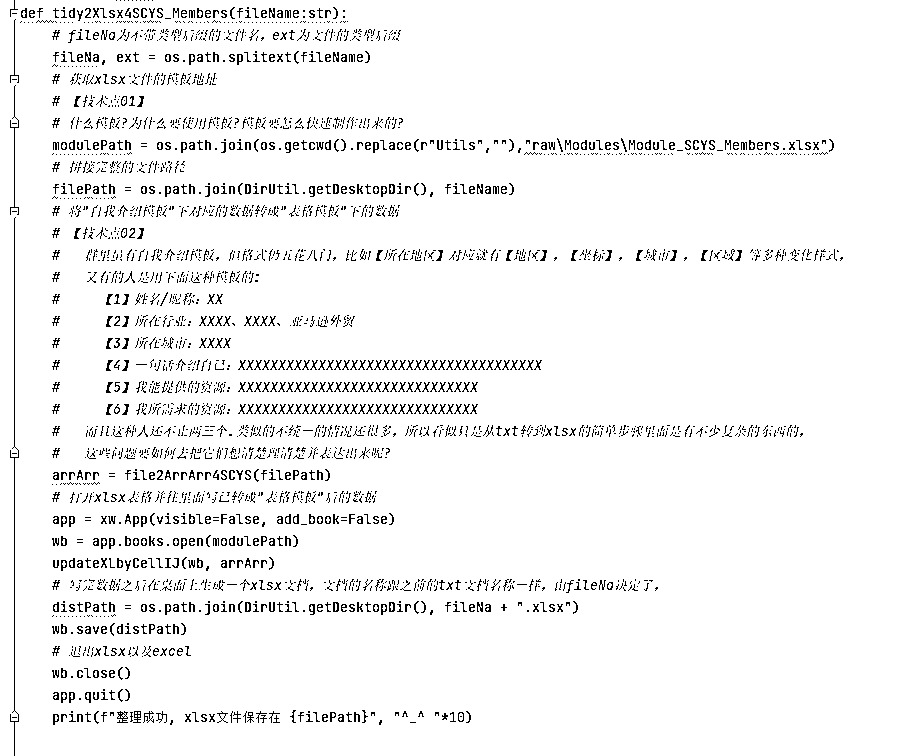

# 工具：文本快速采集+精细整理

> 来源：[https://xq23zki45o8.feishu.cn/docx/WIhodIaJ4oz7EqxFaencMltYnNg](https://xq23zki45o8.feishu.cn/docx/WIhodIaJ4oz7EqxFaencMltYnNg)

# 一、示例效果：

## 微信群上的原始数据（任意地方的任何可选中文本都能采集，这里只是个例子）：

## 快速采集到txt文档后：

## 对 txt 文本整理后的 xlsx 文件：

# 二、操作方法：

## 任意可选文本→txt文档：

A. 双击文件夹下的“ConvenientUtil.exe”，等待几秒至十几秒，直到弹出“请输入操作序号:”

B. 输入0，按回车

C. 输入要保存的txt文件名，如“test0906”，按回车（.txt后缀后缀会自动加，自己不可以不用加）

D. 用鼠标选中你要采集的文本，让它处于选中状态

E. 按Ctrl键

F. 一直重复D和F就会一直采集，不想采集时记得按Esc或直接退出“ConvenientUtil.exe”

↓ 下面是具体操作的视频 ↓

## txt文档→xlsx表格：

A. 双击文件夹下的“ConvenientUtil.exe”，等待几秒至十几秒，直到弹出“请输入操作序号:”

B. 输入1，按回车

C. 输入要保存的txt文件名，如“数字游民”，按回车，注意：txt文档只能保存在桌面上（.txt后缀后缀会自动加，自己不可以不用加）

D. 等待处理，直到弹出“整理成功, xlsx文件保存在 C:\Users\Administrator\Desktop\数字游民.txt ^_^ ^_^ ^_^ ^_^ ^_^ ^_^ ^_^ ^_^ ^_^ ^_^”，注意：目前该功能只针对生财有术圈的自我介绍模板，其它数据想按其它规则整理成漂亮的excel表格可以定制

↓ 下面是具体操作的视频 ↓

# 三、实现步骤及原理（代码解析）：

↑ 主体流程 ↑

↑ saveToTxt方法 ↑

↑ tidy2Xlsx4SCYS_Members方法 ↑

# 四、exe工具及源码下载:

## 工具下载:

## 源码下载地址：

## 一些说明:

若对两个技术点想深入了解的，联系作者微信：potato_2204 或 Wangzq226

# 五、写在最后:

## 谈谈为什么我选择用Python来制作RPA工具，而不是其它的?

Python强大且可实际应用的范围非常广泛，就日常工作生活的应用方面，它能做的包含但不限于信息采集，数据整理，手机、网站、windows系统上的模拟人工操作，视频、音频处理，手机投屏、手机群控等。影刀等RPA工具的好处是有漂亮的UI和看起来丰富且强大的功能库，编程界面有中文让人看起来不是纯英文，感觉有一点亲和。而对于从未接触Python的，想到还要下载安装一些东西、学习一些基础性东西，一开始会让人望而生畏，但是这些RPA工具能实现的Python全部可以实现，并且Python还可以做得更底层、更灵活、更加定制化、在熟悉Python了之后你会觉得Python更优雅、更高效。

## 本工具可升级优化的地方:

A. 每条文本作息采集成功后，有某种直观形式来提示"成功了"会更好，以免个别情况采集失败了却得不到任何提示

B. 有的人不喜欢这种"黑黑的控制台"， 不喜欢这种"指令式"的交互方式， Python也可以制作精美的UI界面[用PyQt等方式实现]，让你"点一点，选一选，拖一拖"就能实现一些操作

C. 其它一些更完善的异常提示和处理机制等