# 微软Azure免费配音教程

> 来源：[https://zphzxek10r.feishu.cn/docx/WTund5tYNooxFrxW3uJcbw0knKd](https://zphzxek10r.feishu.cn/docx/WTund5tYNooxFrxW3uJcbw0knKd)

微软的Azure是我个人认为目前市面最好的配音服务，正好参加了这期的GPT自媒体航海和视频号涨粉航海，感觉有同学可能会需要，今天给大家分享一下简单的一个注册使用教程。

1 首先需要一个微软账号，这个这里不多讲，很简单的一个事情，大家自行搜索相关教程就可以

2 有了微软账号之后，我们需要注册Azure账号

https://azure.microsoft.com/zh-cn/free

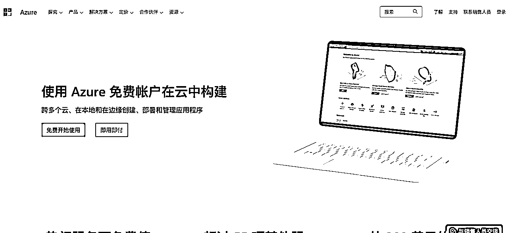

点击免费开始使用，同意所有协议点击下一步，

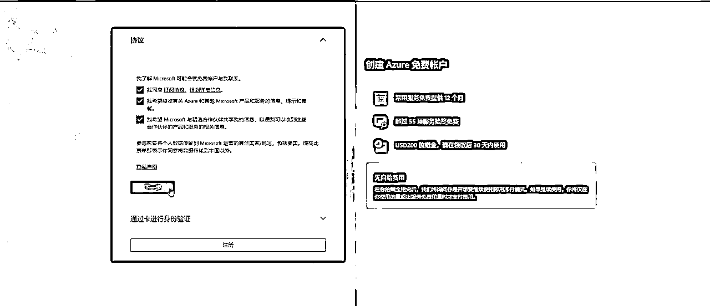

3 由于微软是国外公司，因此银行卡信息这里需要填写visa或者是万事达，有实体卡或者虚拟卡的同学直接填，没有的也可以联系我，我来告诉你如何申请虚拟卡，填写完信息，注册到这里就结束了。

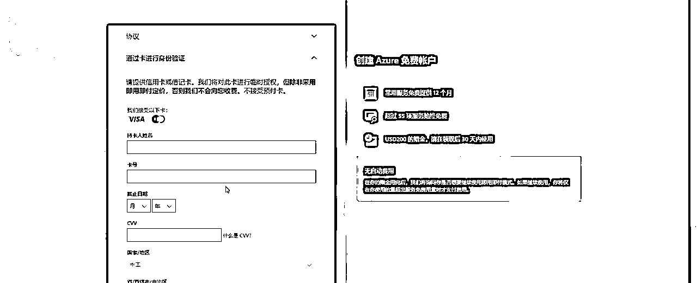

4 注册完就可以登录，来到首页，我们在左侧所有服务里面找到AI机器人学习，然后找到认知服务分组，点击进入就可以看到语音服务（最右侧上面往下数第二个）然后点击加号，就可以创建语音服务

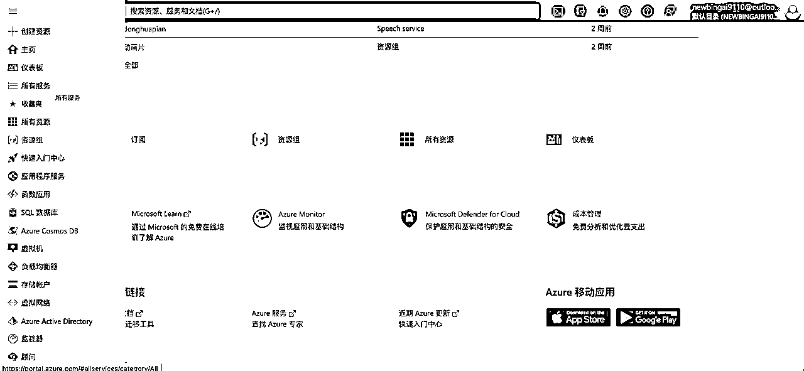

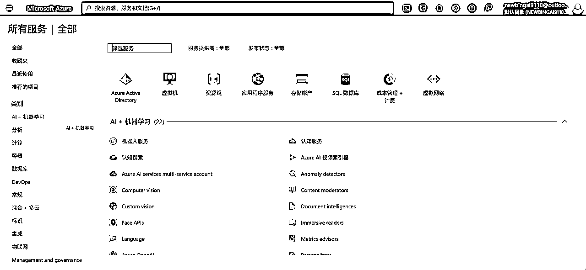

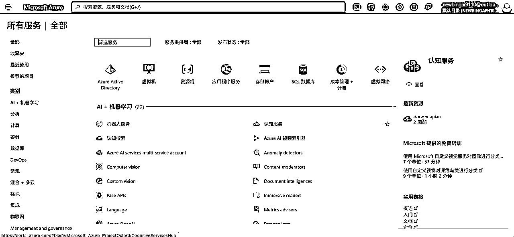

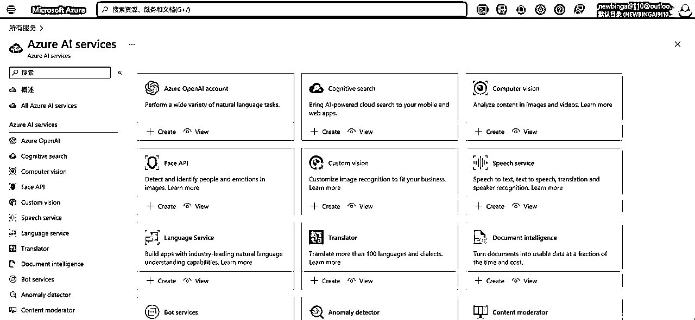

5 订阅中选择即用即付，资源组新建一个，自己任意命名，区域随意选择，名称自己起，定价层我们选择free F0，然后点击下面蓝色字体，审阅并创建。这样就完成了，它会出现在首页的资源组里面，下次可以直接在资源组打开

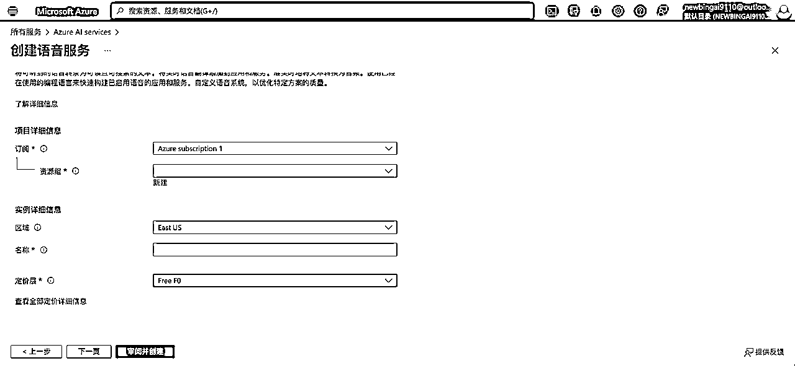

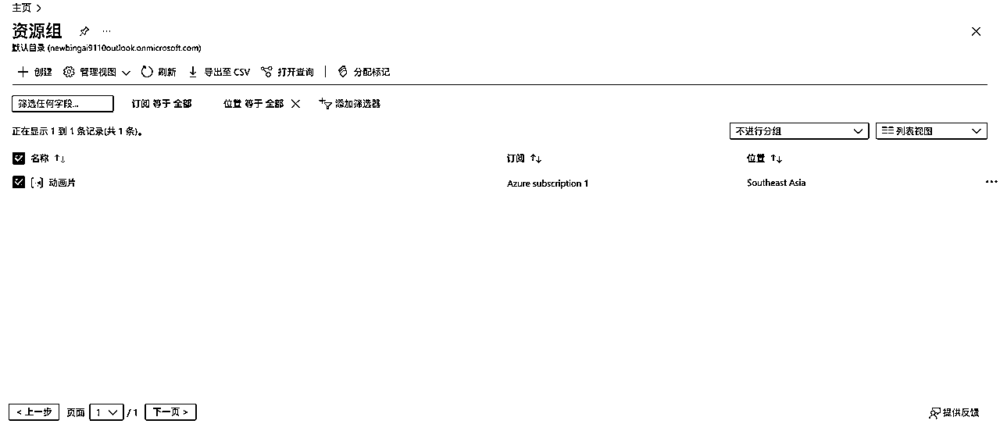

6 如果你是第一次注册AZure的话，微软会送你30天有效期200美元的免费额度

7 下面进行语音合成，打开Azure的资源组，找到你刚创建的语音服务，点击进入，找到文本转语音

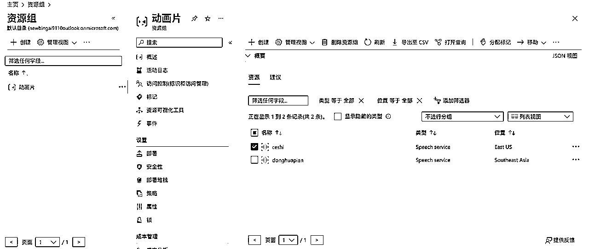

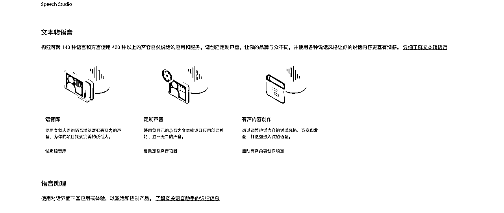

8 语音库里的语言种类很丰富，应该可以满足百分之99的同学们的需求，中文语音里面的方言也有不少。大家可以点击试听，挑选自己喜欢的，或者是符合自己视频定位的语音模型。

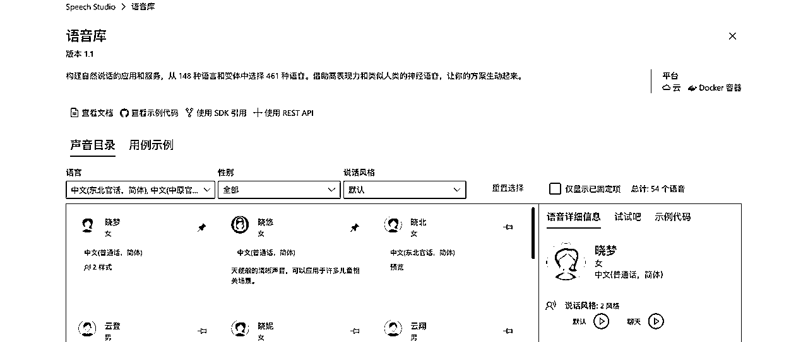

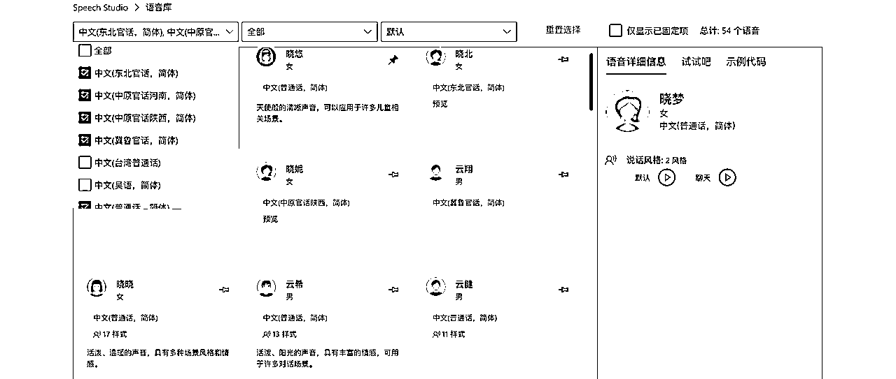

9 选择好自己喜欢的语音模型，点击转至有声内容创作，把你需要的文本内容复制或者输入到网页内，然后试听，如果觉的可以的话，点击保存，导出，储存就可以了。

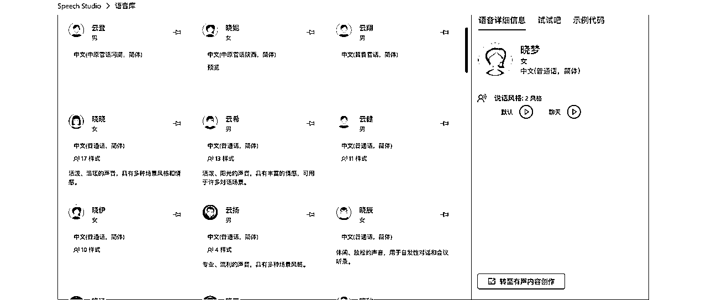

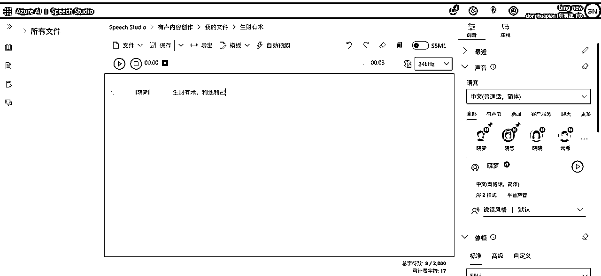

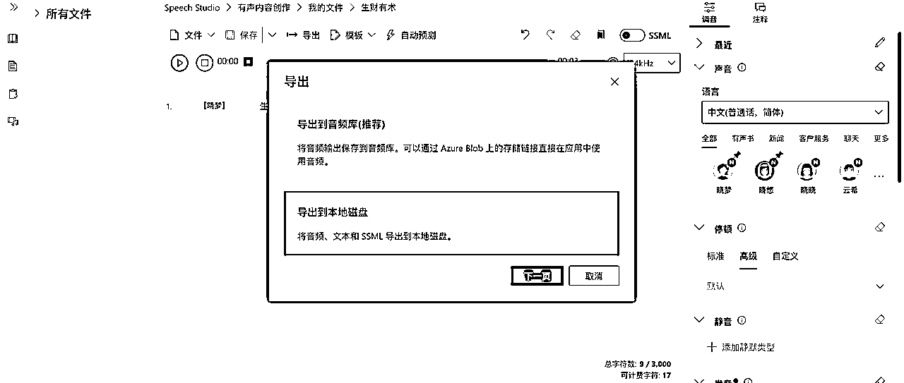

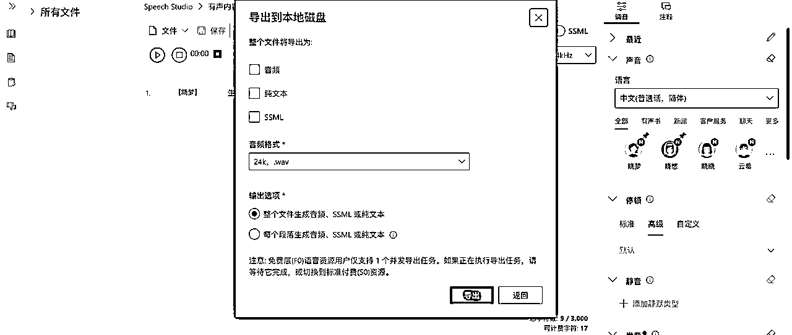

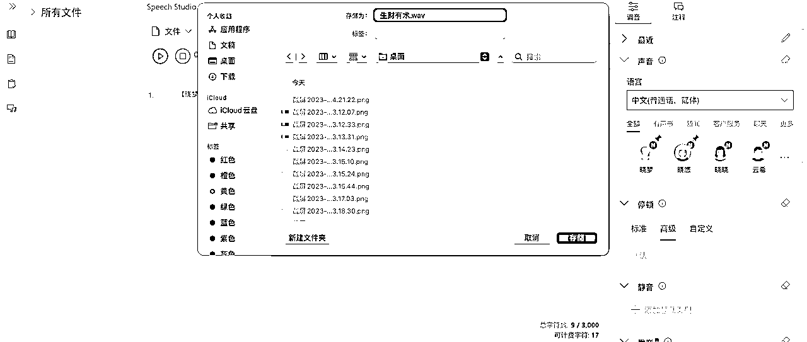

好了，以上就是本次教程分享了，第一次写教程，如有不周，请大家多多担待，并且欢迎大家随时留言指正和提问。

最后，祝大家生财有术