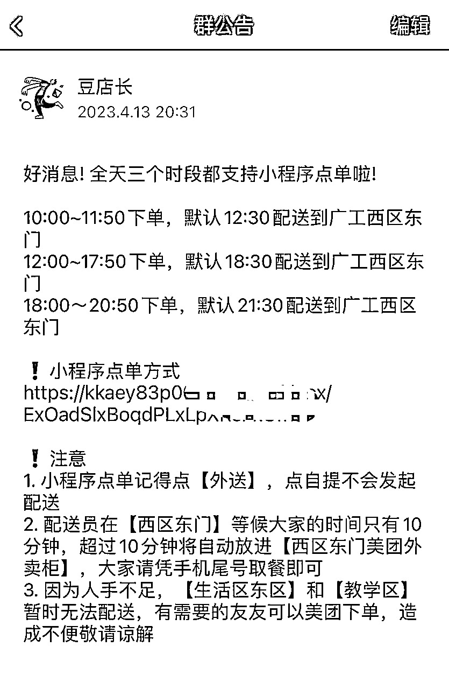

# 一家店当三家店用，经济下行周期实体门店的扩张方法

> 来源：[https://w1dkf9tyjl.feishu.cn/docx/WnHEd3ZLaogb2bxqTcvcMah4n8b](https://w1dkf9tyjl.feishu.cn/docx/WnHEd3ZLaogb2bxqTcvcMah4n8b)

大家好，我是卖奶茶的君宝。

今天简单介绍下我是如何通过摆摊拉满门店的生产效率，一家店当三家店用。

我们是自创品牌，当下消费市场不太乐观，盲目扩张可能会承受较大风险；我们上半年开始发力摆摊，用较低的成本拓张了市场，取得了还算不错的成绩。

现阶段我月单店平均营业额是13~15w，摆摊在其中占比是20~30%。

加入摆摊之后，门店员工全职没有增加，只增加了摆摊的兼职（工资提成制），所以摆摊所带来的营业额增长，转化成纯利的比例是比较高的。

# 一、写在前面

一句话概括这篇文章在写什么：

在有实体门店的基础上，餐饮老板可以通过门店制作半成品，招聘兼职，并用电动车摆摊售卖的形式增加店铺利润；

本篇内容介绍的摆摊方式是尽可能像经营门店一样可以复制化的摆摊，所以不考虑老板自己上的场景；

### 关于销售额

（写下这篇文章的时候正值暑假，门店是开在大学旁边，所以数据就截取到暑假前了）

此处为纯摆摊营业额，没有加上店铺的营收

目前总共有4个摆摊点位：

广工西区&华师&广工东区&梅苑，都是在学校门口，学生上下课经过的要道，或者快递点处人流量大的地方。

前两个点位每天三次（中午、下午、晚上的下课时间）出摊，每次出摊一小时左右

至于为什么需要每天出摊三次，一部分是因为学生会有上下课的时间，下课回宿舍区的时候购买欲望最为强烈，所以我们会等学生下课的时间段出摊；另一方面是我们请的兼职也主要是学生兼职，学生自己也会受限于上课时间无法到岗出摊；

后面两个点位就比较佛系，一般看是否有空闲的兼职，视情况出摊，数据比较不稳定，所以大家可以主要参考前两个点位的数据

### 关于私域客户

目前，广工9个群+华师4个群+门店自身9个群，基本上每次出摊都会卖完。我们会灯箱上面印上进群二维码，每次出摊会在群里做公告告知群友我们的出摊信息，并且卖完之后会在群里面通知，让群友们不要跑空；

这就给客户形成了一个必须在群里的理由，因为我们的出摊会受到天气/人手/售卖量等影响，所以你必须在群里才能第一时间知道我们的摊位信息。所以我们基本不会在群里做很多优惠活动，但是客户粘性依然很高

在没有摆摊之前，我们门店就是用企业微信做用户运营。所以开始摆摊之后，我们也是用企业微信，现在企业微信不像之前只需要给个几百块的年度认证费就完事了，现在要收“人头费”，又是一笔支出，如果圈友短期想跑mvp也可以用个人微信，长期的话...企业微信还是离不开

### 关于利润

目前稳定下来的数据：

单个点位每天出摊时间3小时左右，营收15000~20000，毛利75%，我们兼职是每卖出一杯给予相应的提成，现在兼职工资提成占比20%

但是开过店都知道，开线下门店是有固定成本的，一般来说，一家店无论做50万/月还是做5万/月，铺租/设备折旧都是固定不变，需要每月支出的。而如果员工工作不饱和，在门店让员工提前制作半成品则也是一件不额外增加成本的事；这样算下来是非常划算的

其实有经验的老板都发现了，这个和美团外卖最开始的理念是相符的——我平台只在你每一单上面抽成，你出单就收钱，不出单就不收钱，门店不忙就一直开，毕竟别让员工太闲下来也是一件管理的要事；门店忙还能把平台关了暂停营业，理论上来说是个皆大欢喜的局面。

至于为什么变成现在这样，懂的都懂吧

接下来我就以我们店为例，介绍摆摊究竟如何从0到1开始

# 二、调研与准备

### 摆摊地点调研

摆摊有合法摆摊和非法摆摊，合法摆摊就是有固定摊位，受到统一管理，并且通常需要缴纳一定的租金成本。

关于合法摆摊

优势：

*   不会被赶走，可以长期合法经营

*   一般来说可以有地方摆放桌椅

*   有些场会有电源提供

劣势：

*   需要缴纳场地费用，要交场地费则基本被房东“算死”；好的摆摊位置和门店铺租差不多价格，更离谱的还要押二付一；差的位置人流量/消费力就一般般

*   竞争相对较大

关于非法摆摊

非法摆摊则是真正意义上的“走鬼”，会受到城管的驱逐甚至收车，但是只要能够找到合适的地点摆摊，就是绝对的蓝海市场，我们现阶段的点位基本都属于这种，学生下课的时候每分钟的人流量都有300以上，在这种点位只要运气好不被执勤或者城管驱赶，以我们的出餐速度，20分钟可以出20~30杯，有时候原料带的不多，半小时直接全部卖完，甚至收摊的时候还有很多顾客会来问。真正意义上的风浪越大鱼越贵。

关于非法摆摊的优劣势，与合法摆摊的刚好相反，不再赘述。

### 产品准备

产品的准备是最复杂的一块，因为涉及到半成品准备、运输、储存、卖不完还要返回；而成品还要涉及到定价，摆摊的定价需要比普通门店更低，因为需要和其他摊位进行竞争；但是又不能太低影响品牌的溢价能力。

半成品制作完成之后，就要考虑如何在摊位有限的空间和设备下加工成与门店相同水平的产品，这个需要和下方「车辆该设计与改装」模块联动考虑

而因为产品模块每个门店都有不一样的产品，即便是卖奶茶我们这种卖豆沙牛乳的和卖柠檬茶的都有50%以上的不一样，更别提其他，我这里就提几个通用的小建议，供同行参考：

*   产品一定不要多，精挑细选门店卖的最火爆的2~5样即可

*   卖的好还要毛利高，因为摆摊的定价不可能太高，而且需要给摆摊兼职提成

*   最好不要另外研发，摆摊与店铺卖同样的产品，则摆摊卖不完可以拿回店里，店里卖不完可以留给摆摊，降低食材损耗；而员工也不需要额外准备不同的产品，降低配合难度

*   产品最好在门店能够加工到80%以上，在摊位只需要加工剩下的20%，通常是加热/装杯/搅拌等等这些简单的工作即可，加快现场出餐的速度

*   最好不要制作成最终成品售卖，有现场制作才能卖出价值——我见过很多炒饭、糖水等商家直接完全做好打包好，放在一个外卖保温箱里面卖，看上去很low，完全卖不出溢价，买单的顾客也不多；

*   再者，即便是你最终只有装杯/搅拌/淋上酱汁那么一下，给到顾客的也是现场制作的感觉

### 车辆设计与改装

（这是之前的定价，现在涨了点价）

#### ① 车辆选择

车辆设计主要根据实际出餐来就行，各个产品的餐车设计都会不一样，主要的区别就在于是做：

两轮 / 三轮 / 四轮

两轮车的好处在于灵活，大部分城市都能够畅通无阻；劣势在于，操作空间小，无法实现更高效率的出杯

而对于非法摆摊的操作，两轮车更大的一个好处在于，城管管的会更加宽松一点；

这里可以科普一下另一个小知识，一个城市一个地区的城管数量是有限的，他们出行一般都会开着皮卡，机动性差，我们一般看到皮卡就可以直接上车逃跑，城管不会追；但是执勤数量是无限的，执勤会赶你走，恶心你，但他们没有没收工具的权利。

城管一般看到两轮车会睁一只眼闭一只眼，不会怎么和你计较，相比之下三轮车被收车的风险就大很多了，我去过城管所，里面被没收的95%以上都是三轮车

（城管所里被没收的三轮车）

三轮车的好处，相比四轮的成本低很多，而且也十分灵活，但是非法性最强，交警抓，城管抓，抓到都是扣车

但是架不住性价比确实高，承载量大，焊上不锈钢操作台之后出餐非常顺手，不输门店。也难怪这么多人最终还是会选择三轮车出摊

四个轮就是汽车了，车尾箱摆摊，一般都是玩情怀的，老板自己小打小闹玩玩可以挣点钱，做不了标准化的，就不在这篇讨论范围之内了

#### ② 关于车辆设计

这是我们三轮车的设计稿件，简易版本的设计草图，画出这个之后就可以找不锈钢师傅去焊接了。

设计图可以在小红书搜索，我相信难不倒大家，主要就是要对出餐的场景有个清晰的模拟即可，建议用流程图梳理下，比如说打包的时候打包袋挂在哪里，餐具放在哪，付款二维码在哪，餐牌放在哪等等，挺多小细节要考虑

#### ③ 车辆制作和费用

两轮电动车我们一般都买二手，500r左右，加上改装费用控制在800；如果用外卖车则更好，车架大结实一点，走起来也更稳一点，相应费用要去到1300左右；

三轮车一般买一手，二手的电池是个迷；车子3000左右能拿下，但是焊个车架大概要1500，再加上灯箱要5k左右成本。不过相比开一家正儿八经的门店，这个费用就已经便宜的不得了了

焊铁架需要找当地的焊工，这个需要问下同样在周围摆摊的人，自己找会有点难找。尽量不要找比较远的加工商，运费贵，售后难保障；

两轮的话直接找电动车维修的，他们能够直接安个外卖架在你车上

### 人员排布

无论 两轮/ 三轮车的出摊，除非是生意真的非常非常好，不然我都是建议一个人出摊是最好的。

主要是人员成本问题，我们现在人员成本支出占比20%，还不包括车辆折旧、报损维修、还有充电费（电动车充电越来越贵），合法摆摊还要有摊位费，利润是一点一点抠出来的，能够一个人搞定的就一个搞定

抓住当地摆摊点的客流潮汐，人流量多的时候摆1个小时要比没人的时候摆10个小时都管用

如果人流量非常集中在某个时间段，那安排两个人也行，薪资结构则可以设置稍微高点的底薪+没这么高的提成

# 三、优化与放大

### 如何和其他摊位与众不同

*   外观设计：选用和自己门店相同的VI体系，更有品牌感

*   一定要告知消费者自己有门店：能够和纯摆摊的商家区分开，这时候主打“干净、健康”会更有说服力

*   运营能力：与门店一起发力公域+私域

*   摊位同时也能售卖门店产品：消费者如果不满足摊位的几种产品，也可以在小程序点单统一配送

整体来说，就是走变维打击的思路：

对比其他地摊，我更加卫生，产品更加丰富，线上运营能力更强；

对比门店，我产品更有性价比，位置更好曝光更高

### 如何公域+私域

#### 关于公域

对生财圈友来说，公域就相对简单了，都是网赚圈的，流量这块肯定拿捏。

抛砖引玉一下：

把每个摊位都做成品牌的IP矩阵，每个账号都发布出摊的日常视频剪辑，标题可以参照这个账号，

“五线城市/00后摆摊”+“摆摊的一天”+“大几千/过万的营业额”

矩阵起号之后，后端卖产品、卖课程、卖加盟、卖配方都无所谓了。

#### 关于私域

私域结合实体，有很多玩法，我们目前在摆摊群里主要给顾客提供三个价值

*   告知出摊时间，出摊位置；

*   顾客能够在出摊之前购买门店商品，到摆摊点位自提

*   通过小程序参与门店活动

摆摊本身就是一个充满不确定性因素的事情，顾客会理解这种不确定性，因此他们也不会过于抱怨有时候我们的没到位；相反，我们可以利用这种不确定性在群里反复触达，并且制造稀缺感。

消费者注意力有限，他们只喜欢“难得到的”东西

摆摊还有个好处就是能够顺便配送顾客的外送订单：当顾客觉得摆摊的产品不够丰富，想点店里制作的产品，可以让他在小程序下单并且备注外送，兼职在出摊的时候顺便带上餐品，可以节省非常客观的一笔配送费（当然兼职带上餐品也是有提成的）。因为摊位通常离消费者更近，所以消费者可以在摊位自取，这样既不会增加摆摊兼职的劳动，也减少了店铺的配送成本，而又节省了消费者的时间，可谓一举多得

同时消费者能够享受与店铺同等的优惠活动；我们门店会有节日活动，新品活动等等，折扣力度比较大，一般要到店才能享受这种折扣，但是因为通过摆摊我们实现了统一配送，降低成本，所以即便外送也可以享受优惠折扣（参照瑞幸的店铺折扣和外送折扣差异，普通的单杯配送模式是无法将成本降到如此极致的）

### 薪酬模式设计

关于兼职工资无论怎么设置，最终还是看时薪与工作辛苦程度是否等价

我们目前是纯销售提成，按杯数结算。最终兼职的时薪在30元左右。

这个时薪当然不算低，但是不了解我们模式的人就不能够确定是否能够有这样的薪资，所以会错过一些可能不错的人。当然也可以底薪+提成的模式，但是底薪绝对不能定太高，不然兼职在外面摸鱼半天没卖出一杯也无法做到监管。

另外，也可以执行食材进货的模式拉拢合伙人：

这种模式就不是聘请兼职了，而是让想做点小生意的人一起合作售卖你的产品。简单来说，你负责生产产品（半成品），他从你这里进货，然后自己售卖，他卖多少钱都无所谓，都算他赚的，这种模式下一般就不挂你们的招牌。

例如你是做烧烤的，现在你有一款鸡翅做的很好吃，你可以提前腌制好，让兼职来帮你售卖，卖多少钱用什么招牌由你来定，兼职只是帮你卖，每卖一只提成五毛；你也可以同样提前腌制好，卖给隔壁烧烤摊的同行，他们在他们的摊位烤制，卖多少钱用什么招牌由他们说的算，同时如果没卖完造成浪费，也是他们自己负责。

这两种模式，就看自己的产品，以及精力和时间。

如果精力足够，有更加长远的打算，我建议还是走自营模式；如果精力不够，那就走供应商模式

### 如何躲避城管

关于躲避城管这块，每个地方都有每个地方不一样

如果能够有不错的摊位，对自己产品也有足够的信心，那还是去租个摊位比较省心；

如果没有，则需要通过一段时间的摸索，和城管打交道之后，才能了解个大概，并且做出应急预案的sop。我们目前几个摊位都是非法摊位，兼职上手之后也能够适应，实验了这么长时间，我觉得大概其中也是有一定的可复制性。

# 四、总结门店增加摆摊的优势

*   摆摊的优势：人流量大、基本不用租金、时间自由

*   按照门店vi设计摊位车辆，更加有品牌感

*   通过微信积累用户，且对比存在门店，反复触达更加不反感

*   微信营销与门店同步

*   出摊带有不确定性，更加给顾客带来稀缺感

*   顺带配送团购

*   利用店内设备以及门店员工进行产品粗加工，对比传统无门店摆摊，减少了此部分的人工价格以及设备、存储等支出

*   sop化流程，对比传统摊位更加容易进行地区复制

*   通常对比传统摆摊，门店摆摊的产品优势通常会更强

写在最后：

就目前而言，摆摊带来的投产比，比我们在美团上拼好饭，上抖音团购等营销手段都要高，而且，个人认为，在平台上低价产品，搞大折扣活动，就是一种对线下高价购买你产品的忠诚用户的羞辱。

但是，摆摊只是门店的一种招式，没有绝对的完美和无可替代性。和学会做外卖运营，学会做大众点评刷评分，学会小红书达人探店，学会利用抖音团购是一样的，这些都属于餐饮门店的一种招式。哪一招好用，哪一招适合自己，就用哪一招，没有绝对的优劣之分。

看完我的文章后你知道有这样的一招，对我的这篇分享来说更为重要；用不用，怎么用，就是自己的事了。