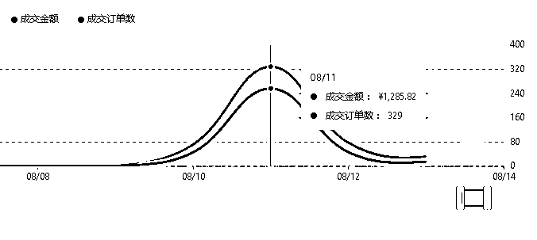
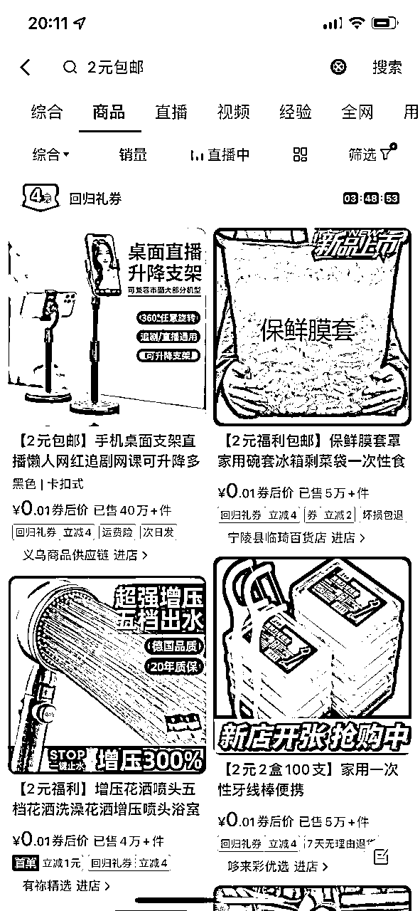
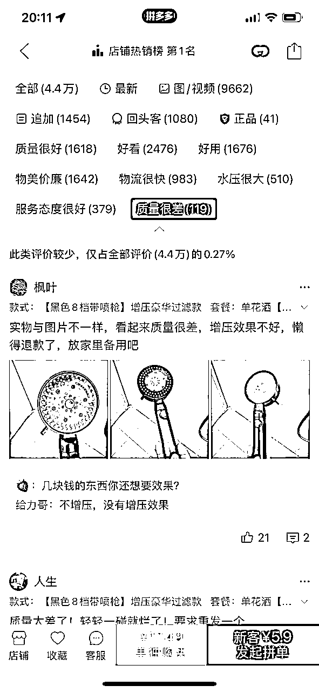

# 抖店福利品出体验分，三天跑到4.8，1单成本一两块

> 来源：[https://o0x89t6r9s.feishu.cn/docx/WrE4dwQr2o6SM1xxcc2chSNxnYb](https://o0x89t6r9s.feishu.cn/docx/WrE4dwQr2o6SM1xxcc2chSNxnYb)

# 大家好，我是江河！

做抖店的伙伴们大概都或多或少受过体验分的困扰，去找人做价格差不多要五块一单，今天给大家分享一下自己这边做体验分的方法，成本比较低，大概每单一两块钱，速度也比较快，每天能跑三四百单，新店差不多两三百单就能跑到4.8了，老店分低的也可以试试。

如图，差不多上架完三天左右起量跑完

## 操作：

1.  首先我们去抖音，商城，搜索2元包邮，会出来一堆低价品，如图，基本都是同行在跑体验分的品

1.  在其中尽可能选择和你店铺类目接近的，销量高的品，找出来保存主图，然后去拼多多识图找款，点进去看评论做参考，点最后边的差评，看差评比例，选择差评率低于0.5%的，避免我们的抖店卖出去收获一堆差评，如图

1.  拿主图去淘特或者1688识图找款，比对成本价格，搬家到抖店时，加价2块上架，标题加前缀【2元包邮】，上架后，设置一个1块钱的新人优惠券，一个1块钱的单品优惠券，最终使抖店售卖价格在2.1元以上，4元以下，这个价格范围出单正常计入销量且比较容易出单，想速度快的就多上成本高的，亏损越多起量越快，我们基本平均每单亏损成本在2块多点

1.  选几十个这种品上架，上架品的数量越多起量越快，我们一般上五六十个品，出单以后去淘特或者1688拍单，不要去多多拍单会出无货源，单品量起来以后，可以联系商家谈代发，走店管家推单，可以节省拍单的时间，基本三四天能出三四百单，出分基本在4.8左右

1.  达到自己想要的单数以后，可以陆续取消掉我们前边设置的两个券，先取消单品券，稳一下销量，出单没太大变化就可以陆续再取消另一个券，这时候基本是在平本跑销量，可以拿来稳评分用，不想继续出低价的跑完下架也可以，我们一般会下掉亏的比较多的品，留几个亏损少的零散出单，保持一点店铺热度，等待签收出体验分然后上架正常售卖的品。