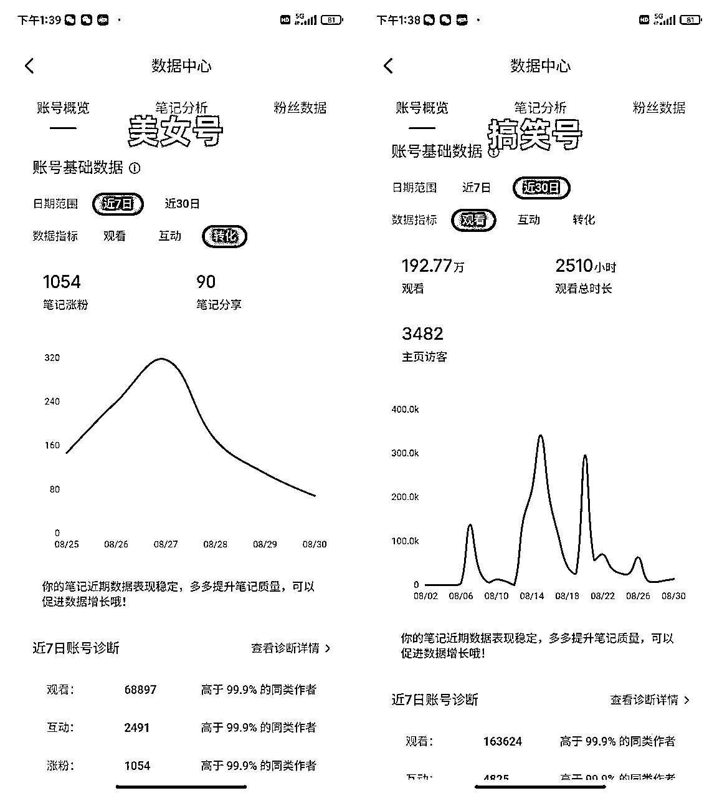
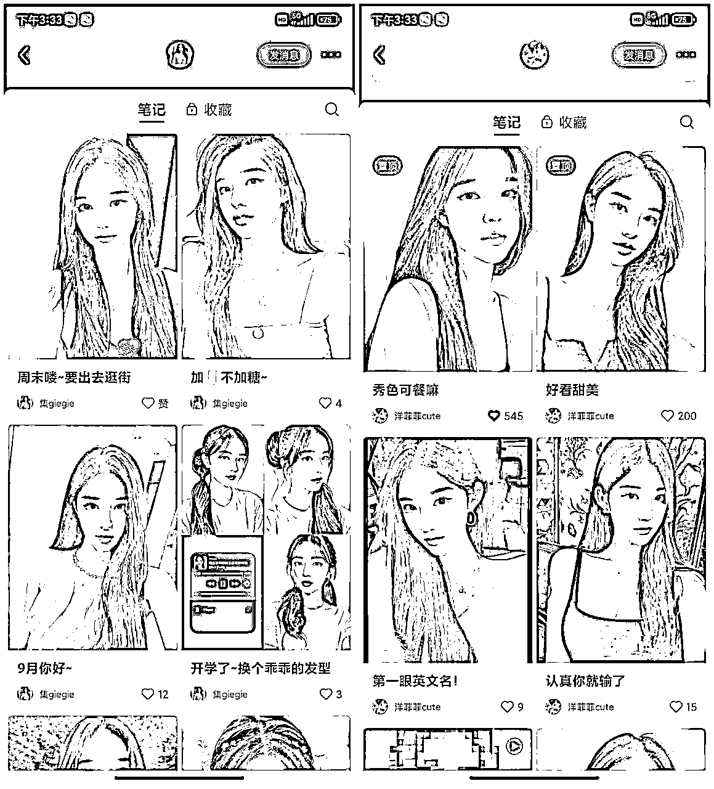
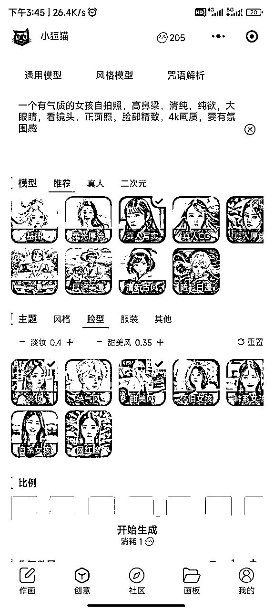
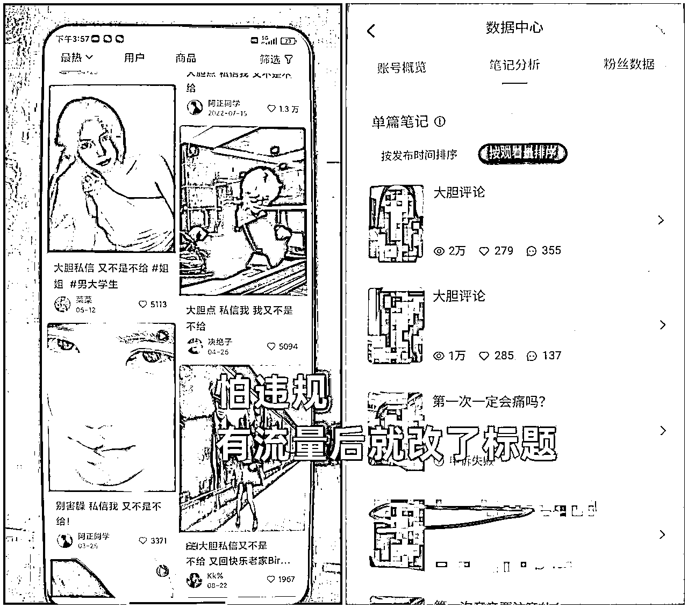

# 实操复盘：新手入局小红书，单账号播放量近两百万，一周千粉

> 来源：[https://ixhrdc36mw.feishu.cn/docx/WwCYdgEzCoyaetxmTPTcAcyLn2g](https://ixhrdc36mw.feishu.cn/docx/WwCYdgEzCoyaetxmTPTcAcyLn2g)

大家好，我是阿酷，今天给大家分享，近期做小红书的实操复盘以及美女IP号的玩法

# 1.为什么做小红书

前段时间的做的拼多多无货源女装，打爆款，退货率太高（成交2万,退1万8），就打算不做了，就开始在生财的知识星球里面逛，了解近期的一些项目分享，发现很多都是和小红书相关。

再加上小红书千粉接商单， 这个词也在朋友圈经常看见，后面就去了解一下，小红书粉丝破千后，可以在官方的蒲公英平台接广告，类似于抖音的星图，都说广告很好接，价格贵，这样开始入局小红书。

为什么要做这三种类型的账号，具体在账号定位里面。

# 2.拿到的小结果

一共做了三个号，一个漫改图片，一个美女IP号（AI做图），搞笑号（朋友圈文案）

取得结果： 漫改号没跑起来，美女IP号 一周不到破1000，搞笑号一共月不到播放量近200万

漫改号已经注销，所以就没法截图数据了。

# 3.账号定位

账号定位，是做任何平台最重要的一个事情，账号选好定位，找好对标账号，才能更加快速的得到正反馈，才能有动力坚持做下去。

账号定位，选择对应的领域，可以找自己本身的或者感兴趣的入手，想要搞钱的话，选择离钱近的。彩妆，护肤，穿搭，美食，宠物，减肥运动，摄影技巧，健身，职场经验等等。一定要把定位搞好，选择大于努力，这个非常重要。

账号内容形式，小红书之前是以图文为主，现在对视频有流量扶持，我自己3个号测试下来，也是明显看出来，视频的流量比图文的好一些，有能力做视频的一定要去试试。

现在讲一下我做这三种账号的原因，我是想要快速涨粉，所以就想做面向人群广的内容，碰巧刷抖音的时候，刷到一条搞笑的视频，感觉不错，就对标这个类型开始了搬运做第一个账号。

这个是我搬运的第6个视频，爆了16万播放量，但是没有做关注引导，只带来了14个粉丝。这个情况也是后知后觉的，错过了很多，后面每个作品评论区我就都会评论，引导他们去关注，后面稍微好一点了，但涨粉情况依然不好，近200万的播放量，粉丝还是500不到，这个账号现在已经慢慢放弃。

漫改的账号，是看了郑恋大佬的文章（AI漫改头像精准引流宝妈粉，单号月利润1W+）开始做的，在找对标的时候发现了美女ip号的，后面就同时搞了。漫改号做一星期，数据一直起不来，但是美女IP号就直接起来了，就把重心放在美女IP号了。

昨天和一个小红书mcn好友聊天，他那边透漏了一点消息，说他们合作的广告商大部分需求是明星娱乐这领域的，所以就把漫改注销了，准备做明星娱乐这块了。

关于养号，这个没有确切的说法，我自己号都是没有养的，注销后直接注册，刷一下对标就开始传作品了，目前是毫无问题的，但是mcn机构的好友，聊天的时候提到过养号，大家不着急的情况下，刚注册不要着急改信息，还是多刷几天再传视频的好。

关于设备，我目前是一个手机两个小红书。一共4个号，也暂时没有异常。

# 4.想要对接资源

身边的圈子比较小，想要扩展一下圈子，有在做小红书的伙伴欢迎来链接交流。

# 5.美女IP号详细玩法

## 5.1什么是美女IP号

这个不知道怎么给你们描述，我就直接上对标账号的图片，你们就明白了

大家可以看一下，所有的图片都是一张脸型，他们主页的简介是AI绘图，经过几个小时的研究，终于测试出来了，差不多的效果。

## 5.2如何去制作

第一张图，是通过文字介绍，加上这个小程序自带的人物模型生成的，第二张图，是用了其它博主的照片，通过AI小程序生成的，大体样子不变，只换了脸。你们扫码直接就能看到我使用的参数和设置了，选择同款就可以直接拿来用了。

大家去使用同款的时候，要记得把这个文字描述改一下，要做一下差异化。不知道怎么描述的，可以去社区里面看一下其他人的作品，参考一下他们的描述文字。

## 5.3三种方法找爆款标题

图片内容有了，现在就要开始选标题了。

1.直接找的对标账号，看他们那个标题数据好就用什么

2.刷推荐，看哪些作品数据好，那他们的标题去小红书里面搜，其它人的作品数据都比较好，那这个就是爆款标题了

3.情感相关的标题 测试过 数据都挺不错的（案例：第一次亲亲要注意什么/第一次谈恋爱有什么建议）

分享一个我自己用的必爆标题：大胆私信，又不是不给

流量很不错，但是有违规的风险，我就靠这两条笔记涨粉800+，我被违规了两次，申诉都成功了，申诉的时候就说内容没有违规，麻烦重新审查一下就行了。

## 5.4注意事项

1.发笔记尽量去带笔记灵感里面的那些话题，会有流量扶持，作品数据好，平台还会送曝光券。

2.简介注意说明一下是AI绘图，要不然就会有一堆人在评论区带AI的节奏。

写了AI绘图，涨粉效果就会差一点了。

我前期为了涨粉快，就没有在简介里面说明是AI的，粉丝破了后才改的。

# 6.经验总结

任何项目都没有看见的那么简单，只有去干了才会遇到问题，解决了问题，才能成长。

选好一个方向，去努力干它1个月，不管成功与否，它都将是宝贵的经验。没有人能够一蹴而就，一步登天。成功需要不断努力，不断学习，不断积累经验和知识。

大家一定要下场干，不要再观望了。生财这个圈子，给大家创造了很多的机会。机会就像海浪，一个接一个地来，如果你不去抓住，那就错过了。

9月已经到了，大家一起加油，一起生财有术！！！