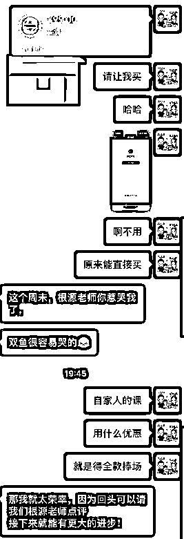
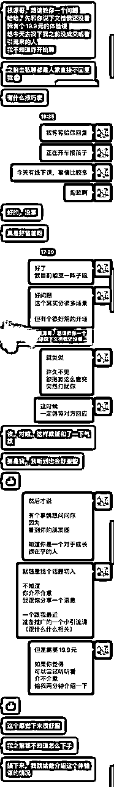
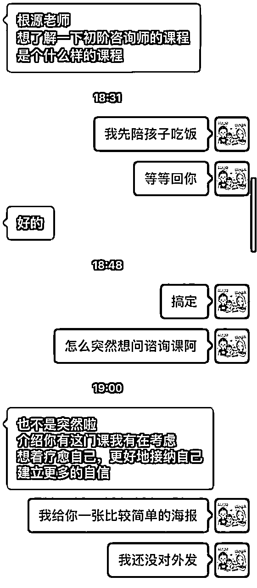
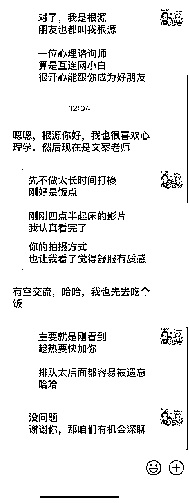

# 续篇 - 25个提高微信成交率的小技巧（26 - 50）

> 来源：[https://oee5lr7gsk.feishu.cn/docx/XYn1dDI9eoVCKOxBSeAcZY3YnJe](https://oee5lr7gsk.feishu.cn/docx/XYn1dDI9eoVCKOxBSeAcZY3YnJe)

全文 6,888 字，大约需要 15 分钟 时间阅读

## 前言

各位好，我是根源。

过去有过几年的线下销售、带团队的经验

同时也是一位实战经验比较丰富的心理谘询师

去年，正式的转型做了线上的知识付费、以及私域。

上个月初，有分享过这个系列主题的文章

阅读和点赞数据都还不错

想着既然这个系列的主题，刚好符合目前的趋势

同时、这也是我自己很喜欢的主题

因为微信场景

可以说是这个时代

最贴近每个人『天天见』的场景

只要能把微信用的好，就代表再这个时代

一定能获得比其他人更多的机会

不管是更好的信任感、更讨人喜欢、又或者是赚到更多的钱

趁着这几天，接著整理了续篇

第26 - 50 个提高微信成交率的小技巧

作为上一篇的续集

（上一篇直达链接： ）

『微信成交』这个主题，我个人其实挺喜欢的。

一方面是，这是我的强项，帮助我去年完成了七位数的转型收入

再一个点就是，这件事我也是近一年才接触，并且真正做到了擅长。

因为我其实从去年开始，第一次从线下转型做线上。

那我发现，转型之后，所有的销售、关系经营、成交，

几乎全部的场景都迁移到了线上，更准确的说是微信。

这背后有一些核心的底层逻辑，我觉得是很关键的。

在上一篇精华帖中，我其实有提到

### 线上的本质，其实是线下场景的迁移

所以在微信上谈成交，本质上是将线下的场景做了切换

其背后的底层的逻辑是一样的

就是我们需要和客户建立足够的信任

然后，成交就是一件水到渠成、自然而然的事情。

我也一直认为，私域的终点是微信

如果能有一些

透过微信沟通更好的小技巧

这是能大大的增加关系维护的效率

以及更好地成交产品

刚刚好想借着这个主题

梳理我去年一整年在线上，微信聊天成交

以及总结过去十年的销售经验

每一个小技巧都很轻

看完便可以知道如何快速上手。

* * *

## 026 微信拓展客户的一个秘诀

「群」其实是个非常好认识新朋友的通道

但也因为是个好通道，所以就必须要『慎重』

得「用对方式」

不然，这也会让一个人的人设

一崩就在整个社群崩了

一般来说，新好友的出现有两种状况

第一：他加我（被动）

第二：我加他（主动）

各位可以想想，哪种状况，可以更好的聊天？

肯定是第一『被动』的状况下，因为别人加，都一定是对方有所求。

又或者他对你有兴趣，在群里的活跃，可以很好的让别人对你产生『关注』，尤其是使用『@』这功能。

私信，对方不一定会回，但你在群裡『@』。

被回应的可能性就很大

初期有个好方式，找几个重要的群（付费最好）。

用一周的时间，找出最少五次机会，固定『@』某个人。

用一周在群里跟特定的人创造互动，互动三次以上。

就有机会让他加你好友，或者是你主动加他好友。

这样的场景发生，都能有很好的聊天开场，甚至是一个更好的延伸

这样的场景，各位可以常常使用

很好用，认识的人都可以很好转化。

但这有个大前提，必须要在群里有一个固定的活跃量。

这个很重要，非常重要

如果透过群这么做，但过快的加人，这反而会有反效果。

一定要让自己有锁定几个重要群的习惯。

能力要培养

朋友要培养

社群更要培养

* * *

## 027 拓展微信客户，这样做一定能增加印象

这张截图是我的微信中好友申请，我想问一下

如果这12个好友向你申请，你会最先通过哪一个？

这个问题我觉得挺值得思考的

假设将角色对换，如果你向对方申请好友，你要怎么做

才能让对方看到的当下，就愿意通过？

这就跟投公司履历一样，

你要怎么做出差别，让公司最少能先看到你。

我想，多数人都会选择1或者是3

这提问并没有正确答案，而是透过思考，找到一个『客观标准』。

也就是，多数人会这么想，多数人会这么选。

### 有一个很重要的销售价值观：

### 当一个好销售之前，肯定要先学会如何当成一位好客户。

各位在加好友时，也依旧会这么礼貌吗？

这才是最重要的事情

我想特别提供一个加好友备注公式，

我自己也经常这么用：

加好友的「备注」公式：

### 姓名＋谁介绍的＋来意

就类似于

你好，我是根源，

XX说你（某某领域）很厉害，

想特别认识你

报名课程学习

* * *

## 028 客户付费后，能增加信任的一个举动

之前我说过，要给予对方的决定『肯定』

对方愿意付钱

这代表，他一定考虑许久，最终决定，我能信任一次

这时候就别推托

幽默的回答，肯定对方思考许久的决定

* * *

## 029 客户经营中，这个习惯一定要重视！

经营关系的过程中

『花钱』一直是个很有趣的行为

大钱肯定需要考虑

但在经济许可的状况下，我有个建议：

小钱都不要考虑，199元以内都是我暂时定义的小钱

只要是一个，我觉得很值得经营的关系

又或者是，对方年轻很认真

只要有一项，是我觉得很棒的特质，小钱我肯定不省

我自己卖过课我懂

有人愿意为了这堂课付钱

不管买了看，又或者买了没看

这我都不太在乎

我只知道，有人愿意给支持

这种开心都会让我难以忘怀

有时候，多用一些不大的钱

把关系慢慢的加深

这会是一种很好的关系维系的方式

看似简单，但非常好用又有效果

当一个朋友我觉得质感不错，如果他刚好有低客单价的课程

这样的小钱，我一般都不会省！

* * *

## 030「多说一点话」，是增加成交率的关键！

十年的销售经验，让我很清楚地知道

成交的关键，其实就是信任感。

只要信任感足够，就有机会成交。

而信任感的增加，没有捷径

其实就是透过每一次，多说一点话，

一点一点持续积累的

把这个思维延伸到微信成交的场景

就是，不要把微信聊天，当成机械地对着屏幕打字

而是想办法在微信上加上一点『人味』

最简单的人味就是

把话多说一点，不要只是机械式的回应

其实，这是一个增加成交率的关键

把关系维护好

也是这个时代，成交之前最需要做的

这个案例是，对方透过公众号找我加微信

如果机械式地回复，就是把微信号丢给对方；

那加上一点「人味」，就会在给对方微信号的同时，

多一些感谢、多一些夸奖，以及跟对方多说几句话。

* * *

## 031 引流来的客户，一定要有低价产品

对于一个『引流』客户来说，如果当前的我正在筛选阶段

有一件事情，是非常非常重要的

就是，不要太快报过高价的产品，这里的高价，指的是四位数以上。

因为信任感不足，产品价格超过四位数，

很大的机会，容易被对方认为是诈骗

所以引流客户若是问到价格

一定要讲一个低价产品，让他能有个环境，对你能有基础的信任感

这时候，高价格产品才能说

不然，对于引流客户报高价，这都是引流筛选时候的大忌

案例中，因为对于引流客户，直接报高价产品，

除非需求非常明确，否则成交率可能会很低很低

* * *

## 032 第一次聊天，客户说对产品有兴趣，千万不能这样做！

如果第一次跟朋友聊天，聊得很开心。

然后，比如我突然讲：

诶 对了

因为刚刚你提到经历

我刚好有一个跟沟通相关的课程

如果你有兴趣的话

可以问问我

客户讲：

诶

那我刚好有需求耶

这时候切记，不要打断他的话，直接跟他介绍产品。

我就会说：

啊 没事

你的故事太精彩了

我还想继续听

等我们聊完之后

回家我把这个产品的海报

发给你看

那个海报上有详细的介绍

诶 对了

你刚刚说到哪儿了

继续听下去，一定不要在那个时候就把产品介绍下去，这是非常大的大忌。

因为这时候，对方叫可能有需求，但不代表他真的有需求。

他有没有可能只是礼貌性的问你。

有可能的！

如果这时候我回到家之后，发海报跟他说：

诶 今天我们提到的产品是这个

你看一下

如果说你觉得这个产品

你刚好有需求

你也可以一起来玩一下

你考虑考虑

这时候我一定不逼他，

如果他想，他就会主动找来。

假设这产品就一两百块，他一定会付钱的。

因为聊天，你把他聊爽了，你不止认同、还夸奖、甚至还做笔记。

他会发现

哇，这辈子没人这么愿意听我讲故事。

对方会有满满的被尊重的感觉。

* * *

## 033 客户退费，有时候也是一件好事

产品之所以能迭代，『坏』客户，是更需要感谢的群体。

如果客户都很好，

也不抱怨

也不客诉

也不给差评

那这产品，一辈子也不会有变化

但如果一堆抱怨、一堆负评价

我敢肯定，这产品的进步速度，肯定是飞快成长。

遇到这样的客户，更得好好对待

一开始的规定既然没说清楚，遇到退费客户，该退就给对方退。

因为这是没定好规则的原因，所以错不在对方，而在自己。

既然都知道错在自己

那就得想，我如何让这客户，这次退费后，下次愿意继续找我。

这才是解决问题的核心

钱先退，退完后肯定要好好问退费的真正理由是什么：

其实

我更需要你们给我意见

因为

我希望自己能不断成长

肯定是我哪些地方

做的不够完善

才会让你有退费的念头

这时候不只退费，我还会打个红包给他，听他说我哪里需要修改。

* * *

## 034 不被白嫖，同时还能建立付费咨询的人设

过去，我很容易陷入这样的状态。就是对方也没有要谘询的感觉，但就是提一个问题，我回答后。

他又提一个问题，我回答后。

他再提一个问题……

结果因为不懂拒绝，他一来我一回的，两个小时就这么聊下去了。

这是微信上很容易发生的场景。

就是，对方提问那我到底是要浅回答还是深回答。

还是说要跟他说，这问题得付费回答？

我一般会这么回复对方

『拒绝』一直都不是一件容易的事情。

要怎么拒绝的恰到好处，同时，又能让对方不至于尴尬。

我一般都会给出一个大范围的回复。我也不会完全不说，但肯定会说一点。

浅浅的谈一点，但不深聊。

* * *

## 035 付费用户想要更多服务，如何回复？

付费群体这事情，有个很有趣的现象，价格越低，客户问题越多，事儿越多。

价格越高，客户问题越少，事儿越少。

因为客户的认知越高，越知道价值的重要性；认知越低，越不懂什么是价值。

假设是我，群里碰到这样的状况，我会有两种方式解决：

第一种：增加服务

只要有群成员敢提，我就敢把服务放进群里。

但这服务有个限制，仅限于群里给出回应，不私下解答，因为价值不同。

这时候我更多的，不是多少钱给多少东西。而是，价格越低的群，练的就是自己的能力。

第二种回复群成员建议的方式：委婉的拒绝对方

大概会用这样的话术，群里艾特对方说：

你说的这个建议好

我可以把你的提议

放进我的社群运营中

但这个讨论

其实也有

但是在我另一个比较高价的群里面

因为每个问题的深入

都能产生巨大的价值

但刚好你也提出来

我放进考虑中

很谢谢你

目前这个方式

对于时间跟价值占比来看

我暂时还没考虑好

是否也在这群里面实施

拒绝也拒了，但维持自己的礼貌。

同时还能介绍自己，有一个更高价的群。

因为这人在群里，所以不能得罪。

毕竟钱收了，虽然收不多，这种人一得罪，肯定在你群里捣乱，这付出的代价会更大。

* * *

## 036 学员只听课不行动，怎么办？

这有个大原则：

（对待学生）只把好的放大，任何做不好、缺点都不说

交付者，很多时候会出现个问题，包含我过去也是

『教』的过程中，夸对方做的好的比例，都是偏少的

很多时候，教学者为了彰显自己的专业，又或者是能力

总习惯改正学员，还有挑毛病

可以尝试用一种方式

只夸，同时还能挑出每个小优点，无限放大。

因为，人是一种需要能量的生物，能自己给自己能量，这是仅少数的人。

就类似这个：

我觉得你已经很厉害了

参加商业比赛的过程

还可以这么精准的

对这事情有个反思

这是个很大的进步

学员所有的成长，都给出正反馈，以及，更细致的发现学员的成长。

用这样的方式反馈

就有机会，让学员能越干越好，抱怨声音就会少。

这是最好的方式，也最简单的方式

总结：

### 少点批评，少点建议，只要负责『发现好』就行。

* * *

## 037 好久不联系的人，这样做更容易拉近关系！

这是一位老学员，突然发讯息给我，说要送我这个福利。

从五月八号到现在，我发过七段话给他，他回了我一张贴图加上一句话。

间隔了将近半年，虽然过去我们确实有过交情，因为这是上过课程的学员。

但是，这样的切入，其实是非常『突然』的。

看似是一种福利，但可以思考一个问题：

假设，我手边有个福利，我最优先会给谁？

会给半年不联系的人，还是天天联系的人？

这是一种判断

判断对方是真觉得我有价值，还是对方只觉得我试著引流看看吧。

看有没有机会，重新跟这个人恢复关系，假设，我突然得到几张很难获得的票。

那我肯定先给核心群，又或者是给身边很熟悉的学生、学员。

估计核心群问完，这票就没了哪还有机会，把这东西分给半年不联系的人。

也就是，这样的『看似给好处』，说不定会不小心造成反效果。

如果，给的刚好是一个逻辑清晰的人

当然，能被老学员惦记到这是荣幸。

刚刚那段分析，并不妨碍我礼貌性的回绝，我心中依旧是开心的。

但如果你哪天，也成为对方的角色，这事情就不能这么做，开场肯定得先说。

老师好久不见

抱歉

今天突然打扰你

刚刚发现我们好一阵子没聊了

几乎有半年

挺抱歉的

当时上您的课程收获这么多

结果我竟然联系少了

今天特来赔罪

有個事情想问问老师

也算是一个我个人的资源

不知道老师能不能

给我一分钟的时间跟您说（举例结束分隔线）

我可能就会用这样的开场，先拉回温度，然后才说正事。

人际关系这事儿，就是个慢工活，能慢但不能停。

* * *

## 038 对方说我在割韭菜，我该如何应对？

我们先看下学员的这则提问：

一个产品，肯定会有不满意的声浪。

当没有人不满意，这产品，就很难有进步的空间

当有人说我是割韭菜

有没有可能，我的课程设计以及交付模式、价格结构

就让别人觉得，这一看就是韭菜盘子？

如果这是『多数人』的感受

那就得反省，肯定我有哪些地方没做好

但如果，只是『极少数人』这么说

我就是警惕警惕，更谨慎的交付好自己的产品

那就没问题了

但这个回复，不是在平台上怼他们

而是说声抱歉，让他有這樣的感受，

然后继续回头认真交付自己的产品

有时候，嫌货人才是买货人

* * *

## 039 这个方式延伸话题，客户对你的印象一定不会差

只要对方热情，这样的状况下，

我一定会特别的多聊几句，加深第一次印象。

这个加深，对于一两天后继续聊，都能有很大的帮助。

案例是一个优质群的转介绍，这则对话也是一个日常闲聊，留下好印象的闲聊。

我特别谈到了名字以及地点，这两个都是一个挺好延伸话题的方式。

* * *

## 040 养成这个习惯，你的关系经营效率可以提高10倍！

在关系经营中，我一直有一个价值观

就是，「先主动给出」

就比如下面的这则对话，面对学员的提问，我会主动给出解答。

因为我发现一个很有趣的事情，

很多时候的交换，不一定要用『金钱』

而可以用自己的技能，做一个『等值交换』

这有个前提

我自己得会点东西，我得让自己有价值

不然，谁愿意交换呢？

对于任何领域，我都会抱有很大的『尊敬』

尤其，当我知道对方，在某个领域比我厉害

又或者是，他会的是我的某个盲区

那我就会释出善意

这善意就类似

对方向我提问，我就会免费的回答

这就是为了同时创造

让对方知道，我在某些领域也有价值

* * *

## 041 切入产品时，这个习惯一定要有！

其实聊天过程中，丝滑的切入产品，一直是一件不太容易的事情

只要我发现跟客户聊到挺高涨的，

也就是可以尝试切入成交的时候

我通常都会有这样一个习惯来切换话题

我就很自然的说

对了

才发现有个事情忘了问你

.........

或者是

我才想到

有个事情问问看你有没有兴趣

……

类似这样的方式切入

比如下面这则对话，就是一次商品展示的切入案例：

这则案例中，切入的前两句话

我做了一个很关键的事情：

用了（199）括号加上价格

一开始把钱说在前头

后面就不担心尴尬

* * *

## 042 介绍产品时，一定得留意这件事！

案例150

其实，成交的过程都是一种能量

我之前说过，成交的关键在于

### 『高能量』成交『低能量』

既然开口，那就得有底气地认真介绍

有时候，介绍过程就因为底气不足

导致，越说能量越低

就是在介绍产品时

你一定得对自己的产品有100%的信心

这种信心会透过文字传达给对方

下面这则案例的介绍，大家可以参考

* * *

## 043 产品介绍的一个细节，你一定需要特别留意！

我有个习惯，会特别的给出介绍时间

这能让对方，有个心理准备，我大概要说多久

一般来说有个原则：

三分钟的解释，两分钟左右就得说完

时间可以说长，千万不要说短

所以在介绍产品前

我都会特别说一句

就类似于下面截图中的这段文字：

* * *

## 044 成交高单价产品前，这件事千万不能做！

任何高单价的产品，对方开口问了之后，

千万不要急著介绍

比如下面这则案例：

对方问了之后，我并没有着急介绍产品

而是先反问「为什么会有这样的需求」

也能这么问：

怎么突然问这件事情

是有什么需求吗

大概这个方向的问句

之所以这样做，是因为

单价越高的产品，只要需求不匹配，就很难进入到成交环节

所以，得确认需求

甚至我还会进行到，二次或者三次确认

最终我才开口说

要不来报名吧

这是四位数以上产品，很必须的环节

透过二次到三次的确认需求，再收钱

有个好处，能让成交率更高，同时，还可以让退费率降低。

* * *

## 045 客户要折扣，如何回应让对方清楚规则？

「折扣」其实属于「产品规则」的一部分，

这类规则越早跟客户说清楚越好。

同时，也会因为规则越清晰，我们的人设和定位，就会更清晰。

通常，如果客户问我要折扣或者优惠券

我会用类似这样子的回复

很谢谢你愿意支持我的产品

但有个事情

得跟你说声抱歉

我们的产品有个特点

所有折扣

都以会员为主

也就是购买过一次的朋友

这点希望你能谅解

（最好能提供一份原则文档之类）

* * *

## 046 拥有这个心态，是做好销售的关系！

成交，一直都是个『概率事件』

不要把情绪，放在没成交的人身上

这只会让自己无法前进

我们要做的，不是每个人都成交

而是透过，不断的做大概率正确的事情，增加成交率

所以失败没关系，下一个继续就好

成交失败后，我依旧会向对方道谢，

礼貌这件事，任何时候都不要落下！

* * *

## 047 跟客户聊天过程中，这件事可以更快地帮你建立信任

聊天的过程，

一定要更多的学会「肯定对方的领域」

该夸就得夸，该说好就得说好

当个讨喜的人总没错

因为讨喜的人，总是能够更快的跟对方建立信任

未来当这个信任积累到一定程度时，就可能在你向对方推荐产品时，而发生成交。

* * *

## 048 跟客户聊天，如何丝滑结束对话又不影响关系

如果刚好是饭点，

聊没几句

就可以用一个吃饭的理由

先暂时离开

或者是忙孩子、和朋友见面

这类比较丝滑的方式结束对话

比如下面这则案例

* * *

## 049 这个价值观，可以帮你提高100%的成交率！

微信跟客户聊天的过程中，我一直有一个习惯

就是给到对方足够的关注和重视

因为这是增加信任感，很重要的一个环节

只要信任感足够，成交就有机会水到渠成。

就比如下面这则对话，对方先问的正事，然后接着聊了一个关于他自己的话题

无论对方回复讯息的先后顺序如何，

我一定会优先回应「跟对方相关的话题」，然后再回应正事

一方面是，成交这件事不用那么心急

另一方面，闲聊是增加信任感和建立私交很重要的一环。

这样的回复方式，也会让人感受到关注和重视，

* * *

## 050 确认收款之后，有一个非常重要的细节要做

成交之后，有一个细节很重要

我们要怎么回应

对方发的红包，或者是对方转帐？

虽然从「付款」到「收款」，

是成交过程中，再自然不过的一个环节了。

但是如何让给钱的人，能给完后开心，这是个学问

下面的对话，我有用到一点点这样的方式

各位可以看看

我其实挺容易成交的，有个原因就是：

收下别人的好意，得用正确的姿势

这样才有机会让对方，下次还愿意继续做。

* * *

# 尾声的过去历史介绍

我是根源，同时也是第四期的生财圈友

一个有 2w+ 实战案例的心理咨询师

12年线下销售、团队管理经验。

2022 年开始转型线上，做一些知识付费的项目。

过去曾发表过几篇文章

都能看到这，代表你对文章的喜爱

肯定有一定的程度！

也欢迎阅读过去我写过的历史文章。

2021年的文章（精华x1）

1.  精华《直觉式萨克斯 透过社群成功变现146万》 https://t.zsxq.com/116B1bcYc

1.  《73项被动收入打造》 https://t.zsxq.com/11EHjTH0P

1.  《杭州夜话02场，夜话官复盘》 https://t.zsxq.com/19IkX4UMl

1.  《年入百万，团队从20人到4万人》 https://t.zsxq.com/19JYt77hL

1.  《主题：如何更有效的链接见面会认识的圈友》 https://t.zsxq.com/19VY2LWg4

2022年的文章

1.  《互联网小白，第 1 次做线上产品，7 天赚回 10 倍门票》 https://t.zsxq.com/11ooZZbM7

1.  《把捣乱分子『逆势』转成爱用者的好方式》 https://t.zsxq.com/19lipLhJ5

1.  《 好的内容，是目前依旧没退旧流行的变现方式 》 https://t.zsxq.com/19BLMAYw1

1.  《明白老师的一个启发，让我从100天日耕的过程赚了30W+》 https://t.zsxq.com/19BgNoxfi

2023年的文章（精华x6）

1.  《私域的意义不是管理，而是经营》 https://t.zsxq.com/19WEsfSq1

1.  精华《9年传统行业 1 年时间，从一无所有，到年入 200 万》 https://t.zsxq.com/10nmEr1cA

1.  精华《25个提高微信成交率的小技巧》 https://t.zsxq.com/11AgRW24F

1.  精华《35 个让私域收入翻 3 倍的技巧》 https://t.zsxq.com/11FmV2aqZ

多亏加入了生财有术

让我少走了很多弯路。

也积累了一些经验、心得

如果圈友有什么需要探讨的

欢迎加我微信「 AF54094 」交流~

▲

也能扫码撩我~