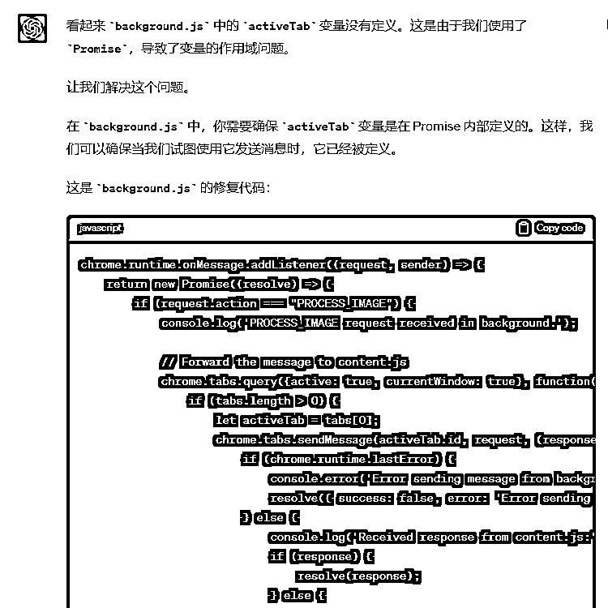

# 如何通过ChatGPT生成视频特效？Code Interpreter GPT编写代码实现Chrome插件

> 来源：[https://kxgiimtbac.feishu.cn/docx/XacsdvICvo1WLcxnG2DcsGPencf](https://kxgiimtbac.feishu.cn/docx/XacsdvICvo1WLcxnG2DcsGPencf)

自从今年3月生财航海期间通过ChatGPT编程并上线第一个Chrome插件（GPTBLOX - ChatGPT Save Data）以来，我一直在探索ChatGPT编程，之后在生财有术的6月航海中做了第一次分享并在随后获得第一篇精华和第一颗龙珠：

新手怎样通过ChatGPT编程落地工具站产品

这个过程对我触动很大，生财就是这样一个神奇的地方，一篇精华一颗龙珠就足以让我们这些普普通通的圈友大受鼓舞，越分享越幸运，感谢亦仁和各位圈友的认可和支持！

作为一名曾经的不那么擅长编程的技术人员，虽然我深知通过ChatGPT开发产品并非最高效和最稳健的方式，刘小排老师也分享过更为高效跑通产品MVP的思路：

善用黑科技工具，做十倍速全栈程序员

写给独立开发者：如何快速做出产品MVP

但我仍然愿意继续探索如何通过ChatGPT编程，为什么呢？

其一，在ChatGPT问世之前，虽然我懂一些编程，也做过一些项目，但以我一个人的编程能力要在两三个月甚至半年内开发出GPTBLOX这个涵盖大大小小60多功能模块（上百个细分功能点）的Chrome插件几乎不大可能，而ChatGPT仅用一周时间就帮我实现产品雏形，并在第二周完成改版和上线，之后短时间内连续迭代4个版本。

GPTBLOX插件细分功能点统计：


虽然目前插件没有任何变现，但已经有接近1000用户，每天看到流量的增加和用户数的变化，给我继续探索AI编程和深挖工具站带来无尽的动力；

其二，对于没有编程基础的圈友来说，要开发一个产品或者实现一个想法，即使在GitHub上找到合适的源码，也难以着手做二次开发和上线，而ChatGPT已经可以让我们通过中文或者英文的指令，就能实现一些简单的需求，如果配合合理的对话和思路，甚至可以开发出具有一定复杂度的产品，希望我在6月航海中分享的思路能给圈友带来一些启发。

## Code Interpreter的问世

今年7月份ChatGPT发布了一个重磅功能Code Interpreter（现已改名为Advanced Data Analysis），其强大的数据分析能力和Python自运行能力再次深深震撼了我，我一度怀疑前段时间在航海中分享的ChatGPT编程思路已经过时，然而，经过一番测试之后，Code Interpreter让我惊叹的同时，也让我失望了，面对稍微复杂一点的需求，Code Interpreter一样会出现GPT4 default遇到的问题，也许Code Interpreter的算法内核本质上也是GPT4。

接下来，我给大家复盘一下前段时间我通过Code Interpreter把图片做出各种视频特效的过程，前面部分复盘Code Interpreter如何挖掘需求、自行编写Python程序并自行运行程序生成简单的视频特效，后面部分复盘Code Interpreter编写一个实现图片隐形特效的Chrome插件，从中了解Code Interpreter的强大能力和存在的局限性。

## 通过ChatGPT生成视频特效

前段时间Twitter上有位大神分享通过ChatGPT Code Interpreter把图片变成隐形特效的视频：

后来找到他在GitHub上的代码：

https://github.com/ChaseLean/gpt-prompts

在ChatGPT Code Interpreter对话窗口附上这段代码，然后上传一张图片：

```
I want to apply the disintegration effect from Avengers to this image. Can you help me with it? Provide me with a link to download the video generated. Use the code below:

import imageio
import numpy as np
import random

# Load the image
image_path = "[INSERT IMAGE PATH HERE]"
image = imageio.imread(image_path)

# Define the block size
block_size = 4

# Get the dimensions of the image
height, width, _ = image.shape

# Make sure the image dimensions are divisible by block size
height -= height % block_size
width -= width % block_size

# Crop the image to the new dimensions
image = image[:height, :width]

# Calculate the number of blocks in each dimension
num_blocks_y, num_blocks_x = height // block_size, width // block_size

# Create an index map of blocks
blocks = np.dstack(np.mgrid[0:num_blocks_y, 0:num_blocks_x]).reshape(-1, 2)

# Multiply the indices by the block size to get the pixel coordinates
blocks = block_size

# Define the distance to move the blocks (Ask the user for X in percentage, tell user default = 10%)
distance = round(0.1  width)  # Replace 0.1 with X

# Define the number of times to move each block
move_count = 3

# Create a copy of the original image to work on
working_image = image.copy()

# Convert the blocks to a list and randomly shuffle it
blocks_list = list(map(tuple, blocks))
random.shuffle(blocks_list)

# Define the number of blocks to move (Ask the user for Y in percentage, default = 2% of the total blocks)
num_blocks_to_move = int(0.02 * len(blocks_list))  # Replace 0.02 with Y

# Create a video writer context
with imageio.get_writer('/mnt/data/disintegration_effect.mp4', mode='I', fps=30) as writer:
    # Write a static image to the first 3 frames
    for _ in range(3):
        writer.append_data(working_image)

    # Loop over the blocks in the shuffled list
    for _ in range(move_count):
        for i in range(0, len(blocks_list), num_blocks_to_move):
            # Select a slice of blocks to move
            blocks_to_move = blocks_list[i:i+num_blocks_to_move]

            # For each block, move it to the left by the specified distance
            for block in blocks_to_move:
                y, x = block
                shift_distance = int(min(distance * random.random(), x))  # Don't shift more than the x-coordinate of the block

                if x-shift_distance >= 0:
                    working_image[y:y+block_size, x-shift_distance:x+block_size-shift_distance] = working_image[y:y+block_size, x:x+block_size]
                    working_image[y:y+block_size, x:x+block_size] = 0

            # Write the frame to the video file
            writer.append_data(working_image)
```

就可以生成这样惊艳的视频特效：

于是我想，能否让ChatGPT模仿这个特效的代码，生成其他视频特效呢？答案是肯定，这正是Code Interpreter所擅长的其中一个技能。

我做了一个测试，先让ChatGPT罗列出10个可以把图片生成炫酷特效视频的效果：


然后让ChatGPT根据我们指定的特效名称直接生成相应的特效视频。

测试过程的对话记录请在生财原帖下载：

如何通过ChatGPT生成视频特效？Code Interpreter GPT编写代码实现Chrome插件

缩放波动（图片以波动的方式进行缩放）：

色彩旋转（图片的颜色会持续旋转和变化）：

镜像翻转（图片会进行垂直和水平的翻转）：

3D 旋转（图片会进行3D空间旋转）：

像素化（图片逐渐被分解为大的像素块）：

融化效果（图片像融化的蜡烛那样逐渐下滑）：

扭曲波（像水波纹一样扭曲图片）：

光晕闪烁（在图片上添加光晕效果，使其闪烁）：

破碎效果（图片像被破碎的玻璃一样分裂）：

心跳效果（图片模仿心跳的效果，进行缩放）：

我们可以清晰地看到Code Interpreter会自行编写相应任务的Python代码，然后在一个临时环境中自动运行Python代码并生成视频，受限于算力和每个会话临时环境的大小，Code Interpreter并不能帮你完成太过复杂的任务，生成我们这种简单特效视频的过程中也常常会出错。

不过让人震撼的是：这些报错是Code Interpreter自动运行过程中自己检测出来的，它检测到报错后还会重新再次运行代码或者重新执行任务，而且别忘了这仅仅是ChatGPT的一个开始，随着算力的提升和运行环境的加大，如果再给ChatGPT接上各种外置的眼睛嘴巴和双手双脚，真不敢想象一个会根据任务自行编码、自动运行代码执行任务的GPT会变成什么样子！我们人类不也是在接收一个命令之后，在头脑中自行构思方案，然后自行执行任务嘛？

## 通过Code Interpreter实现图片隐形特效的Chrome插件

接下来，我们测试一下Code Interpreter的编程能力，让它把上面图片变成隐形特效视频的GitHub Python代码，重新编写成一个Chrome插件。

测试过程的对话记录请在生财原帖下载：

如何通过ChatGPT生成视频特效？Code Interpreter GPT编写代码实现Chrome插件

整个对话和开发过程并不那么顺利，足足花了一个下午的时间，但通过这个过程，我们可以清楚地看到：虽然Code Interpreter的编程能力相较之前的GPT4 default要强，但并不一定能完成所有的需求和任务，而我们之前探索的ChatGPT编程的思路，对Code Interpreter仍然有效，我们通过这个实例，看看怎样通过合理的思路，让ChatGPT Code Interpreter实现我们的需求。

我们先让ChatGPT扮演资深的软件需求分析师，分析上面把图片变成隐形视频的代码逻辑：


思路一：分步骤让 ChatGPT 编写程序

ChatGPT 在输出的时候，经常会遇到输出中断的问题，有时可以通过“继续”、“继续写”、“继续输出代码”等指令引导它继续输出，但并不是总能奏效，而且程序这种上下文强关联的内容，一旦前后逻辑有偏差，就有可能出现问题。因此，我尝试让 GPT4 分步骤帮我输出，先引导他告诉我实现这个功能需要哪些文件，然后再引导它把一个个文件的代码单独输出。

先让ChatGPT根据需求罗列出编写这个插件需要的文件列表：


分步骤依次输出每个文件的代码：


思路二：项目的切入点一定要小

GPT4 已经非常智能，但是并不能奢望直接把一整个项目需求丢给 GPT4，让它帮你写出所有代码。即使项目很小，稍微有一些功能模块，ChatGPT 也不一定真能帮你实现整个项目。一开始的时候，一定要抽象出项目的最小功能点，项目切入点一定要小，小到 GPT4 能给出完整能用的初始版本。这样即使 ChatGPT 给到你的代码存在问题，由于代码量不大，功能点较少，ChatGPT 往往能较轻松地检查出问题所在。

事实上，ChatGPT上面分步骤输出的代码并不能满足我们的需求，稍微细看就会知道它实际上并没有引入做图像处理的pixi.js库或者其他图像处理的js库，因此它生成的代码无法实现我们想要的效果，并且，在接下来的调试过程中，我们也遇到了重重困难。如果我们在一开始的时候，先抽象出项目的最小功能点，比如先实现上传一张图片，然后先做一些简单的处理，也许会更有利于先把插件跑通，然后再在已经跑通的插件代码基础上一个模块一个模块地做进一步开发和修改，最终有可能能更加顺利地实现我们的需求。

思路三：不断剥离出最小相关功能的代码模块

由于我们开发的仅仅是一个小插件，每次让 ChatGPT 修改或者增加的功能只有那么一点，因此，每次 ChatGPT 需要做修改的代码大概率集中在一两个文件中甚至集中在一个文件的少量代码中。

所以你可以把需要修改或者增加的功能的相关代码剥离出来，其他无关代码隐去不提或者用“…部分代码省略…”来代替，每次对话中只给 ChatGPT 最小的代码量，并要求他在这些代码的基础上做修改，这样，ChatGPT 不仅能给出相应解决方案的代码，而且，代码也大概率不会和原来的代码出现逻辑偏差。

由于我们这个插件的功能点还不多，因此还不需要剥离出最小代码模块，但是遇到问题或者需要做调整时，我们仍然可以整理出插件的相关功能的代码，再让ChatGPT在这些代码基础上做修改，比如我们让ChatGPT把图像处理的库换成fabric.js库时，可以把相关代码提供给ChatGPT，让它在我们给定的代码基础上做修改：


思路四：不断让 ChatGPT 检查确认代码

GPT4 的输出有时候还是会出现前后逻辑接不上的情况，因此在开始增加一个新功能前，我往往会重新起一个对话窗口，重新把项目需求和最相关的代码重新输入给 ChatGPT，让它再次确认需求，并重新提供代码让他检查确认是否存在问题。确认无误之后再在这些代码基础上增加新的功能和逻辑。

Code Interpreter本身具备强大的数据分析能力和代码审查能力，因此可以让它直接帮我们审查代码，我们把前面已经生成的代码放在一个压缩包内（打包成zip格式），然后提交给Code Interpreter进行代码分析和检查：


让Code Interpreter分析插件的所有文件代码：


Code Interpreter分析代码后说明了代码存在的问题。我们询问一下ChatGPT怎样修改才能实现图像的隐形效果：


ChatGPT给出了一些修改建议，接着，我们让它就这些修改建议一个个地解决：


思路五：适当地深入功能和代码来对ChatGPT做引导

在 ChatGPT 就某个问题来回多个对话仍然无法解决问题时，我们最好要深入具体功能需求和代码中，根据自己的经验做一些判断，引导它尝试使用其他方式实现需求。

比如这个插件，ChatGPT一直围绕着pixi.js库来实现图像隐形的效果，但却一直解决不了问题，我们可以这样引导它通过其它方式来实现相同的需求：


然后我们让它转用fabric.js库来实现图像处理的需求：


思路六：让 ChatGPT 自己检查并解决问题

通常，在多次对话后无法解决问题时，ChatGPT 往往会开始给你的代码增加 Console 日志，如果他没有这么做，你也可以引导它在代码片段中增加跟踪日志。然后把程序运行的结果或者报错直接粘贴给 ChatGPT 做检查。

比如我们测试插件的时候出现这个报错，我们可以把报错信息反馈给ChatGPT：


ChatGPT往往都会自行检查前面的代码逻辑并给出相应的解决方案：



这个思路在我们通过ChatGPT编程的过程中经常都要用到，尤其是项目有一定复杂度或者你的需求表述不清楚的情况下，更加需要不断地与ChatGPT进行多次对话和确认。试想一下，帮你做产品开发的同事在编写程序的过程中，同样会遇到各种问题和波折，只有直面问题，设法解决一个个问题，项目才有可能最终落地，而我们在通过ChatGPT编程的时候，虽然不做具体编程，但是我们必须充当产品经理和测试工程师的角色，尽最大可能给ChatGPT表述清楚产品的需求，在ChatGPT编写好代码后测试出产品存在的问题并清晰地反馈。ChatGPT不单单是我们的工具，更是我们的Partner，我们需要和他并肩作战，才能攻克一个个产品难题。

最终ChatGPT帮我实现了这个插件的雏形：


上传一张图片，点击“Apply Effect”，生成了一个视频，点击“Download Video”下载视频，我们可以看到这个Chrome插件实现了一个稍微粗糙点的把图片生成隐形特效视频的功能：

## 对Code Interpreter的展望

有人把Code Interpreter称作ChatGPT问世以来最为重磅的更新，其强大的分析能力和自运行能力正在颠覆我们的许多认知，除了我们经常看到数据分析和生成图表之外，我的朋友 文韬武韬 正在用它做亚马逊数据分析和选品，并且选出了不少极具蓝海价值的产品。

而我，主要通过它来编程，ChatGPT已经帮助我开发出一些产品雏形，尤其是Custom Instructions出来之后，这种预定义指令一定程度上解决了ChatGPT无法长时间记忆的问题，而且通过设定一定的规则，我已经尝试通过Code Interprete结合Custom instructions实现半自动甚至全自动生成贪吃蛇、飞机大战、连连看等Chrome插件小游戏。受限于GPT4编程本身存在的问题，这种尝试并不总能奏效，这一块我仍然在测试中，如果有进一步的进展，再和大家分享和探讨。