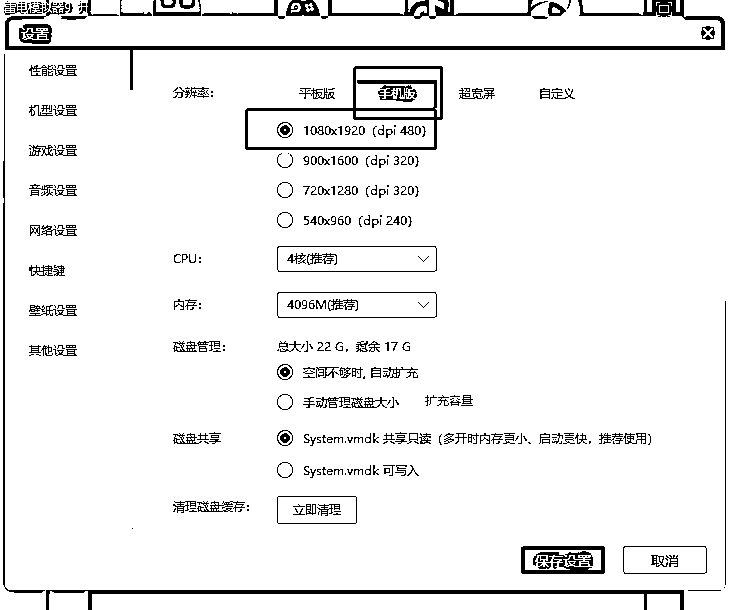
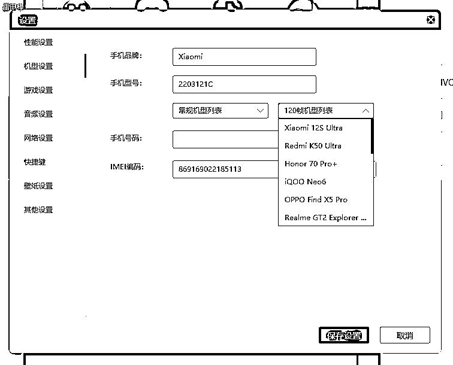
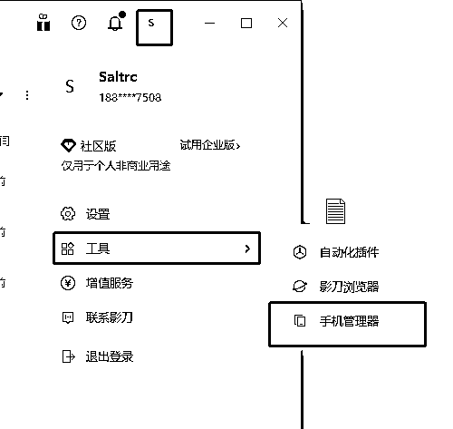
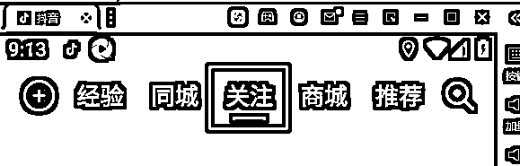
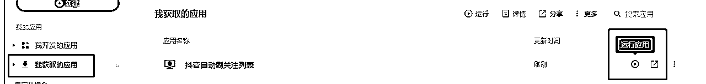
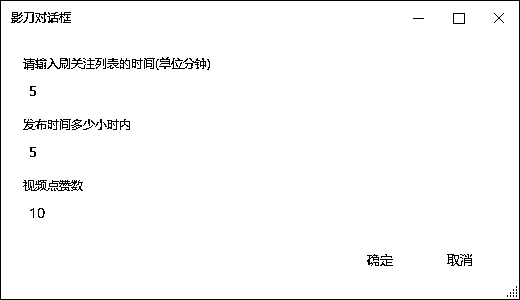
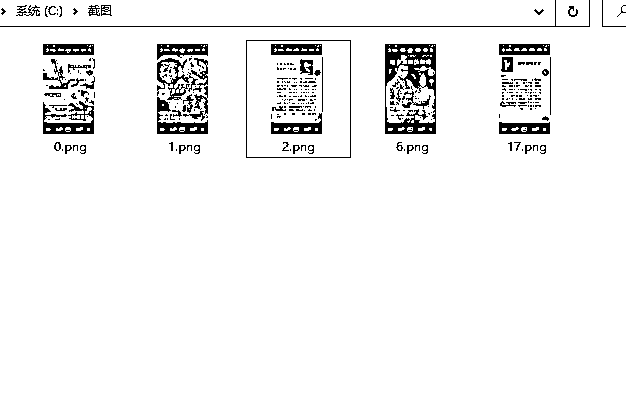
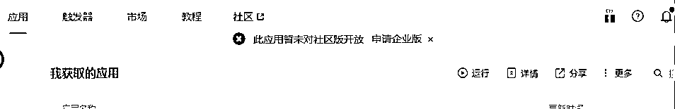

# 抖音图文如何快速跟款？借助RPA工具自动化刷关注列，捕捉异常值

> 来源：[https://o6tet8cc4p.feishu.cn/docx/YCBsdJF8soOx4MxX8afcH1Zrnih](https://o6tet8cc4p.feishu.cn/docx/YCBsdJF8soOx4MxX8afcH1Zrnih)

# 用这里提供的安装包，不要自己下载！！！

因为用了模拟器，建议使用台式机，或者游戏本。

### 零、先关注一定数量的优质对标账号，再试用该工具效果更好

该工具只是替你减少刷抖音的这个动作，优质的对标账号还是要靠你自己去收集关注

### 一、原理

通过模拟器安装指定版本抖音APP，结合已经写好的PRA指令模拟人工刷抖音，把符合条件的图文截图保存

### 二、需要的工具

1.影刀（软件下载地址：https://www.winrobot360.com/share/activity?inviteUserUuid=d57f8143-91a1-4ef4-b465-fdbac9f34904），安装软件并注册账号

2.雷电模拟器（软件下载地址：https://www.ldmnq.com/），安装软件并设置好分辨率和手机型号（这里设置的不是你自己目前使用的真实手机，跟着文档操作就好了）

### 三、实操

1.模拟器分辨率和机型设置好后，安装第一步提供的抖音apk文件(然后重启模拟器)并登录你关注了同行的抖音账号

2.关闭模拟器

3.建立影刀跟模拟器的通信 影刀官方文档：https://www.winrobot360.com/yddoc/topic-basedDoc/ad425eef1331b4da07d7de584f16c273.html

跟着这个文档操作，只需要看前面的8点就可以了。

4.影刀官方文档中第7点命令是adb devices -l(这个是小写的L, 不是数字1)，

5.如何判断通信是否建立，打开手机管理器，点击左边我的设备列表的连接，第一次连接需要安装几个app,点击同意就好

6.打开模拟器中的抖音，并切换到关注列

7.获取我分享的指令(因影刀方面的原因建议注册新账号，因为新账号送一个月的创业板权限。只有账号有创业板权限才能使用别分享的程序，并不是我这边程序所控制的)：

https://api.winrobot360.com/redirect/robot/share?inviteKey=ac0c84806820eca9

打开上面这个连接，立即获取就可以了。获取后查看

8.完成上面的操作后，点击运行程序了。程序中有3个输入框如下图：

符合条件的图文程序会自动截图保存在C:\截图（需要先在你自己的电脑上创建这个目录）

### 四、常见问题

1、如遇到下面的情况，重新注册一个影刀账号，然后获取第7步中的程序即可。

