# 0成本抖音团购项目，带领学员做出400w+GMV

> 来源：[https://n28vbku1px.feishu.cn/docx/J1iQdneeFoqrvkx702CcsOLlnme](https://n28vbku1px.feishu.cn/docx/J1iQdneeFoqrvkx702CcsOLlnme)

Hey，各位有钱有颜有实力的圈友们大家好

我是清一，一位在培训行业干了五年的私域培训师。

今天这一篇文章想跟大家详细的分享一下“抖音团购”这个项目

我通过20几天的时间，带领学员做出400w+GMV。

现在很多学员在没有任何新作品产出的情况下，后台收益还在不断的增加

本来只是为了打发时间，因为我主要的项目还是私域相关的

但是看到这个团购还有巨大的发展空间，所以写了这篇帖子出来分享

特别是这两天很火的酱香拿铁，大家喝上了吗？

4号当天，酱香拿铁单品首日销量突破542万杯，销售额超过一个亿，根据瑞幸直播间的数据来看。“酱香拿铁”的在官方直播间渠道销量已经超过100万杯，超过以往所有的“年度重磅”单品的。

由此可见，抖音还是提高门店销量的主力军，这仅仅是官方直播间的数据，不包括其他的kol数据。

这也是我认为抖音团购这个项目还非常有市场的原因。

下面我来拆解一下我是如何通过抖音团购变现的：

## 案例分享

以下是我和我学员的部分数据分享：

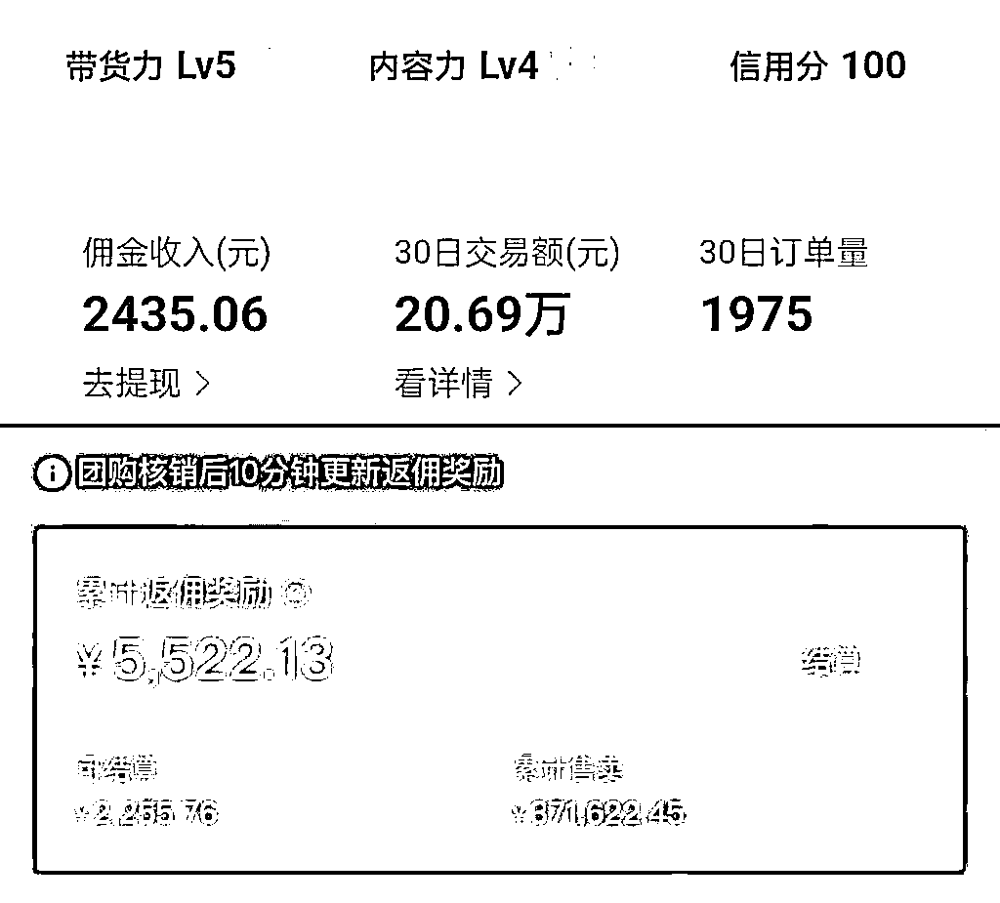

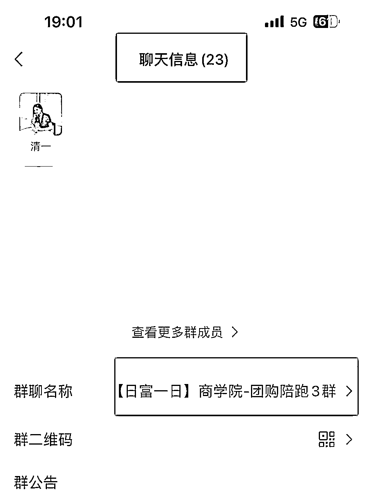

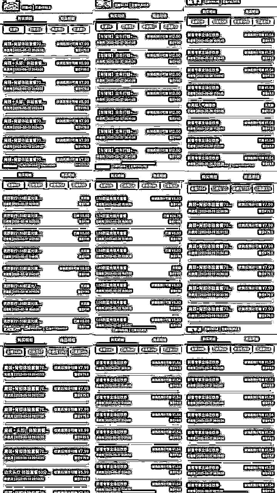

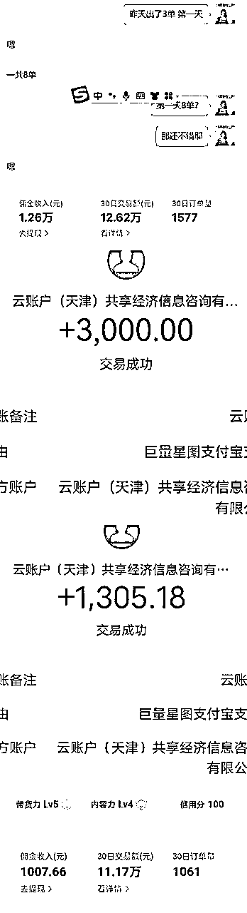

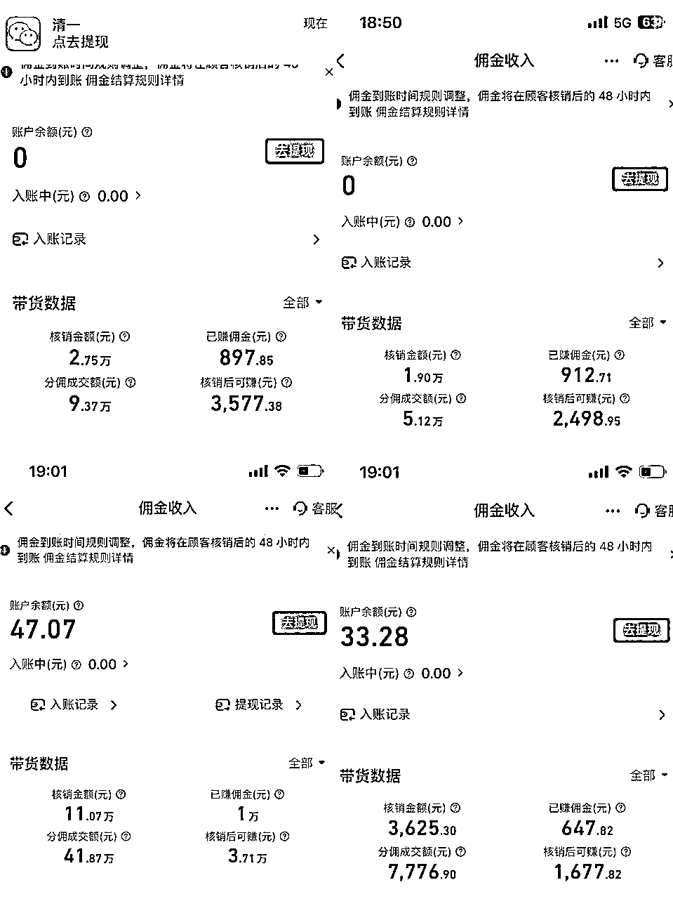

上面第一天就出了8单的是一位宝妈，半个月变现1000+。她的生活主要就是带孩子，团购项目确实很适合她，每天花30分钟发作品就足够了。

还有一位上班族，一天发10几条作品，半个月变现1w+，战绩比我牛多啦~ 这个也和发的作品数量有关系。

## 项目介绍

下面我来详细的介绍一个这个项目：

### 字节跳动的本地生活服务

简单来说，就是帮餐饮店、 咖啡馆、酒店、娱乐场所等等的线下商户，卖消费券。跟美团干的事儿一样，区别在于，入驻美团的商家不用拍视频，入驻抖音的商家需要拍视频，需要有产出内容的能力。

但对于绝大多数的线下老板来说，他们根本不会拍视频，不具备运营能力。怎么办呢？

抖音推出了“团购达人”计划。

只要我们任何一个用户在分享视频的时候，挂上线下商户的消费券， 有人通过这个分享购买了消费券，并且最终使用了这个消费券，咱们就可以获得佣金了。

（我用的方法不需要真人探店 第一天就可以出单！）

### 适合人群：每天有30分钟发作品的宝妈、学生党、上班族、自由职业者

只要你每天能保证30分钟去发布产品，这个项目就完全可以做，对于小白来说真的很友好。

### 发布作品的三种形式：

#### ①实探：

操作技巧：自己拍利用好黄金前三秒。一开始就把体验完之后的感受，来作为开场白。比如“我的天！， 你敢相信么？我点了这么一大桌只要 99！”。这样的方法能够吸引粉丝眼球，让它在你的视频当中停留下来。接下来就可以介绍店铺和商品了，也可以拍摄商店的门头，店里的环境特色商品的全景和特写镜头等等。

优点：可以白吃白喝，一般这种去探店都是置换，或者给到一定的车马费。

缺点：比较费时费力，制作成本高，且产出的数据不会太好。

#### ②混剪

如果你自己不会拍视频，还有一种省事的办法，把同行里拍得好的三五个视频，拿 过来做二次原创，也就是混剪。类似于影视剪辑里的混剪，素材打乱、镜头重组、视频变速、 调色、加边框等等。

#### ③图文

直接发图文模式，图片去小红书上找。我也见过几千赞的、 挂着商家连接的美食图文，只要内容好，一样能火。不管哪种模式，都有做得好的同行，前期多去模仿他们。

我用的是后面两种办法，基本上不去实探，我自己尝试过，实探的作品浏览不过几百，但是图文和混剪的基本上每一个作品都出单，有很多作品都是百万的播放量。

而且现在有一些技术，是可以实现直接照搬的，根本不用自己去云剪或者做图。

（目前在探索的过程中）

## 实操玩法

我主要来分享图文方面的实操玩法：

### 从 0-1 如何搭建账号

新账号垂直定位/账号四件套搭建

什么是定位，就是你之后想要在抖音上做什么领域，决定大家以后发什么样的作 品，发什么样的素材，有什么样的精准粉丝，只有定位好了才能找到用户画像， 我们是来抖音带货的，是来抖音赚钱，不是做娱乐做剧情的。

团购我们就做吃喝玩乐（全国的都去做）综合类达人，一上来我们卖的可能佣金比较低，但是出单比较多， 流量也会比较多，而且目标客户大多数都是女性，粉丝粘性比较强，比如说之前我们团队里有个成员，干洗套餐卖的很好，那我们前期可以一直去卖这个套餐，主做这个也是没问题的

案例:

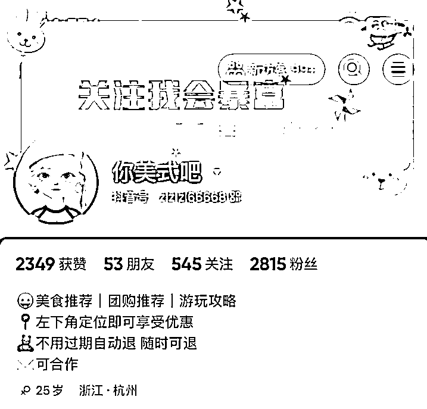

四件套是什么，名字，头像，背景图，个人主页

怎么把四件套做专业呢？

名字：怎么取，要记得三点，好听，好记，好传播。

例如：花花爱分享

最好是个人名字+定位，比如 xxx 团购分享，尽量 4-6 个字，不要太多，根据咱 们的定位来。简单明了。

头像：是咱们的招牌，第一印象就是头像，最好用自己的，有个人 IP，有亲和力， 也可以用卡通头像，用自己照片做成卡通形象，自己可以设计。

背景图：也就是头像后面的图片，这个长条怎么做呢，添加一个比较简单大气的， 不要太花哨的。

个人主页：这也是很重要，尽量不要超过 4 行，用 2-3 句话介绍，比如你是来抖 音做什么类目的，关注你有什么价值，能够得到什么？大家可以参考一下同行的。

### 新人如何开通团购账号

第一步：打开抖音我的主页，右上角三条杠

第二步：进入创作者服务中心

第三步：进入创作者服务中心

第四步：实名认证（部分地区限时免1000粉丝）

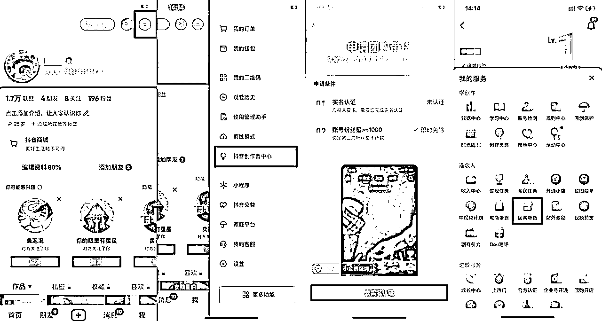

### 如何发布新作品？

第一步：准备好要发布作品的图片和文案

第二步：找到合适的 BGM（前期建议使用别人制作的音频，也可以自己制作）

举例：

要发的品是火锅，先收藏我们想要配的音频，右下角小圆盘（收藏到我的音乐）

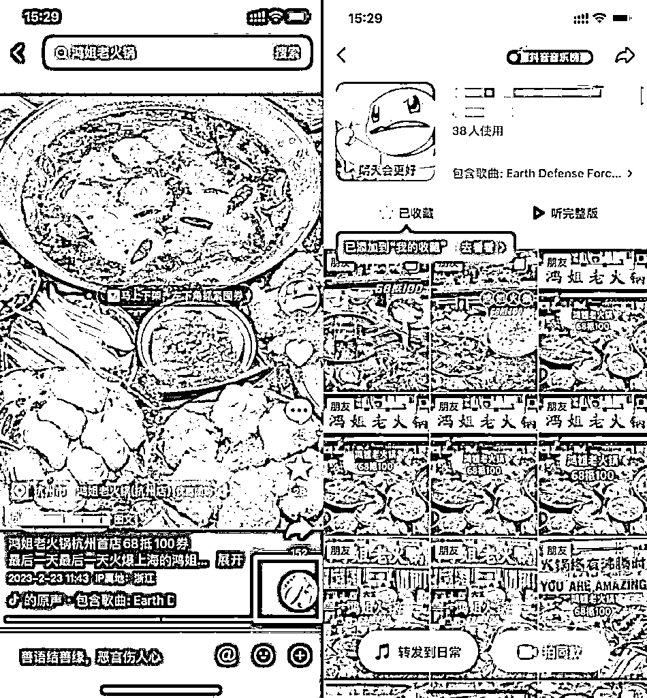

第三步：发布作品

可以直接点击右下角【拍同款】

也可退回抖音首页点击“＋”

上传我们准备好的图片

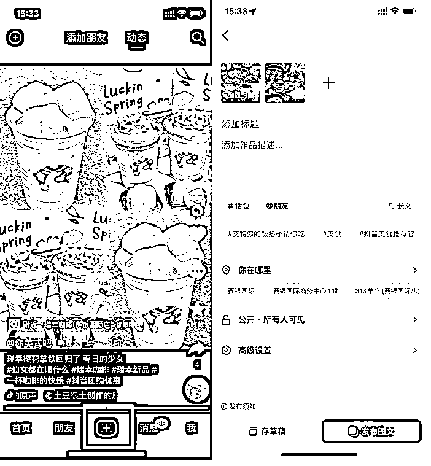

第四步：写好标题、文案、话题、带上定位

标题：标题一定不能带敏感词，我们可以利用一些工具脱敏

话题：带团购相关的，比如说#优惠#美食#团购 #西双版纳 #滑雪 #民宿 #度假 #抖音网红餐厅 #美食推荐官等等

定位：这里我说一下，开通团购达人以后，带上定位就会显示下单佣金，但是同时要记得打开“门店自动推荐”，这样可以获得更多的流量，同时其他诚实的人刷到我们的作品，看到的就是她身边就近门店的团购套餐。

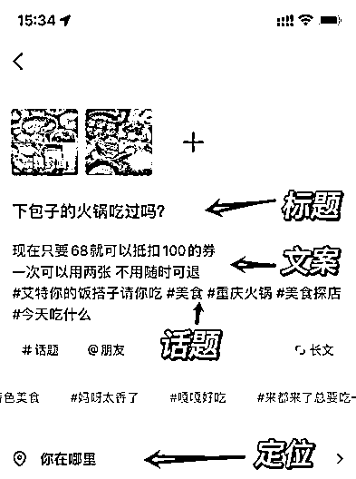

### 如何找素材

例：瑞幸咖啡

第一步：打开小红书（其他平台同理）

搜索【瑞幸咖啡】

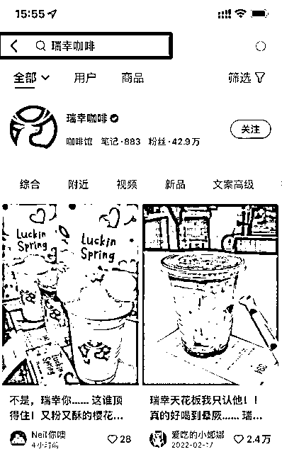

第二步：找到满意的图片进入笔记页面

点击右上角的箭头-复制链接

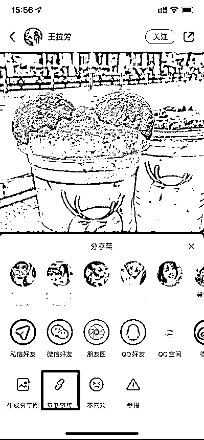

第三步：微信搜索去水印小程序

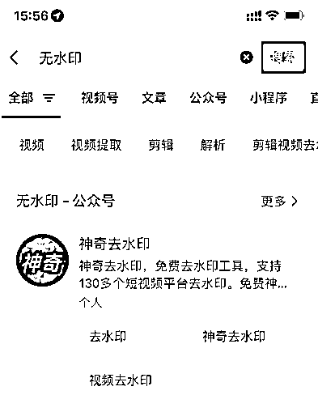

第四步：复制链接点击提取

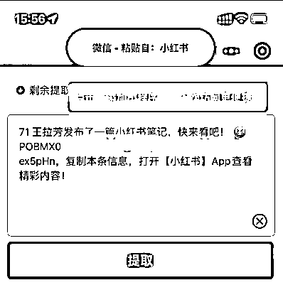

第五步：保存想要的图片即可

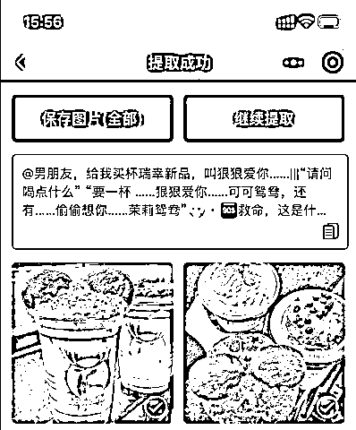

### 如何做好防搬运

第一种：二次修改图片

①用美图秀秀（醒图）打开一张保存好的图片

②给图片大小进行重新调整

③换一个新的滤镜

④进一步调整图片细节（锐化、清晰度、色彩度）

⑤可以再将图片进行镜像展示

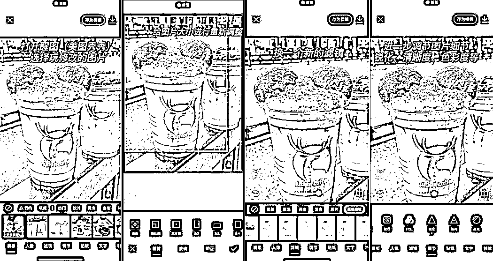

第二种：拼图不易被判违规

①打开美图秀秀的拼图模式

②选取 2-9 张准备号的图片

③可以使用无缝拼接也可以用原始的拼接

④保存图片就是一张全新的图片

⑤同时可以使用保存好的图片 加上一些文案

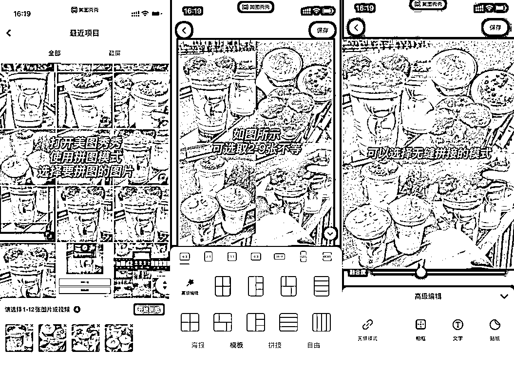

第三种：给图片添加配方

①导入图片到美图秀秀或醒图

②给图片选择合适的配方模板

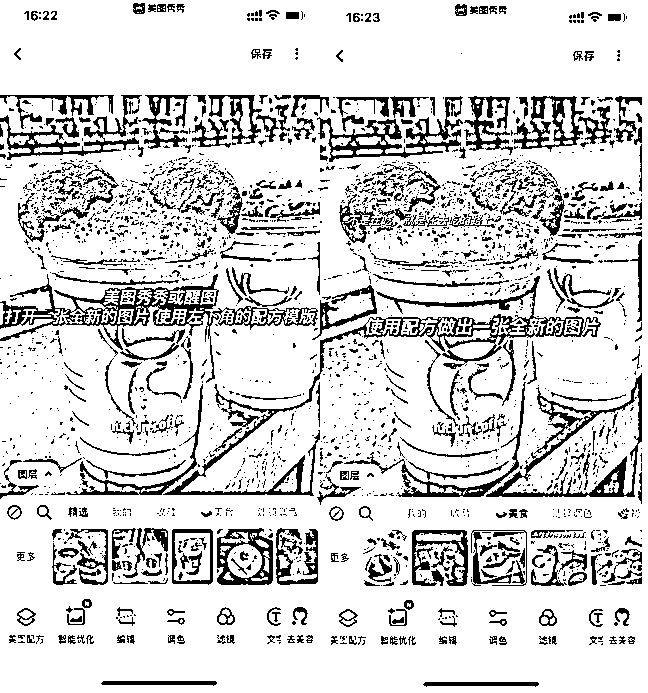

第四种方法：抠图+加贴纸

①使用美图秀秀抠图工具

②将抠好的图片进行细致处理

③给图片换一个新的背景，也可以换上产品门面图

④也可以给图片换一个新配方

⑤当然还可以加入自己喜欢的贴纸

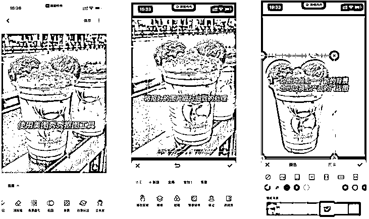

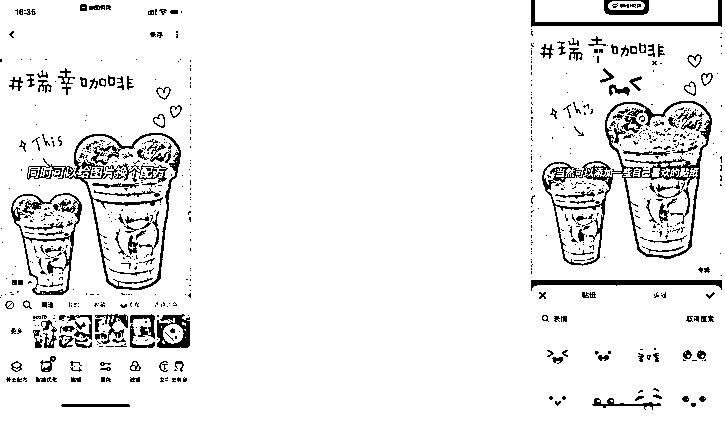

第五种：给做好的图片导入一张自己拍的图片

①选择已经做好的图片加入醒图

②使用导入图片功能，导入一张自己拍摄的图片

③把图片放大至全屏或部分均可

④将图片的透明度调整至 1-2

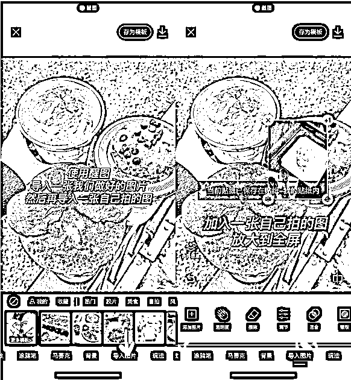

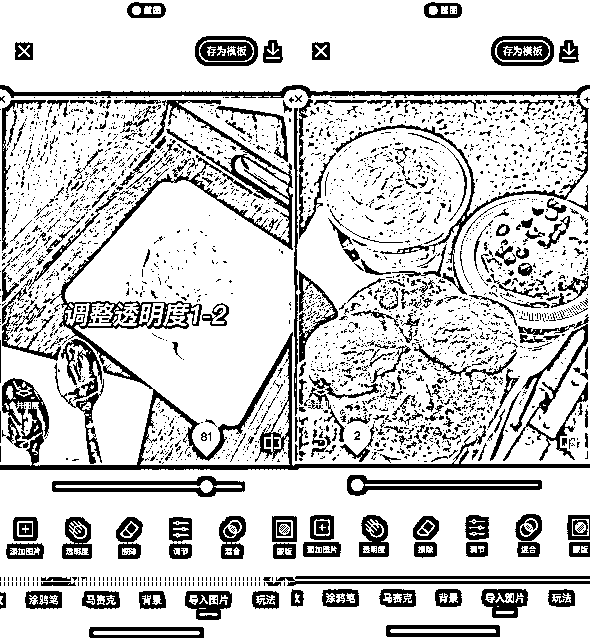

### 如何选品？

这么多产品怎么选择的？当时我们是跟着当下热门来做的，什么店新开了，或者佣金高，就去发这一类的。

前期可以选择一些美食、出单是会比较容易的，像库迪，瑞幸这样的。

也可以做团旅产品，佣金高。

当然也可以根据当地的一些消费方向来选择

选品原则：佣金高、折扣大、近期热门。

比如最近的酱香茅台，就有大批人在跟。

从抖音吃喝玩乐榜单上也可以找到对应城市选择对应的地点

我是比较建议大家跟着团队去发~

首先团队的品是有保障的，另外团队会根据当下的热门产品来给你选品，你只要跟着发送就完事儿~

前期自己选品容易缺乏经验，摸不准爆款，短时间内没出成绩容易打击自信心。

## 必备心态

### 重视，但不看重

这是什么意思呢？就是说你要重视互联网，重视自媒体，因为这是普通人赚钱最好的渠道。自媒体是绝佳的杠杆。

如果你不重视它，它就不会给到你一个好的反馈，做任何事情都需要时间的积累，没有持续的坚持是很难拿到你想要的结果的。

但是又不能太看重，比如我个人就有数据焦虑，看到很多人的账号总觉得这是一夜暴富的捷径，然后把很大一部分生活的重心都放到这上边。

其实对于普通人来说，没有天赋异禀，你想要通过这个项目迅速赚大钱不可能，但是赚够生活费，或者一个月多赚2万块，我个人认为没什么太大问题。

既要重视，又不能太看重结果，保持积极的心态。

### 拉长战线，拒绝焦虑

选题焦虑、数据焦虑、小眼睛焦虑、赞藏焦虑。像团购这样的项目，你做了就会有收入，但是很多类型的账号就未必了，很多人都是被焦虑打败的，最后不了了之。

我自己出过不少爆款，实际上都是无心插柳柳成荫。当做一个业余的兴趣爱好来做，结果在做的过程中认识了很多同频的朋友，加上自己不断的更新迭代，反而进入到一个正循环的状态。

### 保持耐心，持续学习

做自媒体耐心是必不可少的，或许你每天都要运营很多账号，前期正反馈极少。

有人说这个行业很浮躁，我认可，但正是因为这样，有足够耐心的人才最难得，最容易收获成绩。

纵观整个自媒体行业，那些可以赚到大钱并且保持长期盈利的，都是有着很深厚的沉淀，雷打不动一天五条朋友圈，日更账号。缺乏耐心的都是昙花一现。

功夫深，铁杵磨成针。

以上就是我全部的分享~

感恩生财有术这个平台，让我有了更多可能。

祝各位圈友都能成功生财。