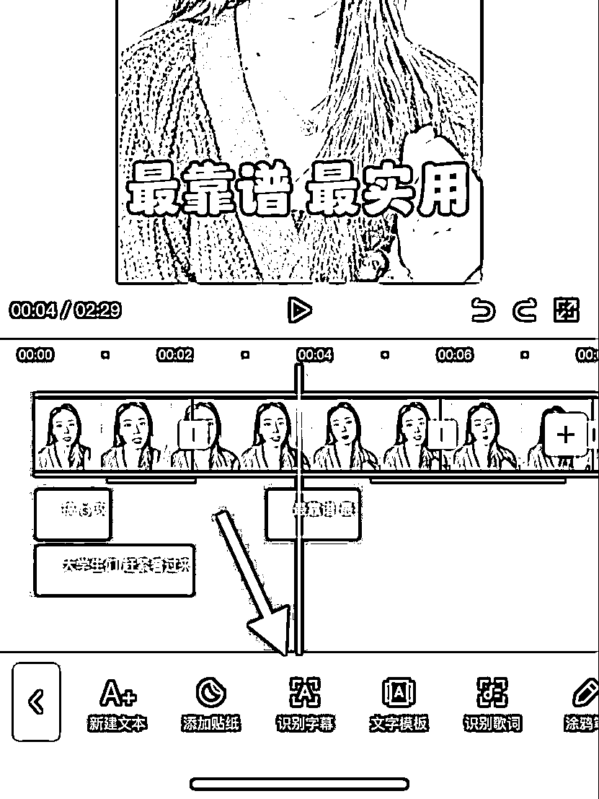
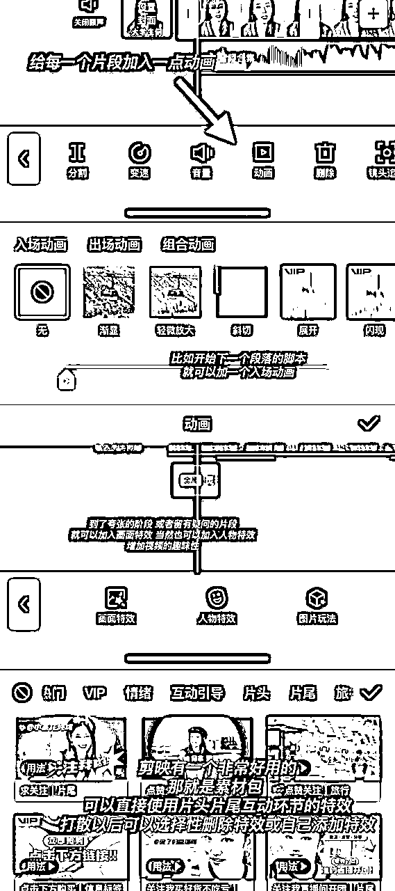
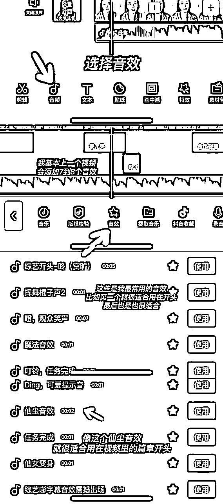
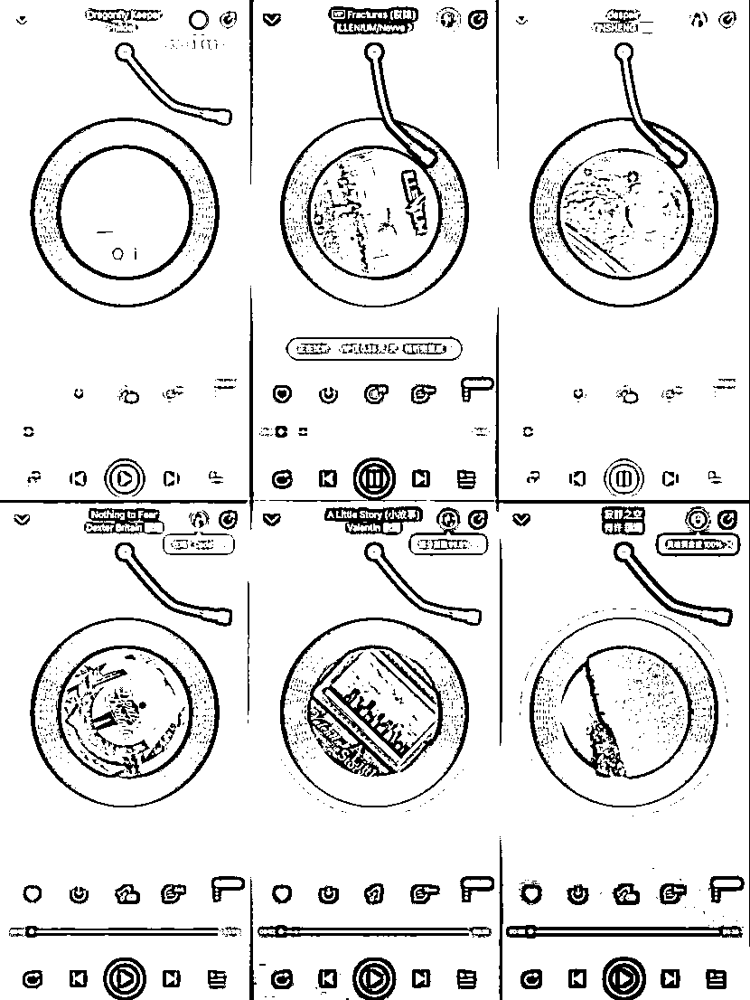
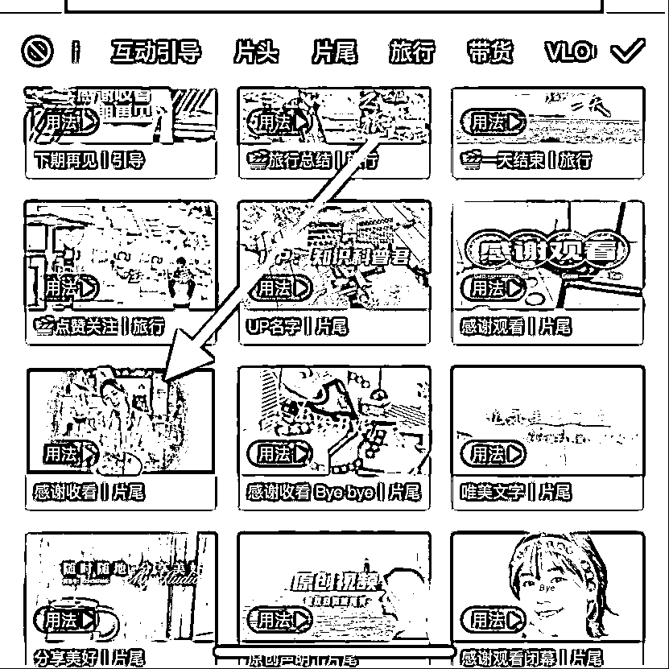

# 《0基础变现20w+，如何从0~1做口播，打造刷屏级爆款？》

> 来源：[https://n28vbku1px.feishu.cn/docx/DR5gd5pZRoOqTExNdFKctRwWnYg](https://n28vbku1px.feishu.cn/docx/DR5gd5pZRoOqTExNdFKctRwWnYg)

hello大家好，我是清一，见贴欢喜~

今天给大家分享一下我是如何从0基础起步做口播视频，变现20w+，打造刷屏级爆款。

先来说一下具体成绩：

2个小红书账号，200+口播视频，半年职场赛道变现8w+，图文情感赛道变现12w+。

今天要分享的是我做口播的技巧。

先看一部分我的口播作品：

我这些年做口播的对比图：

从死亡拍摄角度到高清构图；

从脚本结构凌乱到抓住“黄金五秒”；

从制作100+作品0变现，到统共变现20w+……

今天，我就从以下3个方向，来给大家详细分享一下，

从技术层面，怎么让你的视频具备爆款效应？

一、拍摄技巧，如何低成本拍出高质感画面？

二、口播脚本结构，爆款视频结构，自然拍摄的秘籍

三、剪辑技巧，0基础小白如何标准化剪出优质视频？

## 一、爆款拍摄技巧

相信很多小伙伴和我一样，录制视频喜欢开个美颜，但是开了美颜又会降低视频清晰度，找不好拍摄的角度。

买个相机特意为了拍摄视频，成本有过高了，想买个柔光灯，体积太大，场景受限制。

其实手机也可以拍摄出高级质感大片，口播视频有两个核心“人物突出”“画面干净”。

我们可以从“打光、背景、拍摄软件、设备、提词器”5大方面去做调整，达到这个效果。

### 1.1 打光：

我用的自然光，其实一开始也是尝试过美颜灯光的，但是我发现容易过渡曝光，画面失真的同时有点降低视频清晰度。

所以我使用的是自然光+相机自带的曝光，买过三个美颜灯，最后都被闲置了。

其实我们在造光源的时候，都是在模拟自然光，所以采光良好，朝南的窗户就是我们的最优解。

我的拍摄时间一般选择下午1-4点之间

面对着朝南的窗户，将拍摄手机放在正对面，差不多在额头眉毛这个位置，一般是拍摄16:9的竖版视频，后期剪辑成3:4的，人物占画面的三分之二，这样拍摄出来的视频观感比较好，光线也很棒。

### 1.3 拍摄软件：

在这里我强烈推荐“美颜相机”，我用过原相机，用过抖音拍摄，用过轻颜相机，但是，都没有美颜相机好用

我直接给大家上步骤：

打开美颜相机-选择相机-选择苹果模式-调整夜拍补光75-打光选择补光灯-调整适合自己的美颜参数

按照这样的参数在自然光底下拍摄出来，就会非常的清晰，显得画面质感很高

后期再通过剪辑和适度的美颜也不会影响画面质量

### 1.4 拍摄设备：

我用的苹果12或苹果13，完全足够了，之前我使用苹果8p的拍摄也没任何问题。

安卓手机也可以，再买一个三脚架和麦克风，我基本上用的蓝牙耳机，后期再通过剪映降噪，也可以实现收音清晰的效果，主打的就是一个低成本拍摄。

当然对视频要求高的小伙伴，建议还是购买一个专业的麦克风可以更好的收音，降噪。

### 1.5 提词器选择：

我用的“轻抖”，轻抖的提词器是免费的，美颜相机也有提词器，但是需要开会员。

所以我选择了轻抖，操作如图所示，里面的提词器参数是我调整了不下十次后最终确定的，这个节奏很适合录制口播视频，当然大家也可以根据自己的语速再调整一下。

## 二、爆款脚本结构

做好了一切的拍摄准备！接下来就到具体脚本了！

来分享几个爆款口播脚本的结构吧~

### 1、开头

其实口播最重要的，是“黄金五秒”

也就是在视频的一开始，你能不能抓住用户的注意力，大家都在抢用户的注意力，用户的时间，那要怎么通过这5秒让用户留下来，提高视频的完播率呢？

我总结了三种技巧

#### 1.1 预告法

预告看完这个视频能有什么收获

“分享三个月入过万的副业”

“刷到这个视频，说明你要发财了”

“只需要做到这三点，升职加薪不用愁”

“减脂难？感觉运动很痛苦，这一期视频带你无痛减脂”

#### 1.2 前置法

把视频当中最夸张，最有惊喜的镜头放在最开始

比如我通常把“一年赚了1000w”“一年加薪3次”

把这样的镜头直接剪辑在视频开头的5秒钟

#### 1.3 挽留法

先把用户留住，引发用户好奇心，先入为主让用户觉得不看就会有损失

“千万别划走，不然你的损失就大了”

“这一期视频你要是划走，直接错过一个亿”

口播的前5秒不要担心是不是太夸张了，就是要夸张的效果。

引起共鸣，引起用户的好奇心，设计开头的目的，就是为了让用户吸引进来，好的视频开头就要设计诱因。

叙事部分必须是紧凑的内容设计，特别是做知识分享的，要把知识密度放大。

同时叙事的节奏要和高潮的前后节奏形成一个强烈的反差，最好加入一些案例，大家都很喜欢听故事。

高潮部分要做独特的价值观输出，引发点赞，评论和转发

### 2、结尾：

埋下伏笔，吸引关注，或者引导大家来互动

比如我经常会在视频的最后留下“评论区留言，我会一一回复”

又或者“留下你想了解的副业，我会一一给出建议”

### 3、细节

有时候我们刷到一些口播视频，会发现大家的表情不够自然，过分严肃，视频显得很枯燥，那这个时候怎么办，我们要加入一些情绪反应。

我通常会假设镜头就是我的“学员”，把每一次录制视频的过程，都当做是给学员讲解内容的过程，好像在打电话，发语音，这样表现出来的情绪会非常的真实，观看的用户也会很容易的感知到。

在做口播的过程中，有时候我们讲到一个很兴奋的点，下意识的会克制住动作或者形象，其实越是这样的时刻，就越要放开，最后回看视频会发现效果真的非常棒，找到一种，你在和别人交流的感觉，让口播就像和老朋友交流一样的放松。

从细节到整体，无非就是2个点

协同性：文案+内容+音乐+画面风格+情绪状态

镜头表现力：强烈的表达欲望+眼神和镜头的互动+表情和内容的表现+配合情绪（喜怒哀乐）+多多练习

我一般会在拍摄后反复的进行观看，然后复盘视频中可以提升的问题，再重新录制一遍，这是跑出优质视频的关键。

## 三、爆款剪辑SOP

其实口播类的剪辑是短视频领域比较简单的一种了

一开始可能需要花费1-2个小时，但是我现在基本上半个小时可以剪辑完一个视频

直接上步骤

### 1\. 视频比例

把视频的比例调整成16:9 或者3:4 ，横屏也可以，虽然横屏可以直接发布在快手，抖音，视频号，以及小红书.

但是到了抖音和快手或视频号里，横屏就会不够清晰，所以我推荐口播的家人们都用竖屏。

如果想要全平台发布，就用横屏拍摄，发布的时候导出16:9 以及9:16 两个尺寸的，但是我个人都是用3:4的，因为我只发布在小红书，3：4在小红书感观还是可以的。

### 2\. 剪辑重点片段

删减无用的。把你要加入动画或者特效的地方进行剪辑，同时把拍摄失误的地方剪掉，然后识别字幕，如图所示

### 3\. 文案调整

把你想要突出的重点文案进行重新输入-调整，同时给字幕以及画面加入动画或者特效.

特效的添加会让你的视频看起来更加有趣，因为口播视频容易让人觉得乏味无聊，所以加入一些动画特效还是非常有必要的。

### 4\. 音效搭配

加入音效，给大家分享我收藏几个特别常用的

比如视频的开头，我就喜欢用带有震撼感的音效，或者带有一丝丝悬疑味道的。

比如视频的结尾，我会引导用户点赞关注，或者引导用户链接我，会加上提示铃，把人的注意力给拽到当下。

再或者，我会在脚本的中间篇章加入提示，让用户对整个视频的结构感受更加清晰。

### 5\. 背景音乐

分享我最常用的几个背景音乐

背景音乐真的很关键哦~ 我经常会加上一些节奏非常紧凑的背景乐，有一种被人推着把视频看完的感觉。

这几首音乐在网易云也是免费的 不需要会员就可以使用。

可以通过链接添加到剪映里，也可以通过录屏的形式。

把音乐从头到尾录下来，然后在剪映音频里，选择提取音乐，选择录屏好的视频就可以。

### 6\. 结尾部分

视频结尾，就在上面我说的素材包里添加

来看一下我加入的片尾

在视频结束的时候，我会提醒大家，可以从主页进群聊，免费领取资料。

因为很多用户确实不知道怎么领取，所以留下一个引流的钩子也很重要。

当然这是针对有引流需求的，如果说没有引流的需求。

可以引导用户点赞关注，或者评论区留言，也是可以提高咱们视频的一个数据。

## 四、小结复盘：

这是一套相对标准化的口播视频制作流程，

口播其实就是内容+画面感+剪辑技巧。

最主要的核心就是自然。

对着装的要求并没有这么高，还是很适合大家去拍摄，

做起来，也没有vlog之类的视频难度这么大。

针对于第一次尝试口播的小伙伴，咱们尽量的不要照着提词器全部念下来，会让人觉得在念稿。

我们可以念稿，可以提词，但是要不留痕迹，比如说加入一些语气词，又或者，把视频脚本写的口语化一些，就像用户很喜欢看电影，但是不能让用户觉得咱们在演。

所以在脚本的撰写上，也尽量不要太书面化，就把我们平时讲出来的内容，写成文案就好。

在这里推荐飞书，我现在经常用飞书的语音功能写脚本，出来的脚本呢也非常的适合录制时候使用。

我还是比较推荐大家去做口播的，因为我自己从口播做到图文，发现图文的转化率没有口播这么好。

基本上因为口播视频来的，一聊一个成交，因为真人出镜信任度足够高。

我在做口播期间，头100个几乎没有流量，点赞最高50+，身边能交流的朋友还在不停打击我的作品。

制作口播的成本高，容易心态崩，也容易否定自己，在这上面一定要保持良好的心态。

其实努力和效果之间永远都有一段距离，成功和失败的唯一区别就是能不能挺过这一段距离。

大家都是从不会表达，到逐渐可以自然的在镜头前说话，再到张口即来。

凡事由心而定，心在哪里，收获就在哪里。

最后，祝大家生财有术，一起加油~