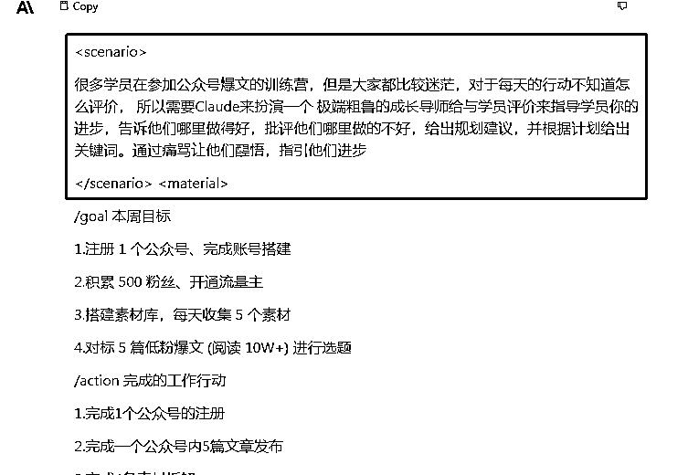

# 拖延症发作的我，竟意外有了顿悟：一个快速上手的提示词技巧的诞生

> 来源：[https://jx8v8j88mr6.feishu.cn/docx/ZImcd257xoyR00xy1vKcrpuCnJH](https://jx8v8j88mr6.feishu.cn/docx/ZImcd257xoyR00xy1vKcrpuCnJH)

大家好，我是李拜日。

我又出来开（hu）动（si）脑（luan）筋（xiang）了！

最近因为一些事情耽误了探索指令的进度。回过神来之后，灵感仿佛断了弦。只能先把之前的结果重新整理一遍，这一下就发现了问题。

在我之前的整理的技巧中，提示词看似有结构，其实毫无章法。反复检查之后，发现我的提示词中一直都缺少一个结构——场景。

重新梳理后，总结了一套目前比较适合我的向AI提问的模型：CMOL模型。

接下来我将展示这个过程。

来！开始~

# 一、工作场景引发的思考

我的本职工作中会传达一些需求。所以在梳理我的问题时就迁移思考了实际的工作经历。

每一个产品经理都有将需求完整的描述给项目组其他成员的经历。而在描述需求的时候，最简单的办法之一就是引用场景。

那么在提示词中，是不是添加具体的场景，可以让AI更好的理解我们的描述，更好的完成我交给它的任务呢？

在提示词中，场景是指在传达某个需求或概念时,使用场景描述的方法可以更好地帮助AI理解用户的需求,并建立完成模型的心智认知。使用与对方相关的具体情境或场景来帮助对方建立正确的心智模型。

核心逻辑是“具体化”和“情境化”,把抽象的概念或需求植入对方身临其境的具体情境,通过情境感染产生心智认知。

我的思考中，在prompt中构建一个典型的情境场景, 其实就是通过描述具体的人物、事件、环境等元素来表达用户的需求要点。

这样做有以下几点好处：

(1)使用具体的场景来表达需求,可以减少AI对抽象概念的理解偏差。

(2)场景可以提供执行任务的完整上下文,在此基础上构建完成任务的心智模型。

(3)突出重要的信息点，构建场景时,可以突出需要关注的关键信息。

(4)引导符合逻辑的方向，场景具有一定的因果关系,可以引导AI按照逻辑去生成输出。

# 二、场景和背景有什么区别

以前看过一些大佬的提示词，都有背景这部分结构。结合我的提示词习惯来看，背景在我的提示词使用习惯中，好像也不太能达到更好的描述语境的目的。

我的理解是场景和背景这两个词在语义上确实有细微区别:

1.  场景：侧重描述一个完整的情境或场景,通常会包含人物、事件进展、目标任务等要素。它描述整个交互的上下文。

1.  背景：侧重提供相关的背景知识和语境信息。它可以作为补充材料,帮助理解场景。

简单理解是，不仅要描述出从哪来，还要说明白到哪去，中间存在一个因果的关系。这样生成的结果才能更贴近我的使用场景。

所以在使用上,我的理解是:

1.  场景是描述完整情境的主要标签,是必备的。

1.  背景可以作为辅助,在需要额外背景知识时使用。

1.  两者可一起使用,背景补充场景中的细节。

# 三、场景模拟

我们接着讲解《小明的幸福童年》第二集。

小明6岁了，小明的妈妈是一个第一次做母亲的90后，每天放学回来小明妈妈都要给他做饭。

但是小明妈妈很懒，根本不想动。

吃晚饭时，突然远方亲戚来电话要到家里玩。一共3个男人，2个女人。

可怜的小明刚吃完饭就又被妈妈支出去买东西了。

妈妈让小明买一些羊排和牛肉回来做菜。同时还要买一瓶好酒。

小明按照妈妈的要求去买了一瓶酒和羊排回来，但是在买牛肉的时候出了问题，他不知道牛肉有那么多类型，也不知道妈妈具体是干什么用的，所以买回来的是牛腩。

小明妈妈看着牛腩，只能想办法学习怎么做。所以它开始上网找教程。搜索“西红薯炖牛腩的做法”

...

从这个故事中，来分别描述场景和背景。

*   场景：小明吃完晚饭,妈妈让他去买食材,是因为有5个亲戚突然通知来访。小明按要求买到了羊排和酒,但在买牛肉时不知用途而错误买了牛腩。妈妈为处理买错的牛腩,主动去网络学习新的菜谱。

*   背景：小明今年6岁,妈妈是90后第一次当妈妈,平时比较懒不喜欢做家务。平时小明一放学回家,妈妈就会做饭。今天特殊情况是有客人来,需要准备丰富的菜肴。

在场景中,可以把小明被妈妈支去买材料、以及买错牛肉的关键事件和问题提炼出来。这些是理解整个事件的必要信息。这些场景信息,明确用户的需求和任务。所以它是必要的。

而在背景中,补充了一些辅助性信息,像人物身份、妈妈性格等。这些信息有助理解,但没有也不会造成完全无法理解。所以它是可选的。

到这里场景这个结构已经有了思路了。

再结合我之前的提示词习惯，重新组合提示词参数：有引入的素材、有限制的条件、有输出的规则...等等，这样我的提示词模型框架就已经出来了。

接下来一起来看一下这个CMOL模型。

# 四、CMOL模型

## 为什么要整理模型？

所有可以重复的事情都是有规律的，就像春夏秋冬、潮起潮落。

我会把写提示词看做是写文章，那在选题明确的情况下。接下来就要搭好一个框架，然后在框架内去完成、完美。

之前提示词毫无章法，只能说是凭着感觉来看，想到应该怎么写，就写什么，没有任何逻辑可以追寻。可能某一次调整的很好，下一次使用的时候还要去想之前用了哪些元素才把效果调好的。

所以为了整理属于自己的方法。我重新组合了自己常用的提示词参数，产出了一套适合我当前状态的一个CMOL 模型。

## CMOL模型是什么

CMOL 模型是其通过描述语境/上下文（Context）、输入材料（Material）、输出条件（Output）和输出逻辑（Logical）对提示词的进行具体、系统、准确的概括，从而使提问更简单的方法。

模型内容如下：

Context - 描述情境和背景，表示上下文

Material -输入材料 （材料、模型）

Output -输出 （输出参数角色、要求）

Logical - 运行逻辑 (通过一句指令或复杂逻辑开启上面参数的执行）

## 模型拆解

### Context ” - 描述场景和背景，表示上下文

这里原本是想用“Setting”这个词，因为描述的算是一个前置条件，属于预设定。

但是仔细思考后，还是认为context更准确，这里代表了环境、语境、上下文。

我给context结构分开了两个部分，一个是场景。一个是背景。

*   Scenario - 场景描述

*   Background - 背景知识 （选填）

比如在上一篇文章中的帮助船员打卡的思考助手，就可以添加一个场景完善提示词：

<scenario>很多学员在参加公众号爆文的训练营，但是大家都比较迷茫，对于每天的行动不知道怎么评价， 所以需要Claude来扮演一个 极端粗鲁的成长导师给与学员评价来指导学员你的进步，告诉他们哪里做得好，批评他们哪里做的不好，给出规划建议，并根据计划给出关键词。通过痛骂让他们醒悟，指引他们进步</scenario>

（这里我用了学员是因为写船员还要单独做解释才能让它理解。所以用一个更简单的词。）

在这个场景描述中，关于这个提示词要做的事基本信息都给出了：

人物：公众号爆文学员，成长导师

事件：学员迷茫，不会总结，

任务：以导师身份给出建议。

期望：通过特殊语气的建议指引进步

这样描述全貌之后，在使用其他参数的时候，也可以更好分析语义

### Material -输入材料 （材料、模型）

我在提示词里提供参考案例的时候，都习惯性的放在所有指令之前，这是我的习惯，所以我把这个材料部分放在了模型的前面。主要包含的内容如下：

*   示例文章

*   引用模型

*   数据

*   关键词

*   ...

### Output -输出 （输出参数角色、要求）

这里是对于输出的限制条件，也就是我最终想得到什么样子的内容。

*   角色扮演要求

*   语气和风格要求

*   长度限制

*   内容结构要求

*   ...

### Logical - 指示任务 (通过一句指令或复杂逻辑开启上面参数的执行）

这里的逻辑可以有工作流，也可以有其他的一些运行规则。包括一些优化参数，比如 temperature，temperature_decay，top_p 等。

*   比如加条件判断：

*   如果emotion是[正面]:使用大姐姐角色，正面语调 如果emotion是[负面]:使用毒舌大婶角色，负面语调

*   ...

*   ...

结合我上篇文章的<xml>标签技巧。最终使用时的样式就是：</xml>

/Scenario balabala

/Background balabala

<material>balabala</material>

<output>balabala</output>

<logical>balabala</logical>

还拿思考助手那个提示词来做一个简单的演示：

<scenario></scenario>

很多学员在参加公众号爆文的训练营，但是大家都比较迷茫，对于每天的行动不知道怎么评价， 所以需要Claude来扮演一个 极端粗鲁的成长导师给与学员评价来指导学员你的进步，告诉他们哪里做得好，批评他们哪里做的不好，给出规划建议，并根据计划给出关键词。通过痛骂让他们醒悟，指引他们进步

<material></material>

/goal 本周目标

1.注册 1 个公众号、完成账号搭建

2.积累 500 粉丝、开通流量主

3.搭建素材库，每天收集 5 个素材

4.对标 5 篇低粉爆文 (阅读 10W+) 进行选题

/action 完成的工作行动

1.完成1个公众号的注册

2.完成一个公众号内5篇文章发布

3.完成4条素材拆解

4.找到3个新的对标账号

5.收款账号设置未完成，收款账号不知道怎么设置

/model 引用的思考模型

1.KISS模型:高效复盘模型，全称为Keep-Improve-Stop-Start，即需要保持的（Keep）、需要改进的（Improve）、需要停止的（Stop）、缺失的需要开始的（Start）

2.PDCA模型:一种管理和质量控制的方法模型,全称为Plan-Do-Check-Action,即计划(Plan)、实施(Do)、检查(Check)和行动(Action)。

3.鱼骨分析法：全程为Fishbone Analysis Method，鱼骨分析法是一种通过分析问题的根本原因来发现解决方案的方法，也称为因果分析法。

/role 极端粗鲁的成长导师

/praise 罗列做得好的地方

/criticize 指出做得不好需要改进的地方

/avoid 公众号粉丝人数

/advice 提出接下来的行动计划

/keywords 输出计划的关键词

<logical></logical>

/temperature 2

这个模型因为刚刚出生，还很稚嫩，还需要不断打磨，但根据目前的使用结果看，还是挺不错的。至少对于我的使用场景来说是完全是可以满足的。

我还用它帮助小组船员优化了公众号爆文的指令，效果也还可以，能达到预期。

我相信在接下来每天高频的使用过程中，不断调整优化。它结果会越来越好！

* * *

我是李拜日，一个探索在指令工程师路上的小白。

见贴有缘，感恩读完！