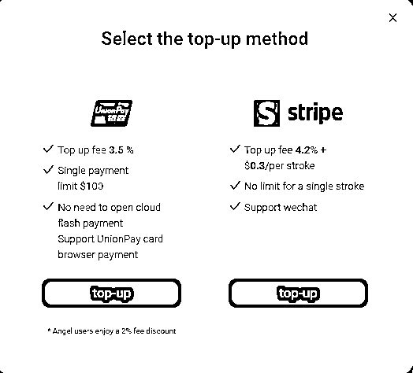
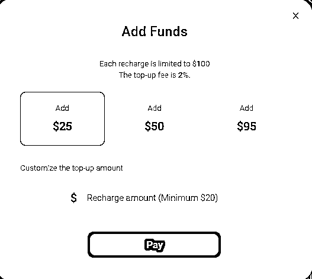
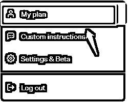
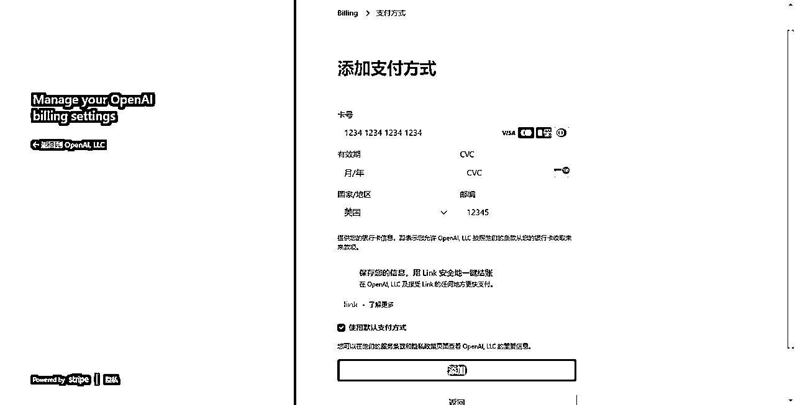
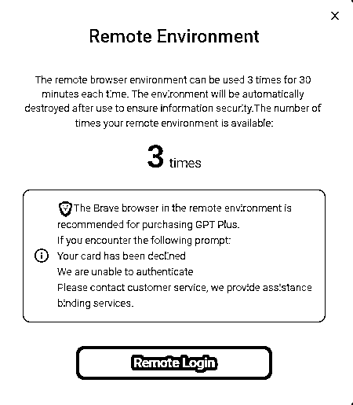

# 没有境外卡，如何升级ChatGPT Plus？

> 来源：[https://h8sakm73dz.feishu.cn/docx/ZTaCdQ8KHoY4rQxzF40cmUYJnnb](https://h8sakm73dz.feishu.cn/docx/ZTaCdQ8KHoY4rQxzF40cmUYJnnb)

由于众所周知的原因，我们在中国大陆升级ChatGPT Plus并不容易，经常卡在没有境外卡的这一步。

这篇文章能够让我们在中国大陆也可以顺利升级ChatGPT Plus，成为使用最强的GPT4的这一批少数人。

这是一篇手把手教你升级ChatGPT的教程。

升级ChatGPT Plus有什么好处？

*   能使用目前地球上最强的AI：GPT4；

*   使用目前地球上最强的自动运行的AI：Advanced Data Analytics（也就是原来的Code Interpreter）；

*   使用目前多达400个ChatGPT插件。

我想不到任何理由不用这个最强的AI。

我们开始。

点击这里注册wildcard

点击Started，进入界面：

填入你的实名电话卡，接收验证码，点击Continue。

选择不同的套餐，这是一次性的费用。

两个套餐的区别在于年限、虚拟环境使用时间、海外电话卡的使用次数，支持额外的平台等。

（关于虚拟环境使用次数对于我们开ChatGPT账号和升级ChatGPT Plus很重要，后面会讲到）

选完套餐之后，就会进入这个身份验证的界面了。

WildCard是需要进行实名认证的，这也是合规化的要求。

实名认证完之后，我们就可以看到主界面了：

分配的这个卡号和Billing Adress，我们就可以把这些信息用于ChatGPT Plus升级使用了。

我们需要先充值到卡号（目前可以用银联和Stripe充值，之前可以用支付宝，这段时间用不了），最低要充$20 —— ChatGPT一个月的费用也就是20$

（不过我个人不建议留很多钱在里面，毕竟我们只是为了ChatGPT升级，分散一些风险是必要的，当然土豪随意）

接下来我们在ChatGPT界面里，点击左下角的用户，点这个My Plan：

点击这个Manage my subscription：

（如果你的还没升级，会和我的界面有些不一样，显示的是Free Plan）

在ChatGPT的会员管理里面，对应的上面我们开好的Wildcard账号，复制粘贴对应的信息，就可以了

我们在升级过程中，有可能因为环境的问题，导致升级失败。

在主页面找到这个地方：

如果我们选择第一种14$的方案，有三次的机会：

在这个虚拟环境下我们可以登陆进去，然后进行ChatGPT的升级。

大部分升级不了的原因，都是因为环境的问题所导致。

终于看到这个久违的升级成功画面了！

你还等什么呢？赶紧开始吧：点击这里注册wildcard