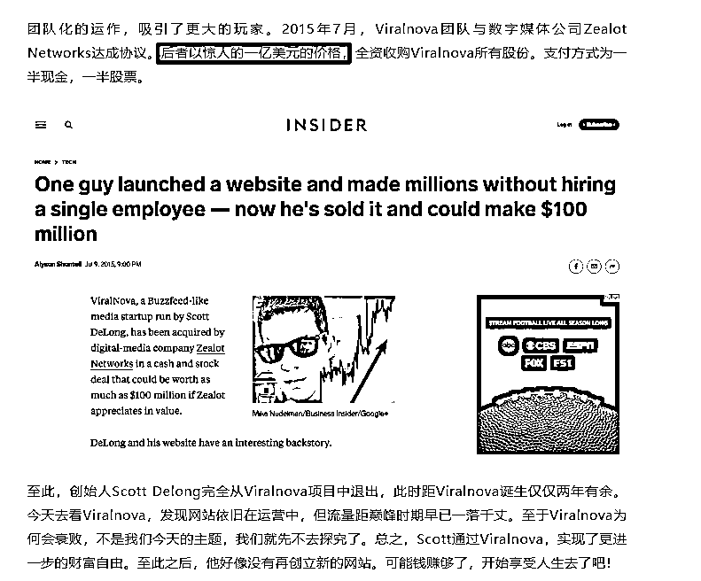

# 互联网上百分之 99 的信息都是垃圾信息

> 原文：[`www.yuque.com/for_lazy/thfiu8/tqy8owngqmk2hoyb`](https://www.yuque.com/for_lazy/thfiu8/tqy8owngqmk2hoyb)

## (46 赞)互联网上百分之 99 的信息都是垃圾信息

作者： 侠狼

日期：2023-08-29

互联网垃圾信息很多，针对与人群而言也是如此，就像有些人不喜欢看我的内容，也会觉得我的内容是垃圾文章，这很正常。

有时候承认自己写的内容是垃圾也是有必要的，毕竟，谁不是从小垃圾走过来的，哈哈。

这几天看到几篇文章觉得挺有意思的，关键词分别是，**精准、垂直、有效、高效。**

而这几个词，在现在的互联网是很难可以整合起来的，如果你能将这些信息整合起来，那么就可以收钱了，比如生财有术，淘金之路，就是最典型的。

**一、算法**

为啥说现在的互联网很难整合起来？

绕回本文标题，互联网上百分之 99 的信息都是垃圾信息。

刷抖音，小红书，快手，公众号，视频号等等，他们现在都在尽力去做一件事，推送给你感兴趣的内容。

如果你浏览的内容，并不是你感兴趣的，那么，你将不会对这个内容，乃至平台有更深层次的关注。

就像写公众号，个人 IP，都是如此，所写的内容受众群体是谁，这是在最开始能思考就要去进行思考的。

在这个信息越来越密集，互联网资内容越来越多的情况下，就诞生了很多相对应的产品。

比如跟创业相关的，淘金之路，生财有术，这类型的社群圈子。

比如，flomo，小宇宙，知识星球，微信读书，等等当然还有更多，可能我还没接触到。

如果你有体验过以上产品，你会发现，这些需求其实一直都在，一直都有。

而简单看一下以上几款产品，会发现，这些都是比较小众的(受众群体)。

比如以知识星球为例子，算是一个付费的，内容信息承载平台。

而在这之前，我们想看某些垂直内容，只能通过自己的方式去进行挖掘，比如，百度，知乎，CSND 等等。

而以上这几个信息挖掘的方式，挖掘出来的信息大部分呢也是垃圾信息，很浪费时间，很难找到有用的，还有绝大部分就是完全为了复制为了流量而做的，才不会关心你的结果是否正确。

而这时候，知识星球出现了，虽然说，里面什么东西，什么圈子基本都要钱，哈哈哈。

但，效率是提高了，有效信息阅读输入效率也提升了，有效有用的知识摄入变多了。

**二、内容摄入**

现在依旧还有大量的人，把抖音，快手，当做学习平台，但，说真的，能学到啥呢？

很难学到有用的东西，因为**短视频的定位就是娱乐平台，而不是学习平台。**

信息越来越多的时代，我们要怎么控制住自己摄入有用的信息？

这时候，圈子的出现，就很有用了。

如果你不知道什么是圈子，那么简单理解为，高效的，有用的，垂直的，精准的，以及与你相关能给你带来帮助的。

当然，这些圈子基本都是要付费的，免费的也有，但，大概率都是留下钩子，为了引导你加入付费的。

**免费的信息，基本都只能看到个比较片面，如果想要获得更多的，优质的付费那就是必定的。**

互联网哪有那么多可以给你长期的，无限白嫖的。

如果你未曾尝试过付费内容，加入付费圈子，那么可以花一些钱试试看，加入购买一些付费内容。

但，要做好每次付费被骗的准备，**在互联网上付费买东西，一定要做好被骗的准备，成年人要为自己做的决断买单。**

咋写着写着跑标题了...

进入正文吧。

**三、机会**

本来是想分享一下搞钱思路的。

今天刷帖子的时候，看到两个玩法很有意思。

一个是，每天花费大量时间去挑选自己认为不错的文章，发布或者转载到自己博客。

前期起步阶段，发布到自己博客后，再利用社交媒体，引流到自己的网站，比如，转载发布这样的。

微博就是很好的类似的，当然，这主要是思路。

而这个人呢，就利用这样的玩法，自己做了一个网站，后面将这个网站卖了一个亿美金，有兴趣自己可以去搜一搜这个内容。

也许会有非常多人觉得这个是假的，但，真的假的跟我们有啥关系么？

没有，但，这个思路是对的啊。

而**今年的很多付费圈子都是这样玩的，收集契合你的信息，大概率会对你有帮助的信息。**

然后自己再来一遍人工筛选，当然，如果是发在知识星球，并且被星主点赞过，或者加为精华的帖子，那么这就已经经过了多次筛选了，所以你选择看还是不看？

再往后走，有用的信息将会越来越值钱。

**这里不是劝你去加入星球、圈子，而是只是告诉各位一个道理，信息将会越来越不值钱，但，有用的信息一直都是非常值钱的。**

有用的信息有很多，但要做到我以上说的几个点，就是很难的。

任何有效的高效的信息，在起步没有流量的阶段，是很难被传播出来，这时候就要想办法去借力了。

对了，视频制作成本，阅读成本都很高，文章的阅读成本最低，但，难度也相对应的不少。

毕竟，你所写的文章受众群体层级，大概率会比看视频的人更高一级。

写文章，就不要在老手面前秀肌肉了，特别是有些人写文章，牛头不对马嘴，数据乱写的。

接下来，都要开始踏踏实实做事了，做最真实的自己吧。

小众的赛道保值率将会越来越高，有效的，高效的信息将会越来越值钱。

GPT 的出现，大幅度提高了我们寻找有效信息的时间。

如果你还未接触过本文以上所说到的，圈子，GPT，这些的话，我是强烈建议尝试的。

**本文完！**

本文就写完了，对你有帮助的话，打赏点赞转发走一波！

* * *

评论区：

月见草 : 高效的获取信息，可以提升效率，减少无效信息占用脑容量哈

* * *