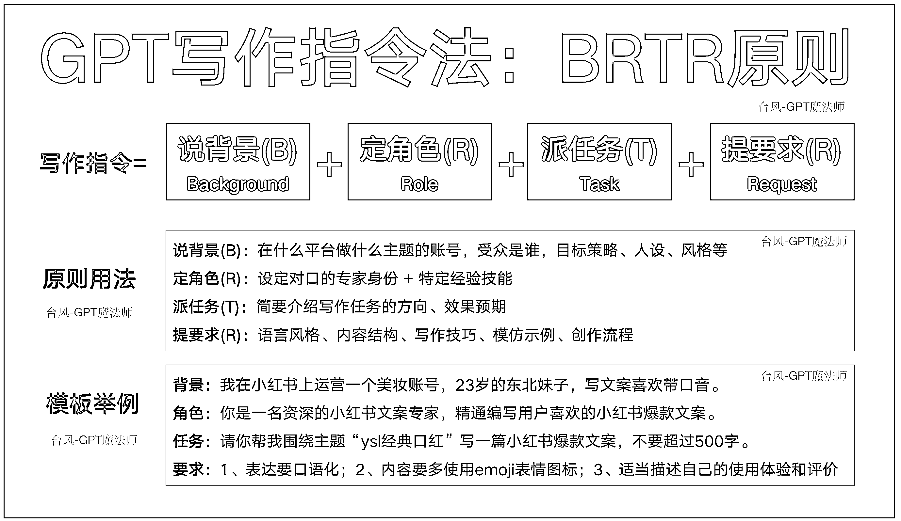

# 轻松搞定 10w+爆款文案：一看就会的 GPT 写作指令法

> 原文：[`www.yuque.com/for_lazy/thfiu8/cn435fhw39c3hh7t`](https://www.yuque.com/for_lazy/thfiu8/cn435fhw39c3hh7t)

## (75 赞)轻松搞定 10w+爆款文案：一看就会的 GPT 写作指令法

作者： 台风-GPT 魔法师

日期：2023-09-01

大家好，我是台风，生财有术 ChatGPT+自媒体航海教练，目前主攻 AI 自媒体方向，擅长 GPT 指令创作和产品应用。公众号矩阵粉丝近 2 万。

  我在做 AI 自媒体培训指导的过程中，发现对于大多数人而言，GPT 提示指令学习有着相当高的门槛：不知道该怎么将写作的要素融合到 GPT 指令中去，总是调教不出自己想要的效果。

所以**做了一份 5000 字喂饭级的 GPT 写作指令学习教程。**我对写作内容框架进行了像素级拆解，形成了一套叫<GPT 写作指令法>的方法论。

**具体教程请移步飞书：**[`xq6mz7nkknp.feishu.cn/docx/Rux5d3lw3o132RxKE4DcNuO2nIe`](https://xq6mz7nkknp.feishu.cn/docx/Rux5d3lw3o132RxKE4DcNuO2nIe)

  

* * *

评论区：

陈少安 : 太有用，收藏系列
台风-GPT 魔法师 : 飞书链接已更新在文章里啦~
台风-GPT 魔法师 : 感谢支持~

* * *