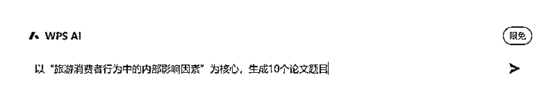

# 小白也可以靠 AI 写文章-论文，实现日赚 2000 元

> 原文：[`www.yuque.com/for_lazy/thfiu8/yvkd7t8888xkqbrg`](https://www.yuque.com/for_lazy/thfiu8/yvkd7t8888xkqbrg)

## (64 赞)小白也可以靠 AI 写文章-论文，实现日赚 2000 元

作者： 歧黄之后

日期：2023-08-30

人工智能的应用已经在小圈层里面开始传播了，部分企业、行业开始使用了，也有部分人开始用 AI 进行自媒体创作，进行论文写作。

但摆在大家面前的一个大问题是：什么 XX 一言，Xxxx GPT，上手难度相对来说，都比较高，而且用这些 AI 写论文、写文章，需要进行大量重复的提问，上下文逻辑还经常不通畅。

那什么是更适合中国宝宝体质的 AI 呢？——————WPS AI

**WPS AI 是个非常好用的工具（此处非广告，雷军没打钱）**

笔者在 AI 应用普及之前，就偶尔接单一些文章润笔，一篇 1 万-1.5 万字的小论文，虽然单篇的客单价不低，但一般情况下需要最少 3-5 天时间完成，且极耗心力。

如果是没有 AI 的情况下，当笔者本月 25 号本人接到 5 篇，急稿，要求三天内交稿的文章时，一定是直接拒绝或另找外包完成的。

有了 WPS AI 之后，嗯。。。

**5 篇万字小论文，总共用时 3 小时，预估收入 1500-2000 元**

>

下面做一篇内容拆解，以下引用部分为课程题目

> 完成这篇论文，大体分五步
> 
> 1.  **第一步：让 AI 想一个题目出来**
> 
> 打开 WPS，新建智能文档，把上述要求，找到核心词，复制进去
> 
> 
> 
> AI 生成目标题目
> 
> 
> 
> >
> 
> 1.  **第二步：挑一个顺眼的题目，生成文章大纲**
> 
> 
> 
> 
> 
> >
> 
> 1.  **第三步：进行文章大纲调整**
> 
> 让每一个小节，都是完整的句子，避免扩写的时候 AI 胡说八道
> 
> 
> 
> 1.  **第四步：把每一条，进行“续写”**
> 
> 
> 
> 1.  **第五步：交稿**
> 
> 最后生成的内容如下，再转移至 WORD 里，进行一定的格式调整，就可以交差了。
> 
> 文章太长，点击下方超链接查看
> 
> [旅游消费者决策风格与行为倾向的关系研究](https://kdocs.cn/l/ctk1jm5TYpHz)
> 
> * * *
> 
> 评论区：
> 
> 黄多金 : 学术论文要查重的…AI 写的除非不查重
> 歧黄之后 : 当然，毕业论文不能这么写，这篇论文的格式架构也不符合
> 结课作业一般不查
> 另外，试了，重复率不高，40%左右，再用优化表达降重比较容易
> Harry Sun : 前天看一新闻，说是用 AI 写论文或被撤销学位证
> 歧黄之后 : 不同学校不同政策
> 另外。。。毕业论文别全篇 ai 啊
> 课堂作业 ai 下就好了，毕业论文更多的要体现和导师的交流结果
> Harry Sun : 嗯嗯 用 AI 润色一些文案 [呲牙]
> 歧黄之后 : 或者水字数
> A 孟世扬 : 试了一下电脑版没有 ai，手机版有，和大佬的不太一样，没有标题生成，没有续写，版本区别还是会员等级区别？
> 歧黄之后 : 需要申请，ai.wps.cn
> 
> 
> 
> * * *