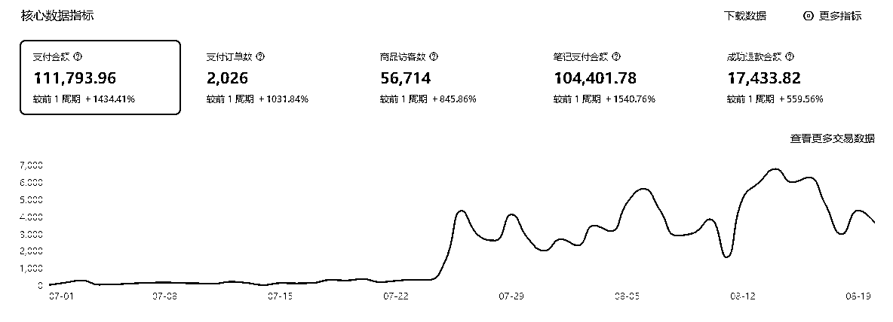

# 如何在小红书店铺爆单后继续稳定出单？

> 原文：[`www.yuque.com/for_lazy/thfiu8/ly5g1bpoxu7lwk5a`](https://www.yuque.com/for_lazy/thfiu8/ly5g1bpoxu7lwk5a)

## (48 赞)如何在小红书店铺爆单后继续稳定出单？

作者： Jessy👾

日期：2023-08-29

哈喽生财圈友们好~我是 Jessy，这次航海也很开心能作为教练和大家一起在小红书店铺继续航海~

从去年到现在，小红书电商的玩法不断在变，也有很多小伙伴在这个过程中出了单。

我们公司是去年 10 月份开始在小红书开店，目前我们公司有 15+店铺在运营，所以素材全部原创实拍，单店月均 GMV 10w+

如果前几次有参加小红书店铺航海的圈友，相信不少都已经拿到了一定的正向反馈。

如果选品得当，碰上笔记爆款，就能经历一次爆单，少则日出百单，多则月销 10w+。

下面是我小助理做的一个店铺，7 月下旬爆单后，店铺出单水平一直能维持爆单时候的水平，而且这个号到后期只会越来越稳定。

那这次想和大家分享的就是：

**在小红书店铺爆单后，如何稳定爆单单量，让一次爆单变成多次爆单？让爆单成为常态呢？**

首先，我们要明白的是，**爆单本身就是不可持续的。**

爆单是当单量的增幅突然远超日均水平，比如之前每天只有几单，突然日增 200 单，如果每天本来就发 200 单，这对你来说就不叫爆单，不过是个日常水平。

在提出解决办法前，我们需要明白，为什么爆单不可持续呢？

首先，在小红书平台，除开纯直播的玩法，大部分爆单都是一篇或几篇爆款笔记带来的。

在没有付费流的情况下，为了抓住消费者注意力，平台总要用算法去进行内容的更新迭代，所以爆款笔记的自然流量不可能无限上涨。笔记越爆，流量持续越久，但基本上不会超过 1 个月。

其次，某些爆款带有季节性，比如吊带，连衣裙，凉鞋等都是夏季热销产品，过季之后的转化率必然下降。平台也会根据当季热点，去淘汰或者主推一些商品。

再有，当笔记爆款之后，必然被同行刷到，总会有人能够卖比你更便宜的价格，来瓜分你的流量，势必抢走部分消费者，也会导致我们产品的转化率降低，甚至很多大爆款沦为价格战。

之前我们有一款裤子，价格 69.9，后期有同行直接到手价 19.9，比我们成本价还低。

还有，就是消费者审美疲劳了，注意力改变了，新产品刚上架总是最受人喜欢的，看得多了也就那么回事。

作为借着平台红利赚钱的商家，我们一定要满足平台的需求，顺着平台的规则行事，也就是帮助平台去吸引用户的注意力。

所以商家在小红书平台稳定赚钱的底层逻辑在于，**谁能够持续满足平台的内容生态+商品生态，谁就能够持续获得爆款，持续爆单。**

小红书的内容生态和商品生态目前是什么情况呢？

就商品生态上来说，很多人说目前的小红书电商就像 17 年的抖音，确实没错！小红书现在就是缺商家，缺商品。

缺商家，所以你来我小红书开店我给你流量扶持。

缺商品，你如果是稀缺类目，我只要发笔记我就送你流量。

看懂了吗？如果你是小白商家，不知道怎么选品，**那就错位竞争，找准平台缺少的商品生态位，弯道超车。**

很多人现在做小红书还在去跟爆品，去抄别人的爆款封面，但是执行下来发现很难爆了。其实不是你的问题，这个赛道太拥挤了，没流量给你分了，如果还不是原创内容，那基本上很难拿到流量。

我一个朋友在小红书买新中式手链手作，客单价２００＋，一周就发几篇笔记，但每篇笔记都是１００＋点赞。因为她这个商品类目非常稀缺，且产品调性相当符合小红书的逼格感，氛围感，高颜值，平台直接送流量。

就内容生态上来说，小红书本身就是一个内容种草平台，缺的不是内容，缺的是优质的带货内容。包括这次小红书力推的买手，也就是鼓励创作者生产更多优质的带货内容，进一步完善它电商＋内容的自闭环。

这也是我们为什么不做混剪，只做原创的原因，因为要想持续在小红书吃到肉，单单靠一波混剪怼量是难以持续的，混剪爆单后，一定要符合平台规则去创作原创带货内容，帮助小红书让用户养成小红书下单的习惯。

如果理解了底层逻辑，执行层面就很容易去操作了？

### 一、多样化爆款素材

这招叫“换汤不换药”，那就是变着法子去拍你的爆款笔记。

爆款很大程度是概率性的，爆了自有她的道理，具体什么因素爆了这个是很难分析出来的，你能做的就是去复制 100 条一模一样的爆款笔记，而不是绞尽脑汁想出一条全新的笔记。

很宝子一条笔记爆了觉得自己老牛逼了，赶紧去原创内容，觉得自己能踩中消费者的内容偏好，结果打脸。

虽然我们不做混剪，但如果你是混剪笔记爆了，最快的速度先继续混剪，抽帧，加滤镜，反转等；二就是赶紧转实拍，1：1 复制爆款笔记的场景拍摄。

如果本身就是实拍的，更改一下不重要的拍摄小细节，比如换个场景，换件搭配的衣服，换个角度等等。

### 二、多样化选品

用爆款产品去带动你的新品。

方向一是垂直你的店铺产品，比如你爆款的是连衣裙，那就继续上架差不多风格的连衣裙；

方向二是上架关联品，比如我们爆款了一条半身裙，就上架很多搭配能这条半身裙的上衣。

### 三、上付费流

小红书目前不管是企业号还是个人号都可以投流，不要用薯条。

如果有大爆款笔记，点赞破千甚至上万那种，自然流跑量的同时，个人店可以直接上 ARK 推广，企业号可以投聚光，ROI 只要能打正也很香。

### 四、避免账号被打死标签

特别不建议爆款了之后，你的账号就一直怼一个爆款商品。

根据我们的经验，也许你短时间会出单很猛，但是后期账号标签会被打得很死，爆款过季后发其他新品流量会很差。

建议是发 5 个商品笔记，其中有 1-2 款是垂直类的新品笔记，一是 push 自己上新频率，二是避免账号标签定死。

今天的分享就到这里~希望大家坚持执行，多多爆单！欢迎圈友链接交流~

也可移步飞书文档查看：[‌⁤‍​​‬⁢‌⁢‬⁢​‬⁣⁤​​‌⁡‬​⁤⁢⁢‍⁤⁢⁤‬‍​⁡⁤⁤‍⁡⁢⁤‬⁢⁤‌​​⁡⁤如何在小红书店铺爆单后继续稳定出单？ - 飞书云文档 (](https://e23q9cnwec.feishu.cn/docx/XxMtd5W5koh09MxTU7wcNRVdnPu)[feishu.cn](http://feishu.cn/)[)](https://e23q9cnwec.feishu.cn/docx/XxMtd5W5koh09MxTU7wcNRVdnPu)

#### 往期文章：[小红书店铺如何 1 个月做到月流水破 50w](https://articles.zsxq.com/id_3wtmvpiwsaur.html)

* * *

评论区：

不二 : 有耐克阿迪的全盘商品，是经销商。想咨询下如果要在小红书上找达人分销，应该怎么选人呀，是否有合作的可能
向北尘 : 可以合作嘛?
Jessy👾 : 前期建议就是手动去搜关键词，找对应的低粉爆款的博主私信合作，后期可以开一个企业账号用蒲公英去筛选
不二 : 怎么合作，加微信细聊呗
不二 : 懂了，感谢～
阿润 : 你好 请问可以链接嘛
Jessy👾 : 可以呀 JessyCcc

* * *