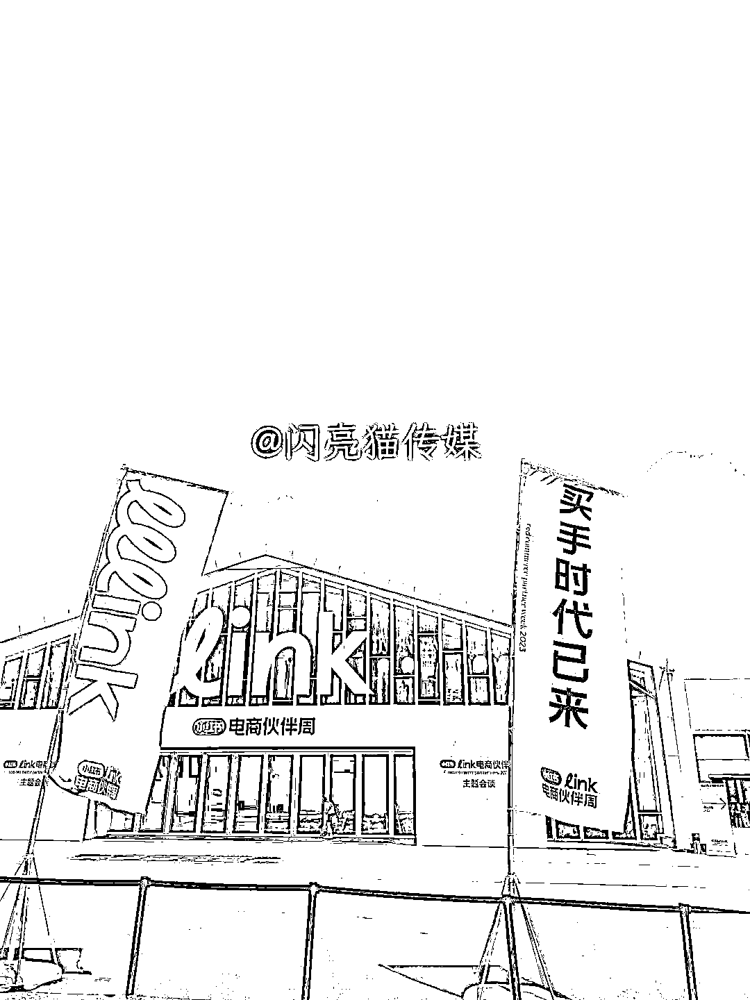
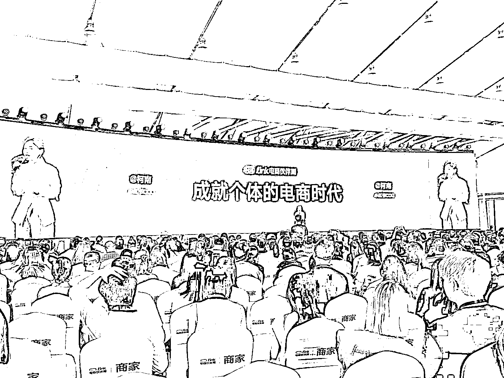
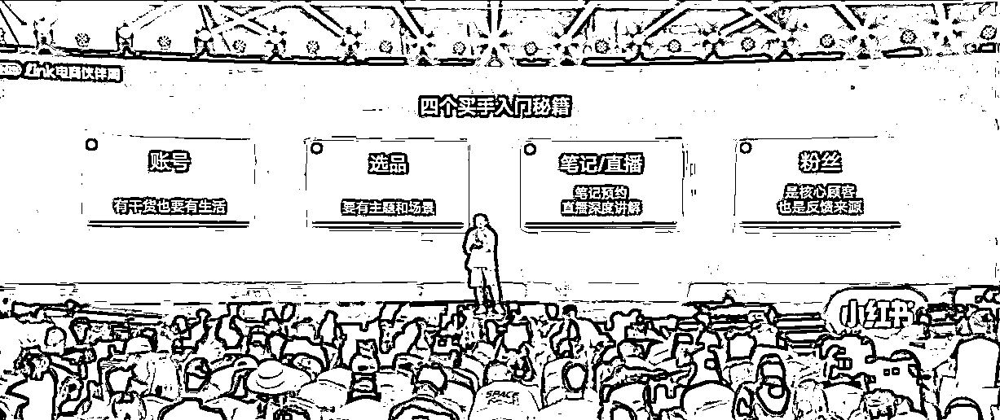
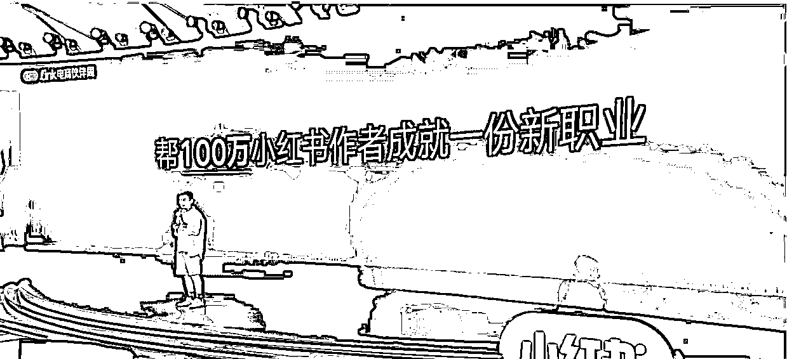
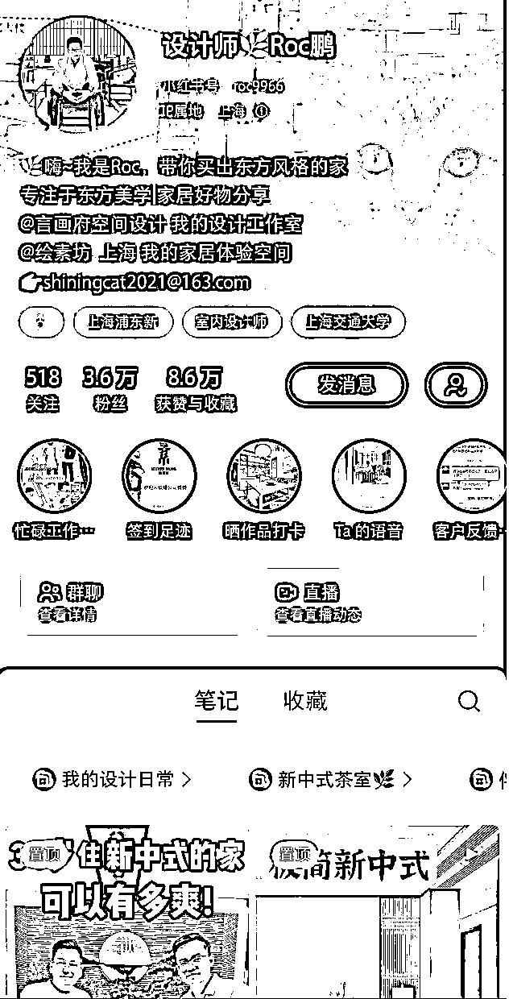
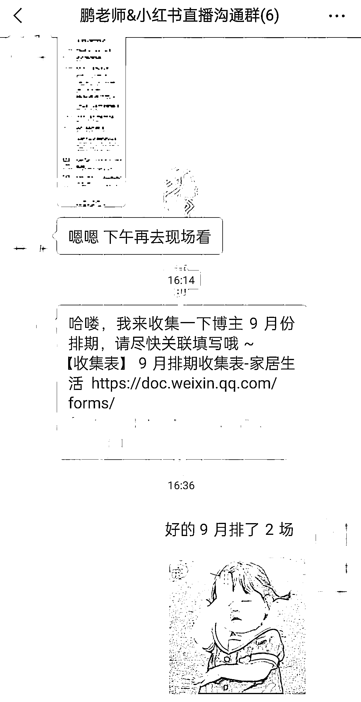
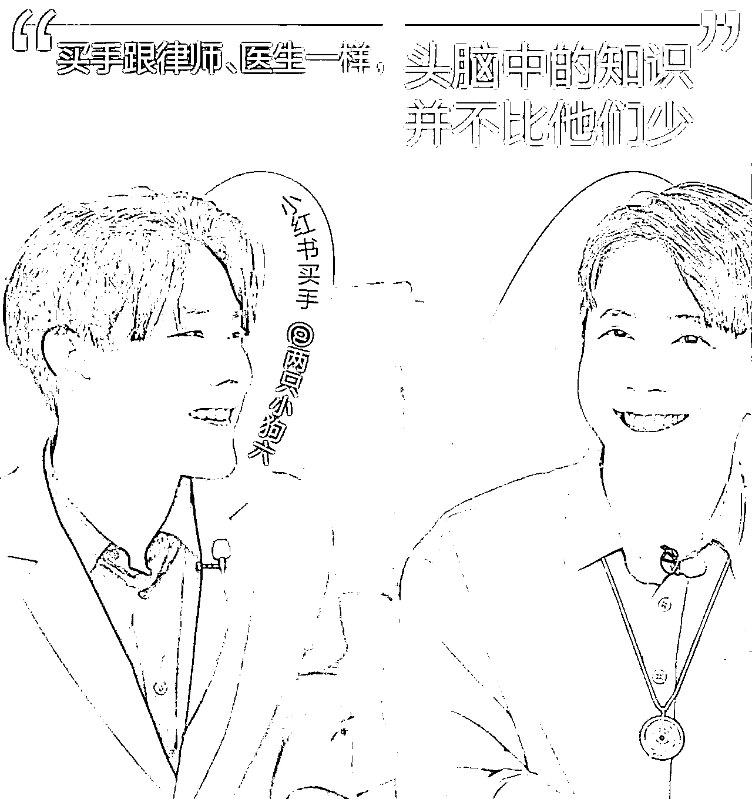
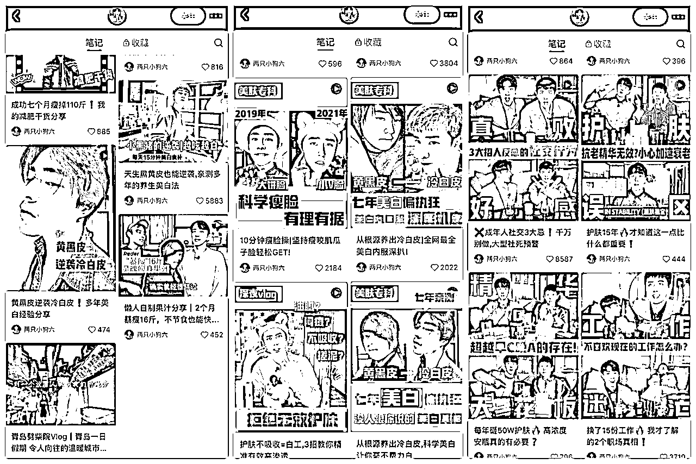
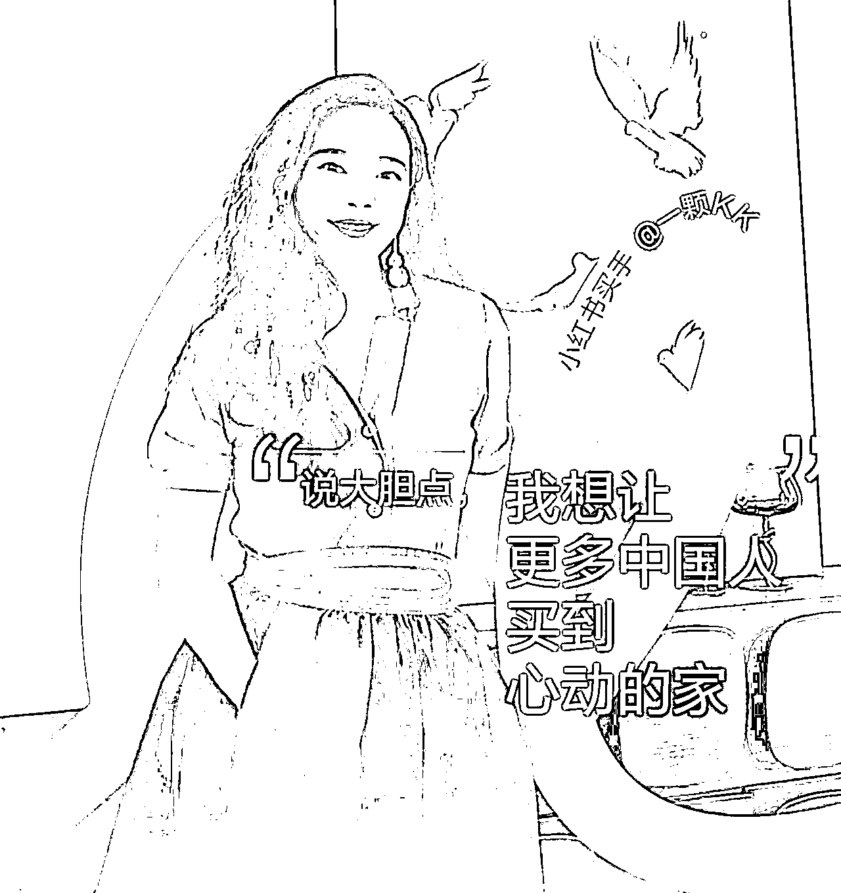
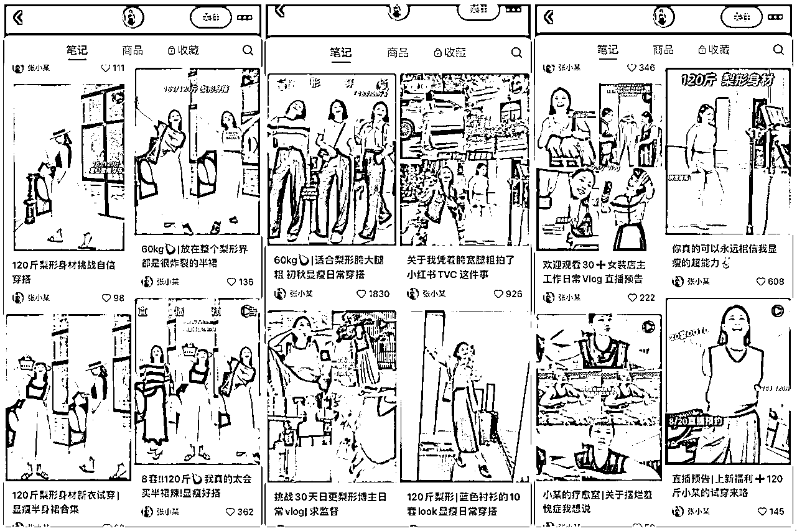

# 小红书千亿流量扶持来袭！深度拆解商家和博主如何赚钱？

> 原文：[`www.yuque.com/for_lazy/thfiu8/onisv7te947yxnxz`](https://www.yuque.com/for_lazy/thfiu8/onisv7te947yxnxz)

## (58 赞)小红书千亿流量扶持来袭！深度拆解商家和博主如何赚钱？

作者： Sherry💎谢无敌

日期：2023-08-28

Hi~生财的朋友们大家好~ 我是你们的老朋友-谢无敌，小红书 MCN 闪亮猫传媒创始人。

上周参加了小红书 Link 电商伙伴周，给我的感觉这真的是一场小红书官方动员大家做电商的“动员大会”呀！

选品会和主题会谈，两个会场连在一起，占地面积庞大；再加上满目可见的红白旗帜，标识着“买手时代已来”，真的是声势浩大。

参加完此次活动后，我也收获颇丰。

不仅仅见到了很多一直在合作的商家朋友，也嗅到了在电商板块上，小红书官方的态度。

下面我给大家码了 3000 字的干货，都是我在主题会谈上获取的一手信息，请大家先收藏转发，再细细阅读。

## 一、小红书“买手时代到来”

过去一年半，小红书电商迎来了高速发展。

在官方给出的数据中，小红书买手和主理人规模增长了 27 倍、商家增长了 10 倍、购买用户数增长了 12 倍。

在小红书日活用户里，日均求购评论 300 万，日均求购用户 4000 万，求购的背后是庞大的等待被服务的用户。

小红书 COO 柯南表示：个体是小红书最有活力的电商力量。

这些个体，包括小红书买手、主理人、店长和金牌店员等。

### 1、**什么是小红书买手？**

**小红书买手，是小红书博主 2.0 版本。**

是指连接商品和用户，并创造购买场景的人，他们用自己的审美、生活经验来分享好物，提升生活质感。

简单来说，小红书买手就是基于自身真实的生活方式和个人形象，真诚地去为粉丝推荐货品进行带货的人。

典型的例子就是上半年爆火的董洁和章小蕙。

### 2、**小红书买手有什么特点？**

单纯的利己，在小红书永远走不通，但如果你通过自己的分享，帮助别人也变得更好，那么小红书的用户会第一时间给予最真诚和最直接的反馈。

小红书买手最大的特点，就是通过个体的专业知识或真诚推荐，连接用户和商品。

他们不是直接让用户买买买，没有大声吆喝，不搞价格大战，不用饥饿营销，而是真的帮助大家挑选到好的东西。

**在用户眼中，小红书买手有审美、有专业、有信任。**

现在，已经有无数的小红书买手在小红书里成长，未来，小红书会用千亿流量来扶持小红书买手和商家共同生长。

## 二、普通人如何做一名小红书买手

### 1、买手入门的 4 个秘籍

在会上，小红书直播业务负责人银时给出了四个秘籍：账号、选品、直播、粉丝。

①账号：有干货，也要有生活

干货，就是对用户真的有用的信息，也就是说我们要站在用户的视角，去分析他们需要什么样的场景，并且在这个场景下我们能够提供给他们什么样的帮助。

那为什么既要有干货又要有生活呢？

生活，就是你的生活方式。用户最终要的并不是一个商品，而是追求一种生活方式。

有生活，才能和用户保持最立体和最直接的联系，并且通过生活帮助你发现新的需求，创造新的干货。

②选品：有主题，也要有场景

大家选品的时候，会遇到很多自己喜欢的商品。比方说你做穿搭，穿搭里可能有非常非常多的风格，但如果你什么都做，那用户很难记住你，商家和品牌也很难认识你。

所以一定要找到自己的一条主线，沿着这条主线去选品。

有主题有场景，才能让更多垂直的品牌和商家认识你，从而主动把更多新品更多好的东西推荐给你。

小红书直播的场景化，更突出的是在生活中的场景，比如说自己的更衣室、茶空间；或者户外的露营场地等。

③直播：笔记做好预约，直播深度讲解

选品之后就是如何把商品卖出去了，笔记和直播都只是你和用户去做联系和沟通的渠道。

为了吸引更多新粉丝，可以把选品经历、商品讲解做成笔记；通过笔记预约，吸引用户来到直播间，然后通过直播间精细的讲解和互动，打消用户顾虑，最终下单。

④粉丝：是核心顾客，也是反馈来源

粉丝是你的核心顾客，也是买手不断成长和不断反馈的力量和来源。

认真回复粉丝的评论，提高粉丝粘性，在选品的过程中，你也可以根据粉丝的反馈去调整货品。

古往今来，做生意都讲究回头客，当你经营好自己的粉丝，其实也是让自己的买手生涯有一个更好地支撑自己前进的力量。

### 2、买手扶持计划

银时表示，小红书推出百万买手计划，未来会投入大量资源来支持小红书买手的培训和发展，帮 100 万个小红书作者在小红书成就一份买手的新职业。

具体来说就是官方会做这两件事情：

**第一件事就是用工具和社区赋能，帮助大家快速入门。**

小红书会推出买手中心，包括选品、数据分析支持，以及建立**买手社群**，进行运营对接、活动激励，帮助买手成长。

**第二件事就是在更具体的政策方面**，小红书会拿出 500 亿的流量去赋能和帮助买手成长，帮助买手度过新人成长的冷启动期和每一个可以跃迁的阶段。

像最近我正在给「设计师 Roc 鹏」账号筹备买手直播，我们就有专门的官方运营对接群。

## 三、买手时代下的商家经营之路

真正的“买手时代已来”，这个时代不仅属于买手，也是商家经营的契机。

### 1、商家经营的 3 个关键

在买手势能之下，商家如何在小红书做好生意经营？

小红书商家负责人麦昆认为：小红书的商家经营之路可以概括为 3 个步骤（经营 3 部曲）：

①**建账号，发笔记：创作要与用户互动**

建账号的目的不仅仅是品宣，而是要来做经营。

它就像你在街角开的一家有意思的店，你是店铺的主理人，目的是想和用户进行双向的沟通和交流。

那么一家店如何吸引潜在顾客进店呢？

除了好看的店招和橱窗，就是要设置一些打卡互动的装置和场景吸引用户。

发笔记也是同理，你要制作有真实互动的内容，你的账号要有独特性和真人感。

比如你是护肤商家，你的用户有什么痛点，你的产品能解决用户什么问题，你就把对用户最有用的信息展示在封面上。

简单的摆拍，没有让用户感受到任何价值感和参与感。

②**找买手，做直播：做好直播前的预热和种草**

麦昆说：商家选对能定位品牌和商品的买手，才能实现 1+1 大于 2 的效果。

在小红书做带货，不是只找流量高的买手，**而是要找到更认可你的人，更懂你的人，更愿意把你的商品分享给他粉丝的人。**

每一个买手其实就代表了一群人的消费选择，选择能够定位你品牌和商品的买手，这样才能链接到真正的潜在的用户，实现 1+1>2 的效果。

选好买手，接下来就是确认选品，做直播预热。

好的预热是直播成功的第一步，在预热过程中，可以通过评论区用户对于求购的兴趣、粉丝群对于产品的反馈，以及直播预约人数来调整和确定直播时的策略。

③**开店播，稳经营：要发展多场域的运营能力。**

一个店铺想要稳定的经营，除了有外部的推荐之外，另一个重要的就是要有直接服务用户的能力，这个也是商家在小红书实现营销长期经营的一个非常关键点。

直接服务用户的方法，包括购物笔记、买手直播、店播、私域群聊、营销广告等。

对于商家来说，有更多的场域经营的布局和能力、平衡促销和营销的比例和关系、以及增强确定性，这些才是实现在小红书稳定经营的重点因素。

要注意的是，经营 3 部曲并不要求严格按照顺序执行，**不同的商家可以根据自己自身的能力和特点进行排列组合，在小红书找到自己的经营之路。**

### 2、商家扶持政策

会上麦昆透露了商家们很关心的平台扶持政策，主要有以下 3 个：

1.  合作商家会有专人运营对接专属活动；

2.  搭建商家和买手的沟通平台。比如：线下选品会，让商家和买手面对面沟通，线上买手推荐平台，提升双方的沟通效率和更广泛的合作；

3.  500 亿商家专属流量扶持，帮助 100 万商家在小红书长期稳定经营。

## 四、小红书买手案例分享

前有董洁、章小蕙为代表的小红书头部主播，推出“董生活的买手店”“玫瑰梦想橱窗”直播间，后有@两只小狗六、@一颗 kk、@张小某等各类型的博主孵化出自有特色的直播间。

这些抓住风口的小红书买手们，做对了什么？

### 1、美护博主**@两只小狗六**

**“用户买的不是产品，买的是我们两个加起来将近 20 年的美护经验和选品能力。”**

两只小狗六是两个男生共同经营的账号，分享美妆护肤以及成长类干货。摸索了两年，涨粉 40w+，收到 1000+品牌合作，8 个综艺邀请。

如果用一句话来形容的两人出圈关键，那就是真诚利他。

不管是笔记分享，还是直播选品，两个人都非常用心。

他们会在直播间反反复复强调：不一定要买贵的，而是挑选自己的，不适合自己的，再贵也是负担。

**真诚利他是自媒体博主成长的关键，也是成为小红书买手的基石。**

### 2、家居博主@一颗 kk

**“一个好的买手就是连接平台、品牌和用户，这是一个共赢的游戏。”**

37 岁离开体制创业做小红书家居买手，从第一次直播时在线只有几十个人，到一场直播卖了 2000 多万，一颗 kk 用了两年。

从 kk 的成长故事中，我们看到了坚持的力量。

坚持分享高品质的家居，坚持把适合的产品而不是销量最高的产品分享给用户，坚持自己认为对的想法，并努力地去实践。

当买手最幸福的时候，就是当你被粉丝艾特说：跟着 xx 买到了别处发现不了的好东西。

这可能也是小红书买手的价值和意义所在。

### 3、穿搭博主@张小某

**“我就是胯大腿粗梨行身材，要挑战自信穿搭的张小某”**

一个“胯大、腿粗”的梨形身材的普通女孩，在小红书做梨形身材穿搭。

在短短的两年时间里已经积累了 24 万粉丝，并且也是一名女装品牌主理人。

张小某说，她从来没有想过，自己可以成为一名单场破百万 GMV 的小红书买手。

所以，张小某的成功证明了，在小红书上，不是只有颜值高身材好的博主才能出圈，没有身材优势的普通人一样也能圈粉。

甚至你的“缺陷”反而可以成为你的流量密码，吸引同样身材的人，而且粉丝更精准，粘性更高。

好啦，以上就是我参加小红书电商伙伴周后的干货分享。

也欢迎大家和我交流，微信：sherryxie668

**更多分享：**

[博主必看！2023 年小红书八大运营趋势解读](https://t.zsxq.com/0eFBeisHS)

[做对小红书关键词布局，拿捏消息 99+的流量密码！](https://t.zsxq.com/0eLiWlm9B)

[客单价 4 位数的玄学博主，教你一个公式写出高转化笔记](https://t.zsxq.com/0eMdKqJbg)

[（附选品清单）如何选择小红书蓝海赛道和产品？3 个方法搞定！](https://t.zsxq.com/0eUR5OYuT)

[一晚涨粉 400+、引流 80+，人人都可以复制小红书群聊引流法](https://t.zsxq.com/0eG1wH8d5)

[船长复盘：小红书小航海 ｜乘风破浪会有时，直挂云帆济沧海](https://t.zsxq.com/0e63wt9Iw)

[1 篇笔记引流 200+精准客，破解小红书真正的流量密码](https://t.zsxq.com/0eKZ3bNvk)

[《0 基础新手，如何在 1 个月内通过小红书快速变现？（附 10 种变现渠道整理）](https://t.zsxq.com/0eeQyLczW)

* * *

评论区：

老彭 : 多谢分享，期待下一篇教学篇[色]

* * *