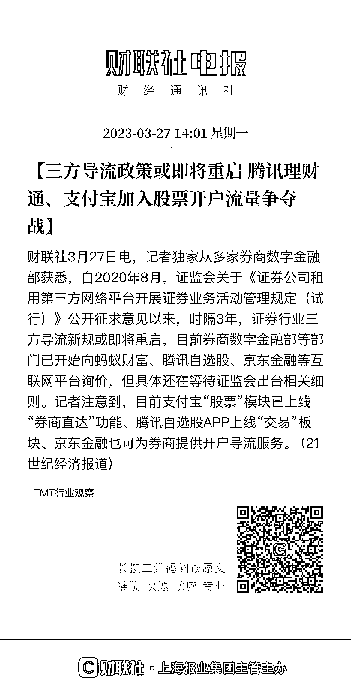

# 如何成就理财类 IP-怎么创作快速获得他人信任的图文内容？

> 原文：[`www.yuque.com/for_lazy/thfiu8/ogig7sy62agomyc3`](https://www.yuque.com/for_lazy/thfiu8/ogig7sy62agomyc3)

## (24 赞)如何成就理财类 IP-怎么创作快速获得他人信任的图文内容？

作者： Lemon

日期：2023-08-28

大家好，我是互联网金融行业从业者 lemon。

今年刚加入了生财，参加了两次航海+续航，每天在生财潜水已经成为了我的生活日常。

今年 7 月份，抖音上即将卖基金的新闻，传的沸沸扬扬、业内震动。

抖音超 6 亿的 DAU，这可是金融行业新的蓝海市场。

同时，《证券公司租用第三方网络平台开展证券业务活动管理规定(试行)》或即将启动，这代表了以后在支付宝、微信、头条等巨头平台可以开通股票账户、交易股票了。

在不远的将来，基金、保险、证券等普通人的投资理财方式通过一个平台就能完成。

这也就意味着，以后金融机构在三方公域平台的流量争夺会更加激烈，

机构内部培养&外部合作大 V 引流的模式也会迎来新一轮爆发。

投资理财类 IP 的重要性不言而喻，生财上也不乏年入百万的投资 IP 大神们。

对于这类专业程度较高的赛道，如何做好这 IP？去年参加了花爷 IP 训练营，很有收获。我结合投资理财领域的特点，总结了如何通过长图文内容，快速建立客户信任和树立 IP 的方式，供大家参考。

包括以下几个方面：

1.  在视频时代，理财类长图文还有人看吗，它有哪些优势？

2.  有哪些能快速让人产生信任的模版内容？

3.  投资理财方向有没有具体案例，要怎么应用？

微信链接：[`mp.weixin.qq.com/s/kaPLq5uLLyZT-oOxF4mc2A`](http://%E6%80%8E%E4%B9%88%E5%88%9B%E4%BD%9C5%E5%88%86%E9%92%9F%E8%8E%B7%E5%8F%96%E4%BF%A1%E4%BB%BB%E7%9A%84%E6%8A%95%E8%B5%84%E5%9B%BE%E6%96%87%E5%86%85%E5%AE%B9%EF%BC%9F)

飞书链接：[`aa16nizk1e.feishu.cn/docx/TGwPdlfTloiFsfxhHdZc2s1dnSb?from=from_copylink`](https://aa16nizk1e.feishu.cn/docx/TGwPdlfTloiFsfxhHdZc2s1dnSb?from=from_copylink)

* * *

评论区：

-花开猫- : 链接打不开呢
尺子白 : 对，我也没点开。
晨宇 : 复制链接到浏览器可以打开
Lemon : 感谢提醒[玫瑰]，自己这里测试正常，另附上飞书链接，也可以访问‌‌‌哈‌‬‌‌⁡‍​⁣⁣⁢⁢‬‬⁢⁢⁡‍‬‍​​⁤⁤⁤⁣‍⁡⁡​‌‌⁡​‍‬⁤​

* * *