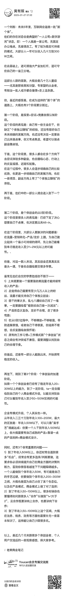

# 未来 5 年里，互联网会造就一批“新个体”。

> 原文：[`www.yuque.com/for_lazy/thfiu8/qxv9ixup1k2k4irx`](https://www.yuque.com/for_lazy/thfiu8/qxv9ixup1k2k4irx)

## (41 赞)未来 5 年里，互联网会造就一批“新个体”。

作者： 亦仁的收藏夹

日期：2023-08-28

未来 5 年里，互联网会造就一批“新个体”。

典型的存在状态就是："一人公司+数字游民"。

即：一个人就是一家公司,无固定办公地点、无雇佣员工、有了较为稳定可持续的模式、大部分人一年可以收入几十万到 300W 之间。

* * *

评论区：

暂无评论

* * *