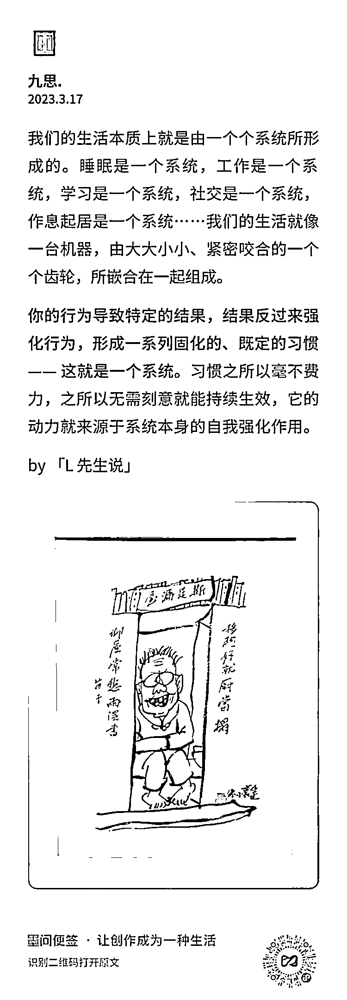

# 你的行为导致特定的结果

> 原文：[`www.yuque.com/for_lazy/thfiu8/bk6l13b89mx8locb`](https://www.yuque.com/for_lazy/thfiu8/bk6l13b89mx8locb)

## (14 赞)你的行为导致特定的结果

作者： 亦仁的收藏夹

日期：2023-08-30

你的行为导致特定的结果，结果反过来强化行为，形成一系列固化的、既定的习惯。——这就是一个系统。

* * *

评论区：

暂无评论

* * *