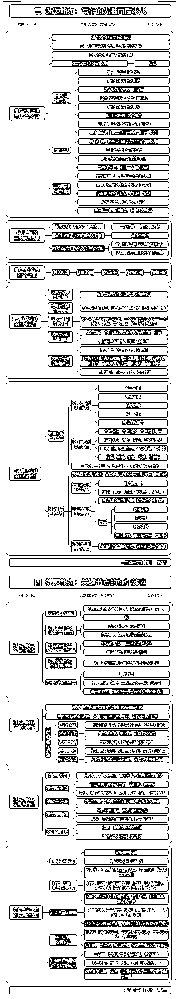
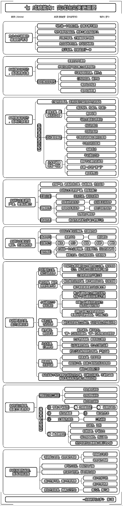

# 学会写作：竖屏思维导图，助力 8 月航海

> 原文：[`www.yuque.com/for_lazy/thfiu8/ese2f58v74uispgl`](https://www.yuque.com/for_lazy/thfiu8/ese2f58v74uispgl)

## (65 赞)学会写作：竖屏思维导图，助力 8 月航海

作者： 罗卜

日期：2023-09-04

【《学会写作》竖屏思维导图，助力 8 月航海】

我深知阅读和写作对于个人成长的重要性。

在这个充满竞争的时代，我们总是羡慕那些大佬们，他们似乎总能在各个领域挣到一点一滴的收益。

而我，也曾经是这样的一个观望者，每天在这里看一点，那里看一点，虽然我也从中受益匪浅，但我却迟迟没有开始我的阅读和写作之旅。

在我开始阅读之前，我对写作充满了敬畏之心，觉得那是作家的事情，普通人根本不值得一试。

然而，带着这样的想法，我开始去阅读，去输出。

起初，我写的自己都看不下去，但随着时间的推移，我发现自己的写作水平在慢慢提高，看着自己的作品也觉得越来越顺眼了。

在此之前，我曾阅读过粥左罗老师的《学会写作》，并参加过他的训练营。

通过各种学习，我逐渐开始尝试写作，并勇于公开发表我的作品。在星球上，我也尝试着输出我的观点和经验，虽然内容还仅限于自己的那一点点经验。

这一次，我将结合航海的主题，在航海前将《学会写作》通过竖屏思维导图的方式进行整理，以助力航海活动。

我希望通过这份导图，能够帮助更多的圈友，哪怕只有一点点帮助，或者只有一个人从中受益，我都会觉得这份导图没有白做。

在航海前，参与图书共读的书友们可以抽空查看这份导图，相信它会给你带来一些启发和帮助。

让我们一起在阅读和写作的道路上不断前行，共同成长。

* * *

评论区：

一诚 : [强][强][强]
Alan Chen : 这种是 xmind 做的吗？
看好你 : 想问问这种导图怎么做的？
罗卜 : 对的
罗卜 : Xmind 就可以
Alan Chen : 我也一直在用，但是没有办法形成这样图片的，是一个整体的，这个是有拼接吗
怪力小乔巴 : X mind 里面选择树形导图吗？
罗卜 : 不用拼接，一气呵成

* * *