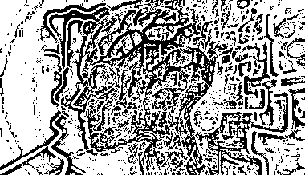

# 如何通过 ChatGPT 生成视频特效和编写代码

> 原文：[`www.yuque.com/for_lazy/thfiu8/mz70wsbgbr84w7eu`](https://www.yuque.com/for_lazy/thfiu8/mz70wsbgbr84w7eu)

## (28 赞)如何通过 ChatGPT 生成视频特效和编写代码

作者： 易焘

日期：2023-09-04

如何通过 ChatGPT Code Interpreter 生成视频特效和编写代码实现 Chrome 插件

今年 6 月份 ChatGPT 发布了一个重磅功能 Code Interpreter（现已改名为 Advanced Data Analysis），其强大的数据分析能力和 Python 自运行能力再次深深震撼了我，我一度怀疑前段时间在航海中分享的 ChatGPT 编程思路已经过时，然而，经过一番测试之后，Code Interpreter 让我惊叹的同时，也让我失望了，面对稍微复杂一点的需求，Code Interpreter 一样会出现 GPT4 default 遇到的问题，也许 Code Interpreter 的算法内核本质上也是 GPT4。

接下来，我给大家复盘一下前段时间我通过 Code Interpreter 把图片做出各种视频特效的过程，前面部分复盘 Code Interpreter 如何挖掘需求、自行编写 Python 程序并自行运行程序生成简单的视频特效，后面部分复盘 Code Interpreter 编写一个实现图片隐形特效的 Chrome 插件，从中了解 Code Interpreter 的强大能力和存在的局限性。

由于需要更好的显示测试过程和视频效果，请移步下面链接查看全文：

测试过程的对话记录请下载下面文件，两个对话记录都是通过 ChatGPT 编写的 Chrome 插件 ChatGPT 导出，欢迎大家使用并指点。

Code Interpreter   生成视频   视频特效[`kxgiimtbac.feishu.cn/docx/XacsdvICvo1WLcxnG2DcsGPencf`](https://kxgiimtbac.feishu.cn/docx/XacsdvICvo1WLcxnG2DcsGPencf)

* * *

评论区：

暂无评论

* * *