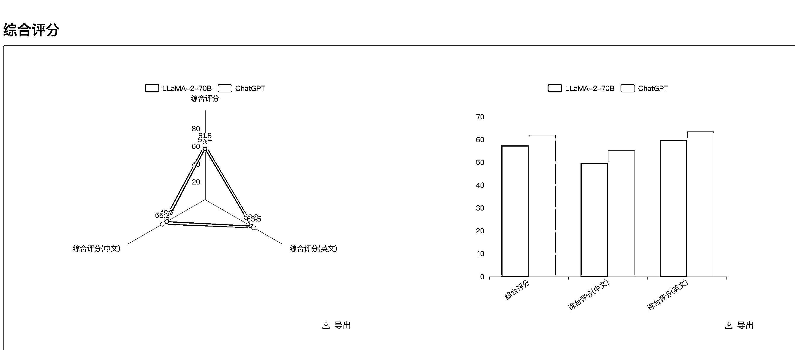
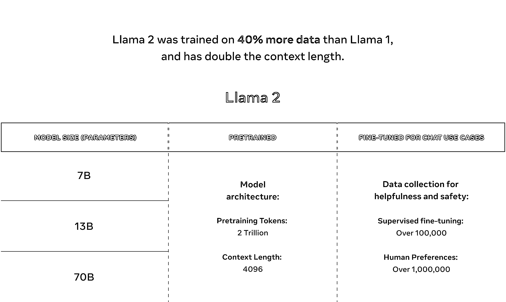
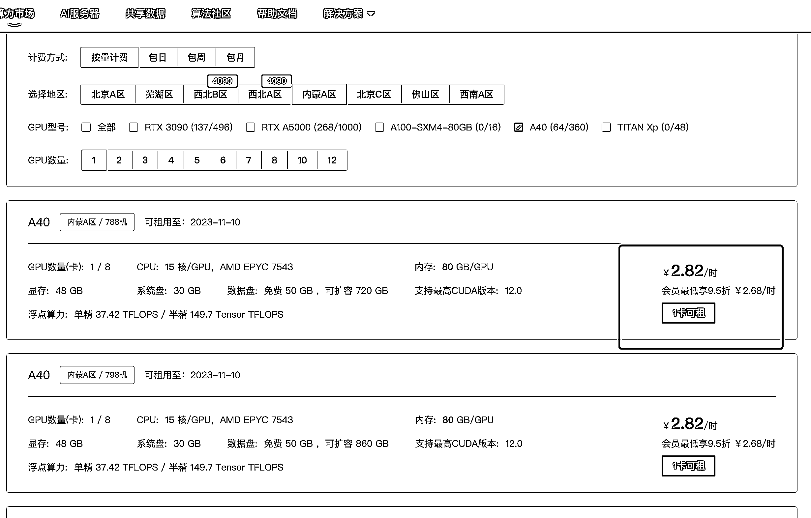
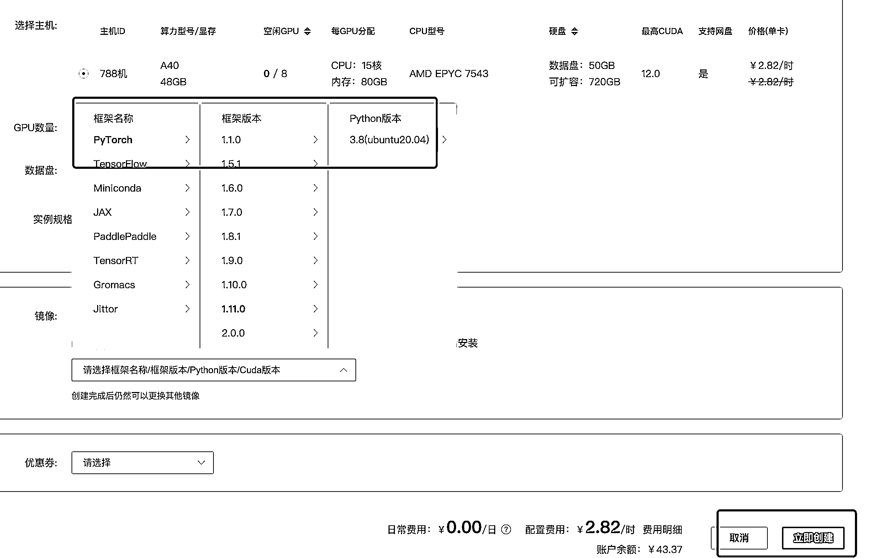
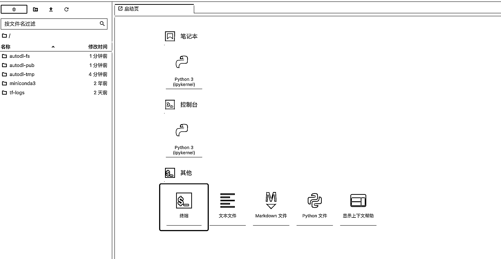
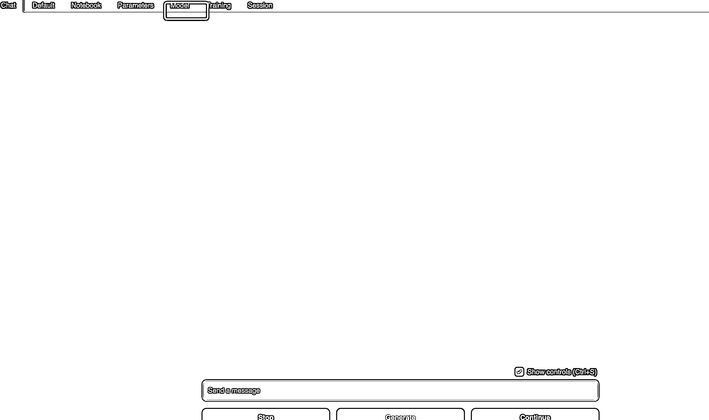
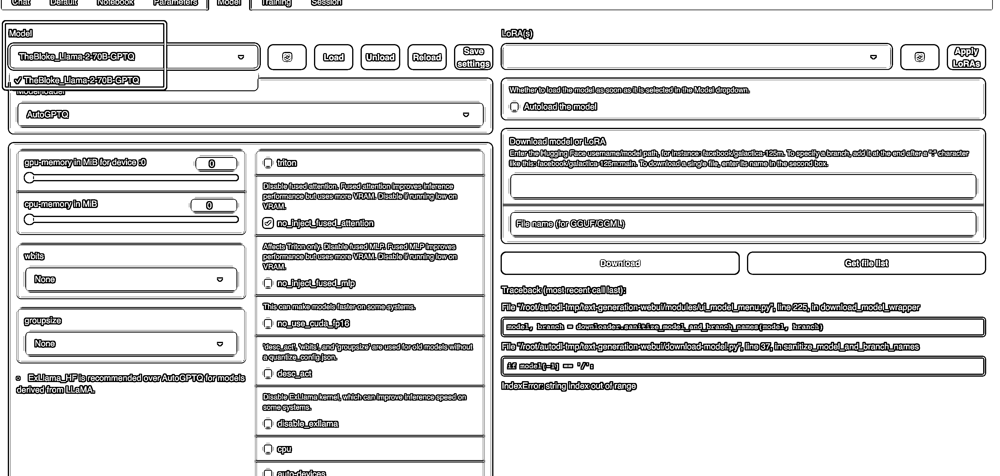
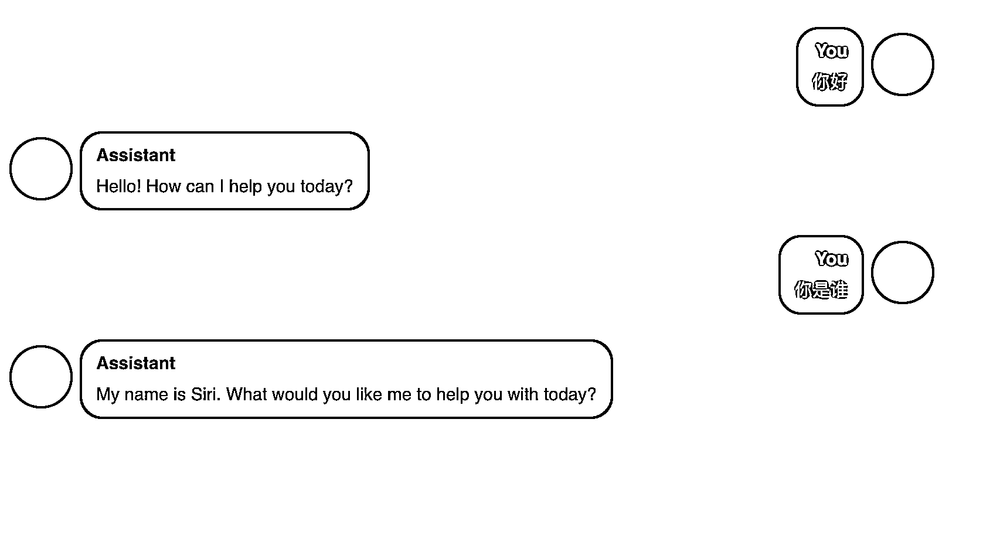
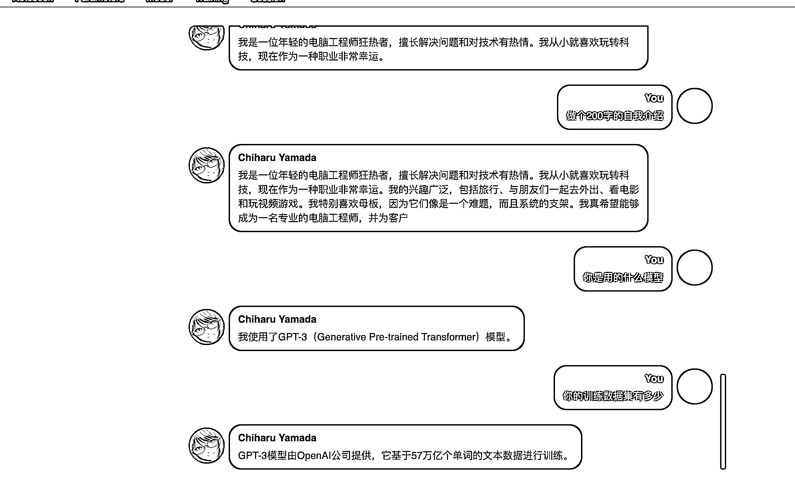
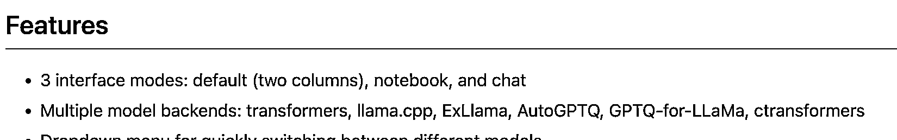

# 以 Llama2 为例，教你部署自己的私有大模型

> 原文：[`www.yuque.com/for_lazy/thfiu8/vnq4w0y09bbb6r73`](https://www.yuque.com/for_lazy/thfiu8/vnq4w0y09bbb6r73)

## (25 赞)以 Llama2 为例，教你部署自己的私有大模型

作者： 小辉 AI 教练

日期：2023-09-04

## 一、背景介绍：

一夜之间，AI 大模型圈变了天。Meta 联手微软宣布，Llama 2 正式开源商用。

LLaMA 是由 Meta 开源的一个大语言模型，是最近几个月一系列开源模型的基础模型。包括著名的 vicuna 系列、LongChat 系列等都是基于该模型微调得到。可以说，LLaMA 的开源促进了大模型在开源界繁荣发展。而刚刚，微软官方宣布 Azure 上架 LLaMA2 模型！这意味着 LLaMA2 正式发布！

无论对于我们个人还是企业来说，都是一个革命性的进步，虽然国内还沉浸在百模大战中。

我们现在可以像玩 Stable Diffusion 一样部署自己的私有模型，和进行微调训练 Lora 模型了。之前我们想去做垂直行业的模型训练，需要调用 GPT 的接口，而且还需要科学上网，现在你可以自己部署一个自己的私有模型，并进行自己的定制，做上层的应用，而不是基于 GPT 的简单套壳。

那么对比 GPT 来说，Llama 达到了什么水平，从测评表现来看，Llama2 距离 GPT 还是有一些差距，但是 Llama 的进步还是很快的，从第一代发布到第二代仅用了几个月

今天这篇教程，就是教大家如何部署 Llama2, 有 3 个参数量级的版本可以选，分别为：7B, 13B, 和 70B，我们就以最大的参数规模 700 亿参数来举例，7B 模型文件有 7 个 G 左右，在 A5000 显卡测下来还比较流畅，70B 的模型文件就有 35G 大小，所以显存最低要 40G，在 A40 48G 配置的机器上测下拉比较流畅。

## 二、实操部署

1.  服务器配置

我们就以 AutoDL 的云服务来部署，其他云厂商的都差不多。

首先我们去算力市场选一台配置够用的容器实例，看你部署的版本，70B 建议 A40 显存 40G 以上，2.8 一小时。

选好可用的配置后，点击租用，进行下一步配置

这里我们选择基础镜像 PyTorcha 就可以了，注意不能选最高版本，系统版本不支持，然后点击“立即创建”

等个 1 分钟左右，就可以看到你的容器已经启动好了：

接下来我们选择 Jupyter，进入 ternimal 终端，可以开始部署操作了

1.  Text generation web UI 部署

然后把 Text generation web UI 仓库([`github.com/AYLIEN/text-generation-webui`](https://github.com/AYLIEN/text-generation-webui))克隆到服务器，下一步就是根据官方文档安装环境和依赖：

1.  安装 **Conda**

2.  [`docs.conda.io/en/latest/miniconda.html`](https://docs.conda.io/en/latest/miniconda.html)

3.  On Linux or WSL, it can be automatically installed with these two commands ([source](https://educe-ubc.github.io/conda.html)):

1.  **创建一个 conda 环境**

1.  安装依赖

1.  模型下载

界面我们已经有了，然后就是把我们的模型安装就可以了，跟 SD 一样，你只要把模型下载到 models 目录下, UI 就可以加载了。

Meta 官方下载模型的话需要申请，在他们官网上填申请表就可以了，等几分钟，他们会把下载的 key 发到你邮箱里

当然，原生的模型文件不能在 text-generation-ui 下运行，默认使用的是 huggingface 格式的模型，因此我们需要一次格式转换操作，或者使用已经转换好的模型文件，这里我们直接使用 TheBloke 大佬转换好的模型文件，在 huggingface 上可以直接下载，下面是各个版本的链接：

1.  [`huggingface.co/TheBloke/Llama-2-70B-chat-GPTQ`](https://huggingface.co/TheBloke/Llama-2-70B-chat-GPTQ)

2.  [`huggingface.co/TheBloke/Llama-2-70B-GPTQ`](https://huggingface.co/TheBloke/Llama-2-70B-GPTQ)

3.  [`huggingface.co/TheBloke/Llama-2-13B-chat-GPTQ`](https://huggingface.co/TheBloke/Llama-2-13B-chat-GPTQ)

4.  [`huggingface.co/TheBloke/Llama-2-13B-GPTQ`](https://huggingface.co/TheBloke/Llama-2-13B-GPTQ)

5.  [`huggingface.co/TheBloke/Llama-2-7b-Chat-GPTQ`](https://huggingface.co/TheBloke/Llama-2-7b-Chat-GPTQ)

6.  [`huggingface.co/TheBloke/Llama-2-7B-GPTQ`](https://huggingface.co/TheBloke/Llama-2-7B-GPTQ)

## Hugging Face Hub 模型下载方案（优雅，强烈推荐）

1.  启动 UI：

这行启动命令的意思是把模型映射到“TheBloke_Llama-2-70B-GPTQ”， 监听 6006 端口，因为这个端口可以启动 AutoDL 的自定义服务，让我们可以通过浏览器访问

进入到 UI 后我们能看到主界面, 我们先通过顶部菜单进入到 Model 页面加载模型，这里选择已经下载的 70B 模型

当界面上显示“Successfully”就表示模型加载成功了

然后我们就可以愉快的和 Llama2 对话了

默认的对话交互模式体验不太好，我们可以改为熟悉的聊天模式

Text generation web UI 比较好用的一个功能就是可以定制自己的角色，比如设定角色的性格等

多模型：

Text generation web UI 是支持多个开源模型的，你只需要把各个模型下载到 models 文件夹下即可， 然后在界面上切换模型也很方便。

飞书和视频教程链接：https://j0oqwdylc47.feishu.cn/docx/G2uvdNJIloP8D8xIXBccKZDunYg

* * *

评论区：

暂无评论

* * *