# 靠陪伴、情绪价值，视频号单场直播利润 26 万的经验分享

> 原文：[`www.yuque.com/for_lazy/thfiu8/hidtb5s26khsx7ar`](https://www.yuque.com/for_lazy/thfiu8/hidtb5s26khsx7ar)

## (精华帖)(366 赞)靠陪伴、情绪价值，视频号单场直播利润 26 万的经验分享

作者： -王拾柒

日期：2023-09-05

在视频号直播带货，亲测晚上的流量更好。晚上 12 点到次日 8 点是黄金时间段，加上提供陪伴和情绪价值，是可以间接带货的。

而我也是通过这两种方式，半年时间通过视频号半无人绿幕直播带货做到了 7 位数。

我今天就从直播的全流程来讲讲具体是怎么做的，希望能够给正在做或者计划做视频号带货的圈友一些帮助。

文章目录：

一、自我介绍

二、结缘视频号

三、视频号的现状和机会

四、视频号直播带货的多种玩法介绍

五、新手小白该如何入局视频号

# **一、自我介绍**

大家好，我是王拾柒。很惭愧，我是今年 4 月 28 号才入的星球，编号 90067。

在此之前，由于没有足够的预算付费，我借了别人的账号在星球上看过很多大佬的文章，也因这些文章获益很多，有些文章打开了我的认知，有些文章让我获得了能量。我很感谢有这样的平台。

今天我写下这篇万字长文。这是我到星球后发表的第一篇文章，距离上次付费入星球，仅仅过去 3 个多月的时间。

接下来，我与大家分享我是如何通过视频号直播带货，4 个多月的时间赚到了 100 万。

先给大家认真介绍一下我自己：我今年 32 岁，未婚未育单身，摩羯座，是个湘妹子，我跟很多人一样，出生农村，没有什么学历，到了这个年纪，也经历过人生的起起伏伏。

其实我们这群人的成长路径好像都差不多：早早步入社会，接受社会的毒打。

我的第一份工作是在一个做散热器的日本工厂做流水线，就是站在那里拿着一个电动工具每天给散热片打螺丝，不要笑，是真的打螺丝，我记得那会我明明才 18 岁，我的两个手掌却全是茧子。

打了一年工后，我真的不想干了，我虽然文化低，但是我清楚的知道，如果这么下去，我跟我姐姐的一生会很像，我不想做一辈子的工厂打工小妹，于是我跟我妈提出我要回到湖南，她骂了我的，尽管这是 13 年前的事情，我记得很清楚。

我回到了湖南长沙，从电话销售开始做起，白天打 200 个电话，拜访 2-3 个客户，夜里在网吧找客户资料到深夜 12 点。基本不休。

后来我做到了公司销售冠军，再后来，我更加努力一步一个脚印，同事不想跑的远地方，我打着摩的也要去跑，我坐过好多次那种长途大货车，只是为了要他们顺着我去要拜访的外地客户，也常常凌晨赶火车去往我们湖南的各个地级市...

再后来，我从一线做到了管理，是别人口中的年轻有为的王总，靠自己买房买车，一切都是那么顺风顺水，好像你只要去努力了，就会收获想要的。

我不甘于为别人打工，想要有自己的事业，于是在 2018 年南下广州创业之路，原以为事业会就此腾飞，但其实创业是九死一生，不是你努力就一定能成功的。

由于各种原因，在坚持了两年后，于 2020 年末，公司不干了，拖着疲惫的身心从广州回来长沙，负债超过 50 万，因为压力体重一度超过了正常体重的 30 斤。

此时，我已经 29 岁了，是妈妈眼中的大龄剩女，很难生出来孩子的那种，经历了事业的失败和家人的不理解，我终于倒下了，这一下，就休息了长达半年。

2021 年 5 月，我重新开始找工作，在一家做抖音的创业公司上班，由于之前一直做的传统行业，对电商行业不是很熟悉 ，为了尽快入行，我在这家公司每天呆的时间特长，早上 10 点到公司，基本凌晨下班。

老板也给了我很大的信任，让我可以有很多学习的空间跟机会，包括知道生财有术，也是源于他是最早加入的圈友，我知道他早些年就已经在各种付费的星球里混圈了，是他改变了我很多的认知，我很感激他，他叫羁绊。

# **二、结缘视频号**

我非常建议圈友们一定要有付费思维，多链接。

得益于星球里的很多人的分享，我在去年 11 月开始接触到了各种互联网项目，包括多多视频、同城相亲交友、小说推文项目。

印象特别深刻，我看了别人的一篇关于多多视频项目的分享觉得太适合自己入手干了，于是我兴致勃勃的下场了。我感觉这些项目都离我好近，我觉得我不会比他们差我都能干，我马上快要赚到钱了！

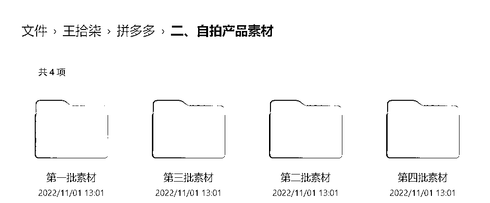

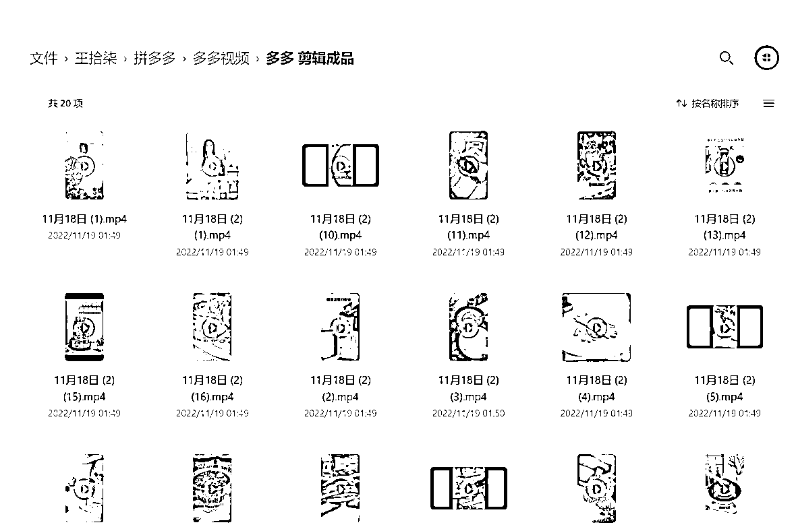

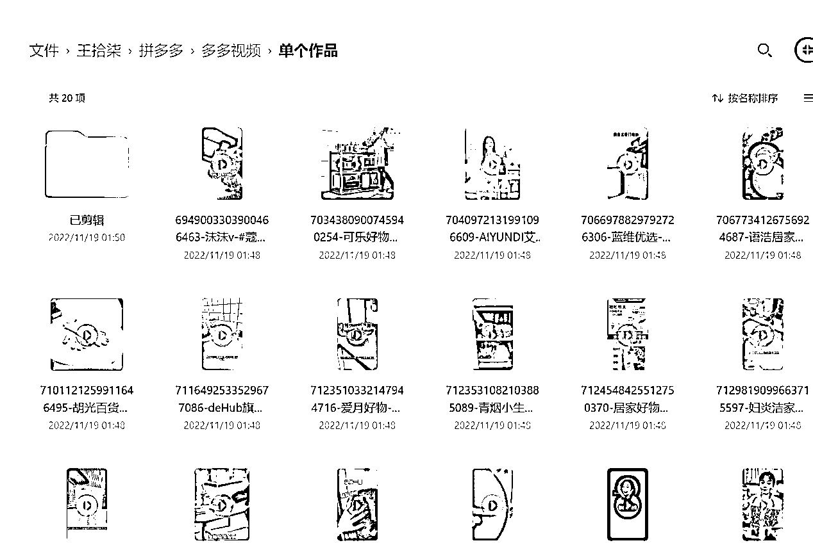

当时多多视频需要当月发布爆款好物视频满 50 个才能有带货资格，于是我买了好多好物的样品，天天拍摄、剪辑。很享受这种“看上去马上要赚到钱的感觉。”

原以为大佬们分享的帖子足够干货，实操性非常强，且自己对于文章的理解力，自己做项目的执行力足够好了，应该能很快获得成绩。

没成想在跟着星球里的帖子一步一步实操后，经历了白天上班打工再下班后每天剪辑视频到深夜的一个月，没有一个休息日，没有放轻松一天后，一个“无多多视频带货资格”把自己给弄的挺难受的。

这就好像，你使出了所有的力气想去干成一件事，你努力了一个月发现连入场券都没有，有被狠狠的打击得到。

包括后来的同城相亲项目，折腾了大半个月，还没有开始就草草的结束。

后面的小说推文项目，当时 自己处在边上班边想做副业的状态，那会是真的拼啊，白天在公司搬砖到夜里 9 点多，回去简单洗漱就漫长的剪辑之路，有时候一剪辑就是 4 小时，因为真的是不会剪，有时候一个功能也要研究好久。

结果“可想而知”，一个月下来，总剪辑时间超过 100 小时，项目最终收益，赚了 7 元。

剪辑 100 小时赚了 7 元，100 小时自己去公园跟老大爷们一样捡矿泉水瓶子估计都卖更多。在经历多多视频、小说推文两个项目，60 多个日日夜夜，没有一点正向结果后，尤其是跟我一同做项目的 00 后都比我做的好的时候。

坦白来说，这种觉得自己不如人的体感，对于一个已经三十多岁的我来说，并不好受。也曾一度想要放弃，回到之前安稳上班的日子，下班可以打打牌看看电视、周末可以约上三五好友喝喝小酒；也想过要不嫁人算了吧，一个女孩子干嘛那么累。

**但是我真的不甘心啊，不甘心就这样被打败，于是我依然保持着边上班边自己折腾的日子，没有一个周末没有一天休息，晚上凌晨睡觉常有的事情。**

**可能人生就是这样，当你清楚的知道你想要的是什么样的人生，世界都会为你让路。**

**命运的齿轮转到了我这里，**可能很多底层的人跟我一样。对于没有一点后路的我们来说，当我们好不容易嗅到了一点点商机，看到了一些好像能改变命运的机会，我们是全力以赴 all in 进来的，只要干不死，就一直干。

**当你清楚的知道自己想要过什么样的人生，你就能忍受当下任何一种生活。**

12 月底到 1 月，我身边所有人都沉浸在要过年的喜悦当中，我那些闺蜜、朋友都在忙于置办年货、美甲美发美容三件套、买新衣服等等。

我当时就是白天上班晚上研究视频号，基本不睡每天吃着简单方便的食物，不知道今天星期几，不知道今天你是否吃了饭，吃了什么。

讲真，如果你没有熬过夜，如果你没有为了达到一个目标拼过命，也许我跟你说我连续熬了 50 多个通宵每天睡眠不到 4 小时会认为我是在给你洗脑吹牛逼。

当时的自己 处于一个无人问津、不被理解、有人嘲讽的日子，很累、我想休息，但是我知道我不能有半点的喘气。

我相信那些创过业的人，那些想抓住某一个机会改变自己甚至是家族命运的像我一样没有学历没有好的家庭背景的人，你们是经历过我所经历过的，熬夜不苦，苦的是穷。

2023 年 1 月 9 号，我出了车祸，不严重，只是因为太困了开车撞到了高架桥下的桥桩，人没啥事，但后劲很大，当时就是正常开着车眼皮实在打不开了，掐了大腿也没有用。

（没有图，因为撞上了后人整个很懵，真正吓懵了的人是不会想到再去拍照片发圈的。不知道是因为太困还是吓到了，交警蜀黍来的时候看到我眼神飘散，一度以为我 xidu 了）

那天我是真的很困啊，毕竟已经 48 号小时没有睡觉了，因为我的品爆了。

这是我第一次做账号，8 号那天我选了可伸缩除尘掸，剪辑完视频我就睡了，因为我想着我只是练练手，第二天起来后发现视频爆了，消息那里好多红点点，然后就发疯了，剪视频、弄账号、选品停不下来。

这样的状态持续到了 3 月底，明明是三个月的时间，我感觉过的非常快，我通过搬运好物视频，在边上班打工的同时赚到了 1 万左右的佣金，而且我坚定的认为我可以做的更好，于是我毅然决然的辞掉了我月薪 1.5 万的工作，开始了自己的自媒体创业之路。

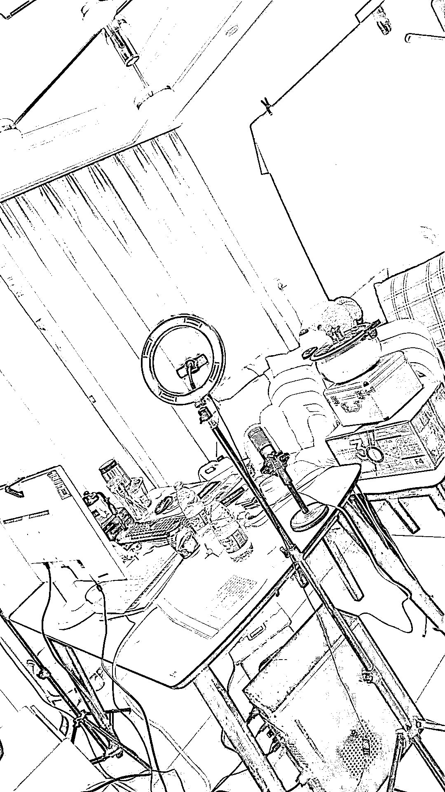

我非常感谢当时自己做了多多视频、小说推文项目，以至于后面做视频号带货，我做多多视频为了拿带货资格天天选爆品积累下来了选品能力、我做小说推文积累下来的视频剪辑与网感能力，在做视频号项目中都得到了很好的运用。

**真正印证了那句：你每走过的一步都算数！**

为了 全身心投入，我甚至给楼道里搞卫生的阿姨，额外支付了 150 块钱要她帮我丢垃圾，而我就足不出户的研究视频号。

她见我这么宅，母性光辉发散了，每次我开门给她垃圾她都会苦口婆心告诉我：年轻人，没有什么困难是过不去的。多出来走走，不要闷在家里。有时候没有联系她丢垃圾她还是会来敲门，她说就想确认一下我在不在。

哈哈，她说的在不在可不是说的是否在家还是出门，她是怕我想不开、做傻事呢！

4 月 1 号到 4 月 14 号，连续熬了半个月，我没有出家门，每日只睡 2 小时，熬通宵直播更是常态，吃饭也是随便对付一下。

**视频号好像是很公平的，它的高光时刻只属于那些因为了这个事业拼尽全力的人。**

4 月 14 号，我起飞了，没有一点准备，数据就是下图。

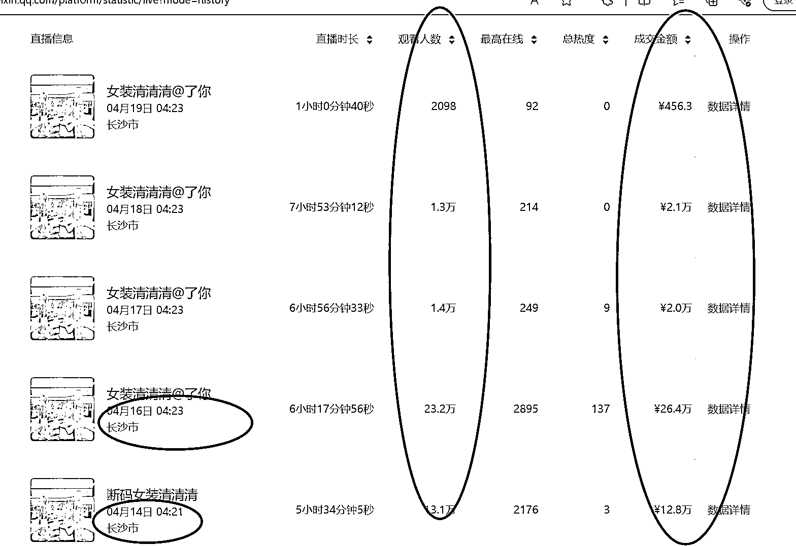

5 个半小时，13 万多人看，最高在线 2176 人，成交金额 12.8 万。第二天，闺蜜问我激动嘛，坦白说我没有多激动，我知道这一天迟早会来，只是没有想到来的如此之快。

4 月 14 号 -4 月 18 号，自己的佣金线上+线下，到手是 7 万多块。以下是部分商家线下转款的截图。

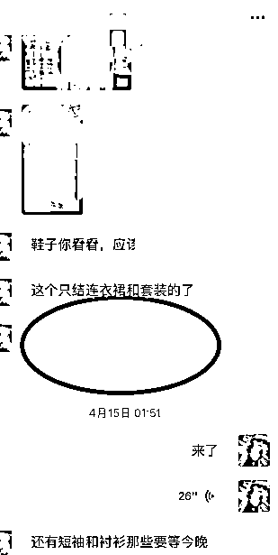

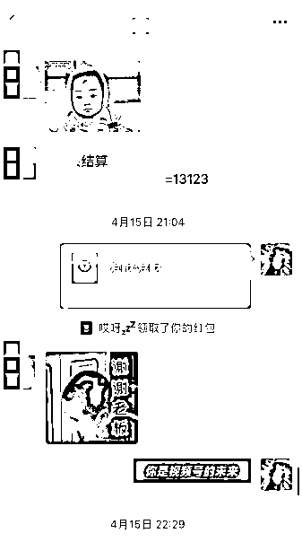

7 万多块，不得不说，很多普通人可能一年的收入就是这么多，我却用 4 天做到了。

有很多人在我直播账号的后台联系到我，惊讶于我的数据的同时想要付费学习，原来，有了数据，有了流量，真的可以是王。

4 月 19 号账号违规下播后，终于在 50 多个通宵工作后，第一次给自己放了假。打了一场麻将，买了一个 lv 牛角包。

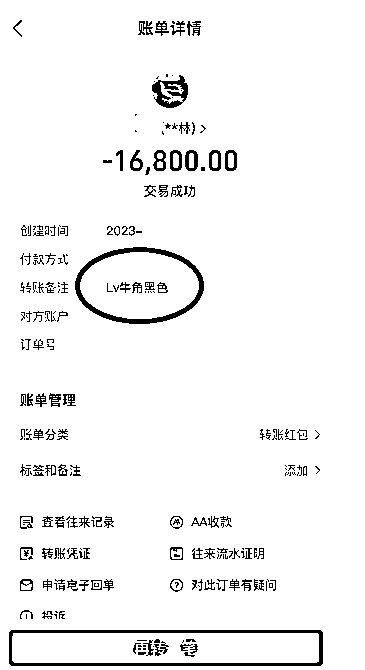

印象比较深刻的是，当时 打麻将组局约了好久，之前我那一拨牌友，因为过去的 50 多天我从来没有给她们凑过腿，甚至为了不影响我专注于直播打品，好几个牌友都设置为了勿打扰模式，等我自己要约人打牌的时候，这拨牌友身边的“朋友”已经换了一拨又一拨。

随着数据越来越好，越来越多的人通过我的直播间找到我，想跟我视频号带货。

这期间不乏有在家渴望通过自己的努力想增加收入的宝妈，有在职场郁郁不得志的职场人，渴望通过视频号变现的自由职业者，当然也有刚刚毕业的大学生小白。

无论是哪种人找到我，问到的是什么样的问题，尽管我当时没日没夜通宵的直播打品，精力很有限，但是想到曾经我也是这么迷茫、困境下的境遇走出来的，每一条信息，我都尽量用心回复。

每天我的工作由最初的只要直播，变成了回复问题、带教+直播，虽然很累，但是能够为这么多人解决这么多问题，对我来说更像一种使命感。

不过这样我的睡眠时间更少了，这样的状态一直持续到了 5 月 13 号。

那一天，命运的齿轮好像开始转动，在测品的过程中发现到了佛学、国学赛道这个曾经被视频号限制的类目，突然给了大流量，尤其是心经手抄。

要知道这类品，客单价高，佣金基本在 50%以上，商家愿意次日线下结算、退货率基本为 0。于是自己再次抓住机会没日没夜的跑品。拿结果、沉淀方法论；这是当时打品直播的截图：

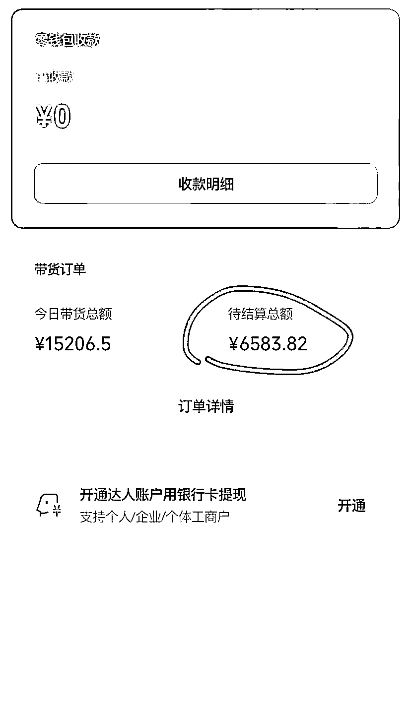

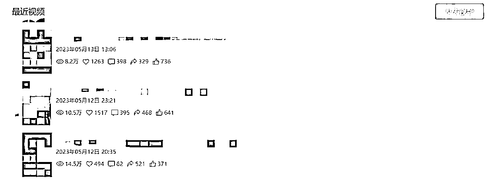

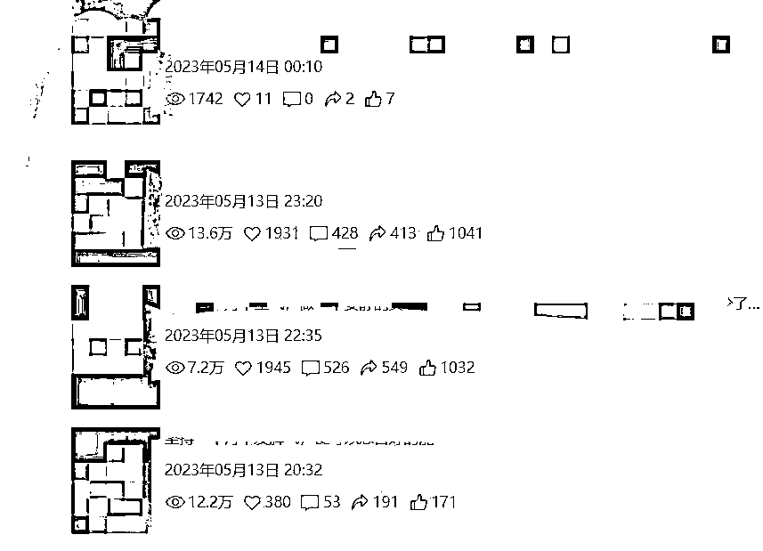

我用了两天时间，三个账号，不用养号注册后直接发视频，视频非常简单，按照我这边测试号的爆款框架来即可，剪辑一条视频不超过 30 分钟时间，发了就会有流程，然后开启直播，按照我提供的话术，甚至样品都没有都能爆，没有一条不爆，甚至看到有同行模仿我的视频框架录我直播间的声音都能爆。

两天，三号到手佣金 17000 元，基本实现了大家眼里羡慕的日入一万。

虽然这个钱赚的很香，但是两天后我差点垮了，因为人吃不消，不是剪辑视频就是直播，还因为长期的熬夜，那颗久久不发作还没有拔掉的智齿开始发炎，咽口水都痛，更别说直播了，张嘴都疼。

我当时着急啊，明明打法有了，明明我好像马上能赚到很多钱，身体出状况了，要知道这个风口不抓住稍纵即逝。

于是我想尽各种办法，比如租场地、请人直播，但是转念想，等招聘、培训、上岗后可能这个风口就过了，后来一个朋友建议我跟人合作，让我把方法教给别人。

中间我有过犹豫，要把方法教给别人就要等于付出很大啊的精力把方法论整理出来，还需要找到合适的人，到底收不收费，收费会不会被人认为我是搞培训的，不收费大家会不会投入度不高。

本来还在犹豫纠结，但是机会不会等我，我转念一想，我做的是正确的事情，也是能带着大家赚钱的事情，既然对大家是好的事情，那就去做吧。

我找到之前和我互动还挺多的圈友，找到几个合适的，试探的询问了一下，其实也是很不好意思，但是过程中有些圈友很直接，开口就是十分愿意付费学习的事情。

以前自己打品，不会去考虑太多，冲就完事了，现在还要教别人，所以倒逼着自己无论从供应链端、打品端、内容端、直播话术端不断的精进与打磨。

带着我的小分队们，在实战中出真知，心经这个品被打爆之后，我接连推出了好几个品，如文昌塔、财神贴、粗盐等各种佛学品；各种爆款书，再到后面的百货好物如缝隙刷、管道疏通剂等品品必爆。

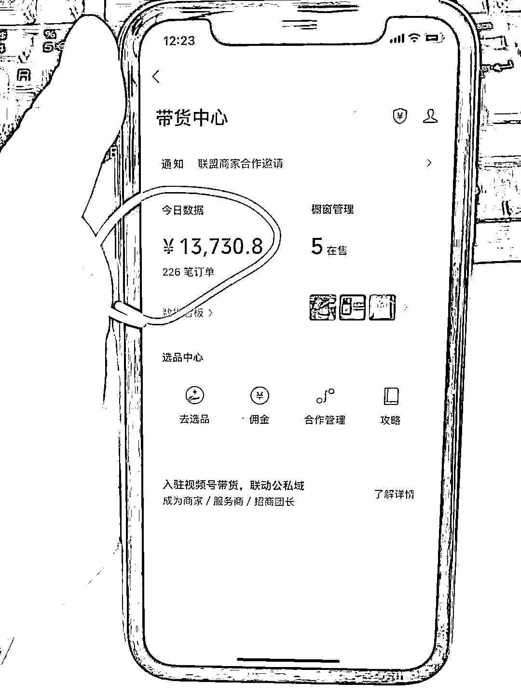

记得有个品我打完第二天，整个平台 30 多个账号，拿我的实拍素材、直播间放我的录音，基本一天能赚超五位数以上。

我的合作伙伴更是，最高一个人一晚上赚了 3 万多佣金。简单、上手快、拿结果、事实证明：在视频号不是好的产品会说话，而是我们赋予了产品会说话。

我也成为了合作伙伴眼里的选品能手：

带的几个圈友赚到钱了，我觉得这件顶住压力干的事情做对了。几个大爆品下来，我的收入成指数级上升，

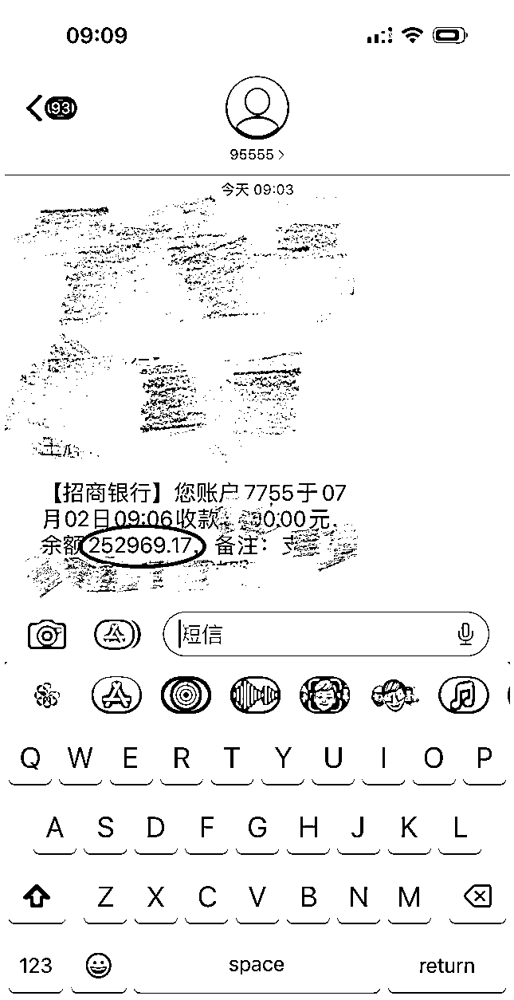

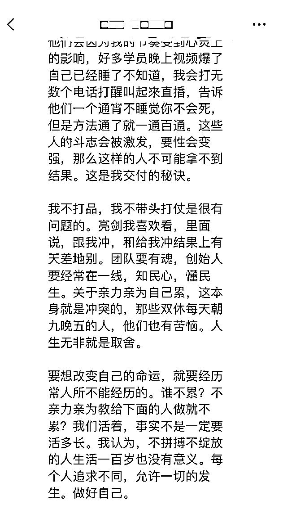

后来我给一个伙伴的分享，我觉得不管什么时候，我都要在一线打品，打好品，才能永远保持着一线作战能力。

就是那跑品跑的火热的几天，我跟我妈妈吵架了，她不理解我一个女孩子每天每日每夜干工作，也不知道我到底赚没赚到钱，也有可能，她跟很多人的妈妈一样，不认为这个钱是正儿八经赚来的。更无法接受我 32 岁了还不找人结婚，邻居大妈跟她聊天，说我以后找不到对象后她终于爆发了。

那是一个隔壁村里的理发师，说我不是喜欢做头发嘛？找理发师很好可以一辈子免费剪头发，又给我推荐了一个在深圳开货车的司机，在她眼里这样的工作稳定。

说我这么大年纪了还不结婚让她很没有面子，以后可能也生不出来小孩。其实我能理解她，但谁又能理解我？为了结婚而随便找个人，我能幸福吗？面子有那么重要吗？

我是一个有自己思想、经济独立、有远大理想报复的人，关于婚姻我有我自己的想法，我希望能跟我另外一半在事业维度相互扶持的同时能一起奋进，而不是随随便便找一个。

那次，我们吵的很凶。第二天，我去提了一辆奔驰 E300；我想通过这样的方式，告诉给我的母亲，我可以不用依附任何人，过的很好，我有赚钱的能力。

从那之后，母亲对于相亲的事情提的很少，偶尔打电话关心下我的身体，让我多注意休息，我想不用我说赚了多少钱之类的话，就这个车也能稍微让她安心一点吧。

# **三、视频号给普通人的红利**

故事说到这里，我想有必要跟大家说说，为什么我一个普通人能抓住这样的红利，半年时间靠着视频号带货实现年入 7 位数。那么，就开始我的干货环节吧。

1、视频号的主流消费群体：下沉市场的 40+以上的中老年女性用户。

这些人还没有经过 dy\快某等短视频平台的高度洗礼，也就是说很多我们 已经在 dy\快某看的都快要吐的种草类视频、剧情+产品种草类的视频、或者我们一眼都能看出来是智商税的产品硬广视频。

这一群大姐大妈们依然觉得这些视频很棒，她们大多数人有跟风、从众心理、封建迷信心理，很容易被种草进行产生消费欲望。

加上，这些大姐大妈们已经有足够的消费能力，所以我们要做的就比较简单了：找到这群消费群体喜欢的产品、找到她们感兴趣的视频，通过短视频+直播的方式在视频号呈现出来。

比如：家居百货、服装、护肤、孩子教育、大健康类、风水迷信这些类目，对应的可以从这几个类目找到产品。

2、视频号非常适合新手小白入局：视频号不用养号、不用起号、实名认证费用 100 元、当天注册当天可以发布视频并直播。

同时，只要会基础的剪辑能力，能从其他平台找到素材进行搬运、混剪或者一比一复刻实拍；不惧怕镜头，看着话术播，就能拿到比较好的结果。

3、dy\快手等平台，已经将很多的打法、类目、品做的非常大而全，成功案例、素材完全可以借鉴甚至于拿来主义。不需要自己踩着石头过河。

# **四、视频号直播带货的多种玩法介绍**

下面，我就目前我自己在做的几种打法与各位圈友分享，希望我的这一点分享能给正在做或者计划做视频号带货的各位圈友一点新的方向跟启发，当然，也欢迎大家拍砖。

先给大家分享，**绿幕清仓半无人直播带货**

整体玩法：利用绿幕将背景打造为卖场场景，利用背景字幕：**新店开业，100 3 件等。购物车越往下越便宜或者某些主打产品的低价等字幕吸引后户停留，配合清仓话术、留人弹幕以及好的排品策略（福利品引流、噱头款拉停留、利润款做转换）。

将人、货、场做到符合清仓玩法，同时基于平台，从话术、直播间布景、细节等规避违规风险，实现业绩高转换。

适合类目：百货类、零食类、服装类，比如最近的月饼，就非常适合做这种玩法，绿幕放个月饼工厂库房的照片贴图就好了。

需要准备的硬软件：台式电脑（配置高的笔记本也可以）、摄像头（电商平台搜索罗技 C92 即可，不需要多高清配置）、绿幕（电商平台搜索绿幕，2*2 米即可，不需要多大）、补光灯（根据自己直播环境决定，电商平台搜索普通补光灯即可）、200 兆宽带以上、安静的直播环境、实名视频号、推流软件（OBS 推流软件下载地址：[`obsproject.com/`](https://obsproject.com) ）

具体步骤：视频号无需粉丝即可带货，一个人可以实名 5 个微信号，开通微信号即可以申请视频号。

申请视频号后，将视频号名称改为：**批发、**华南云仓等。 （名称不重要）。头像改为相关类目背景的即可，头像跟名称以及简介，参考抖音、视频号清仓类的直播即可（非重点）。

无需养号，注册当天即可开播，无需发视频。视频号对新账号有流量扶持。进去创作者中心，点击带货中心-选品中心，根据操作实名后缴纳 100 元，然后等通过（一分钟左右即可通过），就可以去选品广场选品。

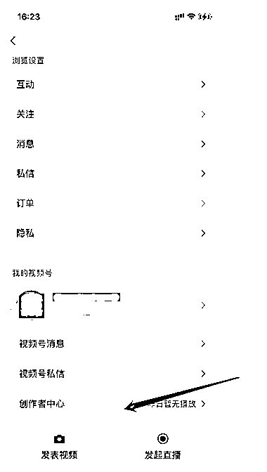

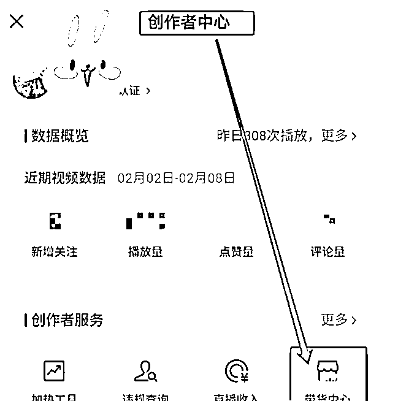

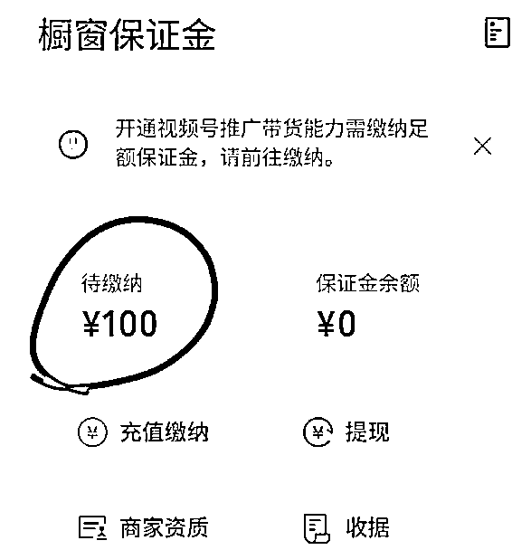

点击进去，会有需要实名的消息，注意，这里需要用你自己或者你身边的人实名，因为后期直播需要人脸实名。按照流程走完用，1-2 分就可以下来带货资格。

这里的保证金 100 是可以退的，具体有保证金退的相关要求，可在后台查看，因为金额较低，这里不做展开。

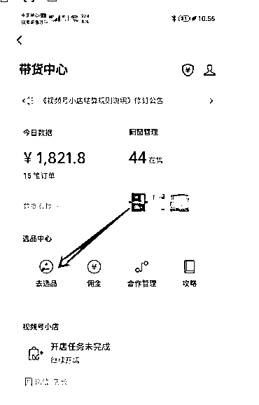

选好品后。即可以准备开播的流程。

开播时间：视频号的群体，亲测晚上的流量更好，因此，建议在 24:00 后开播。晚上 12 点到次日 8 点；是黄金转换时间。

排品指导：视频号是倒序的橱窗展示形式，也就是说，最后一个链接是 1 号。橱窗链接数量控制在 180-250 个左右为最佳，超过 300 或者低于 100 对直播间转化会造成影响。

1-100 链接，搜索选品广场精选联盟挑选其中的商家进去，找到贵、质量好、款式好尤其是大牌的这些链接贴加进去橱窗，没有销量的也可以。

注意（1-100 链接非主卖，为噱头）添加福利款链接 50 个，搜索选品广场精选联盟挑选其中的商家进去，找到便宜、款式常见、销量高、佣金低的链接贴加进去橱窗，注意（福利品，一定要有销量，一个价格低，排到你橱窗的最前面，比如你是选了 180 个品，因为是倒序，你的福利品是 180-130 号链接，观众进来看到的就是福利品）。

其余链接：就是放利润款，即价格不是太高 佣金不是太低，有销量的款式。

开播话术：欢迎大家+表明自己的身份，找个噱头（为什么今天的价格这么便宜，是工厂不做了，仓库积压货了，新店开业了，老板今天生日等等都可以），只要场景代入足够真实，观众都相信就好了。

以上就是绿幕清仓半无人直播带货的具体玩法，大家可以根据这个操作指南去实操。

下面给大家分享：**百货好物连怼打法。**

相信近断时间刷视频号直播广场的人都能看到以下类似的账号：

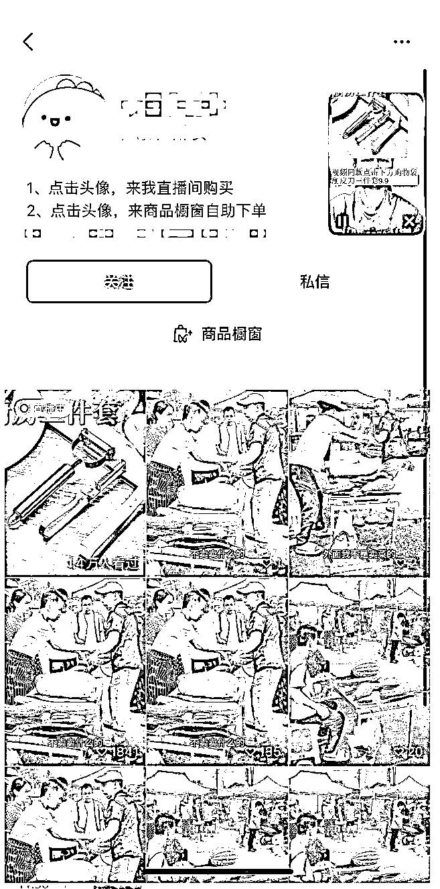

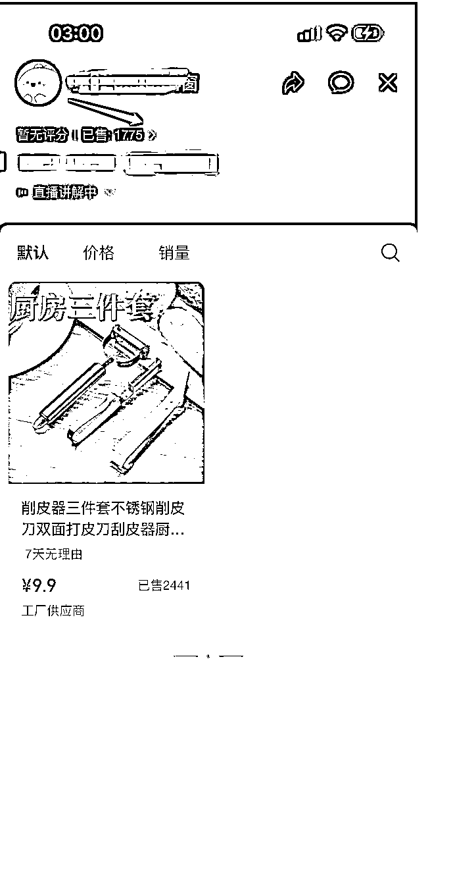

 这类视频乍一看，无论是从视频剪辑、发布还是直播来说，都是简单粗暴型。甚至有的人刷到都会对这种视频、直播画面嗤嗤以鼻，不敢相信这样的玩法能赚到钱。

那么这一类玩法为什么会有流量、为什么能赚到钱，又是怎么赚到钱的。请认真看：

这类玩法其实是从抖音过来的，2019-2022 年，抖音平台成就了无数个好物推荐的账号：吸引人的前三秒+BGM（口播）+接地气的好物种草类视频。

这类型的视频，简单明了快速的在十几秒内吸引到用户的眼球，比如口播：你绝对想不到这个小玩意还可以这么用、家里有小孩的一定要看过来、厨房里一定要有这么个小东西等。

这一些都大大提高了视频的完播率以及转发率，符合平台的算法逻辑与推荐机制。如今，随着抖音平台越来越商业化，人群也不断的被清洗，好物推荐类的玩法在抖音是属于过期的。

那么，视频号为什么又会火？

很简单，目前的视频号带货像极了早几年前的抖音，甚至毫无疑问的说，这几年在抖音火爆过的各种玩法，都值得在抖音做一遍，比如清仓、比如好物推荐、比如顺爆、比如矩阵等。

视频号目前的主流用户与消费群体都是 45+以上的下沉市场的中老年女性，她们没有高认知也没有那么快赶上时代发展的潮流，比如很多人没有抖音/快手，很多人看这种种草的广告并不认为是广告而是会认为是跟她一样的用户分享，且有跟风、从众、摊小便宜的心理。

  下面详细讲解一下这个玩法具体怎么做。

**（1）选品**

 抄：抄同行。

抄不是干抄，要会抄。比如当你立项了后，第一时间是去视频号刷视频，你要将你的账号刷成直播广场大部分都是你想要看到的同类型的视频。

那些正在直播正在爆量的账号，最好是场观不高但是出单不错的品即是爆品。找到对应的账号，点击进去该账号的橱窗 看已售件数以及直播间互动情况判定即可。对应的品是你可以立马跟的品。

因为这个品当下能爆，一定是有原因的，你要做的就是快速响应。

当然，有个点值得注意，不要去跟大爆品，就是你刷到了好多个账号，大家都在玩的。全广场都是的，这种不建议跟。

选品：选品是需要体感的。去抖音搜索好物类的品的同时，还要符合视频号的用户群体：便宜实用、新奇特、符合中老年人。你的一段视频，这部分老年人能看明白，看明白了觉得这个东西好，想要买就是好品。

那自己选品该怎么选？我个人总结的经典四要素：低价、实用、新奇、符合中老年。

当然，借助选品工具是必不可少的：如蝉妈妈、考古加等平台。巧用筛选工具进行筛查即可

**（2）选视频素材**

定框架：好的素材框架是视频号爆、抖音也爆的框架。

1.  这类素材一定符合以下几点的原则：

2.  前三秒 足够吸引人。比如新奇特

3.  框架简单不冗长，内容想要表达的东西大家一看便懂

4.  放大用户的痛点，增加共鸣，看了就想买

5.  情节（音乐）等足够拉互动与停留

6.  尽量蓝海

找素材内容：好的内容一定是原创度越高越好

**（3）剪辑**

这里可以说是整个玩法里最重要的环节了，这里一定不要偷懒，因为多数我们还是在做搬运、混剪的事情，所以如果不做好素材的去重处理，视频是很难爆的。

常用的去重的动作尽量做到位：抽帧、改 MD5、贴纸、特效、转场、调整倍速、调整大小、旋转、调整角度等，这么做是为了改变帧率去重。  

**（4）账号包装**

头像可以是中年妇女的头像，最好是背影 、侧影的那种网图，或者是像妈妈们用的头像一样的，比如莲花、荷花等，没有特定的要求，但是不要用好物推荐、全场清仓等这种踩雷的头像。

账号名字：如雪姨 339、朵妈 798 这样一看就像是像普通用户而非专业营销号的名字，切记不要用好物推荐、好物分享、**百货这种。

 简介：视频同款在下方链接。不要去弄什么品质保证，高端品牌这种要官方顶死你的话。

 位置：发布作品时不要贴加定位

 封面：同一个品不同的素材框架，发布视频时尽量将封面进行统一，封面符合几点：足够吸引人、文字与画面内容不违规、不擦边；这样更利于转换效果。不能做到统一就做到风格统一。

**（5）发布**

视频发送，记住都用手机发（wifi 和流量都行）

**（6）直播**

 直播设备：苹果手机开启直播即可，准备电脑，电脑看数据。登录[视频号助手](https://channels.weixin.qq.com/platform/) [channels.weixin.qq.com](http://channels.weixin.qq.com)

 将直播画面设置为如下图即可：手机端开启直播-画面-贴图-上传一张图

（这个产品的宣传图你可以在淘宝、京东、视频号小店后台、抖音小店后台、拼多多去搜索该产品找到对应的宣传图下载下来即可。注意这张图只需要简单介绍今天的产品是什么，功能是什么即可，不要太恶意引流的文字描述或者内容涉及医疗等违规字样。）

将贴图大小调整如下或者还可以往右边移动一点，大概占据屏幕三分之一即可，不要完全把人脸挡住，当然，如果直播能力可以的话，人脸漏出来不放贴图的直播效果转换更高。

即设置好了开播的封面

封面就用头像或者是用你刚找的那个有关于产品的贴图。分类-综合电商-购物-综合电商；直播模式不动-定位可开启可不开。

实物样品：注意是需要样品的，你可以拿到手里讲解，或者拿个转盘（拼多多十几块钱）把样品放在屏幕显示的下方，让用户可以看到就好，官方审核人员也需要看到你的样品才会判定你不是非实物在讲解直播。实在没有样品，就找个相似的实物也可以，不过有风险。

**  开启直播后的重要事项**

  ①先弹窗

  （下方是电脑端操作）登录[视频号助手](https://channels.weixin.qq.com/platform/) [channels.weixin.qq.com](http://channels.weixin.qq.com)

 如上图，弹窗（弹链接在视频号助手-直播-直播商品管理），开启直播后，在每条链接右边会有讲解二字，你想弹哪一条链接，就在哪条链接那里对应点击讲解就好。

如果是手机端弹窗讲解：在直播画面下面栏目有个商品-点击进去 点讲解即可

 ②打开数据大屏

视频号助手-直播-直播商品管理-箭头位置，进入直播间-数据趋势大屏点击进去即可

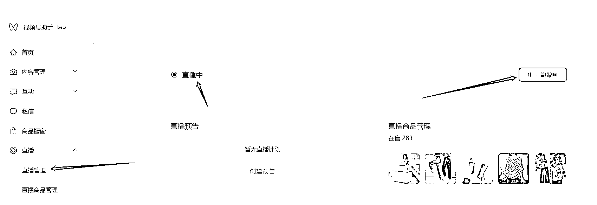

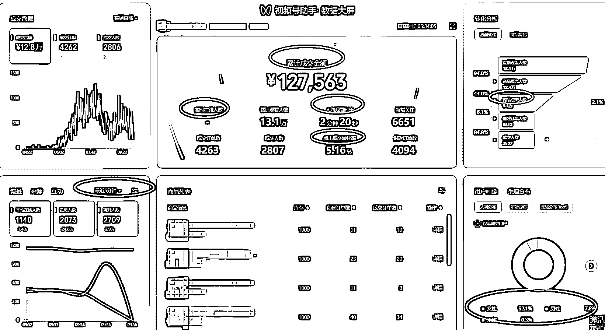

  如上图：进入到数据大屏后，每五分钟关注数据大屏几个指标：实时在线人数、每五分钟进人、男性女性占比

  留意公屏进人。

 ** （7）话术**

**直播简单话术：**

**欢迎：**

欢迎新来的哥哥姐姐，哥哥姐姐如果是通过我们视频来到我们直播间的，下方链接已经跟哥哥姐姐们弹出来了，所见即所得，想要拍的哥哥姐姐们抓紧时间点击下方链接去拍，有任何问题都可以打到公屏上，老妹看到了这边跟您耐心做回复。

看了想拍的的朋友抓紧去拍今天 9.9 就最后几单了，厂家做福利等下就没了！！

**产品介绍：材质+用法+功效**

如：今天这个小玩意千万不要小瞧，它是不锈钢材质的，... 统一告诉一下哥哥姐姐们怎么用...是不是很简单方便； 这个小玩意放家里真的能省不少事情呢。

**逼单：**

哥哥姐姐们，刚老妹也详细的跟大家介绍了，如果有确实是喜欢的哥哥姐姐们，那就直接点击下方去购买就可以了。

因为这个价格你们也看得到，确实也不是要大家大几百块，都是大家能花小钱办大事的，今天这个价格库存我们没有上特别多，也是想着新号开播跟大家交个朋友的价格。

以上是两种打法的详细介绍，下面跟大家浅谈一下，这两种打法的优劣势：

**绿幕直播的优势：**

1、不用发视频，不靠视频流量直接全靠直接流量；

2、选好一个类目深耕就好了，不用一直选爆品单品，不要一直想爆品视频内容框架；

3、上限很高，一场直播有可能就是大几十万的 GMV；

4、不废号

**劣势：**

1、对主播的直播能力、控场能力要求比较高。

2、选品与讲品难度大。

3、平台对每一个类目都有市场最低价的规则且是不断变化的，因为是多品，一次要上架 100 个以上的，有可能因为某个品的价格低于平台的要求，而违规。

4、相对来说更加适合于团队运作，个人操作难度大，比如直播需要拉时长等。

5、比较吃后端，比如性价比高的产品、发货与结算有保证的商家。

**百货好物连怼打法的优势：**

1.  对于主播能力要求低，只要愿意真人出镜会读话术即可

2.  单品打法，不需要排品，不需要讲品

3.  随时可以换品，打法灵活

4.  非常适合个人操作

**劣势：**

1.  需要有剪辑能力，还要有视频网感

2.  品的周期性很近，需要不断打造爆品

3.  废号

4.  上限低，一场直播哪怕拉时长 5 万 GMV 是上限

# 五、新手小白该如何入局视频号

（1）**心态：足够聚焦，深耕是王道。**

我做视频号的这大半年，足够聚焦，并没有去做其他的项目，尽管会有很多人也会拿小红书、抖音本地生活、AI 数字人等项目极好的结果数据刺激我，我依然坚持足够聚焦、人的精力有限不能什么都想要的原则，all in 到了视频号。

我也跟很多人聊过天，我发现那些能拿到好结果的人并不是那个“聪明”的人，相反是那些不懂走捷径、没有太多想法、简单听话照做的人；

那些经验主义、那些手里同时做了多个项目、那些喜欢带着自己很多想法加入进去项目的人，尤其是喜欢把抖音的玩法带入到视频号当中的人，最终的结果就是：要么说视频号不行，平台不够完善；要么说视频号审核太严格，老是违规；要么就是怀疑项目本身。

不知道在哪里听到过的一句话：“挖一米宽，一米长，深耕一万米。”

我想，无论做任何的项目，其实不在于项目本身有多大，而是在于我们在项目上愿意花多久的时间，愿意沉下心再苦再难去沉淀去深耕。

像曾经我们觉得可能不会有太大结果的多多视频、闲鱼等等很多大项目，依然会有人在观望，而有人赚的盆满钵满。

视频号亦是如此，如果是看到的全部是问题，那哪里都是问题，如果你看到的是机会，那哪里都会生根发芽，只要你愿意播种。

**（2）坚持日刷，保持对行业、平台以及玩法的敏感度。不下牌桌等风来**。

我辞职做视频号是今年 4 月，我 4 月在视频号通过 0 粉 0 作品清仓玩法绿幕直播的方式，最终拿到的结果是带货佣金 15 万+（具体不记得，因为后台的结算不是一次性到位的）；

我总结下来能拿到结果的原因是由于自己为了保持对平台、对内容、对直播玩法的敏感度，与我每天坚持刷视频号 1 小时有莫大关系。

这里也想给正在做或者计划做视频号的圈友们分享一个点：同行其实是最好的老师。你需要把你的视频号刷成你想要做的类目的账号标签，这样平台会源源不断的给你推荐同行。

这里给大家分享一个做项目的方法论：抄超钞方法论。

①、抄

找一个优质的好项目，请记住，好项目不是大家赚到钱了叫好项目而是合适自己的叫做好项目。

比如有人通过直播带货赚了钱，那你就要去思考，你去做直播做带货，需要什么对应的硬件条件，自己是否具备，不具备的话是否能调整等等。

以直播带货为例，然后你需要在你想做的平台里对标一个优秀的同行，进行一比一复刻，比如他的话术、直播间的场景搭建、开播时间、视频内容发布时间、账号名称及包装、选品排品等等。

②、超

当你找到对标同行的时候，你就有了方向，剩下的就是聚焦，去做细节。

因为你可以复制同行的整套模式，但无法去复制人家的细节。所以你要想达到别人的高度或者超越别人的高度，就必须自己在同行玩法的基础上进行创新。

比如你看到对标的直播间主播话术说的不好，转换不行那你想尽一切办法去优化主播的话术提高转换，那么你可能比你对标的直播间拿到更好的结果。

当你将整个项目环节都跑通了，你对这个行业也基本有一定的了解，这个时候就需要做删减，把别人没用的东西删除掉，优化细节，然后再去摸索新的玩法，超越同行。

去其糟粕，取其精华！人无我有，人有我优！

③、钞

做到以上两个点，你基本已经可以成为某个行业的玩家了，这个时候你需要做的是，放大！

把你操作项目的环节进行拆分，模块化，流程化，降低操作门槛。

剩下的就是该请人的请人，该外包的就外包，该投流量的就投流量！毕竟个人的时间、精力、资源，是极其有限的。

想要成气候，就必须升级商业模式，有效放大。

（3）**执行力拉满，红利面前浪费一秒钟都是可耻。**

我记得我当时发现新赛道后，于是立马执行，当即剪辑视频当天直播，两天两夜没有睡研究玩法，拿到了两天三个号佣金 2 万的好结果。

毫不夸张的说，那段玩命的日子，没日没夜基本不咋休息，一天一个指数级跨越，一天一个大结果。我把这段拼搏的日子，叫做成长。

有很多人劝我：“注意身体。” 也有人笑我：“你这工作就是玩命，给医院打工。”

还有人说风凉话：“到时候会猝死。” 只有我自己知道，这就是执行力。

**写在最后：**

以上是我这半年玩视频号的心得体会，希望能给在做视频号的圈友一点共鸣与启发。

特别想给大家分享一段话：“有一天，你决定，沉下来，先动起来，再坚持一下”。

谨以此献给那些迷茫困顿焦虑的你，如果你此刻没有方向，那么你需要的是先动起来，因为路是靠自己走出来的；

如果你此刻正觉得很难，告诉自己再坚持一下，你会发现从 0 到 100 万，其实没有我们想象中的那么难。

* * *

评论区：

宇逍 : 给拾柒打 call
🌈盆蜀🌈 : [强][强][强]
胡北北 : 很棒[强]
希声 : 厉害！
小南瓜 : 厉害了[强][强][强]
在路上 : 厉害
徐来 : 吃得苦，霸得蛮！湖南妹子好样的
christophe* : 太强了

* * *