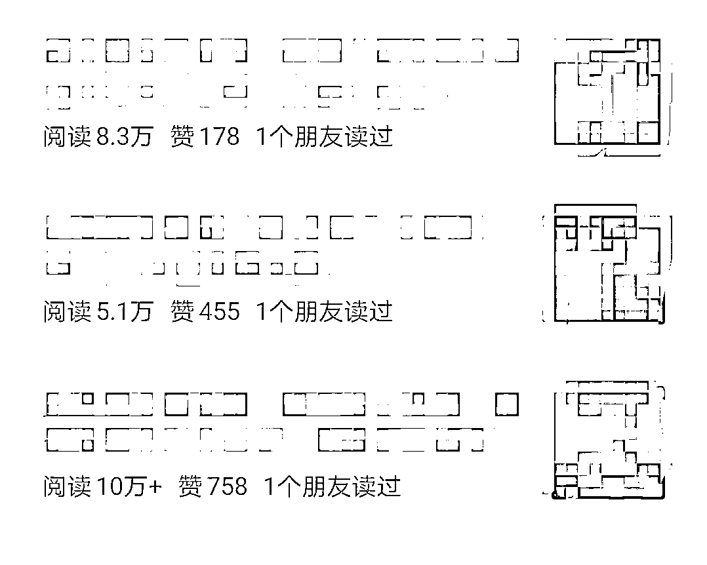
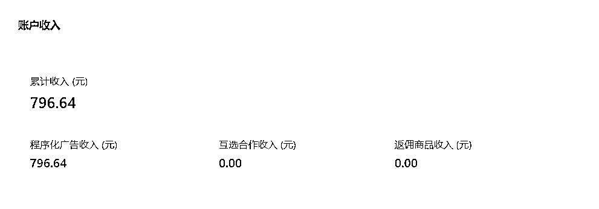
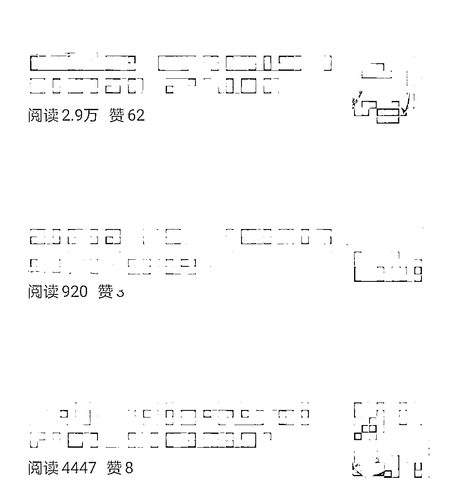
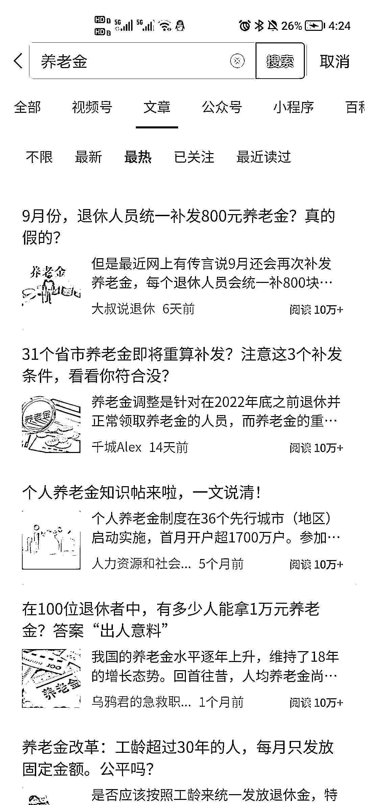

# 第一篇文章就入池，三天拿下阅读 10w+，收益 1000+的全部思路

> 原文：[`www.yuque.com/for_lazy/thfiu8/gynqack75xo5yitd`](https://www.yuque.com/for_lazy/thfiu8/gynqack75xo5yitd)

## (172 赞)第一篇文章就入池，三天拿下阅读 10w+，收益 1000+的全部思路

作者： 辰风

日期：2023-09-05

大家好，我是辰风，见字如面。

我从八月份开始对公众号流量主进行测试，当时看了航海手册关于近现代史的内容，然后注册了 chat，在公众号随手发了两篇文章。

之后几天都没看，然后回来发现居然阅读破万了，我意识到这个值得一做，立马开始组建团队，进行日更。

然后我开始看生财精华帖关于公众号流量主内容，并且通读了公众号爆文的航海手册。

在一周内，我出了一篇 10w+，多篇万阅读文章，收益了 2000+。

我的主要测试赛道是：近现代史和民生领域。

收益确实一般，不过也没开文中广告（因为当时只是顺手测一下），建议有必要开启。

> 自媒体赛道变得越来越拥挤，许多博主和公众号争夺有限的用户注意力和流量。这导致了广告收益的竞争，使一些公众号难以维持过去的收益水平。
> 
> 微信等平台不断修改流量推荐规则，导致公众号的流量下滑。这些算法调整可能使一些公众号的内容难以被用户发现，从而影响了广告的曝光和收益，许多人逐渐退出公众号平台。
> 
> 加上短视频平台如抖音和快手暴力打法，吸引了大量用户的注意力，让公众号市场面临很大的压力。
> 
> 很多用户更倾向于观看短视频内容，而不是长篇文章，这就使得公众号的受众面更为狭窄。
> 
> 为了应对来自其他平台的流量竞争，公众号逐渐开始开放公域流量，例如互推和流量矩阵。公众号还调整了规则，允许作者选择是否被平台推荐。这样做的目的是为了更多地支持优质内容创作者，而不再依赖私域流量。
> 
> 微信平台也积极发展视频号、问一问，试图以此实现文字、视频和用户互动之间的联动，以形成新的用户闭环，从而为公众号提供了更多的变现机会。
> 
> 公众号流量主项目面临着市场变化和竞争的挑战，这对于我们来说也是一个新的机遇！
> 
> 而很多朋友的实践也表明，公众号流量主变现这个赛道是完全可行的。
> 
> **一、公众号流量主**
> 
> 大家基本的应该都有了解了，生财航海里也有写到。
> 
> 首先，你要有至少一个公众号，其次达到 500 粉，开通流量主。
> 
> 收益的计算方式通常是根据文章的阅读量和广告的曝光量来确定。具体来说，广告收益会随着文章的阅读量和广告曝光量的增加而增加。
> 
> 建议想做这个项目的朋友，可以准备 4-6 个账号，日更进行测试，可以选择 1-2 个细分赛道进行输出。
> 
> 注册一年或两年以上的老号，可能自带流量权重，更容易进池。
> 
> 账号准备好，直接开通流量主即可，无需等待。
> 
> **二、八月份的变现成绩**
> 
> 这一个多月来，一共测试了两个赛道，近现代史赛道原创文章在 70 左右，收益 3000+，民生赛道是在八月中旬开始测试，收益在 1000+。
> 
> 这是流量主收益图，每天差不多是上百收益。
> 
> 历史赛道在八月初发布测试就开始爆文，进入流量池，首发破 4.9W，收益在 300+，后续也在持续的爆文，更是在测试第六天，文章爆款 10W
> 
> +，收益破千。（只打开了底部广告）
> 
> 
> 
> 民生赛道相对来说爆款较少，但是民生领域的单价较高，一万阅读量在 70-100 区间，起步阅读量还是不错的，收入也算是可观的，有一篇十万加的爆款收益在 1000+。
> 
> 
> 
> 我在这个月也带了几个学员以及合伙人做了这个赛道测试，效果都不错，收益也将近 800。
> 
> 收益图：
> 
>   
> 
> 文章爆款：
> 
> 
> 
> **三、历史号赛道以及民生赛道的详细 sop**
> 
> 1.  公众号流量主前提：满足开通条件
> 
> 首先是公众号流量主要开通必须要达到 500 粉为前提条件
> 
> 2.  如何获取对标账号
> 
> 2.1 对标账号可以通过搜索关键词
> 
> 比如民生领域的“养老金”、“延迟退休”这类关键词，然后点击文章，再点击最热，就可以看到很多篇十万加文章，点进去，就可以看到对应的民生公众号。
> 
> 
> 
> 2.2 复制一条爆款文章标题进行搜索，然后点击文章，点击最热，就可以看到很多篇十万加文章，点进去，就可以看到对应的公众号了，无论是历史领域还是民生领域都适用。
> 
> 
> 
> 2.3  进入订阅号消息
> 
> 不要展开关注的公众号列表，去看公众号推荐给你的图文消息
> 
> 多翻一些你就可以找到低粉爆款（有标注 10w+的）
> 
> 3.如何寻找爆款选题进行创作
> 
> 3.1 对标公众号获取
> 
> 可以在对标的公众号里面查看近期的的爆款，至少阅读量在 5 万+，最好是十万+爆款来作为选题，时间最好是近七天的爆款文章。
> 
> 3.2 百家号+今日头条获取
> 
> 百家号可以定位文章为对应的领域，比如历史、军事、社会等等来获取爆款选题。
> 
>   
> 
> 今日头条可以刷同类型文章进行获取，看到一些阅读量很高的，可以进行收藏，获取爆款选题。
> 
> 3.3 工具获取
> 
> 低粉爆款文章获取工具：极致了 、次幂数据、西瓜数据
> 
> **4.如何根据爆款创作新的爆款？**
> 
> 4.1 自己写
> 
> 首先是获取了多篇同选题的爆款文章，根据爆款文章得出新的大纲，根据大纲进行展开阐述，具体根据爆款文章风格来写，参考她的标题等等。
> 
> 我写近代史的思路，就是先从爆款文章提取框架，然后投喂给 chat 历史背景信息，让 chat 利用我给他的架构，然后进行内容创作。
> 
> 在此基础之上，对于开头，正文内容和结尾进行适度优化。（尤其是写一个炸裂的，吸引人的开头，可以多用疑问句或者设问的方式）
> 
> 在修改结束之后，再进行查重，如果原创度较低，继续进行修改，一直达到 75 以上为止。
> 
> 4.2 gpt 写
> 
> 前提是获取了多篇同选题的爆款文章，利用 AI 进行写稿，AI 写稿要注意的是同质化以及原创度问题，可以先提取它的大纲，然后通过指令得出一篇新的原创文章， AI 写稿需要自己进行补充内容以及辨别内容是否正确。（也可以在指令中设置禁止虚构，必须创作真实内容）
> 
> 以近代史为例，很多历史 ai 并不了解，所以需要你给他故事背景，否则他就会胡诌。一定要避免重大史实失误，人物和故事情节对不上号，虚构内容等问题。
> 
> 检测文章原创度网站可以使用爱发狗、易撰，易撰网站的原创度检测还算是比较准确的。
> 
> **5.如何获取平台推荐？**
> 
> 首先，做好垂直账号，确保你的公众号或文章内容与一个特定的垂直细分领域相关，比如历史赛道、民生赛道等等。
> 
> 只要定位足够垂直，内容质量还过得去，基本进流量池只是时间问题。
> 
> 一个建议：你最好能够对自己的定位有一定的了解和兴趣度，最好能够具备一定的网感，否则你根本没有办法判断这个内容质量好坏。
> 
> **一个内容是可以反复成为爆款的，如果你写了某个人物，或者某个故事拿到了 10w+，那你可以一直写，直到没有流量为止。这也是一种赛道细分和流量密码。**
> 
> 其次，保持频繁的更新文章，坚持每日发布。
> 
> 即使起初阅读量较低，也要坚持发布高质量的文章。一般来说，流量推荐是在三天到一个月不等，我之前 8 月中旬的一篇历史文只有六百多阅读量，但是就在昨天推流到八千+、一万多的阅读量。
> 
> 近期我的历史号在推流半个月前的文章，几乎都篇篇快破万了，流量的推荐并不是只有有短期直接推流，推流需要时间，不要轻易放弃！
> 
> 如果选题和内容都没问题，以上问题也没有，那就可以注销，重新再来，或者测试新的账号了。
> 
> 原则上来说，只要是多账号测试爆款定位内容，不可能进不了流量池，只有可能是内容问题。（如果你运气实在差，那也没办法）
> 
> 最后几点思考：
> 
> 1.  如何提高原创度
> 
> 第一种办法，以口述文字的方式来进行内容写稿，我们把一个内容先写个框架下来，然后语音转文字去生成我们的思考和认知。
> 
> 可以提取原爆款文章的标题选题，关键词，内容框架，故事架构，来进行文字创作或者语音转文字，上手快的话，也可以实现在 20-30 分钟左右创作一篇 1200 字左右的文章出来。
> 
> 口述文章的话，五分钟可以生成一篇一两千字的稿子。然后让 AI 去修改标点符号和措辞表达。你夹杂一些废话，你自己的理解，这样你的这个内容的原创度自然就高了，而且你还避免了同质化。
> 
> 第二种办法，使用 chat4.0,4.0 用完了用 chat3.5，同时结合克劳德和必应等 ai 工具，进行多次改写。当然，这样一通下来要花费不少时间。
> 
> 第三种方法，多投喂不同的引导词，学习不同的引导话语技巧，来让 chat 进行创作和内容改写。
> 
> 2.  如何开多个公众号
> 
> 一个人可以开个人公众号，个体工商户执照可以开两个企业公众号，公司可以开很多个账号。
> 
> 如果你想搞到更多账号，唯一的办法就是找别人，从身边靠谱的亲戚朋友开始。
> 
> 3.如何避免内容同质化严重
> 
> 还有一种办法就是黑科技，我们对标那些最新发布的原创内容。先入场为王。直接通过爬虫去爬那些高数据的同时，是最新发布的那些没有被洗稿过的第一手内容。
> 
> 先发占据绝对优势，后面拿到内容再次创作已经不知道是第几手了。
> 
> **以上，就是我关于公众号爆款文的全部思考，感谢生财的航海手册，感谢公众号流量主精华帖的作者，感谢各位能看到这里。**
> 
> * * *
> 
> 评论区：
> 
> 大智 : 先码后看
> 牧清影 : 哇，太牛了
> 辰风 : 谢谢
> 辰风 : [抱拳][抱拳][抱拳]
> 慧菲 : 太厉害了
> 书情小跟班 : 大佬在我身边，有幸跟大佬在同一个群，哈哈
> 微微 : 辰风真棒！🎉
> 辰风 : 谢谢微微
> 
> 
> 
> * * *