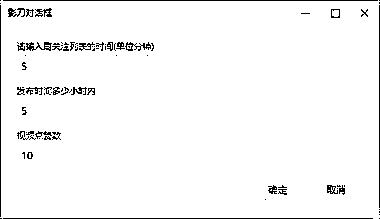

# 抖音图文如何快速跟款？借助 RPA 工具自动化刷关注列，捕捉异常值

> 原文：[`www.yuque.com/for_lazy/thfiu8/eirrg533qbnqnk3r`](https://www.yuque.com/for_lazy/thfiu8/eirrg533qbnqnk3r)

## (72 赞)抖音图文如何快速跟款？借助 RPA 工具自动化刷关注列，捕捉异常值

作者： 咸人韦

日期：2023-09-06

抖音图文如何快速跟款？借助 RPA 工具自动化刷关注列，捕捉异常值

昨晚听了坤哥的分享，坤哥提到了如何选品、跟品。

最简单的方法就是先关注一批优秀的同行，然后固定几个时间点去刷抖音的关注列

于是我写了小工具，借助影刀+模拟器。用程序来替代刷抖音的这个动作

先设置好异常值的标准(图 1)，

刷同行的时间：比如刷 5 分钟，10 分钟
发布时间 XX 小时内、多少点赞：比如找发布时间 5 小时内，100 点赞的图片

符合条件的图文，程序会截图保存在 C:\截图（需要先创建这个目录）

闲言少叙：上飞书链接：

希望对大家有帮助[啤酒][`o6tet8cc4p.feishu.cn/docx/YCBsdJF8soOx4MxX8afcH1Zrnih`](https://o6tet8cc4p.feishu.cn/docx/YCBsdJF8soOx4MxX8afcH1Zrnih)

* * *

评论区：

陆陆 66 : 优秀
猫嘉 : 韦哥真牛[强][强][强]
宝哥~ : 学习了
眼镜 : 感谢分享  请问下载你的抖音 在模拟器里面打开后会闪退 是什么原因
WEI : 大佬，这个会不会给封号的啊
咸人韦 : 不会的
Harry Sun : 大佬，有 Mac 版本么
咸人韦 : 没有哦，Mac 版影刀好多功能没有做

* * *