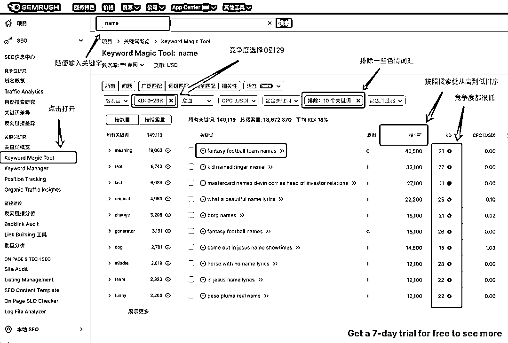
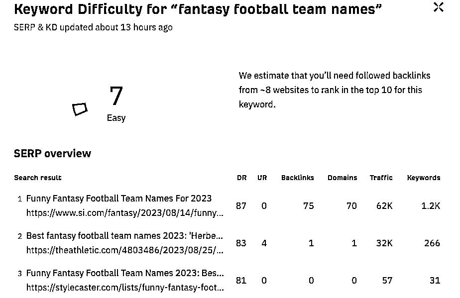
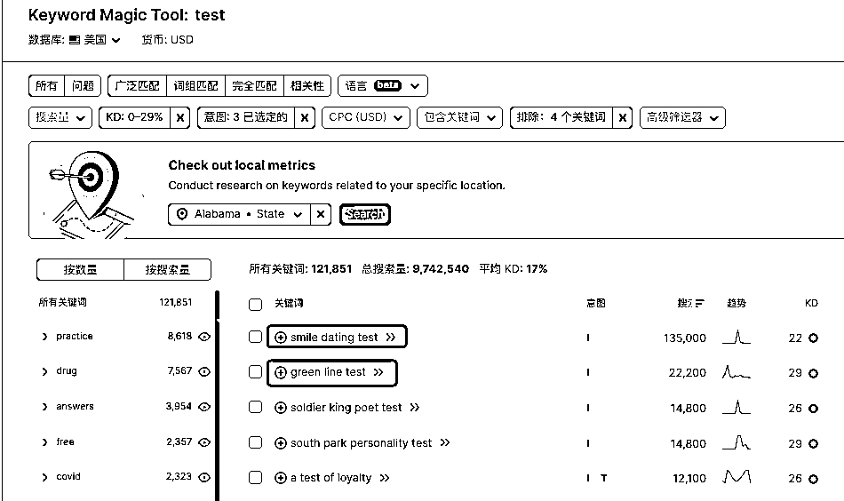
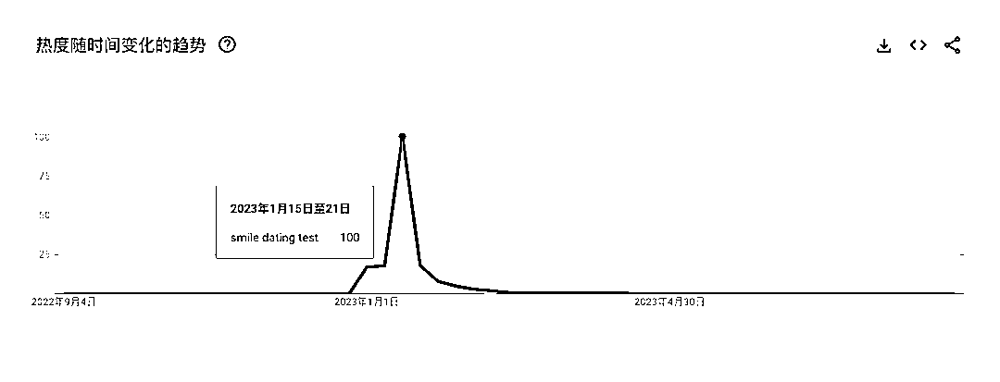
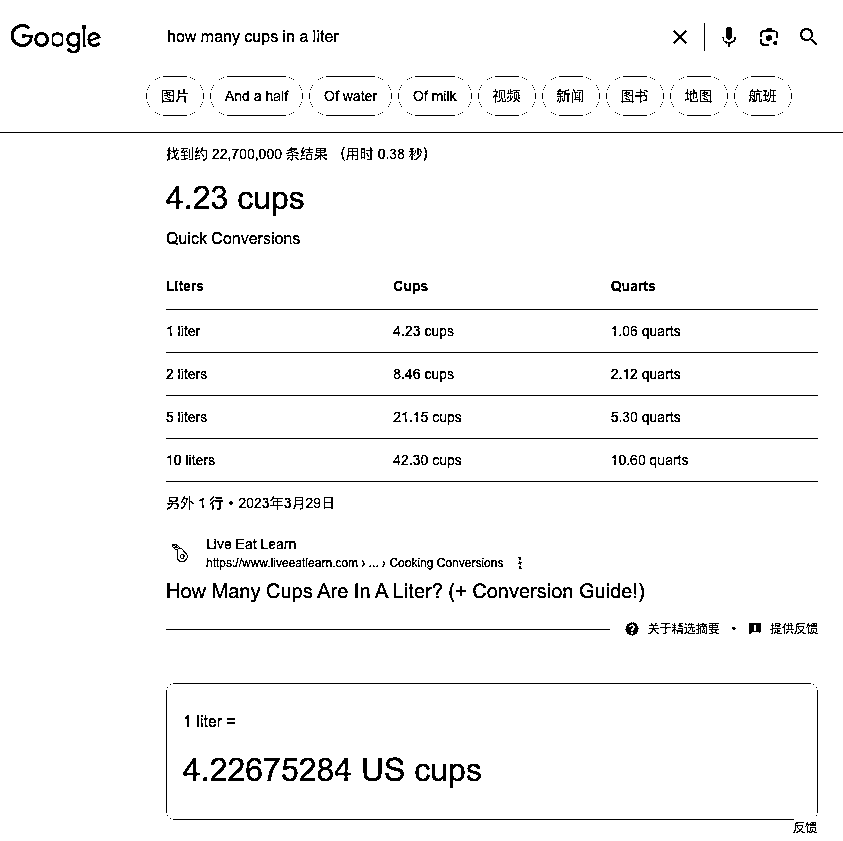

# 利用 Semrush 找有一定搜索量且竞争小的关键词时容易遇到的一些陷阱

> 原文：[`www.yuque.com/for_lazy/thfiu8/lc1msapx9k29vh9f`](https://www.yuque.com/for_lazy/thfiu8/lc1msapx9k29vh9f)

## (60 赞)利用 Semrush 找有一定搜索量且竞争小的关键词时容易遇到的一些陷阱

作者： 哥飞

日期：2023-09-07

哥飞在 [海外工具从需求挖掘到网站制作一篇文章让你搞懂](https://t.zsxq.com/11TqORn77) 中给大家介绍了一篇 reddit 上的帖子，作者说在通过 ahrefs 找到了 2 个每个月有 40K 搜索量但竞争度很低的关键字，之后总共花了不到 2000 美元做网站，2019 年 11 月上线了网站，到现在每个月收入 1000 美元，美滋滋。

哥飞在那篇文章中带着大家学习了如何用 Semrush 挖掘需求，但其实这里会有一些陷阱，哥飞带着大家一起看一下。

##   陷阱 1：季节词，不稳定流量

如上面第一个关键词“fantasy football team names”，很有意思，fantasy football 是一款游戏的名字，这个搜索词看起来是大家在搜索引擎理找好听的团队名称。

全球搜索量 53.8K，竞争度只有 21，很低了。再去 ahrefs 看一下，竞争难度 7，只需要 8 个外链就能排到首页。

看起来这就是我们要找的词，简直完美，但是，先别笑，我们再去 Google Trends 上看看全年搜索量。

  

从搜索趋势曲线就可以看出来，这个词只在一年中的某个时间段火，那么就不值得我们花时间去做一个网站了。

其实是因为这个游戏在每年的八九月份会开始新的赛季，大家此时会去搜索引擎搜索好听的名字，取好名字后，这个需求就没有了。

我们继续去找别的词，另外提醒一下，大家在【意图】这里，可以把导航去掉，勾选其它三个。导航指的是用户搜索的一般都是网站名字，就是想找特定的网站，这种词是我们不需要的。

这次，我们输入“test”，这是在线测试类产品常用词，结果发现了一个有着 135K 搜索量的关键词 “smile dating test”，竞争度只有 22。

这次我们直接先去 Google Trends 看看，果然，又是只在短时间内流行过。

这也就难怪虽然有 135K 的搜索量，但没人去做这个词了，因为这个搜索量不是长期稳定的。

## 陷阱 2：谷歌直达

有很多词，我们搜索时，谷歌会直接在搜索结果最前面就把答案直接显示出来。

我们搜索关键字“how many”，可以看到第一个关键字有 40K 的搜索量，但是竞争度只有 29。

Google Trends 全年搜索量也挺稳定的，那么为什么竞争度这么低呢？

直接在谷歌搜索一下，看看结果就知道，谷歌的搜索结果直接就能够满足用户的需求了，所以就没必要去做这个词。

类似的还有“half double crochet”的搜索结果，前面全是 Youtube 视频，那么这类关键词，其实不适合自建站，反而适合去 Youtube 发视频。

## 陷阱 3：需求量大但不合法无法放置广告

搜索 mp3，可以找到一些搜索量特别大但是竞争度奇低的关键词

如“youtube to mp3”这个词，搜索量 612 万，但是竞争度居然只有 16。

直接去谷歌搜索一下，发现有很多网站，都是内页，就能够排到前面。

拿第一个站的域名 [y2mate.is](http://y2mate.is) 在 Similarweb 查询，发现这个网站有 960 万的月访问量，而且域名还是 2020 年注册的。

一切信息都表明，这个是一个金矿，但是为什么竞争度这么低呢？

一开始哥飞也不清楚，经过请教彪总、树哥和小排老师之后，大概知道了一些，首先是这些站谷歌经常会打压，因为不合法。

然后这里边还有些黑科技，这些词基本被某些团队垄断了，我们去做，不一定能够排上去。

好了，三个陷阱基本就讲完了，你还发现什么陷阱呢？

欢迎评论区补充说明。

* * *

评论区：

Ai 指令师-越越 : 干货
晴天哥哥 : 学习了
LimBo : 关于第二个陷阱，有个疑惑，对于某些领域，很多人上来搜就是为了搜集资料的，如果首页全是视频，零星的图文内容反而更吸引人去点击，还有就是很多人并不喜欢看视频。
哥飞 : 你代表不了很多人，不要你感觉，你去调查，或者实际测试一下就知道了。
LimBo : 好的，事实应该如此，一个如果验证过没有图文需求的市场，确实可以放弃，除非出现奇迹
LimBo : 不过我看过前面几个视频的播放量，最多的大概在 2M，排在结果第一的也就只有几十 K,而视频下面第一个图文网站的访问量也是 2M 左右，所以这块图文的需求还是确实存在的。
阿泽 : 多谢分享

* * *