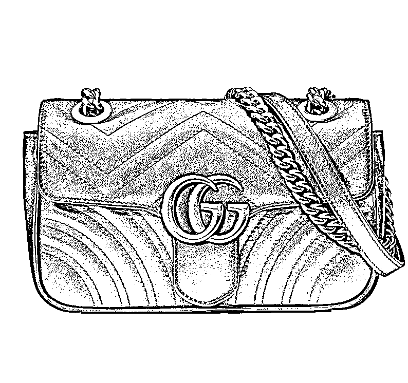
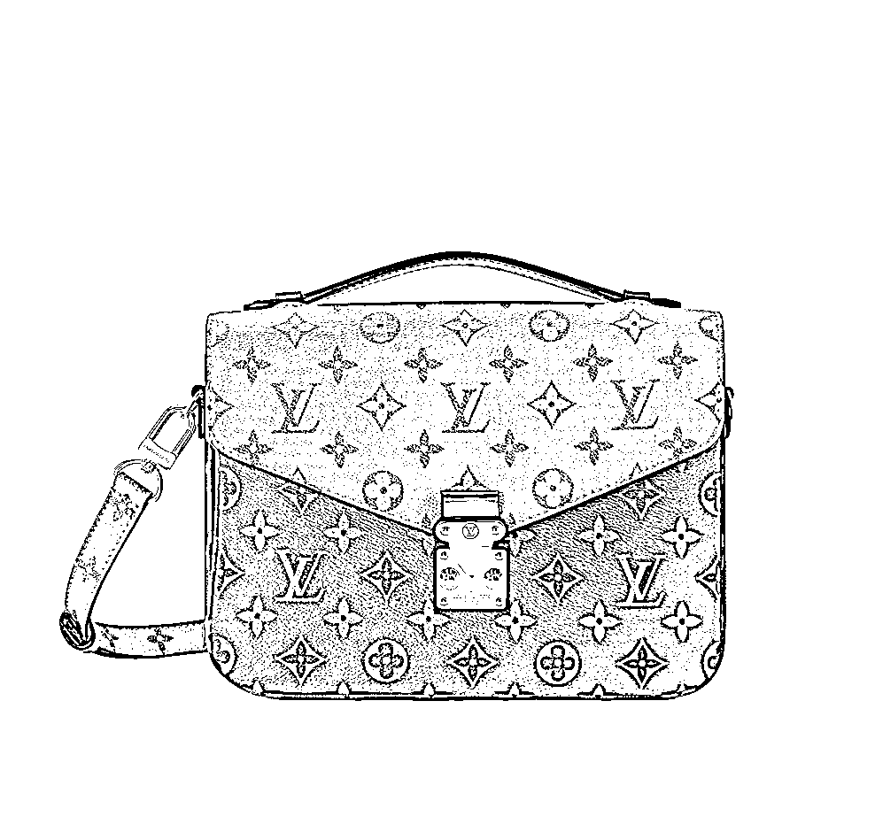
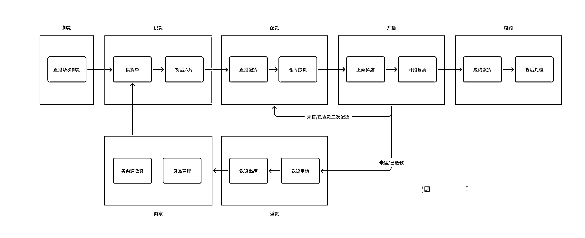
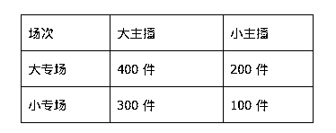
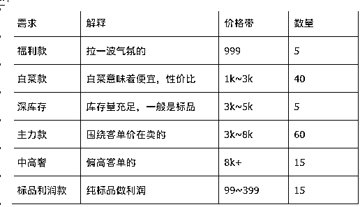
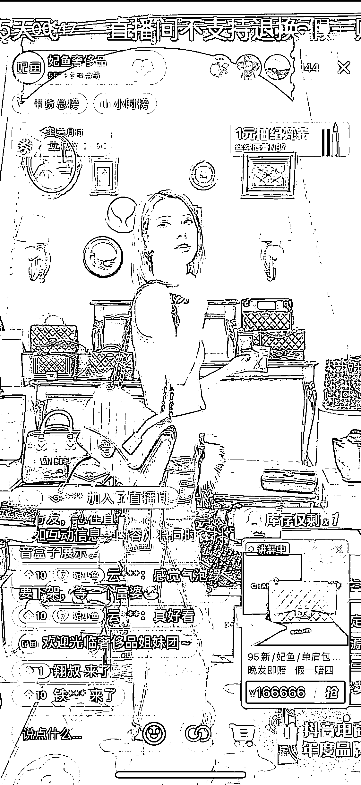
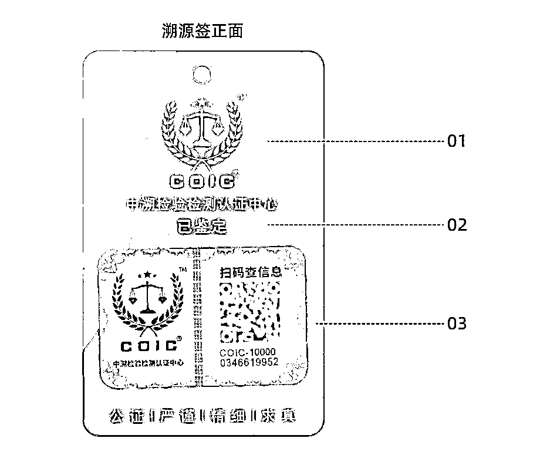

# 一只包的生命之旅，从包包切入二奢直播供应链

> 原文：[`www.yuque.com/for_lazy/thfiu8/cqb4zwtq10mo5zx7`](https://www.yuque.com/for_lazy/thfiu8/cqb4zwtq10mo5zx7)

## (精华帖)(58 赞)一只包的生命之旅，从包包切入二奢直播供应链

作者： 翔叔

日期：2023-09-05

一只二手奢侈品包包，从看到、购买再到最终送到手里，都要经历些什么呢？

今天，我就从一只包包入手，来给大家分享下二手奢侈品的供应链体系具体是怎样的，希望对各位圈友有所帮助。

大家好，我是翔叔，一名介于有趣和无聊之间的产品狗，个人使用手册：[`bit.ly/3skZXFR`](https://bit.ly/3skZXFR) 。做过 5 年国内外秀场直播&社交产品，2 年二手奢侈品电商。

本人入二奢行业也才 2 年，谈不上有多深入，只是比大家多看到了些业务细节，本文只是分享一些我知道的事情，以及一些思考，若有解释不到位的地方，还请各位圈友多多指正，欢迎交流！

文章将从 3 个板块展开

1.对二奢的基本认知

2.包包的生命之旅

3.行业常见问题及解答

首先我们进入第一部分

# 一、讲二奢之前，咱先得认识它

**（1）到底什么是“二奢”？**

简单理解，就是二手的奢侈品，别人用过的。

但是二手并不是核心，核心是性价比，二手只是意味着价格低于原价，背后的需求是让消费者能以更低的价格买到更高级的货，降低虚荣心的门槛。

**（2）目前市面上在卖哪些品类？**

品类其实不少，箱包、腕表、配饰、服饰、鞋等，但是以箱包为主流，有些是专门卖腕表

**（3）回到二奢产业链，我们看看全局**

（2021 中国二手奢侈品电商平台消费洞察报告）

#### 1、上游

C 端：纯个人卖家，手里有点货要出，回笼资金，但不持续；

小 B：一部分是个体和企业，还有一部分，本质还是 C，都是没有营业执照的，手里能拿货，把二奢当成一门生意来做。

#### 2、中游

机构：一般是小的直播机构，手里有个别主播，可以销货；

平台：可以理解成仓储+大型机构，这也是我们目前的定位

1.  有自己的物理仓储空间+系统，对货品进行标准化管理

2.  货品主要来源于小 B，当然也有自己的采购团队，供应内部自营货品

3.  有自己的销售团队

销售模式：

① 以寄卖为主：也叫寄售，简单解释就是先卖货再结钱，这种模式就像你出了一本书，别人抢着帮你卖，你坐着拿钱

1.  卖家自己定价：平台从中抽成，这种利润不高

2.  平台定价：卖多少钱平台自己说了算，最终只跟卖家结供货价

② 采购和回收为辅：采购是 toB，回收是 toC

#### 3、下游

C 端买家：消费者

同行：其实除了 C，还有同行

1.  帮帮虎

2.  奢当家

3.  段小狸

# 二、进入正题，看看一只包的生命之旅

接下来，主要以奢侈品中的包包举例，讲讲包包的生命之旅，干货预警！

（GUCCI/马蒙）

（LV Keepall）

  

（LV 邮差）

**（1）谈谈直播**

1、为什么要讲二奢直播？因为二奢是非标的，区别于标品直播

1.  传统标品直播逻辑下，买的流量越多，成交量越高；

1.  二奢：每件都是孤品，好卖的瞬间卖完，剩下的就是卖不动，流量越高，成本反而越高；

2、二奢为何要直播？

1.  新鲜：每日上新的机制，让消费者欲罢不能，即使每天逛逛直播间也比逛线下实体店要爽；

1.  直观：消费者可以通过直播的形式看到主播的专业讲解、细节展示建立信任，主播承担着导购角色；

1.  互动：遇到各种疑问可以通过直播的形式进行实时互动；

1.  氛围：直播讲究的是气氛，在这种氛围下更容易促进转化；

3、销售场景

1.  主要讲的是抖音直播，看看抖音高客单、非标品直播是怎么玩的；

4、以下流程主要针对孤品

1.  孤品：二手每只包的成色和瑕疵都不一样，全世界唯一；

2.  标品：标准款式，库存量充足；

**（2）货的生命周期**

整个流程用一句话解释就是：BD 负责从商家那边拿货，给到仓库入库，然后到指定日期配给对应主播，开播售卖

一只包，在整个链条中其实要经过很多环节才能真正到达消费者手上

#### 1、先聊聊主播&排期

① 主播：主播一般看两个维度

**专业度：**懂不懂包

1.  强：比较懂包，而且一般主要卖包，搭一些配饰；

2.  弱：一些泛品类的主播，比如服饰珠宝类目主播，头部明星 or 达人等；

**大小：**主要看主播实力，但没有绝对的定义，每家公司也不一样

1.  大主播：单场 GMV 能做到百万，甚至破千万的；

2.  小主播：单场 GMV 几十万以下的；

② 排期：也好理解，就是主播开播的日程安排，每个主播开播偏好不一样，一般会提前安排一个月

#### 2、再来看看商家，也叫小 B

##### ① 什么是小 B？

就是商家，手里有批货

##### ② 小 B 一般会从哪些渠道收货？

1.  C 端用户：部分小 B 有线下门店，周边的用户拿包来卖；

1.  闲鱼：直接回收 C 端的货，上面也有些小 B 的货；

1.  包展：主要是 LGE，报名即可参加，一般在上海、杭州等地；

1.  同行：目前主要是帮帮虎，B2B 交易；

1.  买手：日本和美国二奢流通比我们早，流转率也比国内高，有国外的朋友可以倒一手货，比如日本的中古交易所；

1.  BD：找到一个靠谱的 BD，货基本就稳了，BD 手上有很多商家资源；

一只包有可能会从以上任何一个渠道流入到一个小 B 手上

##### ③ 小 B 如何管理一只包？

1.  没有系统的，Excel 登记；

1.  有系统的，业内主要是用【奢当家】和【段小狸】两款产品进行货品管理，记录信息；

##### ④ 小 B 一般关心什么指标？

1.  货品动销：谁帮我销货销得快，我就把货给谁；

动销一般是指从到货上架→售出发货，动销高的能做到 80%左右

1.  货品结算：谁跟我结钱结的快，我就跟谁玩；

##### ⑤ 小 B 一般关心哪些问题？

1.  寄卖货品管理：寄卖的货会比较多，要统一管理；

1.  货品动销：关注每个货的动销情况；

1.  价格动态调整：针对不好卖的货会及时调整价格；

1.  商品召回：这个货在别的地方卖掉了，需要从平台召回；

1.  结算和售后相关：跟钱相关；

1.  货损、瑕疵处理：理赔服务；

1.  养护服务：对货品的护理操作；

1.  其他

**（3）然后是供货**

##### 1、如何供货？

我们的 BD 部门会提前找到商家，协商配货计划，假设一只包被盯上了，就会进入供货名单。一般在开播前的 4～5 天，BD 就会陆续催商家发货了，这只包也会随着快递流入到下一个站点，平台仓库

##### 2、平台货品怎么入库？

需要经历：录入→鉴定→养护→定价→选品→拍摄→上架等环节

录入：记录货品基本信息，一般是商家信息、图片信息、供货价三个主要的

鉴定：做真假判定和残次判定

1.  真包且是良品的会直接通过

2.  假的直接驳回，返给商家

3.  真的且是次品，太次的会被直接驳回，一般的会经过养护之后重新卖

养护：根据这只包的实际情况，看是否做清洗、轻度护理等操作

定价：这里定的是销售价，一般有系统定价+人工定价两种

1.  系统定价：根据平台期望的利润率，进行动态计算，有一套相对复杂的公式，因为也要结合市场价；

2.  人工定价：由商品运营的同学进行实物判断，给出一个合理的销售价；

选品：选品主要针对的是抖音，因为要上架抖店必须得填写一部分商品信息才行

拍摄：对包包的精拍，一般会有两部分，上架抖店的封面图+细节图

上架：准备好了上到对应的库区库位上，准备卖了

##### 3、 补充说明：“专场供货”

是指有一批货专项供给某个具体的主播，一般是分两种情况

1.  一种是商家有一批货，他比较信任某个主播（主要是动销快）

2.  二是我们内部 BD 给专有主播供特定的货品

**（4）接着，来到配货**

##### 1、什么是配货？

是指给直播团队配开播时售卖的货品

##### 2、 谁来配更合理？

目前有三个角色：

1.  BD：BD 负责一手拿货，如果是专供某个主播的，他们一般会比较懂这个主播的销售逻辑，所以 BD 配货是 OK 的

2.  商品运营：中心化的部门，分别负责各个主播的货盘配比，要懂货，懂主播

3.  直播组：直播组自己的人，比如主播、直播经理，他们是直接销售方，更懂货

更合理的分工是：

1.  BD 负责拿货

2.  商品运营负责定价

3.  直播组：负责配货和销货

##### 3、每场直播要配多少货？

##### 4、货盘怎么配比？

这个要看具体情况，不同主播、不同时间点开播货盘逻辑都不一样，这里提供一个基础货盘，仅供参考（数据已做处理）

基础货盘：

大专场和小专场主要对基础货盘的占比进行动态调整

配货终极问题：货少，资源稀缺，该如何分配？

1.  科斯定律：谁用的好就给谁

2.  但问题恰恰在于不好定义谁用的好，因为二奢一般不好卖的货，大家都不好卖，好卖的谁卖都好卖，再加上各种售后问题，有一部分运气成分

**（5）准备好了，要开播啦**

##### 1、开播设备

开播需要哪些设备？这个做直播的基本上都差不多，我也不专业，就不过多普及了

##### 2、场景布置

1.  仓播：所谓仓播就是在仓库直接开播，背后就是各种货架，显得更真实；

1.  直播间：需要精心布置整个环境，主要是背景；

##### 3、人员配置

一般是直播经理+主播+跟播+投放：

1.  直播经理：观察主播情况，帮助主播调整开播节奏和策略；

2.  主播：一般是女性，要求好看+懂货；当然现在也有不少男主播在卖奢侈品；

3.  跟播：主要根据主播的口播情况，及时上小黄车链接，另外也是重要的气氛组；

##### 4、开播节奏

因为卖的主要是孤品，就不能按正常标品直播来走，必须得一个包一个包的过，链接也是一个一个的上。过包速度看主播，快的话基本上 1 分钟一个包，因为品是稀缺的，所以基本上每一次都是秒杀。

关于货盘的节奏，这个我觉得自己实际完整地跟几场直播就大致清楚了。

**（6）卖掉了，要怎么履约？**

##### 1、主要工作

1.  仓库负责打包发货；

2.  客服负责处理订单售出和售后；

##### 2、常见售出&售后问题

1.  细节图：应客户要求要看更多包包的细节图；

2.  养护：应客户要求对包包进行保养再发货；

3.  主播虚假承诺：口播无法实现的承诺，如布面污渍去除，粘皮处理，免费打孔等；

4.  主播未过瑕疵：客户收到货一周内，客户反馈货品瑕疵与直播间介绍不符；

5.  鉴定问题：货品无法过检（手表，饰品，围巾等），年份标模糊，镭射标模糊等；

6.  货品质量：拉链卡住拉不动，手提变形，划痕无法去除，表针卡住，老化掉皮、断裂等；

7.  味道：部分包包因为养护的原因，会有一股霉味，其实不是发霉；

8.  色差：货品颜色明显与细节图或产品主图不符；

9.  缺货问题：孤品，死活不退；

##### 3、履约的 3 个核心问题

① 超拍：就是秒杀时，货的库存只有一个，但是买家能支付 N＞1 的订单

1.  这是抖音一直未修复的漏洞，估计是故意的；

2.  这种情况对客服来说很棘手，因为是孤品，其他的订单没货，就只能一一劝退；

3.  超拍多的时候有上百单；

② 中检：抖音有个叫做 BTAS 质检仓，跟中检合作的

1.  二奢每笔抖音订单，有一定概率会被抖音抽中 BTAS（目前几乎 98%都会被抽）；

2.  抽中的订单必须先发到 BTAS 质检仓，由质检仓鉴定一遍后发给客户；

3.  一般价格低于 300 的不太会被抽中，也算不上奢侈品了；

③ 退货：二奢的退货率是比较高的，高的时候能到 70%

##### 4、关于中检和中溯

中检和中溯都是国家认证的奢侈品鉴定中心，用户是比较信任的。

中检全称为“中国检验认证集团奢侈品鉴定中心”，中溯全称为“中溯检验检测认证中心”。

中检中奢中心的英文缩写为 CCIC。

中溯检验检测认证中心的英文缩写为 COIC。

**（7）货没卖掉，该怎么办？**

下一场继续卖或返还给商家。

##### 如何返给商家？

1.  BD 提交返货申请，仓库找货，返货出库

2.  商家在商家端自己提交召回申请，仓库找货，返货出库

**（8）整个货盘正向 SOP 如下**

**（9）资金运转逻辑**

#### 1、两个账期

①应收：抖音跟我们结算，我们目前是 T+4，也有 T+10，这里的 T 是从买家确认收货开始算，结算期 4 天或 10 天

②应付：我们跟商家结算，要根据商家分层来算，一般是 T+9+7，这里的 T 是发货时间，结算期 9 天，售后期 7 天

结算期是指到了结算时间，就可以跟商家进行结钱了

售后期是指从结算时间开始有个 7 天售后期，在 7 天内如果货品发生退款，是可以把已结算的款追回

#### 2、提前结算

所谓提前结算，就是没到结算期，提前跟商家结算的意思，一般是两种情况

1.  跟商家绝对信任的关系

2.  包展特殊模式

#### 3、异常赔付

主要是有以下场景

1.  成色降级：我们在保管货品的过程中出现降成色的情况

2.  丢失赔付：货品在我们这丢失

3.  降价回收：跟商家协商，以低于供货价吃进

4.  超时吃进：已结算的货发生售后，但是商家一直不退钱，不跟我们玩了，不得不吃进

**（10）展开聊聊**

#### 1、一只包到了消费者手上就结束了吗？

并没有，网络效应中有一个叫做“梅特卡夫效应”，讲的是买卖双方可以自由互换身份。二奢就是的，一只包到了消费者手上，她完全可以转手再去寄卖，整个供应链又从头循环起来了。

#### 2、还有哪些衍生的玩法？

私域会员：积分成长体系

1.  买家→卖家：给积分，积分可用于下次消费抵扣

2.  促进购买：给积分，促进复购

3.  积分有等级，不同等级享受不同服务

# 三、行业常见问题&解答

**（1）二奢还有哪些业务？**

1.  寄售+同行：拿上游寄售的货，出给同行，再跟上游结算

2.  私域：直接面向 C 端用户做交易

3.  AI 智能鉴定+款式库

4.  多平台销售：小红书、95 分、淘宝等直播

**（2）买二奢的主要有哪些人？**

主要是白领，其次是学生党、名媛、时尚工作者；

主要是为了满足虚荣心、社会价值观；

款式偏好：Gucci、LV、YSL 等一些经典款为主；

**（3）二奢真的只卖二手吗？**

业内都在说二奢就是孤品，也就是唯一一个，但其实不是的，做二奢的基本也在做标品，但是标品的定位是不一样的，单纯二奢的利润做到 15%已经很不错了，标品的灵活性更高，既可以冲利润，也可以冲气氛。

**（4）流量从哪来？以免费为主还是付费为主？**

这个怎么说呢，要看你的定位。

如果你是商家，一般不会直接找 C 端买家的，他们更倾向的是找平台或直播机构寄售，坐等卖出去收钱就行了，要么就是同行直接出掉，比如通过帮帮虎。

如果你是机构，一般 C 端用户就是从抖音来，也有淘宝的，当然有些直播机构私域攒了一部分客源。

**（5）抖音直播怎么做？是否要投流？还是免费流量？**

1.  抖音一般是做矩阵，做规模，非 ip，主播要去 ip

2.  要投流的，但是得看店铺情况，有些店铺评分比较低，投流只会废掉整个店铺

**（6）GMV 和毛利能有多少？**

孤品一般在 10 个点左右，标品可以做到毛利在 30-50，GMV 的话，一般大主播单场直播可以做到千万 GMV

**（7）客单价有多少？**

4~5k, 7~8k，都有，看平台

**（8）新人如何入局？**

首先想强调下，机会永远都是和风险并存的

#### 1、先说下机会

二奢起源于日本和美国，国外的二奢流通率比国内要高很多，之前有报告说是国外 30%，国内 5%，国内还是处于一个较早期阶段，再加上中国又是奢侈品消费大国，奢侈品的客单价又高，存量奢品价值肯定不低，这也就意味着机会不小。

#### 2、再说下门槛

实话说，二奢门槛其实不低，要懂货，懂业务，有资金，有资源才能玩的起来，至少对单纯的小个体有点难，而且二奢还有个硬门槛，就是真假鉴定，箱包还好点，钟表比较难，水太深。

#### 3、最后说下新人切入点

其实整个直播供应链的每个环节都有机会点：

1.  你有人，有精准买家，可以去找货，做私域

1.  你有资金，建议从小 B 入，通过上面提到的一些渠道进入圈子，去拿货，货好根本不愁卖的

1.  你手里有直播资源，可以从机构切入，或者买个女粉号，找个合适的主播，投投流也能搞，做个小机构

这里不一定非得是只卖二奢的主播，跟女性相关的泛品类主播一样可以，我们已经跟外部的非二奢达人主播合作过了，模式可行

1.  货品周边：比如养护服务

1.  开线下实体店或工作室

#### 4、入行需要多少资金？

这里我只能给个大概的预估建议

1.  从朋友圈做起，主要走回收，然后去平台寄卖（也可以找我），资金大概准备 2w～5w，前期不要投太多，先小生意跑起来，不要囤货，快进快出，目标是跑周转；

1.  资金充足点的，可以 10w～20w，上不封顶，资金越多，赚的越多；

1.  开实体店的话，差不多 80w 以上；

1.  真假鉴定这块，有资金的可以去考个鉴定师证，2 万块钱吧，早期也可以直接去找中检挂签（权威认证）；

包：40～50 块钱/只，量多好谈

表：80-120 块钱/只，也是看量

PS：做实体店或工作室的要求（听别人说的，分享出来，自己没开过）

**稳定的货源：**

1.  8 成都是通过行业展会购买

2.  长期待在国外的高级买手转手卖给国内

3.  在二手平台闲鱼上进行线上回收，或者上门回收

**一笔启动资金：**

1.  前期铺货+房租人工费用；

2.  奢侈品价值高，流动性好，只要有销售圈，库存基本不会积压，即使有积压不想做了，货物也可在同行之间处理掉

**开店环境：**

1.  一线、新一线

2.  1～2 个有经验的鉴定师

3.  一个店能不能盈利，就看他了

**营销：**

1.  网红地，大众点评种草

2.  短视频、直播

3.  商业模式

**回收：**

收客价普遍会在行情价的 60%～70%，优点快速到账

**寄卖：**

收 10%的手续费，到账时间不可控，商品不是立刻卖出

**（9）如何提升货品动销？**

1.  商品成色提前把控，比如 90 新以上，脏污、油边、划痕、五金、明显瑕疵等提前护理

2.  供货价提前沟通，达成一致

3.  款式好，流通大：符合大众审美，款式尽量统一

4.  多平台同时寄售，提升周转频次

**（10）为什么要做标准化？**

1.  对标得物，中心化的数据更容易去管理货品，进而管理商家

2.  为商品的后续智能匹配和交易背书提供基本保障

3.  做大做强做平台的必经之路，小生意无须过多关心

4.  目前整个二奢行业的数据标准化是一大难题，没有业内统一标准，就拿款式的定义来讲，就说不清

**（11）二奢毛利率真的越高越好吗**？

这个要看视角，如果是做平台，高了反而不好，毛利率越高意味着商品流转效率越低，毛利率低，商品流转更快，量更大

* * *

评论区：

凡响 : 有夏玮玮没李不白[呲牙]，话说那不是 keepall40 嘛是不是笔误[偷笑]
翔叔 : 哈哈图随便截的，感谢提醒，我修改下
亦仁 : 感谢分享，已加精华。
亦仁 : 这个业务和生财有啥合作空间没？
吴中生友 : 大佬有没有联系方式咨询一下
翔叔 : 谢谢亦仁
翔叔 : 我们是做平台的，既需要货也需要直播机构，有货的话我们可以帮卖，有直播资源的可以帮我们出货，其他的合作方式也可以进一步交流
翔叔 : 文章中有一条个人手册链接，里面有

* * *