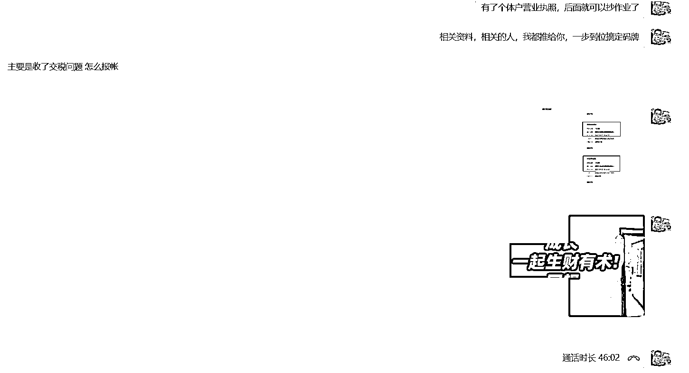

# 关于个体户收款的说明

> 原文：[`www.yuque.com/for_lazy/thfiu8/qfihiw1iw0mv7nnu`](https://www.yuque.com/for_lazy/thfiu8/qfihiw1iw0mv7nnu)

## (34 赞)关于个体户收款的说明

作者： 书情小跟班

日期：2023-09-08

我写过一个帖子 个体户办码牌收款，避免微信风控风险  https://wx.zsxq.com/mweb/views/topicdetail/topicdetail.html?topic_id=211842228285451

我觉得还是有必要再做一个补充，为什么要这么做呢？如下图，我们聊了快一个小时了，如果每次都聊这么久，时间成本有点 hold 不住。因此先把一些信息提前记录下来。

办码牌需要准备的资料

1、门头照

我个休户口没有实际经营场地，找我们深圳圈友彭英锋借的，这里表示感谢

2、2-3 张办工场地，证明你有在办工，我拍了三张，三张是不同的角度，不同的点拍的

3、手持身份证、身份证正面、身份证反面

4、营业执照正面

5、个人银行卡正面

我个人目前办了四张码牌，分别是

1、中国建行

2、富掌柜

3、银盛支付

4、乐刷宜收宝

这四张码牌后面的对接人都是可以帮忙联系，因为我这边都是跑通的。

办收款码牌的第一步是办个体户，我这里是买的个体户，直接让别人过户到我名下的，那么自己怎么办个体户的问题，我就不清楚了。

但是，我可以分享下，我为什么不自己注册个体户选择买一个背后的考虑，我四张码牌其中一张是中国建行，因为建行有一个产品，也可以说是贷款。

可以通过用收款码的流水来办理贷款，可以贷到 50-100 的资金，目前我暂时还不需要贷款，因此这一块实操就分享不了， 我身边有朋友操作了，等我需要的时候再向他们请教好了。

补充说明下，如果你是考虑要贷款，那么就不能是新开的个体户，银行这边要求是经营一年以上才有资格申请。

提一提关于交税的问题，我目前是找人记账的，600 一年，具体非常详细的细节，我不是特别清楚，我能提供的是，目前我是还没有开对公账户的，如果是收税的话，我个人理解是会根据个体户的对公账户的流水来核定征收。

另外的话，如果真按如上我说的，去办下来 50-100 万的贷款，那么是要开对公账户的，这一点是很明确。

细节的补充是，我办了建行的码牌，通过流水申请的贷款，超过 50W 要开对公账户才能把钱转出来。

比方说企业贷测额有额度 100 万，50W 可以转到我个人的建设银行的私人账户，但是另外的 50W，我要开对公账户转到我对公账户再转出来。

说说我办个体户的心路历程：

1、发现个人收款的弊端

我大概是在 2-4 月份的时候，因为收款的问题一个朋友提示我账号异常了，具体时间我有些记不清了，在短时间内收的笔数估计是超了，其实没收多少钱，但是对方跟我说，他看到提示信息，说我账号异常了，谨防诈骗。

2、开始寻求解决方案

我大概是在 5 月份的时候，咨询朋友关于办理个体户的问题，得到的信息是关于新办还是买一个，考虑到后期有可能需要找银行贷款，虽然说暂时用不上，不过万一有需要呢，我就直接买了，多少钱我就不说了，只是分享过程。

3、成功办下个体户的收款码牌

大概是在 6-7 月份，第一个是找合适朋友来拍场地，因为我个体户无地址经营嘛，白话就是皮包公司，然后办理码牌按流程是需要经营场地的。

后面找到深圳圈友彭英锋临时借的场地把如上我说的要提供的材料都提交了，其实很简单，朋友有这块的资源，只要办好一个，其他牌子的码牌提供的材料都是一样的，也就顺利办下来了。

至于为什么我不多办多个，只办了四个收款码牌，回答这个原因也很好解释，我朋友就只有这四个码牌的资源，其他牌子的码牌是可以办，不过，我自己比较懒，也就没再折腾了。

这里贴一个其他圈友关于个体户的分享，每个人知道的都是有限的，没有人是全知全能，欢迎大家评论区留言讨论。

一.聊聊个体户

1.关于个体户的注册流程帖子，很多圈友都分享过，目前个体户注册，基本上都能够自主线上申请，通过本地市场监督管理局网站，可以完成注册；

2.大部分人目前对于个体户注册经营，存在一定的认知误区。注册个体户只是完成了开网店等场景下，资质认证要求的第一步，但对于业务经营来说，还需要进行税务申报，第二步对于大部分人来说，都没有完成，短期看不出影响，但是在注销的时候会比较麻烦，且容易被税务稽查要求补税；

3.个体户/企业注册等业务归市场监督管理局管辖，税务申报归税务局管辖。两个业务监管单位相对独立，所以从流程衔接上会有断层。过去的个体户个体单位较小，且两个部门数据未关联，大多数人的理解，不申报也没事，形成了思维惯性，有历史原因；

4.但当下谈税色变的金税四期，核心逻辑是税务局与工信部/中国人民银行/市场监督管理局进行数据打通，在监管层面生成个人和企业的画像，以大数据的方式进行税务治理，所以当下，个体户税务不申报，存在一定的涉税风险。

二.个体户税务申报流程

其实，对于个体户税务申报的流程，甚至比注册还简单，下面是个体户申报流程，全国范围适用。

1.登录自然人电子税务局网站：自然人电子税务局

2.选择我要办税：选择经营所得申报，经营所得（A 表）每季度申报申报一次，经营所得（B 表）每年度申报一次

3.属于个人名下的个体户纳税识别号，选择对应的时间，录入相关的计税信息；

4.系统自动生产纳税额，若没有收入，选择 0 即可；

5.申报完成，年度申报选择 B 表，流程类似。

三.个体户税率

1.查账征收，按照生产经营所得五级累进税率，5-35%，可以享受个体户的相关税务优惠政策：国家税务总局关于落实支持个体工商户发展个人所得税优惠政策有关事项的公告；

2.定期定额/核定征收，部分地区按照营业额的一定比例征收，例如当初薇娅在上海崇明岛注册的个独企业按照 10%应税。但在这之后，核定政策逐渐取消，目前能够核定的地方不多。

四.相关建议

1.个体户没有收入，自己也要进行税务申报；

2.如果经营流水较大，如实申报，且做好经营账户的资金管理和区分；

3.金税四期的影响和每个人都有关，2025 年，智慧税务全面落实，核心目标，业务-资金-发票-合同四流一致，更加智能高效进行税务监管。

附个体户税务申报图文流程：https://dpfspobq67.feishu.cn/docx/EqSpdiyW9or5WsxSZDPcI4DRnsf?from=from_copylink

* * *

评论区：

柏拉不图 : 个体户能过户？
书情小跟班 : 能

* * *