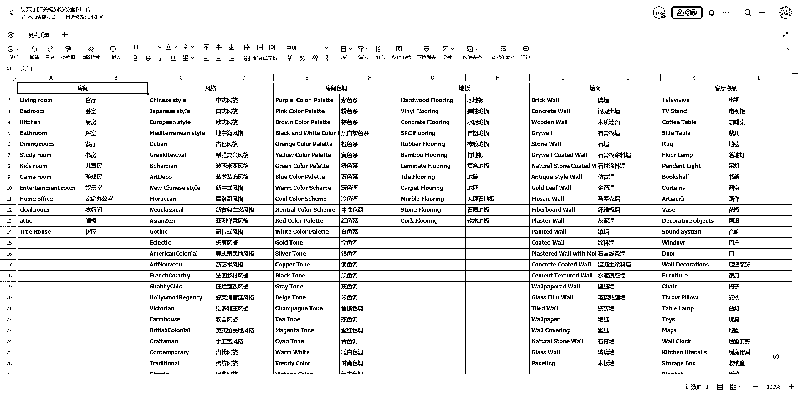
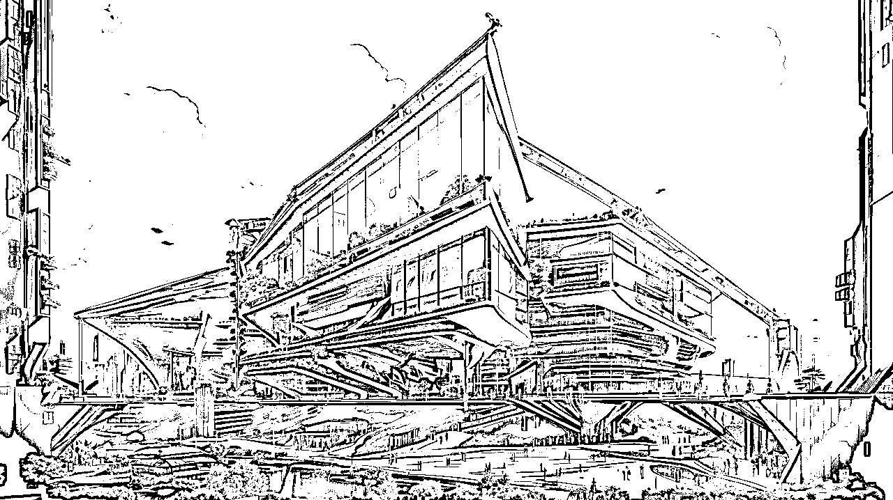
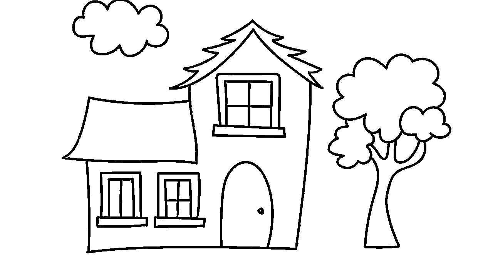

# AI 建筑设计教程！15 个万能模板

> 原文：[`www.yuque.com/for_lazy/thfiu8/app97h3btlgaky68`](https://www.yuque.com/for_lazy/thfiu8/app97h3btlgaky68)

## (47 赞)AI 建筑设计教程！15 个万能模板

作者： 吴东子

日期：2023-09-13

《AI 建筑设计教程！15 个万能模板，三个步骤让你成为设计师！》

各位好，我是吴东子

AI 建筑设计，就是通过 AI 绘画工具给原本只有黑白线条的线稿，生成现实生活中彩色的效果图

对于建筑设计师来说，在短时间内就可生成多张意向图供客户选择，极大地提高生产力

对于我们大众玩家来说，可以根据自己的想象力，一下子就生成出十几种不同风格的建筑图

甚至是家里小孩子天马行空的画作，也能通过 AI 绘画变成现实

于是我把 AI 建筑设计的十多种风格都跑了一次，给大家整理出了一套完整的制作教程

那今天这篇文章将会分为安装模型，SD 基础设置，Controlnet 设置三个步骤

你只要跟着一步一步操作，也能做出同款的 AI 建筑设计图

1.中式庭院风
2.未来科幻风
3.城市鸟瞰图
4.线稿手绘图
5.平面设计图

另外，文中需要用到的所有模型文件，也都给大家打包好放在末尾的网盘链接里了，不需要大家再自己到处去找

花了很多时间才整理出来，希望对你有帮助

[`ry5hwpuf7b.feishu.cn/docx/AVTDdb96Iog7gaxU05PcFrvGnBe?from=from_copylink`](https://ry5hwpuf7b.feishu.cn/docx/AVTDdb96Iog7gaxU05PcFrvGnBe?from=from_copylink)

* * *

评论区：

离心之巅 : 先赞后看
南游 : 真牛啊
一朵云 : 太牛了
土豆先生 : 牛

* * *