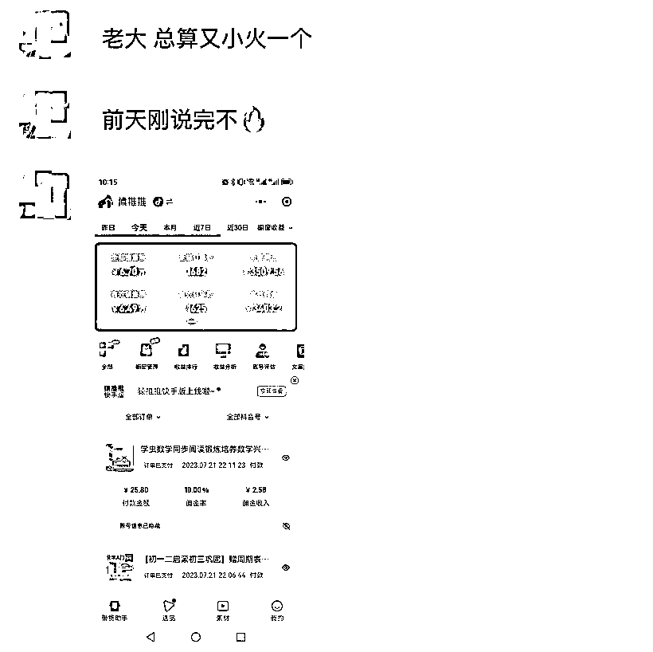
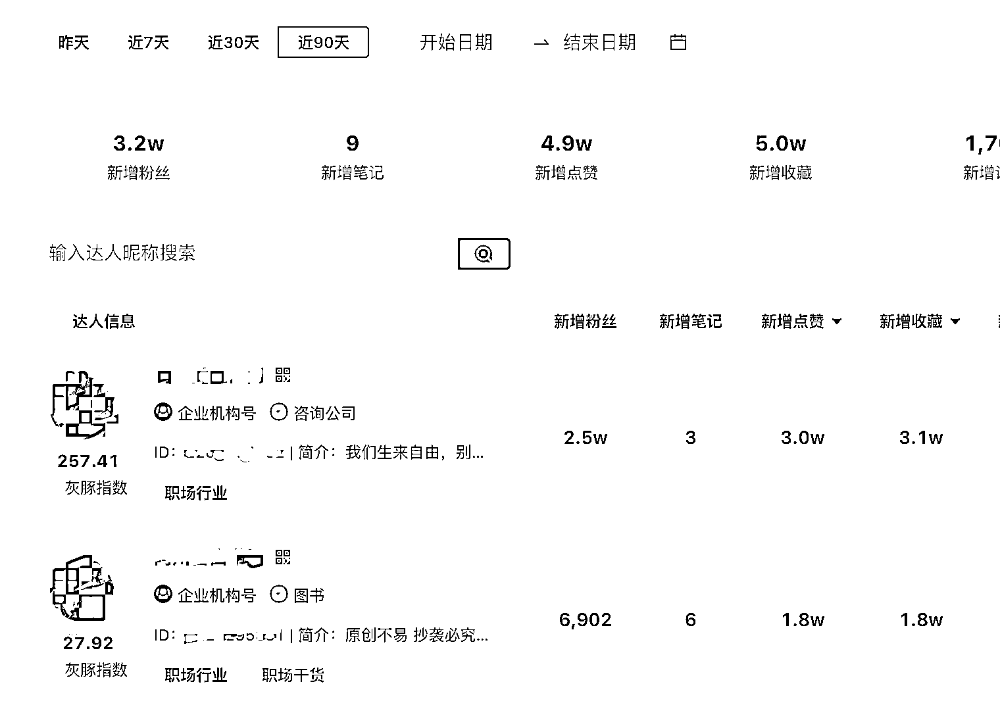
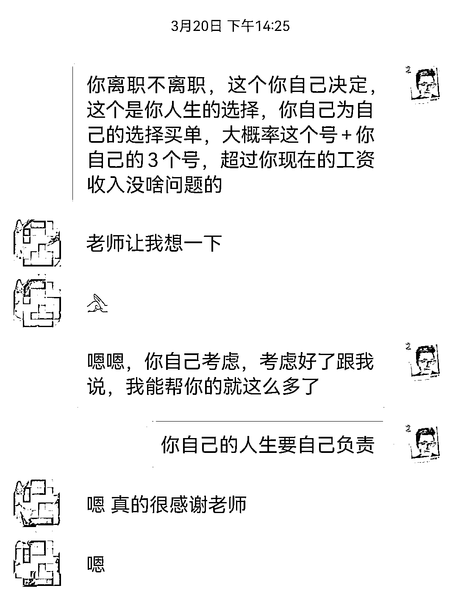

# 成功的捷径：那些做项目赚钱的人都做对了什么？

> 原文：[`www.yuque.com/for_lazy/thfiu8/yehivnrosuhb387v`](https://www.yuque.com/for_lazy/thfiu8/yehivnrosuhb387v)

## (86 赞)成功的捷径：那些做项目赚钱的人都做对了什么？

作者： 老瞿 Qu

日期：2023-09-13

大家好，我是老瞿 Qu，生财有术最懂二手书的男人，经常有圈友问我：“怎么才能做成功一个项目？”，今天我想换一种方式回答一下 2 个问题：

**一、那些做项目赚钱的人到底做对了什么？**

**二、做项目成功的捷径是什么？**

我会通过近几个月，我接触比较深的几个赚到钱的真实案例，去深度挖掘下上面两个问题的答案。

### **第一个案例：闲鱼二手书 5 月航海的学员 A**

拿到的成绩：二手书 6 个帐号，连续单日销售额破万，快速组建 3 人客服小团队，预估月利润破 10W+。

为什么对这个学员印象比较深刻，因为当时在闲鱼二手书航海续航的时候，生财开始让教练直播答疑，因为二手书的教练没有人愿意露脸直播，抱着突破自己的心态，我直播了 3 场，1000 多人参加的二手书航海，3 场直播，敢于连麦的居然就一个人，就是这个同学。

在航海续航的直播前，他已经发信息跟我沟通了自己问题了，希望能深度咨询下：

我记得以前读高中的时候，有一个画面：上课提前十几分钟，老师来到教室讲台，班级的学霸就会把老师围住，开始问各种问题，而我不是全部懂了没问题，而是没有预习，没有努力学习，所以才没有问题的，那些学霸后来基本上都是清北的，而我只考了一个 211。

**从这个案例我觉得可以得到 2 个心得：**

1、学会合理的使用资源

我们一定要珍惜航海的教练资源，尤其是直播答疑，为什么大多数人不敢连麦，大概率是因为那点可怜的执行力，项目流程都跑不通，有的疑问还是闲鱼 APP 的某个开关在哪里，根本没啥深度的问题，当然也就没法赚到钱。

复习一下做一个项目成功的公式:

**项目成功=熟悉项目流程 10%+了解项目底层逻辑 10%+反复的执行迭代 80%。**

2、懂得如何才是正确的链接

遇到问题，最好的解决办法是链接有结果的人，航海的项目手册很全面，一定要多看几遍，要理解性的去看，而不是每次有问题才查看一下，项目手册看透，是做项目成功的基本条件，而链接是为了解决项目手册上没有的，更深度的问题。

生财的圈友问问题一般我看到了都会回答，但是最怕的就是那种把项目手册上的问题逐一都给你问一遍的，然后还来一句：教练，以后我遇到什么问题都可以随时问你吗？问出有质量的问题，也能说明你离成功更近了。

### 第二个案例：一起尝试真人短视频的圈友 B

拿到的成绩：短视频带货日佣金最高 3000+（代投），月利润 5W+

5 月份的时候，我在我的一个 300 多人微信群发起一个项目测试，就是尝试了一波真人短视频带货，300 多人里面，敢于面对镜头去尝试真人短视频带货的 20 个人。

1 个多月的时间，出单的 4-5 人，成绩最好的不是我，其中成绩最好的人，后来了解了一下，以前是做中视频拿到过单视频千万级播放的成绩，后来做混剪没有结果，但是也坚持了 2 个月，然后真人短视频带货的时候，又找到了方向，拿到了结果，掌握了真人出镜的能力，预估后面他月入 10W+的概率很大。

**从这个案例我觉得可以得到 2 个心得：**

1、给自己一点时间

做任何项目，给自己 2-3 个月时间，全力以赴，哪怕最终你在这个项目上没有拿到什么结果，只要你沉下心来，真的努力了，用心去做了，你学到的知识，培养的能力，在未来别的项目肯定也是有用的。

而更多的人太浮躁，我见过报 9 个航海项目的，大概率是不可能有啥结果了。很多人也是航海开始项目开始，航海结束项目结束，航海的目的是为了满足更多人去从 0 到 1 的，而真正做成功项目的人，航海只是起点，甚至航海都不是起点，航海前都实战好久了，把问题留给航海，而不是航海了才办理出版物许可证，证没下来，航海结束了。

2、持续去深耕一个赛道

比如上面这个 B 同学，就一直在短视频的赛道持续深耕，因为短视频短期之类必然是当下最流行的一门语言，赚钱的项目可能会随着时间发生变化，但是短视频能力，包括网感、选题、剪辑、拍摄这些能力是不会过时的，所以当你深耕一个赛道的时候，一切都是一种积累。

当下很多赛道，比如短视频、直播、电商、引流、知识付费、出海等，选择一个喜欢的赛道扎根，无论项目怎么变，你可以越做越精。

### 第三个案例：一起跑项目的合伙人 C

拿到的成绩：小红书电商最高日销售额近 2W，月利润 6W+

亦仁说 2023 年小红书是机会最大的一个平台之一，但个人精力有限，所以我就像涛哥说的那样，选择去投资别人跑项目，于是我就找了一个一起做项目的合伙人，花了几千块钱，投资他去参加了一个生财大佬的小红书电商训练营。

我先给他时间让他跑了一个月，出第一单了以后，就让他带着小社群里面的一群愿意参加的人缴纳押金去打卡，打卡这个阶段，他还是仅限于出了几单，但是要开始给带领大家，给大家答疑了。然后他开始尝试投流，投一个亏一个，一天亏几百，过程中一度要放弃，于是我给他打了很多鸡血，聊了好几次，分享自己做二手书项目的经历和心得。

终于熬了 3 个月，爆单了，单日销售额最高达到了 2 万，现在时不时爆单一下，目前平均一天利润稳定在 2000+了。

**从这个案例我觉得可以得到 2 个心得：**

1、以教为学成长最快的方式

以教为学真的是一个人成长最快的方式，之前看过一个视频，一宝妈当年小时候学钢琴学的很差，后来就放弃了，等带着儿子学钢琴的时候，很快就过了钢琴十级，问她原因，她说需要记住回去教儿子练习。

所以如果有机会和条件最好，没有也要给自己创造机会以教为学，比如参加一次航海，你能不能比别人更快的熟悉航海手册，别人都是在群里问问题，而你的目标是把群里大家的问题都回答了，这样你成功的概率比其他参加航海的人肯定要高很多很多。

或者有些人做项目的时候，会在微信朋友圈发起一个围观群，其实这种方式也是能大大的帮助自己提升做项目成功的概率的。

2、找个有经验的人逼你一把

项目做多了以后，你会感觉所有项目都是万变不离其中，再去做一个新项目成功的概率就会高很多，如果你能打动一个过来人投资你去做一个项目，或者让他去监督你做一个项目，你成功的概率也会提升很多。

生财里面就有很多被亦仁投资的圈友，或者被其他圈友投资的案例，首先你得证明自己可以，这年头要找到一个拿到结果的人去逼你赚钱，那将是很幸福的一件事，要么你被认可，要么你钱给到位。

### 第四个案例： 老瞿曾经的线上小助理 D

拿到的成绩：小红书个人 IP，3 条视频涨粉 2.5W，知识付费变现单月超过 10W+

在今年 3 月份，刚开始做知识付费的时候，说实话助人情节比较重，当时遇到一个小伙子，工作了 1 年，月工资 4-5K，给我付费做闲鱼二手书项目以后，他就打算离职去干，我很担心他，考虑到他前期可以能没有收入，所以我租给他一个已经我已经做起来的，月利润稳定 4-5K 的闲鱼店铺，我抽 10%利润，然后我还给他 2000 块钱工资，做我的线上小助理，确保他能覆盖之前的工资收入。

当时我还给了他一个建议，就是可以一边做项目，一边做小红书知识付费，可以拉到我的社群，我一起交付。也就是同步去做小红书，因为刚好我小红书 IP 那个时候拿到一点成绩，做了一千多粉丝，变现了 2-3W，所以当时也传授了他一些建议。

离职以后他很拼，不仅二手书做的不错，小红书 IP 熬了 2 个月，经历过迷茫、不敢出镜，引流封号以后，又申请了 2 个企业号，突然火了，引流到微信 3000+人，单月变现 10 万+，目前视频停更了，因为爆掉的视频 3 万赞了，持续有流量，每天还在增加 200-300 粉丝，微信每天通过的人数受限，最近开始去打造属于自己的小红书 IP 课程了。

**从这个案例我觉得可以得到 2 个心得：**

1、拥抱直播和短视频

2022 年当时在生财看到一句话被触动：这是一个被直播和短视频裹挟着向前的时代。

你想弯道超车，最好的方式之一就是拥抱直播和短视频。小助理 D 以前是我们有个做项目合伙人群里最年轻的一个 00 后，也是收入最少的一个，通过短视频，短短 2-3 个月就实现了逆袭，从月薪 5 千到 10W+。

2、找到属于自己的赚钱姿势

因为忙于二手书和一些其他事情，我这个老师目前小红书粉丝还只有 1000 多，而小助理 D 已经一个号 2.6 万粉，一个号 8000 粉了。每个人最后适合自己的东西会不一样，亦仁是做社群厉害，郭晓文是做中医养生项目厉害，老瞿是二手书拿到结果，小助理 D 是小红书 IP 拿到了结果。

我们要不断的去尝试，这样才能找到自己最舒服的赚钱姿势。

**所以我们再总结一下，做项目成功的捷径是什么：**

1、沉下心来，做任何项目给自己 2-3 个月时间，全力以赴，哪怕没结果也必有收获；

2、以教为学，是学习成长最快的方式，哪怕没有条件，可以通过航海群或者朋友圈给自己创造条件；

3、高效链接，珍惜航海教练直播答疑的机会，如果能让一个大佬投资或者监督你跑项目，成功概率更大；

4、深耕赛道，无论是短视频还是电商等，选择一个赛道进行深耕，走的每一步都是一种能力的积累；

5、多方尝试，每个人最后适合自己的赚钱方式不大一样，通过尝试找到最舒服的赚钱知识。

以上我觉得才是做项目赚钱的捷径，而做项目赚钱最大的误区：就是把赚钱的希望完全寄托在一次航海，一次训练营，也就是把赚钱的希望寄托在别人身上，在努力远远达不到的时候就开始各种抱怨。

我是老瞿 Qu，愿生财的所有圈友都能年入百万，目前专注二手书，也在尝试拍视频做个人 IP，在生财航海做教练的时候突破了直播从 0-1 以后，也在练习直播，争取跟涛哥说的一样，先直播 200 场再说。

有对这两块比较感兴趣的圈友可以进行交流 V：laoqu3210，也可以围观老瞿的视频号：老瞿转型笔记，每周都会直播，有兴趣我们直播连麦聊聊，一起进步。

大家还对什么问题感兴趣，希望老瞿聊聊的，可以在评论区留言，一个好的问题，我会写篇文章回答你。

老瞿的历史精华帖：

1.《创业 2 年，给还在职场打工的你的一封信》

[`t.zsxq.com/12CSiLwMV`](https://t.zsxq.com/12CSiLwMV)

2.《如何从 0-1 完成自由职业转型，实现月入 20W+》

[`t.zsxq.com/11LAxpHaE`](https://t.zsxq.com/11LAxpHaE)

3.《如何从 0 到 1 做起来一个电商项目》

[`t.zsxq.com/11TgkYhau`](https://t.zsxq.com/11TgkYhau)

4.《闲鱼二手书 2.0：从月入过 W 到年入 100W》

[`t.zsxq.com/11AMMICnI`](https://t.zsxq.com/11AMMICnI)

5.《你为什么做不起来一个副业项目？用 10W 大洋让我姐做了一个实验》

[`t.zsxq.com/11Nv64nPD`](https://t.zsxq.com/11Nv64nPD)

6.《如何从韭菜，长成年入 100W 的生财铁杆粉丝》

[`t.zsxq.com/11CKHNvsw`](https://t.zsxq.com/11CKHNvsw)

7.一份让我年入百万的商业认知：《用外行人的视角，看电商的底层逻辑》

[`t.zsxq.com/11k1hCius`](https://t.zsxq.com/11k1hCius)

8.闲鱼二手书航海，办理《出版物许可证》相关问题解答

[`t.zsxq.com/11o9vufrK`](https://t.zsxq.com/11o9vufrK)

9.《聊聊你做闲鱼二手书项目失败的 100 种可能性》

[`t.zsxq.com/11HcVYHr5`](https://t.zsxq.com/11HcVYHr5)

10.《深耕行业 2 年后，分享咸鱼二手书无货源、绝版二手书等 5 种项目玩法》

[`t.zsxq.com/11KG4nmwT`](https://t.zsxq.com/11KG4nmwT)

* * *

评论区：

小嵩 : 圈友 C 来了[嘿哈]老瞿 YYDS
John 打嗝 : 6666
小黑... : 老瞿的帖子通俗易懂，看完很有收获。感谢🙏
饼干 : 教练 YYDS[奋斗][奋斗]
王新静（萤火虫） : 讲的真的太好了，半夜的我在思考自己做项目为什么还不赚钱的时候，看到了这篇文章。学到了！

* * *