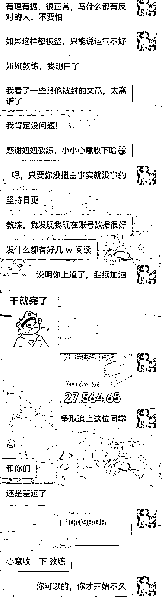
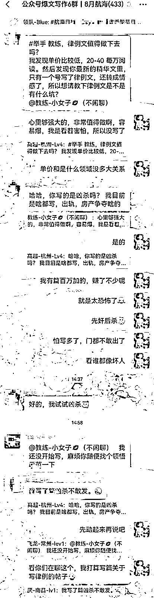
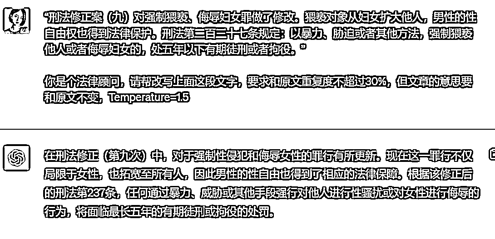
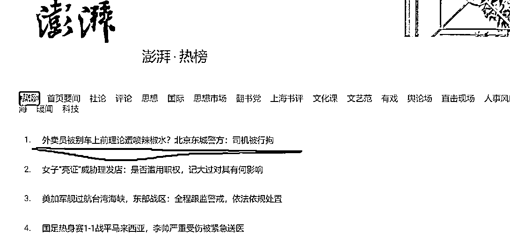

# 分享用 ChatGPT 写律例文，一篇收益 10000+的方法

> 原文：[`www.yuque.com/for_lazy/thfiu8/fmcggqbv4ta8sf3q`](https://www.yuque.com/for_lazy/thfiu8/fmcggqbv4ta8sf3q)

## (205 赞)分享用 ChatGPT 写律例文，一篇收益 10000+的方法

作者： 妞妞💋

日期：2023-09-11

嗨，大家好呀，我是妞妞，我又来做分享了，爱分享的我，一分享起来就停不下来，哈哈.....今天主要是想跟大家聊聊写律例文的那些事。

在公众号爆文写作航海里，写各个领域的同学都有，大家都觉得最容易写的是情感和鸡汤，最容易爆的是热点。

其实还有一个既然容易写，又容易爆的领域被大家忽略了，那就是律例。现在还在坚持的同学告诉我，律例还是很容易爆的。

这个同学写了就爆，吓到了，跑来找我，让我帮他看看他写的文，会不会有封号的风险，爆得太快了。他两篇律例文赚了 3 万左右。

航海群里、我上次的帖子下面，都有同学问到律例还值不值得做，我觉得是值得的，而且可以一直写下去，深耕这个领域，只要自己内心够强大。

我自己也写过律例文，也有过爆 4 百万+，收益 1 万+，后来我写着写着有些怕，感觉那些案例太吓人，再写下去整个人心里都有些承受不了了，所以，我将那个号转写情感领域了。

这篇云南岳母和女婿的案子，是我写过爆的最大的，现在到微信上一搜，好多人洗我的这篇。

好了，进入正题，下面我跟大家分享一下，怎样用 ChatGPT 快速写出一篇律例文，我会给大家一个公式和模板，大家可以参考一下。

大家都知道，我们在写文章之前，要先找素材，写律例文也一样，这个素材的来源有很多，比如：头条热榜、澎湃热榜、1818 黄金眼、普法栏目剧，法律讲堂、今日说法、法治现场、天网、法眼、裁判文书网等。

我常用裁判文书网：

航海手册里有详细的介绍，在这里，就不再赘述了。

下面开始讲怎么写：

**一、写律例的公式：我不管写什么领域，都有公式，我知道这是笨办法。**

**标题+引导语+真实案例回顾+司法解释+判决+引导互动=一篇律例普法文**

1、标题（开幕雷击 50 字以内）

2、引导语（100 字左右）用“令人发指！太残忍了！严惩不贷！太坑人了！太猖狂了！”等情绪化的词语

3、真实案例回顾（这句话可换成别的，600 字左右）

4、司法解释（这句话可换成别的，200 字左右）

5、那法院是如何判的呢？（这句话可换成别的，100 字左右）

6、引导互动（50 字左右）

**二、例文拆解：这篇例文就是我之前爆了 400 万+的那篇，我转领域后删了。**

1、标题（开幕雷击 50 字以内）

**云南 25 岁女婿被 54 岁岳母谜奸，女婿报了警，判决结果出人意料**

2、引导语（100 字左右）

俗话说“知耻近乎勇。”意思是，人有羞恶之心，知道什么是荣，什么是耻，什么事能做，什么事不能做。

然而，云南有一名岳母，竟然谜姧自己的女婿，事情让人感觉匪夷所思。判决的结果，更是让人意想不到。

3、真实案例回顾（600 字左右）

王卫东（化名）是云南宣威人，家境很差，父母供他上大学就已经很吃力。

所幸的是，王卫东从小就乖巧懂事，读书成绩很好，顺利读完大学后，还有了份不错的工作。

相对于村里其他同龄人来说，王卫东算是村里比较有出息的表年，但因为他家里穷，加上他生性腼腆，不爱说话，一直没找到合适的对像结婚。

直到一次公司组织的旅游，他认识了导游林晓媛（化名），两个单身的年轻人看对了眼，成为了恋人。

林晓媛父亲早逝，从小与母亲相依为命，两人在谈婚论嫁时，林晓媛的母亲：吴燕（化名）说不要彩礼，也不要婚房车子，就一个要求，就是王卫东得当她的上门女婿。

当时，王卫东村里的同龄人，都已结婚，而且他很爱林晓媛，就接受了这个条件，与父母商量，父母思考再三后，也同意了。

于是，王卫东便和林晓媛结了婚，婚后住进了吴燕家。刚结婚时，一家三口，日子过得倒也幸福快乐。

由于林晓媛是当导游的，出游远途时，经常要几天才能回一次家。

这时，吴燕觉得女儿经常不在家，这王卫东会不会有外心？

于是，她想考验一下这个女婿，在林晓媛出游外地时，她经常在洗澡时，故意喊王卫东给她送毛巾之类的。 

开始王卫东没在意，以为岳母是忘记拿了，次数多了以后，他觉得不好意思，虽然岳母比自己大了 20 多岁，相当于是自己母亲，但毕竟男女有别。

之后，他只好在岳母进浴室前提醒她，记得带齐毛巾、衣服等。

吴燕看这样不行，就换了一种方式考验女婿，常常当着女婿的面，看那种双人电影。

王卫东觉得很尴尬，每当这时，只好躲进房间里。

有一个晚上，林晓媛又出游外地不在家，王卫东洗漱完准备入房睡觉，这时，吴燕端来一杯牛奶，让王卫东喝下。

王卫东觉得岳母真好，想都没想就把牛奶喝了。

结果第 2 天醒来，发现自己躺在岳母的床上，旁边还躺着岳母，他看到两人都没穿衣物，顿时明白发生了什么。

王卫东急得哭了起来，吴燕却安慰他说：这没什么大不了的。

之后，只要林晓媛出游外地，吴燕晚上就来找王卫东。

后来，王卫东受不了啦，就将这事告诉了妻子林晓媛，想寻求她的帮助。

没想到林晓媛竟然跟他说：“这没什么大不了的，我妈养大我不容易，我经常不在家，不能常常陪着她，你能满足她、让她开心，我不介意，就当你是在替我尽孝了”。

王卫东一听，惊呆了，也感觉很崩溃。

后来，他实在无法忍受了，只好报了警并提起了控诉，说岳母吴燕谜奸了自己。

有人说，王卫东刚开始被岳母谜奸时，没有报警，后面属于你情我愿，吴燕无罪。也有人说，吴燕属于犯了强奸罪，应该要受到刑罚。

4、司法解释（200 字左右）

刑法修正案（九）对强制猥亵、侮辱妇女罪做了修改。猥亵对象从妇女扩大他人，男性的性自由权也得到法律保护。

刑法第二百三十七条规定：以暴力、胁迫或者其他方法，强制猥亵他人或者侮辱妇女的，处五年以下有期徒刑或者拘役。

《中华人民共和国刑法修正案（九）》2015 年 8 月 29 日通过，2015 年 11 月 1 日执行。

5、那法院是如何判的呢？（100 字左右）

由于本案发生是在 2012 年，根据当时的法律，强奸罪的对象为妇女，《刑法修正案（九）》通过之前，强制猥亵罪的对象只限妇女，不包括男性。

所以，本案中，由于当时无法可依，岳母的行为没有受到刑罚，不构成犯罪。

若本案是发生在 2015 年 11 月 1 日后， 按照《刑法》，妇女也可成为本罪的直接正犯、间接正犯、共同正犯、教唆犯和帮助犯。

那吴燕就属于构成了犯罪，要处五年以下有期徒刑或者拘役，林晓媛也同样要受到处罚。

6、引导互动（50 字左右）

对此判决，很多人议论纷纷，说王卫东这个女婿太冤了；吴燕母女两的行为，也惹来不少非议，让她们抬不起头来。

不管法律如何，我们生而为人，有违公序良俗、伦常理德的事，都不应该做。

朋友们，你们觉得王卫东这个女婿冤不冤？如果是你，你会怎么做？

PS:图文素材来源于浙江政务网，侵删。

一篇律例文就这样完成了，非常简单，简直不用动脑子。比写情感更简单，情感故事还得编故事，律例是直接复制案例，稍为挼一挼就好。

当然，一个案例会有很多人同时写，为了能过原创，我们就要用自己的话去复述，这里就可以用到 GPT 了。

这个也很简单，就是把整个案例复制喂给 GPT，让它重新生成一篇意思一样的案例文章。

提示词："XXXXXXXX”你是个法律顾问，请帮我改写上面这篇文章是案例事件，和原文重复度不超过 30%，但文章的意思要和原文不变，Temperature=1.5。

注意：这里的"XXXXXXXX”指的是案例的原文。

如果是让 GPT 改写司法解释，Temperature=1.1 就可以，因为司法解释比较严谨。如图：

写律例很容易出爆文，而且对于敏感字也比较宽容，是很不错的一个变现写作方向。

**三、注意事项：**

我们写律例普法时，要注意不要一直写强奸、凶杀类的，不然会限流，中间要隔一点民事纠纷类的案例。

比如打架，偷盗内衣、骗情骗钱财，抢东西、抢座位之类的社会民生类的事件。

如果能结合当下的热点事件来写，会更容易爆。比如这两天的外卖小哥被喷辣椒水的：

写了就上万到 10 万+

 

当然，写以前的案例也是可以的，写律例不像写热点那样有时效性，它可以写 N 年前的案件，只是说写当天或近期的更好而已。 

写 N 年前和当天发生的热点事件，有些类似的案例也是很容易爆的。

还有就是文章写完后，记得要在文末注明素材的来源，如果实在不知道出处，可以随便标注一个，一般也不会有人真的去查。

比如~PS:图文素材来源于裁判文书网，侵删。

敏感字替换：奸à姧    杀à殺   最à蕞  全à荃 等。

看到这里，有没感觉写律例特别简单？公式给大家了，模板给大家了，方法也给大家了，简直是喂饭级的，大家赶紧动起来吧，10 万+在等着你呢。

**慢慢理解生活，慢慢更新自己，生活应该是美好又温柔，希望你也是。加油呀，圈友们！**

* * *

评论区：

挖哈的阿抓 : 通俗易懂[亲亲]
金钱逻辑 : 666
妞妞💋 : 加油加油🌹
妞妞💋 : 💪💪💪
华仔 : 看来首要的是要有一套适合自己的公式
妞妞💋 : 可能吧，我是没天赋，只能用笨方法
大王 : 妞妞教练在哪学的 GPT 啊，提示词好专业啊
千城 : 教练，你说单价跟领域没多大关系，那它只跟完读率有关吗？

* * *