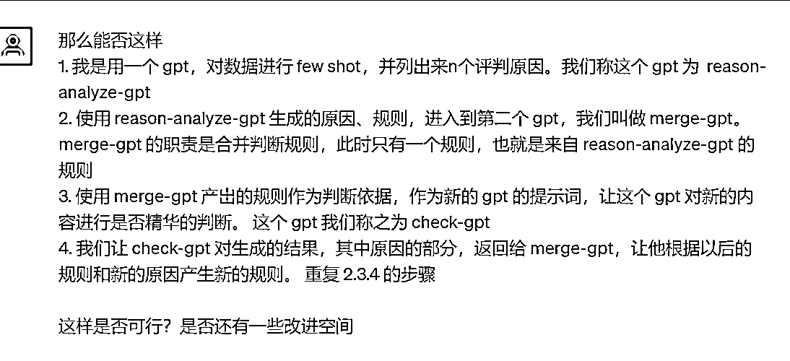

# 提示词的优化

> 原文：[`www.yuque.com/for_lazy/thfiu8/datyp2w3hvzdycgh`](https://www.yuque.com/for_lazy/thfiu8/datyp2w3hvzdycgh)

## (28 赞)提示词的优化

作者： 大铭🍀

日期：2023-09-14

提示词的优化

使用已有数据进行 few shot 学习

收集已经积累数据的内容，让 GPT 进行自我学习，然后进行判断。
由于不想使用 Fine Tuning 的方式，所以使用 few shot 的方式进行

思路如下

1.  收集整理已有的数据，作为学习的原始数据

2.  把整理的原始数据生成 jsonl ，作为 few shot 的数据传递给 gpt

3.  让 gpt 从这些数据中寻找规律，并作为判断标准

4.  对新内容进行判断，给出判定结果，以及判断的理由

改进思路

1.  如果数据量足够，则可以根据分类进行整理，按分类收集和整理数据

2.  根据需要判断的新数据的分类，从已有的分类中，按照不同比例（精华、非精华）构建被 few shot 的数据集
    寻找规律并判断

3.  改进思路可以使用 ChatPAN  insertMaterial with tags 来解决

继续迭代

1.  因为 Context 不够，所以 few shot 的数据量无法给太多，导致学习的基础不足

2.  能否使用一个 GPT 只是进行分析并抽取判断的维度

3.  让另一个 GPT 根据上面抽取出来的维度对新的内容进行判断

改进
如图 1

结构如图 2

实验初步成功，准备用 ChatPAN 生成一个标准的自我迭代的判卷产品

* * *

评论区：

Ai 指令师-越越 : 虽然有点绕，但是分享无价
大铭🍀 : 有没有更好的优化办法，我觉得应该还有改进空间

* * *