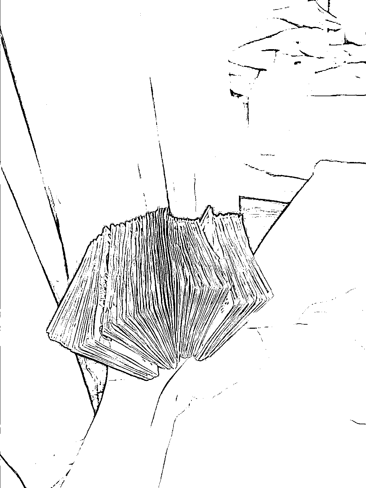

# 公众号爆文圈友交流后有以下几点感悟

> 原文：[`www.yuque.com/for_lazy/thfiu8/ssd7le1x5xtaqnsx`](https://www.yuque.com/for_lazy/thfiu8/ssd7le1x5xtaqnsx)

## (53 赞)公众号爆文圈友交流后有以下几点感悟

作者： 船长

日期：2023-09-11

和一些做公众号爆文圈友交流后有以下几点感悟。
1.关于入池。
我一共做了有 15 个账号左右了，入池的时间都没有啥规律可循，但是更新到后面，几乎都入了。那么，也就是说，只要你能保持更新频率，更新的内容能过原创，标题和封面有做好优化，都能入池。所以，可以放低对入池的执念，相信自己一开始选择的方向，然后向同领域有阅读量的账号对齐，一比一优化，相信这些行为都是对入池有很大帮助，有了这个认知后你也不会浪费大量的时间在纠结是否方向选错上面了。
2.关于单价。
广告单价每天都是变化的，这个是由广告主决定的，而不是我们！但是广告的曝光量、广告的种类我们还是可以干涉的。如果你的文章字数超过 2000 字，然后 1 万阅读的单价偏低，那可以试试手动插入广告，这样可以让文中广告前置，来提升广告的曝光量，间接提升广告收入。
3.关于收益可持续。
其实，爆过文章的朋友都能体会到那种过山车的感觉，收益反差大到有点难以接受，今天大四位数收入，明天就直接降成三位数，甚至是两位数了。站在平台的角度来看，红利期自然是能惠及万民更好，所以平台方是希望越来越多的创作者进入系统的，总的流量增量已经在下降了，那么存量分发自然是会更加随机。所以，对于爆文后，吸粉率不高的账号主，自然就特别容易出现这种过山车体验。面对这种情况，若想保持较大的收益稳定及可持续性，可以做几个动作：
一、选吸粉率较高的领域，比如一些知识分享、工具教程，提升爆文吸粉率；
二、建造自己的私域流量池，比如中老年读书社群，爆文后及时将流量吸引到群里，多次利用；
三、做大量的账号，涉及不同的领域，做好素材积累复用，统计数据，找出方法论，便于下一批账号快速起盘；
四、流量主现在也有了视频类的了，如果对于视频制作比较有感觉的朋友，可以尝试在视频上发力，微信上‘看一看’里的热点部分，已经有很多视频插入了，这或许是个不错的赛道
4.关于心态。
对于一些连续发了一个星期、一个月的文章却依旧没有入池的人，如果你还想继续在这上面赚到钱，就可以做一下注意力转移：收集写作素材、提升写作技能。没有赚到钱，但是能赚到技能，这也是一个收获。通过注意力的转移，来调整你的心态，重新出发。也许，当你瞄准在收集整理写作素材和提升写作技能的过程中，你就真的能赚到钱了，那时候也不用在乎这些钱是流量主来的还是其他地方来的了！
5.关于方法。
我刚开始做的时候就是看帖子，做账号之前，我想了想。曾经，我在无聊的时候，也喜欢刷一些水文或一些奇闻异事，有时候刷到一些带点色色的文章或封面图，也会好奇的点击进去。那当时的我，也就是现在的爆文读者们的一员了！
一、比如我在做情感文的时候，我对标的读者群体是男性群体，那么我就抓住一个字：色！用这个字去改标题，优化封面，但是要把持好度，否则账号易凉！
二、又比如我在做军事文的时候，得益于我之前和一些老年朋友交流过，他们就挺爱看这种文章的，他们喜欢用今日头条看，所以在做军事类文章时，我就去头条找账号，看他们是怎么起标题，怎么做封面！然后我对照着抄！
三、还比如我做的时事类爆文，我发现了一个有趣的事实，城管干坏事和城管干好事拿来做对比，也能吸引到不少老年群体，于是我就把这个细分领域归类到一个账号上，流量也是很不错，但是这类吸粉率就很一般了，这类细分群体还有很多很多，做一些正向的群体，吸粉率估计会很不错。

* * *

评论区：

千城 : 请问，新号一天发几篇比较好
船长 : 在保证文章质量的前提下，有精力的话就多发一些

* * *